## 这不是魔术表演，这是 Adobe 的发布会

在硅谷的科技企业中，Adobe 似乎显得有些“没落”。实际上，Adobe 和微软，Oracle 等企业一样，都是在互联网时代以前的 IT 企业，更容易被人冠以软件公司的头衔，而非互联网公司。

但是，近些年，无论是微软，还是 Adobe，都在云服务上发力，大有逆风翻盘的意思。微软在去年（2018 年）重回第一，虽然现在又不是第一了，但显然回到了 IT 企业的第一梯队，而不再是一个没落的形象。

至于 Adobe，也通过将自家软件云端化战略，市值暴增。说实话，我觉得 Adobe 的股票值得买。

 

---

因为我研究生的专业是虚拟现实，所以自那时起，就很关注 Adobe 的发布会了。

Adobe 每年的发布会被称为是 Adobe Max。近些年来越来越精彩。一个很大的原因是：Adobe 的自家产品在结合 AI 以后，所释放出来的惊人能力。

虽然从商业战略上，Adobe 在走云服务路线，但是 Adobe 的发布会，完全可以看作是 AI 在图像学，计算机视觉等领域的最新应用效果展。

同时，通过看他家的发布会，我们还能了解很多创意界人士的需求痛点。

 

---

比如，很多时候，我们拍摄的视频尺寸和实际需要使用的视频尺寸可能不一致。在下图中，我们要想将原始的 16：9 的视频，剪辑成为 9：16 的手机拍摄效果。如果将剪辑区域固定，效果将非常糟糕。主体目标会经常“飞“出屏幕外。

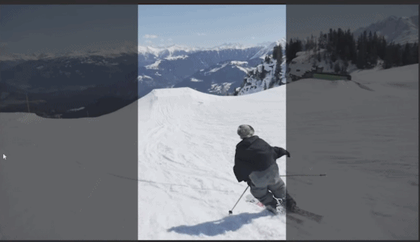

那怎么办？传统的方式，就需要人工跟踪主体目标，相当于在大视频下再做一次运镜处理。可想而知，这个工作量是非常巨大的。

但是，现如今，Adobe 家的 Premiere 产品，将可以直接自动跟踪主题目标，生成任意你需要的尺寸的视频。

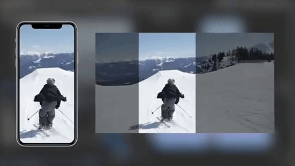

 

再来看看 Adobe 官方给出的其他展示案例：

是不是很酷？

 

---

再来看“抠图”这个事情。

当年我做 iOS Apps 的时候，经常要“东拼西凑”一些素材。为此，我曾经专门买过一本书：大概叫《如何用 PS 进行抠图》一类的。

一点儿都不夸张，一本书。

现如今，在 Photoshop 上，抠图这件“小事儿”，画一个框框就能解决了。

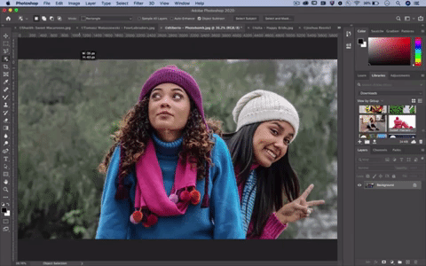

 

你以为这个抠图功能只能识别图片中的主体部分吗？不不不，绝不仅仅如此，我们只对那个帽子感兴趣？画个框框。done！

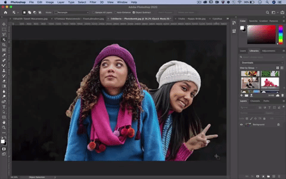

 

即使在极其复杂的场景下，针对极其难抠的毛发，这个新功能也瞬间搞定。

还记得我上面说的《如何用 PS 进行抠图》的书吗？其中至少半本内容在介绍如何抠毛发... 幸好我那会儿觉得没用，所以没有学...：）

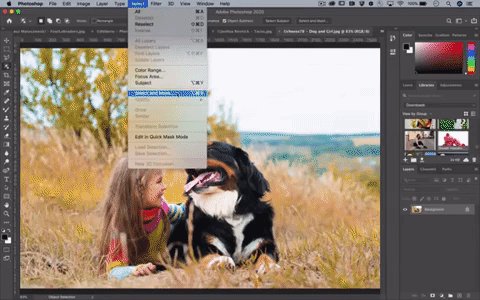

 

---

Adobe 的发布会有一个很有意思的版块儿，叫 Adobe MAX Sneak Peek。

Sneak Peek，就是“偷偷看一眼”的意思。在这里，Adobe 是指，这些功能还在开发过程中，短时间不会正式集成到 Adobe 的软件里。但是，在这里，大家可以先睹为快。

 

比如，Adobe 想象出了面向未来的全新合影方案。

相信大家都有这种体验，和全家人来到旅游景点，但是必须要别人的帮忙，才能照出一个全家福。要是在人多的旅游景点还好，但是，如果旅游景点没啥人呢？别觉得奇怪，在美国，这种情况很常见。

现在，我们可以这样玩儿。先分别照出两张照片。

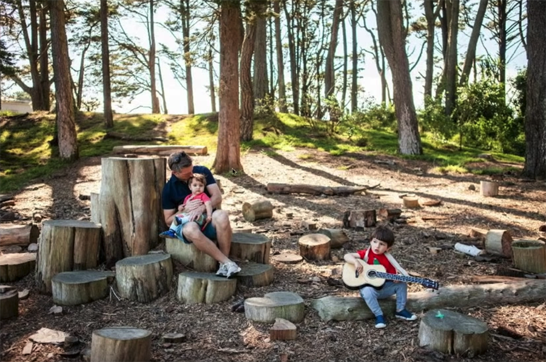

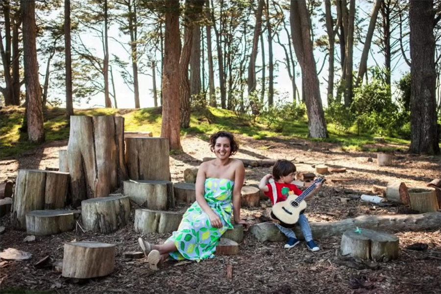

 

大家可以看到，上面的两张照片，分别是爸爸和两位小孩子，以及妈妈和一位小孩子，在同一个景点的合影。

值得一提的是，两张照片同时出现的右下角那个拿着吉他的小朋友，姿势完全不同。同时，两个照片虽然背景是在同一地点，但是具体的角度，光线等也有很大的区别。

然后，Adobe 的新技术，可以无缝将这两张照片结合起来，形成全家福。关键是：一键搞定！

有意思的是，Adobe 的工程师在演示这个功能的时候，直接打开一个 cmd 开始运行 Python 程序。我仔细看了一下，运行的是一个叫做 SmartGroupPhotoMerge.py 的文件... 并且，运行过程中，连调试用的矩阵输出都没有注释掉...

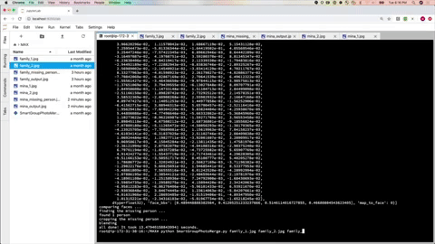

 

但是，结果却出人意料的好。这个功能先从第二张照片中，找到了在第一张照片中缺失的人物：那位母亲。然后，自动裁剪出了这位母亲的图像，无缝衔接在了第一张图片中!

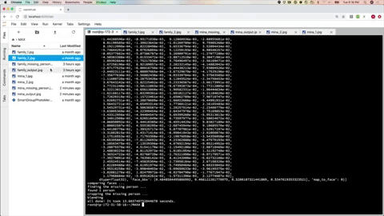

 

再仔细看一下静态的成片：

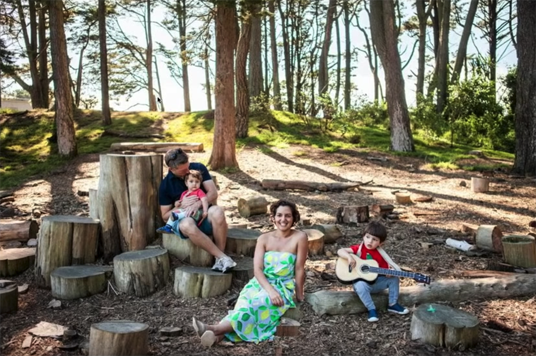

从此再也不用担心合影的问题啦！是不是很酷？

 

---

再比如，以后，Adobe 的特效制作产品 After Effect，就可以直接基于视频中的人物动作进行动作捕捉，然后制作动画效果了！

哎，说来惭愧，我研究生的课题研究的就是动作捕捉。和人家比起来，自己就是个渣渣。

一但捕捉好动作，就可以将视频中真实人物做的动作，映射到动画人物上了。所以，动画设计师的工作大大减轻了。对于简单的动作，只需要自己演上一段，然后，砰！就映射到虚拟的动画人物上了。

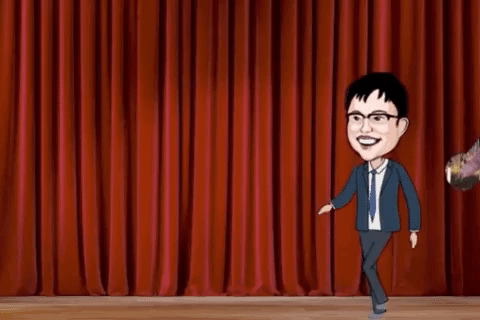

人人可以做动画的时代即将来临。

 

---

另一个有意思的技术，也是在方便动画工作者。

在制作动画片的时候，很多时候，场景上只有人物在说话而已。此时，近乎动画设计师全部的工作量，都是制作口型动画，让动画人物的口型和录音保持一致。

但现在，Adobe 让这个工作自动化了。只需要一个静态图片，一段录音，就能自动生成一段视频，让图片中的人物，根据录音，口型动起来！

比如，在这个例子里，演示人员随便画了一个涂鸦的小猫。然后，小猫就根据录音，开始说话了！

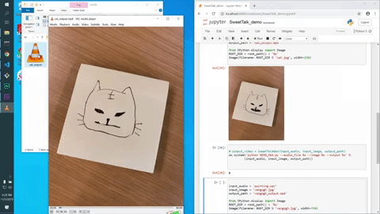

 

觉得这种涂鸦线条太简单，所以好识别？来张梵高的自画像，一样的：

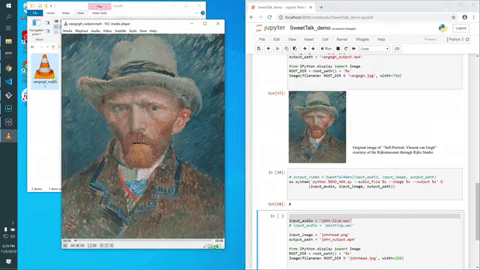

 

对了，在这个演示中，工作人员右侧就开着一个 Jupyter Notebook，一边执行程序代码，一边展示代码输出结果。就跟坐在你旁边调试一样。

这是我见过的最接地气的大厂发布会演示了... 

 

---

Adobe 还在定义下一代的纹理映射。

演示人员首选随手画了一个小鸟：

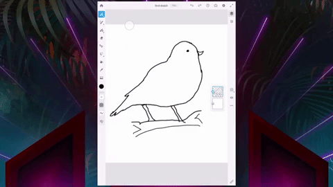

 

然后又选择了一个真实的小鸟的照片：

 

点击生成。砰！一个有着和绘制的小鸟同样形象的照片出现了。图片中小鸟的纹理细节，是根据选择的照片生成的。

这张照片创建了一个新物种！

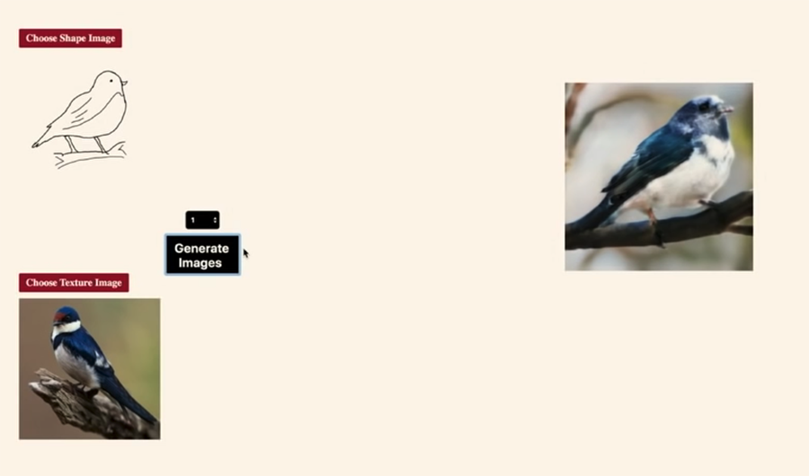

 

这个技术同样适用于两张真实的照片。比如，给一个包包，添加不同的设计，看看结果会怎样？选择几张照片就搞定了。

 

或者试一试，把两张完全不一样的鸟类照片融合，看看会产生什么新物种？

 

如果看过七龙珠的同学，是不是有种悟天克斯的既视感？

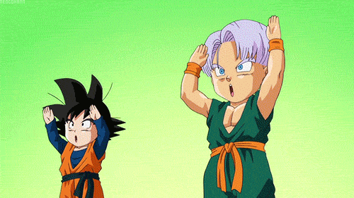

 

---

在字体设计上，Adobe 甚至添加上了体感交互过程。

想象一下在这个字体上，涂了一层虚拟的油漆。演示人员摇晃一下平板，虚拟的油漆竟然流了下来，然后，一种全新的字体效果就被设计出来了！

 

天哪！这到底是在做设计，还是在玩儿游戏？

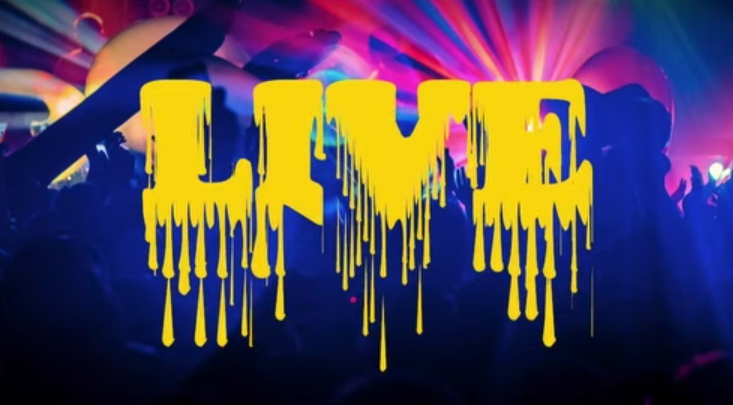

 

---

了解摄影的同学都知道，光线是极其重要的一个因素。很多摄影专业人士为了捕捉一天中最好的光线，要在摄影地蹲点好几个小时。

现在，Adobe 利用 AI 的能力，让摄影者可以随时拍摄照片，然后，再在照片中任意调节成为一天中不同的光线效果。

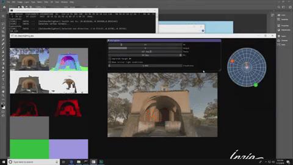

 

---

Adobe 的新技术更可以让我们非常简单的直接调整照片中人物的微表情。

在下面的展示中，演示人员将这位主持人照片的眼睛变大了，同时，还让笑容含蓄的他，更开心了一些。

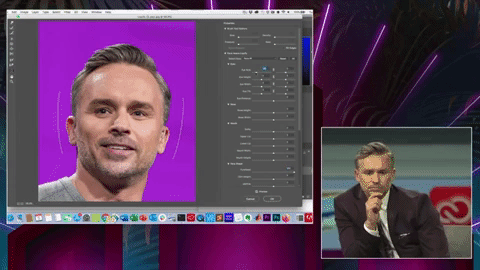

从此以后再也不用担心笑得不够好看了。嘴角的角度，想调成多少，就是多少！

 

---

Adobe 的野心不仅如此。人家还意图进军 AR 领域！在下面的宣传视频中，设计人员直接将设计的结果，通过 AR 技术，搬运到了真实的展馆场景中！

 

这其实是 Adobe 家的新产品，叫做 Adobe Aero，简称 AR。现在，大家可以直接在 Apple Store 下载这款软件，来体验一下 Adobe 的黑科技。

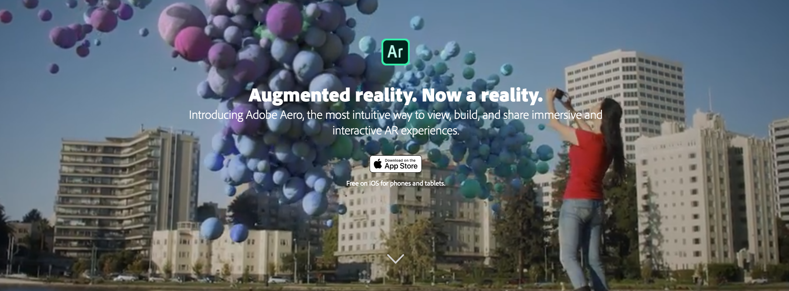

 

怎么样，是不是很酷？

 

---

我看过很多科技媒体评论，都认为 AI 离落地尚远。但其实，在很多专业领域，已经完全离不开 AI 了。只不过，AI 还并没有像手机电脑一样，成为大众唾手可得的技术产品而已。

但我们每一个人，在现代社会生活，都会有意无意地接触到 AI。从使用搜索引擎，到各种不同网站的内容推荐。还有我们看的电视电影，玩的游戏，那些精美的效果和设计，背后都是大量 AI 辅助的结果。

 

依我看，将技术和设计完美结合的 IT 企业，除了苹果，Adobe 也不差。搞不好，从现如今的视角看，Adobe 更出彩。

对了，今年的 Adobe MAX 大会开始以后，Adobe 股价暴涨。

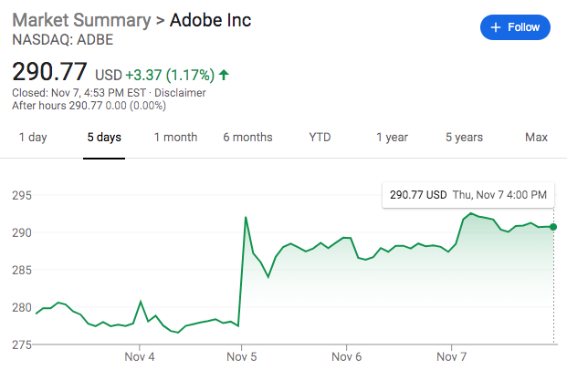

我已经开始期待明年 Adobe 的发布会了。

 

**大家加油！**