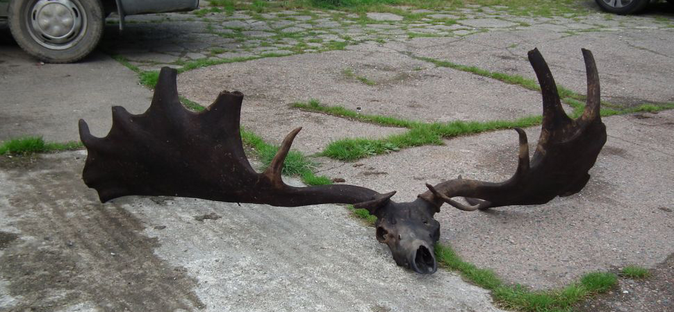
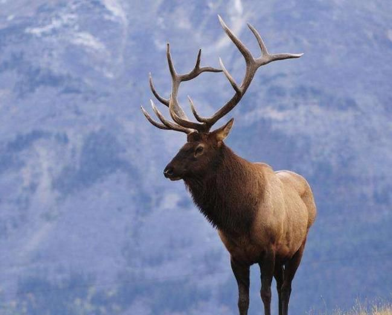
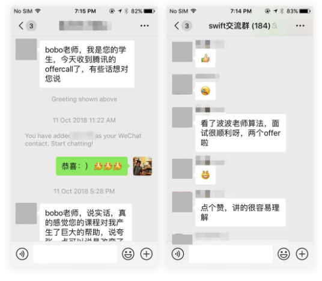
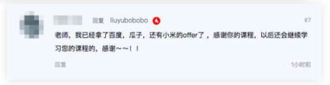
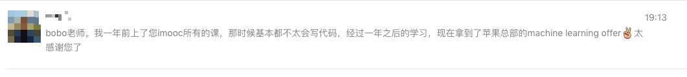

## 爱尔兰麋鹿的灭绝

在网上看到了一个关于“古生物”的新闻。

2018 年 9 月，一名爱尔兰的渔夫在捕鱼的过程中，无意中捕捞出了一个爱尔兰麋鹿的头骨。科学家说，由于这个头骨一直在水底“沉睡”，所以保存极其完好。是人类获得的最完整的爱尔兰麋鹿的头骨标本。

 

一个麋鹿的头骨有什么大惊小怪的？

因为，这种爱尔兰麋鹿早已灭绝。实际上，这个物种只存在于 10000 年前的地球上。

10000 年什么概念？中华上下才 5000 年，其中还有近 1500 年的历史是没有考古学证据支撑的。

 

爱尔兰麋鹿最大的特点是，其雄鹿头顶的角巨大。有多大呢？最大展开能达到 6 米之长。古生物学家恢复出的爱尔兰麋鹿的样子，大体是这样的：

 

头上的角宛如翅膀一般。这要放到中国古代，妥妥的是神兽级别的存在。古人再添油加醋想象一下，这货就飞起来了。

可惜，实际上，爱尔兰麋鹿不会飞。不仅不会飞，这对雄伟的鹿角，成为了让爱尔兰麋鹿灭绝的罪魁祸首。

 

雄性的鹿之所以进化出鹿角，主要是防御敌人用。因此，雄鹿担任着保护家族的使命。于此同时，鹿角的大小也成为了雄鹿获得异性青睐的重要标志。每到繁殖季节，雄鹿之间也会互相用角进行决斗，赢得和雌性交配的机会。

因此，鹿角的质地是非常坚硬的。其成分，和骨骼基本是一致的。

爱尔兰麋鹿的鹿角重量可达其全身重量的 10% 之多。可以想象，爱尔兰麋鹿在 10000 年前，具有着极强的竞争优势。因为其巨大的鹿角，让其种族并不惧怕其他更加凶猛野兽的袭击。

这样的一个物种，为什么会灭绝呢？古生物学家给出的解释是：因为爱尔兰麋鹿的角过于庞大，吸收了身体大量的养分。当地球环境产生变化，致使爱尔兰麋鹿的生存环境里，没有足够的食物的时候，爱尔兰麋鹿却不能快速减小鹿角的大小，来适应环境。大量的营养被鹿角吸收，导致无法维持爱尔兰麋鹿的机体生存。

就这样，几轮并不算巨大的环境变化以后，爱尔兰麋鹿整个物种彻底灭绝了。而同时期在欧洲大陆生存下来的其他麋鹿品种，都有着明显的统一特点：顶角更小。

让爱尔兰麋鹿自豪的，最重要的竞争优势——其巨大的鹿角，最后成为了让爱尔兰麋鹿灭绝的元凶。而其他的麋鹿，虽然顶角更小，看起来像是一种竞争上的劣势，最终，却顽强地存活了上万年的时间。

 

---

为什么这样一个和技术世界毫无关系的古生物学新闻，引起了我的兴趣？

熟悉我的同学都知道，我在北京创业的时候，项目是和北京大学工商管理学院合作的。期间，我采访接触了大量的中国企业。

其中之一，就是新浪。更准确的说，是新浪的微博事业部。那时候，是新浪微博在中国最火的时候。

期间，我访问到了新浪微博运营部门的一个主管。具体的名字和层级我就不透露了。但是，她的故事，让我觉得很受启发。

 

她是一个典型的，从基层爬起来的高管。她加入新浪微博的时候，新浪微博刚刚起步。

那会儿，新浪微博的运营策略是什么呢？就是想办法让全中国各地稍微有头有脸的人物，都来注册新浪微博，使用新浪微博，让新浪微博的内容具有社会影响力。

这里说的“稍微有头有脸”的人物，绝不仅仅是众人皆知的演艺明星或者商业大亨。实际上，在各个省，市，都有大量的地方性人物。他们并不为全国人民所知，但是被当地居民熟知。比如某个地方电视台的主持人，或者只在某个城市才能收听得到的广播电台的播音员。这些人，都是新浪微博的目标。

新浪微博的做法很简单，派海量运营专员，到全国各个地方，去说服这些目标人物开通新浪微博，使用新浪微博。这名高管，在当时，负责中国西南地区几个极其不起眼的城市的“拉人”工作。

按照常理推算，被分配到这样不起眼的地方，应该不是最优秀的人才。最优秀的人才通常会被委以重任，去攻破北上广深这样巨大的市场。与此同时，在这样的地方，业绩也一定平平，和到其他发达地区“拉人”的业绩，肯定不在同一个量级。

那为什么，最后，她成为了一名高管？

她的回答，在当年的我看来，出乎意料；但这么多年过去以后，我却认为在情理之中——因为，其他优秀的人才，都在之后的几年，陆续离职了。

为什么离职？原因很多。有的人不看好微博这种“铺人力拉人”的运营方式，觉得太 low；有的人不满意新浪微博的一些制度；还有的人，认为遇到了更好的机会，于是就跳了。对了，那个年代也是中国互联网创业最火热的时期，靠几张 PPT 就获得投资的事情屡见不鲜。

只有这个人，还一直留在新浪微博，直到坚持到了新浪微博的爆发。此时，和她同时期的“老人”们都不见了。环顾四周，她竟然成了最早的，最了解新浪微博这款产品运营策略方方面面的“权威人士”。于是，她成为了新浪微博运营部门的高管之一。

 

对于这段经历，她总感慨自己是幸运的。但是我不这么看。因为，和她同期入职的所有运营人员，在这件事情上，和她的幸运程度是一样的。但是，只有她最终摘得了“微博”的胜利果实。

当然，其他离职的同事，不一定混得很差。但是，大概率的，没有在微博好。

2014 年 4 月 17 日，微博作为新浪公司的独立子公司，在美国纳斯达克交易所挂牌上市，股票代号 WB，是中国社交媒体在纳斯达克上市的第一只股票。发行价定为 17 美元，上市当天大涨，收盘至 20.24 美元。当时市值 30.4 亿美元。

在随后的几年，微博股票节节攀升，在最高时，甚至达到了近 150 美元一股。2018 年以后，微博逐渐势微，现在的股价，大概是 50 美元一股。不管怎样，当年陪着微博上市的大小主管们，已经妥妥地财务自由了。

 

是什么让这位主管一直坚持留在了新浪微博？我倾向于认为，是她“不够聪明。”

因为不够聪明，所以她感觉不到“铺人力拉人”的方式有多 low；即使能感知到，她也无法提出更好的解决方案；因为不够聪明，她也大概率地没有更好的机会，投身到其他互联网大潮的创业项目中；因为不够聪明，她在面对团队的矛盾和来自上级的压力时，也只能默默忍耐。

在这里，我没有贬低她的意思。所谓聪明不够，努力来凑。我相信，她是一个极度努力的人，在她的工作岗位上也做出了突出的成绩。甚至，到如今，很多人会说她有眼光，有大智慧。

但是，如果时光倒退，回到她刚入职的年头，让大家来预测，这帮运营新人，谁最终能有所成就，可能，她不会被几个人看好。

**她不是爱尔兰麋鹿，没有巨大的顶角；她只是一只普通的小鹿，却最终熬过了最难熬的日子，在残酷的社会竞争中存活了下来。**

 

----

这个案例在当年给与了我很大的震撼。我第一次意识到，很多一般人眼中的“成功人士”，都不是什么“强人”。甚至相反，他们很有可能在一开始，被认为是一名“弱者”。

同时，这也是我第一次意识到，和很多品质比起来，“聪明”是多么的没有意义。后来，我看到了更多心理学家的学术研究，都在辅证这个事实。

因此，我写过一篇文章，叫[《天生不聪明》](../../2018/2018-07-18/)

 

比如，很多同学认为，学好算法需要很聪明。但其实，只要踏踏实实地学习，坚持下去，任何人都能学好算法。

如果觉得缺少高手的指引，还有 bobo 老师在慕课网的课程啊！bobo 老师的算法课程，总共已经有上万人学习。bobo 老师每个月都能收到不同的同学告诉我，自己收到了腾讯，网易，阿里，百度，甚至是国外的苹果，谷歌等企业的 Offer。

 

---

为了指引大家更好的学习，慕课网还特意为大家设计了一个 Java 算法学习路线。三门课程学习下来，相信，所有人都能成为算法领域的小牛。

上面三门课程的学习路线，也可以在我的公众号【是不是很酷】中，回复【课程】，了解更多。

大家在学习过程中有任何疑问，都可以随时在问答区和我交流。

 

**大家加油！**