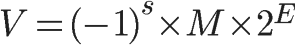
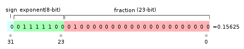
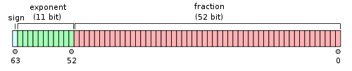

## 浮点计算引发的血案

学习计算机的同学都知道，在计算机中，一切都是用 0 和 1 表示的，包括浮点数。

国际标准 IEEE 754 规定，在计算机中，一个浮点数是使用如下的数学公式表示的：

其中，s 表示 sign，即符号。如果 s == 0，则浮点数 V 为正；如果 s == 1，则浮点数 V 为负。

M 表示有效数字，在 [1, 2) 之间。

而 E 则是指数位。

这种形式同学们应该很熟悉。其实就是我们在小学学习的科学计数法的二进制形式。

对于任何一个数字，比如 666，我们可以基于十进制，将其写成 6.66 * 10 ^ 2 的形式。但是，因为计算机中每一个比特只能存储 0 或者 1，所以，我们转而使用二进制的表示方式。666 的二进制是 1010011010，一共 10 位，相应的，化成二进制的科学计数法，就是 1.010011010 * 2 ^ 9。

套到上面的式子中，相当于 s == 0；M == 1.010011010；E == 9。注意，在这里，M 表示的 1.010011010，是二进制表示。

IEEE 754 规定，对于 32 位的浮点数，最高的一位是符号位 s，之后的 8 位是指数 E，剩下的 23 位，是有效数字 M。

 

而对于 64 位双精度浮点数，最高位依然是符号位 s，之后的 11 位是指数 E，剩下的 52 位为有效数字 M。

 

在这里，IEEE 754 对于指数位 E 和有效数字位 M 的表示，还有一些特殊的规定。比如因为 M 肯定在 [1, 2) 之间，所以每个有效数字小数点前的数字一定是 1，这个 1 就可以省略掉，以节省一位的空间，等等。

IEEE 754 标准具体是怎样的，不是这篇文章的重点。有兴趣的同学，可以在网上查阅这个标准。

但关键是，同学们可以看到，因为有效数字 M 的位数是有限的，这就意味着，计算机表示的浮点数，精度是有限的。

这个精度范围大概是多少呢？

**对于 32 位浮点数，可以准确表示的精度在 10^-6 这个量级。**换句话说，如果我们想要表示的小数，在小数点后 7 位还有有效数字的话，32 位的浮点数就不能精确表示了。

**而对于 64 位浮点数，可以准确表示的精度在 10^-15 这个量级。**换句话说，如果我们想要表示的小数，在小数点后 16 位还有有效数字的话，64 位的浮点数就不能精确表示了。

虽然，对于大多数情况，这个精度范围足够用了。但是，在很多应用领域，我们还是要小心：当使用计算机表示浮点数的时候，因为精度的限制，可能引发严重的问题，甚至是巨大的灾难。

 

---

1991 年海湾战争中，伊拉克的一枚飞毛腿导弹，击中了美军驻扎在沙地阿拉伯 达兰市的一个兵营。这枚导弹造成了美军 28 人死亡，260 人受伤。这个死亡人数，近乎等于美军在整个海湾战争过程中牺牲人数的三分之一。

问题是，美军已经在达兰市部署了大名鼎鼎的爱国者反导弹防御系统。但是，这个防御系统却没有对这枚飞毛腿导弹进行拦截。为什么？问题就出在浮点数上。

事后的研究发现，爱国者防御系统在时间记录上，因为浮点数的精度问题，产生了 0.000000095 秒的误差。然而，就是这 0.000000095 秒的时间，面对飞速运行的导弹，转化成距离，误差被放大到了 573 米。也就是，爱国者防御系统误以为导弹还在 573 米外，尚未对军营造成威胁，因而没有进行拦截。

 

---

并非所有的灾难都是因为精度问题。还有一些灾难，是因为错误地处理浮点数。

最典型的例子，就是在程序中，很有可能会错把浮点数当做整型用。不管是浮点数也好，整型也好，字符也好，在计算机中，都是一串二进制。变量的类型，决定了计算机怎么解析这样一串二进制。不经意间，如果错误地让计算机把原本是浮点数的变量解析成整型，就会产生 bug。

1996 年 6 月，欧洲宇航局发射了无人航天器 阿丽亚娜 5 号。阿丽亚娜 5 号在发射 39 秒后爆炸。

这个航天器花费了 10 年时间进行研发，总投资额达 70 亿美元。与此同时，航天器上载有四个科学卫星，总价值达 5 亿美元。这一切，都在阿丽亚娜 5 号发射 39 秒钟以后，烟消云散。

后续，在进行事故调查的时候，发现是程序中一个极其简单，但同时也是一个极其不易察觉的错误引发的问题：程序中的某一处，将表示航天器水平速度的变量——一个浮点数，错误地当做整型使用了。这使得航天器在升空的过程中，水平方向的速度虽然近乎为 0，却被计算机认为具有一个非常高的水平速度，从而，引发了不正确的自动措施，最终导致整个航天器的爆炸。

 

---

还有一些关于浮点数的 bug，来自四舍五入的过程中。

德国的选举法规定，一个选举人要获得至少 5% 的选票，才能在立法机构赢得一席之地。1992 年 4 月的德国选举过程中，绿党的一名候选人获得了整整 5% 的支持票数。

然而，事后的调查发现，这名候选人的真正得票率不是 5%，而是 4.97%。统计选票程序使用了 round() 函数，对 4.97 进行了四舍五入，最终得到了 5% 的结果。

但这和选举规则是不符合的。选举规则规定：4.97%，也是不足 5% 的。只不过在之前的选举中，没有出现过这种情况，使得人们一直忽视了这个 bug 的存在。

后来，人们重新计算投票后，将这名候选人“踢出”了立法机构。这使得德国社会民主党多了一名候选人。而这一人之差，使得当届，德国的社会民主党赢得了议会上的多数席位。
   
 

---

另一个故事，发生在 1980 年的加拿大温哥华。

当年，温哥华的股票交易所发现，某个指数基金的总价值在奇怪地不断蒸发。事后调查显示，这是因为这个指数基金的交易程序中，对于金钱，使用 floor() 函数的方式，抹去了“分”之后的所有价值。

所以，如果你花了 1234.567 元购买这个基金，最后的 0.007 元，即 0.7 分就被抹去了，相当于交易所少收了 7 厘。

这 7 厘的价值，对于个人来说并不重要。但是，对于整个交易所来说，每天数百万次的交易，在积累一段时间以后，就变成了一个不得了的数字。

 

---

随着计算机系统深入到我们生活的方方面面，很多 bug 真的不仅仅是一个小 bug 那么简单了。它们可能对人类的生活产生真实的影响，甚至是生命的代价。

所以...

对于大多数程序员的日常，可能还是这样子的吧。

 

**大家加油！**