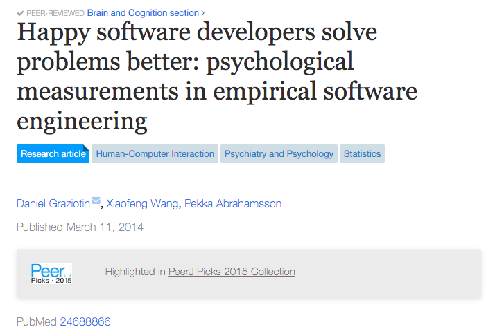

## 软件工程师，工作效率，以及网易

软件工程师的核心任务，就是写代码。如何提高代码质量，减少 bug，提高软件开发效率，是软件行业的老大难问题。为了解决这个问题，无数的技术方案或者工具被发明了出来。

 

最典型的例子，就是各种编程范式的发明。比如面向对象，就是在使用抽象，封装，多态等多种形式，减少冗余代码，方便扩展，从而提高软件书写的效率，降低 bug 率。

函数式编程亦是如此。函数式编程提出“不可变数据”，就是为了减少因为改变各种状态变量产生的 bug。同时，在程序运行高度并行化的今天，不可变也保证了并行过程中的安全。

 

另一个出发点，就是语言。

如果仔细看各个语言最新版本引入的新机制，或者各种新特性的初衷，很多时候，都是和减少 bug，提高代码质量，提升开发效率联系在一起的。

比如对于现代编程语言的学习，要学习一块儿很大的内容，叫异常处理。但是，如果我们去看那些“上古语言”，FORTRAN，BASIC，甚至是 C，近乎完全没有专门的异常处理机制。异常处理是现代语言发明出的，专门“狙击” bug 的语言特性。

再比如，Swift 有一个很有意思的数据类型，叫可选型（Optional）。所谓的可选型，是指可以存储空的类型。换句话说，非可选型不能存储“空”。可选型本质上，就是从数据类型的角度，提醒开发者，这个变量可能为空，所以使用前，请判空！为什么要有这个全新的类型？因为大量的 bug，都和空指针有关。

 

再有，很多抽象的流程或者工具被发明了出来。

如果你翻开一本软件工程的课本，大概就会接触到如下这些概念：

系统流程图、数据流图、数据字典、实体联系图、状态转换图、层次方框图、Warnier 图、IPO 图、层次图、HIPO 图、结构图、程序流程图、盒图、PAD 图、判定表、判定树、Jackson 图、流图、甘特图、工程网络图......

 

上面这堆名词是我在网上找来复制粘贴上去的，很多我也不知道是什么意思。

但是，我知道的是：尽管如此，在软件工程领域，bug 依然顽固地在那里。

每个软件工程师，不管是用什么范式，什么语言，什么版本，什么工具，怎么提前构架，设计，近乎都不可避免地，会写出 bug。

软件行业很多研究结果都表明：并没有明确的证据说明：使用了这些工具，软件工程中的 bug 就减少了。

甚至，我在网上找到了一篇“奇怪”的论文，这篇论文的研究表示：强制员工遵循一些代码书写规范，可能导致项目工程中有更多的 bug。这篇论文的链接在这里：[https://repository.tudelft.nl/islandora/object/uuid:646de5ba-eee8-4ec8-8bbc-2c188e1847ea?collection=research](https://repository.tudelft.nl/islandora/object/uuid:646de5ba-eee8-4ec8-8bbc-2c188e1847ea?collection=research)。

 

提高代码质量的技术手段层出不穷，但似乎都效果有限。那么，还有什么方式，能够真正提高代码质量？

国外技术专家 Hillel Wayne 有一个观点，让我拍案叫绝。

他的核心思想很简单。既然代码都是人写的，那么 bug 也就是人写的。所以，除了改善工具以外，可能，另外一个非常重要的，被很多人忽视的方式是：改善写代码的人。

怎么“改善写代码的人”？

 

---

首当其冲的，就是**睡眠**。

无数科学的研究，已经确定无疑地告诉了我们：睡眠将极大地影响正常人的工作水平，甚至是基础认知能力。

2018 年，IEEE Transactions on Software Engineering 上的的一篇论文，用实验证明了，睡眠剥夺以后的程序员，将丧失大部分工作技能——别说想明白逻辑了，此时，他们可能连 `ls` 是什么都不知道了，不经意间，就 `rm -rf/` 了。

至于长期缺乏睡眠，导致的工作能力的降低，相关研究不要太多。写一两本书是绝对没问题的。缺乏睡眠等于工作能力降低，这简直是常识。

在很多行业，是禁止“疲劳工作”的。最典型的例子是，在运输行业，大部分正规运输公司，都会要求跑长途的司机，期间必须休息一定时间，以避免“疲劳驾驶”。

而在美国，一些医院也规定，护士不得连续工作超过一定时间。因为，无数的研究都在表明，缺乏睡眠的护士，将犯更多错误。

可能很多同学会说，司机和护士的工作，关乎人的性命。程序员不就是坐在办公室里写代码吗？哪里有那么严重？

对于有这个疑问的同学，我建议读一读上周我的公众号文章：[《浮点计算引发的血案》](../2019-11-21/)。

这个年代，很多程序员的工作，也关乎人的性命。

 

---

另外一点，就是**工作时长**。

关于工作时长对工作效率的影响，也历史悠久。早在 1980 年，美国人就系统地研究过这个问题。

其中，最有名的研究，是以建筑工人作为基础进行研究的。那个年代，也是美国经济最繁盛的时期，美国各地都在建建建，因此，也有大量的工人样本供研究。

1980 年，美国的商业圆桌报告指出，如果建筑工人一周工作时间超过 50 个小时，那么在 8-10 周以后，他们的效率就会下降到原来的 76%。也就是说，8-10 周以后，即使这些工人继续每周工作 50 个小时，他们的实际效率，只等于原先的 38 个小时。

如果每周工作 60 个小时，他们的效率会降低的更快。在两个月的时间里，这种极度的低效将表现出来。也就说**同样两个月的时间，每周工作 60 个小时的工人，工作效率还不如每周只工作 40 个小时的工人。**

2004 年，美国疾病控制中心（CDC）的另一项研究，从疾病的角度出发，证实了：过长的工作时间，还将为工人们带来不可逆的健康隐患。

既然如此，那为什么要每周多工作 20 个小时？

 

---

最后一个重要的因素，就是**压力**。压力也将急剧降低一个人的工作效率。

全世界范围，关于压力的研究，也是在近十几二十年兴起的。越来越多的人，开始关注心理健康的问题。

美国疾病控制中心使用护士群体作为研究对象，确凿地证明了：压力越大，越容易犯错，效率越低。

由于关于压力的大多数研究，也就是近十年的事情，而近十年，全球软件行业工作者爆炸式地增长。所以，很多研究，可以直接使用软件工程师作为研究对象。

结论呢？很简单：工程师越快乐，越幸福，压力越小，解决问题的能力越强。

有兴趣的同学，可以直接搜索这篇论文：

 

---

大家可以看到：无数的研究都在告诉我们，睡眠，工作时长，和压力，这些因素，都将极大地影响软件工程师的效率。

那么问题来了。

为什么在大多数情况下，一个软件工程师写了一个 bug，大多数人会说：

如果你使用 XX 语言，就不会产生这个 bug；

或者说，如果你多做一组单元测试，就能更早地发现这个 bug；

或者说，如果引入 Pair Programming 的机制，发现这个 bug 的概率更大。

 

为什么没有人说：

如果你昨天多睡两个小时，就不会写出这个 bug？

如果保持每周只工作 40 个小时，而不要过度劳累，就不会写出这个 bug？

或者如果不要压力太大，应该使用 XX 或者 YY 的方式缓解压力，就不会写出这个 bug？

 

这些问题初听起来，似乎非常好笑。但是仔细想想，不无道理。

 

一直关注我的公众号的同学都知道，我从来不提倡 996。

这个不提倡背后，还真不仅仅是在为每一个开发者着想。

我也是在为资本家们着想啊！

 

最近的网易暴力裁员事件，想必大家都知道。

对于这件事情，各路媒体的报道已经铺天盖地了，我不想赘述了。

对于其中的劳动纠纷，我想后续就听法律的就好了。

但是，HR 在处理整个事情过程中的不近人情，是有目共睹。尤其是还给员工扣上了有“反动倾向”的帽子，在今年上半年这样一个敏感时期做出这样的行为，简直可以说是恶毒了。

不知道这样的做法，会不会让很多网易内部员工黯然心伤，压力倍增，从而大大降低工作效率？

网易这种体量的公司，工作效率的些许降低，折算成人民币，应该也不是一个小数目。不知道这笔账，要不要计算到 HR 的 KPI 中？

 

所以，如果看了这篇文章，有的同学正在创业，或者以后将要创业；有的同学正在带团队，或者以后将要带团队，在思考如何提高团队效率的问题上，可能，除了引入各种奇怪的技术工具和协同机制以外，也需要考虑一下维护团队成员的工作与生活的平衡。

毕竟，**作为管理者，管理的是人。所有的工作，都是人做出来的。**

管理者的管理方案，至少要让团队能够感受到：人，是重要的。

因为：**人，真的是最重要的。**

 

**大家加油！**

然后，今天的结尾多说一句：**大家加油一天，晚上也好好休息！：）**

 

参考资料：[https://increment.com/teams/the-epistemology-of-software-quality](https://increment.com/teams/the-epistemology-of-software-quality)
