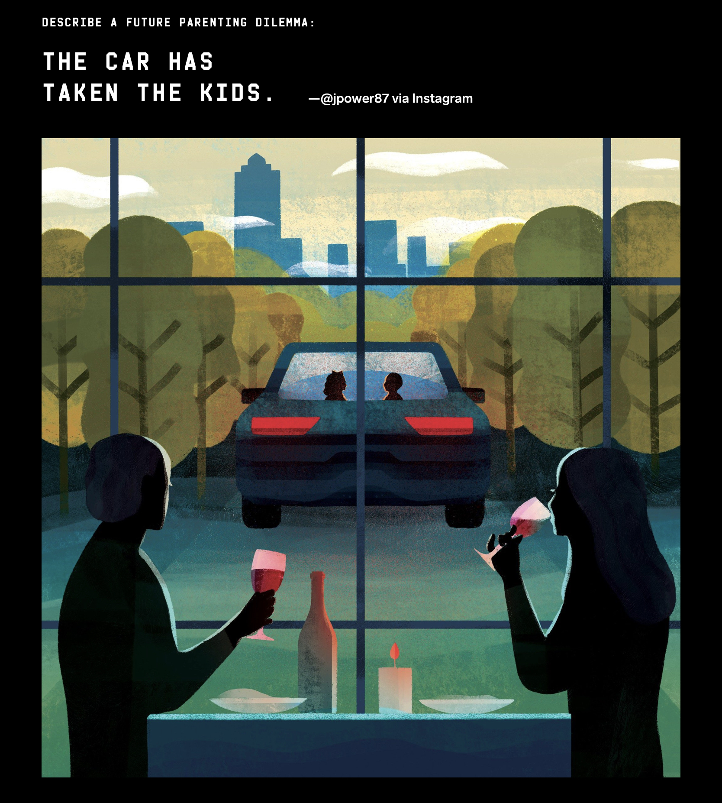
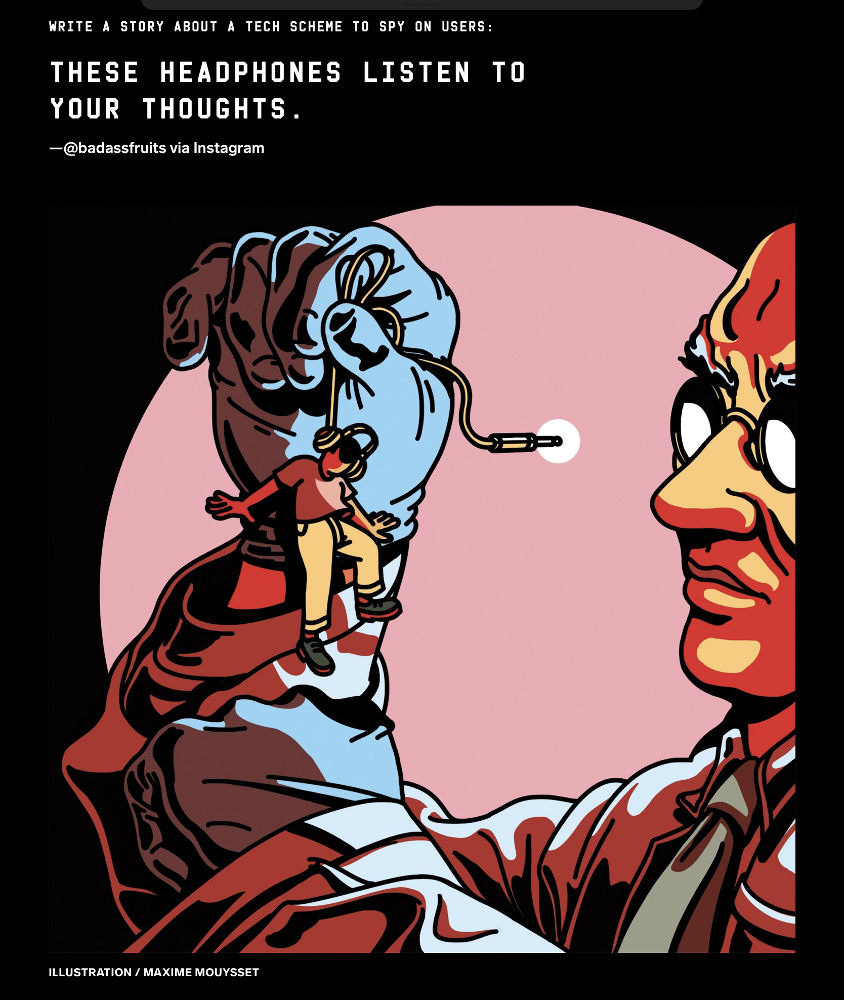
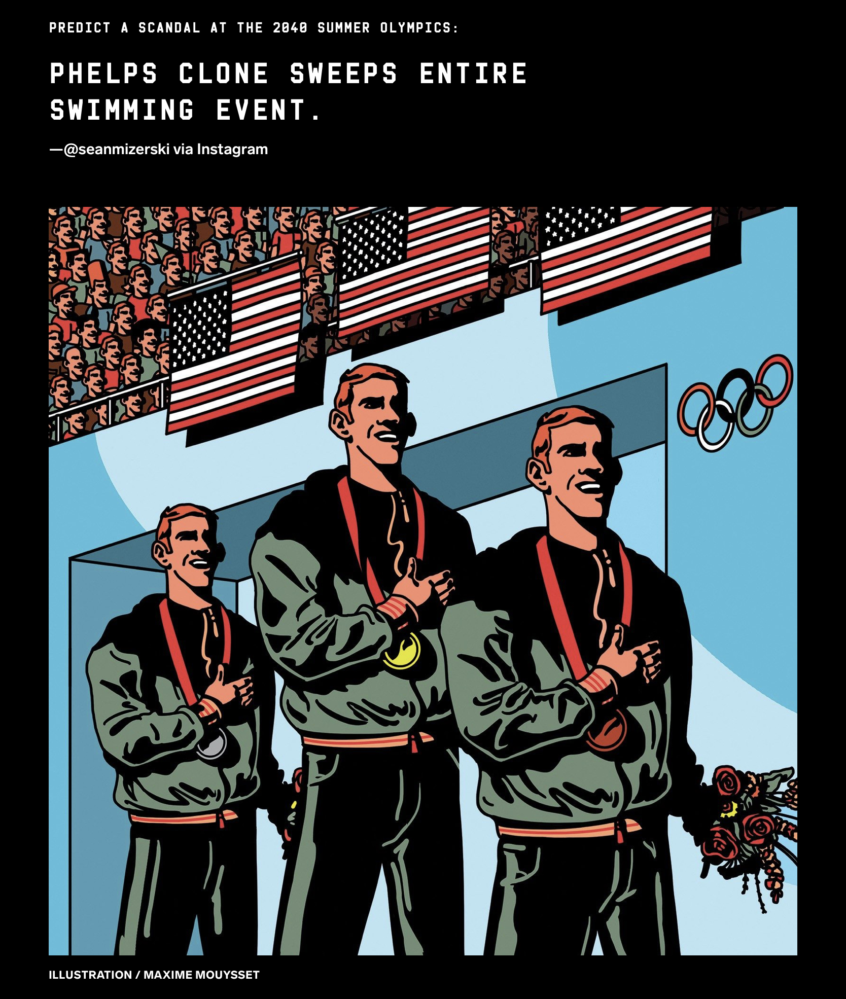
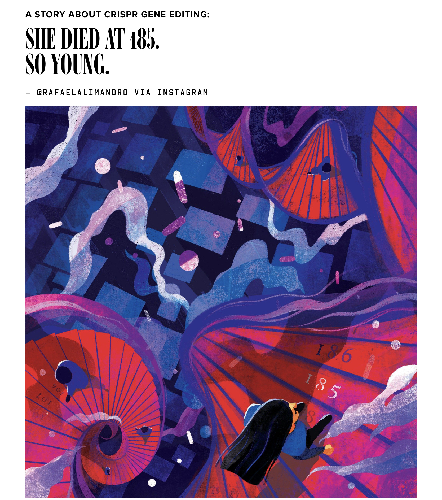
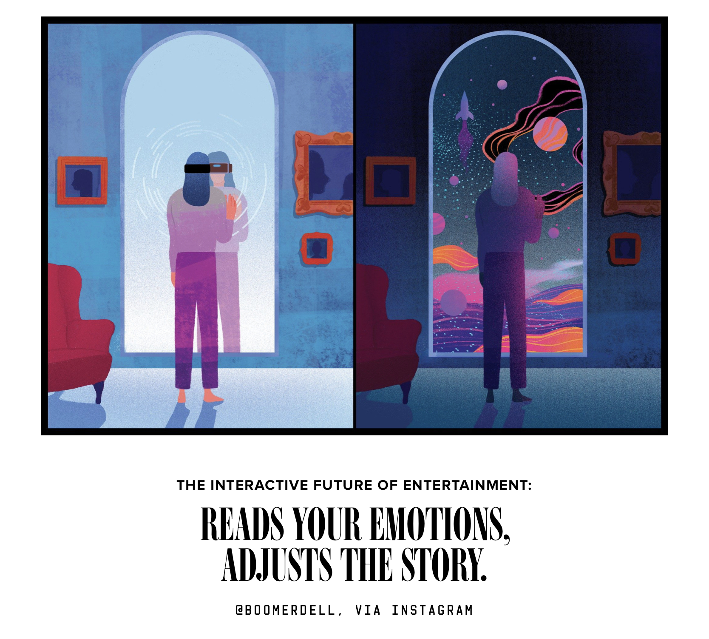
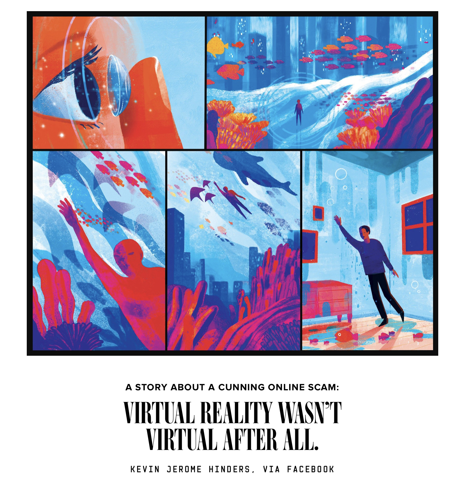

## 六词科幻

曾经，在我的文章[《为什么别人比你早那么多知道比特币？洞悉未来的科技媒体》](../../2018/2018-02-03/)中，向大家介绍过一个我个人非常喜欢的美国技术杂志——wired，国内翻译成《连线》杂志。

《连线》杂志里，有一个非常有意思的栏目，叫“六词科幻”，即只使用六个词，写一个超短的科幻小说。

六个词怎么写科幻小说？

比如这样：

> Diver inflicts emotional distress; car sues

我的翻译：**司机遭受情绪不良；汽车起诉了司机。**

看来，未来，智能车不仅仅是可以自己自动到达目的地而已。

 

关于智能车的六词科幻，还有一期是这样的：

> The car has taken the kids.

我的翻译：**汽车带走了孩子们。**

看下面的配图，父母们正在喝着红酒。看来，未来的智能车，可以自动带孩子。

但是，这是不是意味着，智能车也有可能拐走孩子？

这就是我很看好未来安全领域的原因...

 

说到安全问题，因为现在人们很重视隐私。所以，有一期的六词科幻是这样的：

> These headphones listen to your thoughs.

我的翻译：**这些耳机正在倾听你的想法。**

其实，未来，物联网的世界，人们同时也将被越来越多的电子设备所监控。

 

生物技术也将是未来的大热门，所以，有两期内容是这样的：

> Phelps clone sweeps entire swimming events.

我的翻译：**菲尔普斯的克隆体囊括了游泳比赛的所有奖牌。**

所以，未来的体育比赛，其实是观看克隆人大战吗？

 

再有：

> She died at 185. So young.

我的翻译：**她只活到 185 岁。太年轻了。**

对了，最近有一个新闻，有兴趣的同学可以关注一下：美国 Libella 公司的抗衰老基因疗法于 11 月 21 号获得哥伦比亚 IRB 的临床试验许可。这一疗法宣称可以逆转衰老达20年。

Libella 公司正在美国招募受试者。受试者会前往哥伦比亚签署同意书并在合规的医院内进行基因疗法治疗。费用是：100 万美金。

 

最后，随着虚拟现实越来越发达，未来可能会出现这样的事情：

> Reads your emotions, adjusts the story.

我的翻译：**读取你的思想，调整出适合你的故事。**

所以未来，不是我们根据心情选择自己喜欢的故事，而是故事根据我们的心情，自动编辑出来。

 

所以：

> Virtual reality wasn't virtual after all.

我的翻译：**虚拟现实一点儿也不虚拟。**

其实，就在当下，对于很多人来讲，虚拟的网络生活，也已经成为了人们现实生活中，不可分割的一部分了。

 

怎么样？是不是很酷？

**大家加油！**