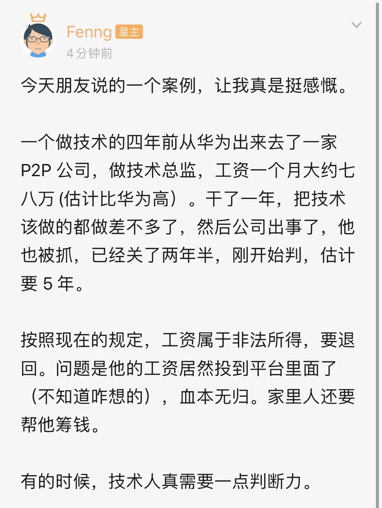

## 不要把鸡蛋放到一个篮子里

今天说的话题可能有点儿沉重。

先讲两个我在网上看到的故事。

 

第一个故事的主人公叫 Grace，一个很普通的，流行于上个世纪的美国名字。实际上，Grace 是 1910 年生人，于 2010 年去世，享年整整 100 岁。

Grace 一生主要做的职位是秘书。收入虽然不高，但也属于美国的中产阶级。Grace 一生未婚，无儿无女。在她去世以后，人们惊讶地发现，Grace 留有 700 万美元的遗产。在她的遗嘱中，这 700 万美元在她去世后，都捐助给了慈善机构。

但人们更感兴趣的是，平凡无奇的 Grace，为什么会留有这么大的一笔遗产？

后来的调查显示，这其中没有任何秘密。Grace 只不过是一个省吃俭用，开销极小的老人而已。她把她的大部分积蓄，都分散扔到了几个相对安全的基金中，不断地复利，滚大。虽然这 100 年间，美国的经济也几经动荡，但 Grace 的账户，却在这 100 年间，尤其是蓬勃发展的美国新经济时期，滚成了 700 万美金的巨款。

 

另一个故事，主人公叫 Richard。这也是一个平凡的美国名字，但是，Richard 的职位比 Grace 不平凡得多。Richard 是美林证券拉丁美洲分部的副总裁。

美林证券曾是世界最大的证券零售商之一，总部位于美国纽约，在世界超过40个国家经营。作为这样一个金融巨头的高管，Richard 自然过着优越的生活。他是哈佛大学的毕业生，在美国名下有两处房产，其中的一处超过了 2 万平方英尺。

但是，同样是 2010 年，Grace 去世的那一年，Richard 不得不宣布破产。因为受金融危机的影响，Richard 的投资不但赔得精光，还因为杠杆，让他负债累累。他不得不变卖那栋面积超过 2 万平方英尺的豪宅。

为什么？因为，Richard 的大部分投资，都在自己骄傲的美林证券内部，而这些投资，大部分都牵扯到了当时引发金融危机的元凶——次级贷款。

实际上，因为受 2008 年金融危机的影响，美林集团也陷入了巨大的经济危机，蒙受了超过 500 亿美元的损失，不得不将自己出售给了美国银行，以避免破产的命运。至此，美林证券长达95年的独立公司经营的道路，画上了一个句号。

 

Richard 当然可以把自己破产的原因全部抛给金融危机。但问题是，Grace 的财产并没有受到金融危机的影响。

从专业角度看，Grace 不仅没有接受过哈佛大学专业的金融教育，更没有常年累月的金融行业从业经验。但是，在投资这件事上，Grace 这样一个平凡的老人，却打败了华尔街大亨 Richard。

为什么会这样？在我看来，道理很简单。一方面，没有什么金融知识的 Grace，反而不会去接触那些复杂的，诸如次级贷款这样的理财产品，这让她免于灾难。

另一方面，Grace 将她的财产，分散在了不同领域的低风险基金中，不仅保证安全，还保证分散。所谓的不把鸡蛋放在一个篮子里。相较而言，Richard 却将他的大部分资产，全都扔给了美林证券。

不把鸡蛋放到一个篮子中。这是多么简单的一个道理。但是，在具体行动上，很多人却把这件事情给忘记了。

 

说回在中国的故事。上一周，在冯大的知识星球，发了这样一个帖子：

这个故事让我唏嘘不已。关于匹凸匹公司在近些年的政策风险，我不想多聊，其实，我也不是内部人士，不是相关行业从业者，也不很了解。

但是，把自己所有的工资都扔到自己的平台里，这样做，真的不是“热爱公司”，而是缺乏基本的常识——不把鸡蛋放到一个篮子中。

 

无独有偶，就在最近，就在我的身边，近乎发生了一个完全一样的故事。

最近一个朋友跟我说，他的一个朋友，所在的匹凸匹公司，被查封了，因为涉嫌诈骗。整个公司近 200 多号人，都进去协助调查了。因为还在协助调查时期，所以还没有定性。也不知道后续会怎样。已经两个多星期了。

其中的一个主管。把全家的钱，都投进自己的平台了。他的老婆现在还在怀着二胎。一边拉扯着老大，一边照顾自己的肚子，还要跑老公的这件事情。搞不好，自己的家底都要赔进去，老公还会被判几年。现在人憔悴的不得了。

可也没办法。现在只能等着调查结果。

**讲真的，一个技术人，挺冤的。**

 

不知道关注我的公号的同学，还有没有在相关行业的，包括区块链的同学。

如果坚持做，一定要关注一下政策变化，包括周围的风吹草动。不是所有的企业都有问题，但是，自己身在这个政策风险较高的行业，要关注这方面的新闻，注意环境的变化。

如果没有那么迷恋自己的公司，为了规避风险，最好还是着手找其他的工作。

但不管怎样，就算是自己的公司，也不能把所有钱都扔进去。巴菲特也没这么干。

all in 永远是最差的策略。不要把鸡蛋放到一个篮子里。这是一个如此简单而又朴素的思想，但是，在具体的决策面前，很多人就是会忘记。

 

话说回来，只有在金钱上，在投资上，才有 all in 吗？

网易的老员工，辛辛苦苦 996，工作量排名第二，把自己干出了绝症，何尝不是一种 all in？还有最近华为的事儿，嗯，不多说了。

所以，又说回了那句老话，如果可以，不要 996；如果可以，适当地发展自己的兴趣，找到自己和这个世界相处的方式；适当发展自己的人脉，让自己尽可能多一条路，而不仅仅是一股脑地拼命“应付”自己的工作，把自己 all in。

为什么呢？因为，其实，每个人也都是一筐鸡蛋。

**不能把鸡蛋都放到一个篮子里。**

 

**大家加油！**