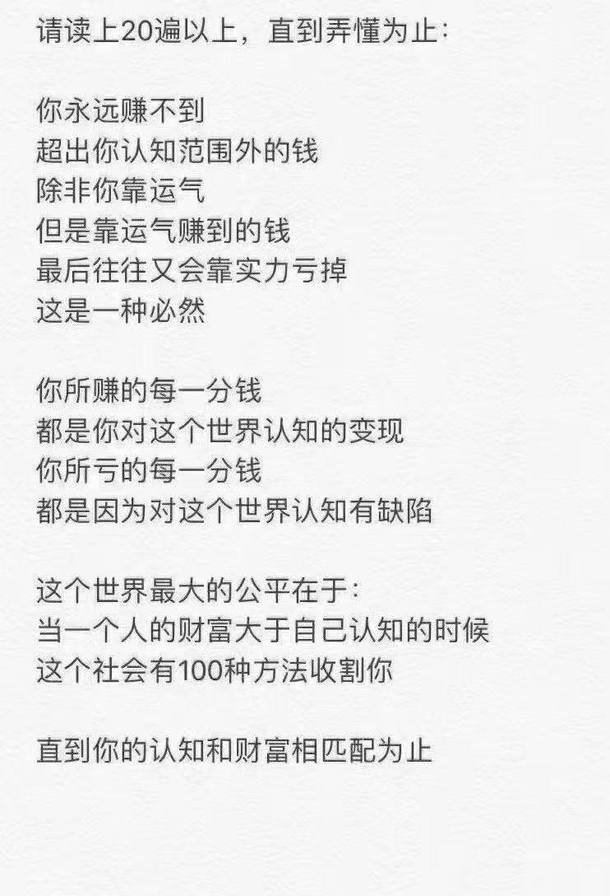

## 随便聊聊认知和赚钱

昨天，我的朋友圈里被这样一段话刷屏了：

 

 

我其实很少聊“赚钱”这个话题的，借着这段话，忍不住随便说两句：

这段文字说的没毛病，但是不知道为什么，我很厌烦这段话。

我仔细思考了一下，可能是因为，这段话过度强调“认知”。似乎在说，对世界的认知足够高，就能赚到大钱一样。

但实际不是这样的。

认知重要吗？当然重要。但是，我以为，**在信息相当发达的今天，大多数人对世界的认知，是超过自己实际赚到的钱的。**

为什么会这样？因为只有认知是不够的，必须要实干。

更关键的是，提高认知最有效的方式，就是实干。

找一个真正做电商的人，哪怕是失败了，没赚钱，甚至是赔钱的人，他对电商领域的认知，都会比普通人高出几百倍。这些实践过后对领域的透彻理解，即所谓的经验，才是真正能帮助这个人下次再次成功的关键。

但是，很多人，偏偏只聊认知，不去实干。

 

---

无独有偶，就在昨天，我的朋友圈里，一个上海复旦大学 EMBA 同学，分享了在他的课堂上的一个观点：

课堂的教授分享了一个数据：从有想法创业的人，到真正开始创业的人，转化比例是 2.7%。

所以很多时候，确实不怕外部竞争对手，只怕自己内部决策或执行错误，死在自己手上。

那 97.3% 的人中，有非常多厉害的精英，如果他们真的敢开始自己干，会是很可怕的对手。幸运的是，他们不敢 ; 

而那些敢于开干的 2.7% 的人中，有一部分是有钱人的玩票，他们没有太大的压力与动力，也没有太多接地气的实战经验，所以也不足为惧。

剩下真正有经验，有压力，有动力的创业者，可能能力不够、资源不够，其实也构不成威胁；

最后剩下的，最有可能短兵相接的对手，很可能赛道不同，大家可以当合作伙伴，而不是竞争对手。

所以，怕啥竞争？别把自己玩死就算赢了。

 

上面这段话的结论，落到了“竞争”的问题上，但我倒觉得，对于大多数人，可能更需要关注的是：**实干的意义。**

其实，程序员应该最明白这个道理。毕竟。看再多的书，都不如自己实际实现一段代码提高得快。

**只是一味追求“提高认知”，而不去做事情，是永远都赚不到钱的。**

 

**大家加油！**