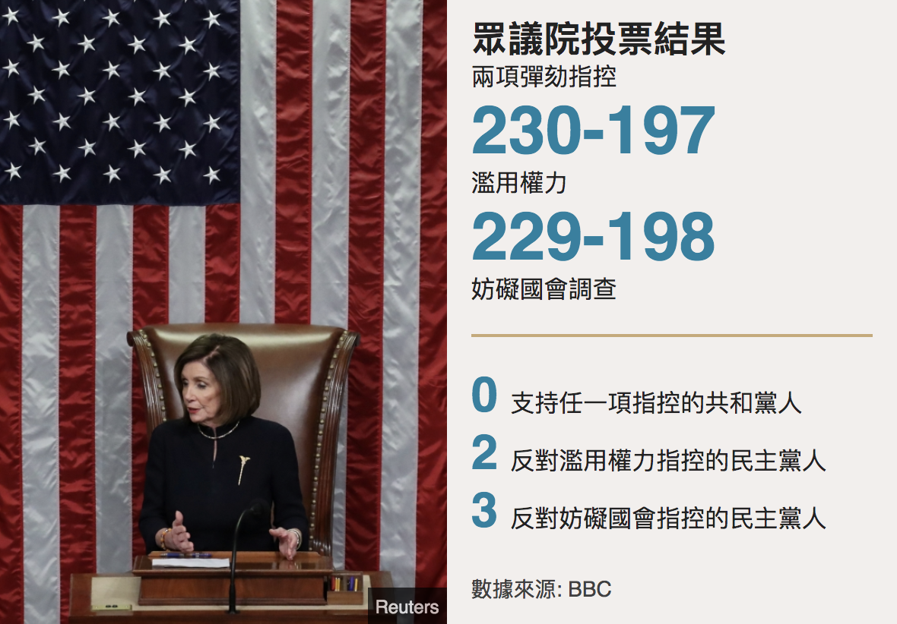
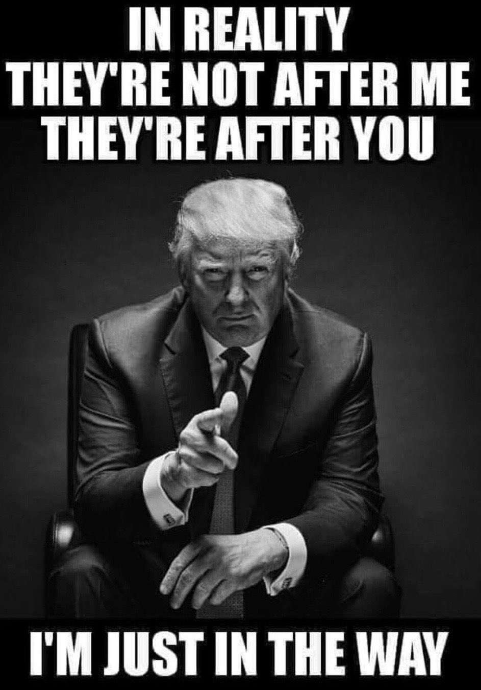
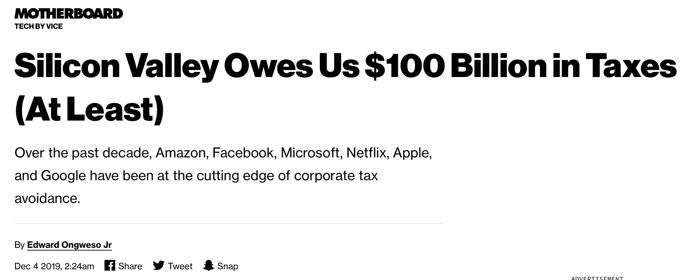

## 科技巨头和虚伪的左派

美国众议院通过了川普的弹劾程序，相信大家都知道了。下一步，这个弹劾程序将走到参议院。

至此，川普是美国历史上第三个被众议院弹劾的总统了。值得一提的是，前两次弹劾的总统——安德鲁.约翰逊总统和克林顿总统，最终都以失败告终。也就是说，美国还没有成功弹劾某个总统的先例。

如果这次参议院真的破天荒地通过了弹劾案，那么川普将成为美国历史上第一位被成功弹劾的总统。这也将成为美国，乃至整个世界的一个里程碑的事件。

但是有一说一，川普被弹劾成功的概率很低，因为弹劾案到参议院，需要 2/3 的票数通过才行。

现在，参议院里，共和党人和民主党人的比例是多少呢？53：47。虽然基本持平，但是共和党人占优。

算下来，需要有 20 名共和党人“叛变”，投票比例变成 33：67，才能成功弹劾川普。这个概率实在太低了。

 

为什么说共和党人叛变这么难？因为，在众议院投票的过程中，所有的共和党人，都表示川普无罪！

在众议院的投票中，给川普的罪名是：“滥用权力”和“妨碍国会调查”两项指控。

最终的投票结果，“滥用权力”的指控，以 230 票支持，197 票反对通过；

“妨碍国会调查”的指控，以 229 票支持，198 票反对通过。

但是，如果我们看投票人的党派划分，就很有意思了。对这两项指控，共和党人全部投反对票；而民主党人，只有两人反对川普滥用权力，三人反对川普妨碍国会调查，其他人统统投支持票。

近乎可以理解成，**所有共和党人都认为川普无罪，所有民主党人都认为川普有罪。**

如此严肃的问题，投票结果却因为党派的不同有着如此清晰的界限，这让我觉得整个过程就像幼儿园小朋友吵架一样：反正我跟你不是一拨儿的。像极了一场闹剧。

然而，这样的闹剧，在美国也不是第一次了。在我看来，去年卡瓦诺先生在接受川普的大法官提名以后，被左派人士指控 36 年前犯下了一场性侵案而闹得沸沸扬扬，也是一场闹剧。有机会再和大家分享一下。

在这些事件中，我们都可以看到美国左右两派深深的裂痕。

 

---

在启动川普的弹劾程序以后，川普在推特上，发布了这样一张图片。

上面的文字是：

> In Realiity, They're not after me, they're after you. I'm just in the way.

我的翻译：

**实际上，他们的目标不是我，而是你们。我只是挡了他们的路而已。**

这里的“我”，显然是川普本人。

“你们”是谁呢？就是川普的支持者们。按照媒体的画像：男性、白人、穷、受教育程度低、生活在“绣带”。

而“他们”，则是美国社会精英聚集的左派人士。

换句话说，川普在向他的支持者喊话：左派人士又要来“剥削”你们的生活啦。但是，为了更好地“剥削”你们，他们必须先要把我弹劾掉。

川普的“喊话”有效吗？目前看来，挺有效的。现在，**川普的支持率不降反升。**

 

---
 
左派人士的问题，是近些年，美国的热点话题。

在英语里，有一个词，叫“liberal hypocrisy”，翻译过来，就是左派（自由派）的伪善。

为什么总有人说左派人士伪善呢？川普曾经举过一个例子，虽然不完全合适，但是也挺妙的。

川普想建一堵墙，以阻挡更多的非法移民进入美国。大多数左派人士都是极力反对这一设想的，认为不人道。无论是希拉里，还是奥巴马，都不支持。

但关键是，无论是希拉里，还是奥巴马，自己的豪宅，都毫无例外地用高墙和外界隔绝。

 

左派的伪善，另外一个极好的例子，就是硅谷的科技巨头。

众所周知，硅谷的科技巨头们，都是在“合法避税”的。

就在上周，vice 的一篇文章表示，硅谷的大企业们，在过去的十年，至少欠美国人民 1000 亿美元的税款。

硅谷大企业们避税的重要方式，是将公司注册在鸟不拉屎的小岛上，比如开曼群岛。这样一来，从法律和会计意义上，这些公司的很多账目，本质是这些小岛上的生意，就可以享受极低的税率了。

这样做虽然合法，但明显不合理。

而搞笑的时候，近乎所有的硅谷大企业，都是左倾的。换句话说，他们认为政府有更多的责任，补助穷人，救济难民。

可是，你们这群大把赚钱的硅谷大企业疯狂地逃税，政府哪里有钱补助穷人，救济难民？如果所有的硅谷大企业都不逃税，每年政府的财政收入能多出好大一笔钱，很多问题都能有效解决。

**左派的伪善。**

 

---

但是，这个问题有解吗？

其实是没有解的。至少短期内没有。

为什么这么说呢？我们可以假想一下：如果某一个硅谷大企业，比如说 Google 吧，突然良心发现，要肩负起社会责任，开始不再避税，全额交税，会发生什么？

首先，肯定是 Google 的员工开始喜气洋洋地宣布：看我们公司，多牛逼，不作恶。我们永远是 Google，永远是硅谷的道德标杆！

但实际上呢？由于公司多交了税，这就意味着公司的盈利能力下降了！公司的盈利能力下降，反映到市场上，就是股价的下调。

手里握有 Google 股票的员工，肯定第一时间得到消息，在互联网上嘚瑟一下自己公司的“不作恶”以后，扭头就去卖股票了。因为他们知道这股票肯定跌嘛！

但是，自己的同事，搞不好不等到互联网嘚瑟一下，就已经去卖股票了。

至于自己的上级，因为知道的消息比自己早，可能早就把股票已经给卖了。

大家纷纷卖，股票一定下降。市场上的股东见势，也会开始卖掉手上的股票。因为整体市场看跌嘛。

于是，就会引起恐慌性抛售。这样一来，搞不好瞬间冲垮整个 Google。

讽刺的是：只因为 Google 决定带头不避税，就很有可能遭受这样的灭顶之灾。

 

所以，现在，所有的科技巨头都避税，反而是大家都陷入了一个博弈论的平衡之中。宛如囚徒困境一般，对自己的最优解，竟然造成了全社会的最差解。

看来，这件事儿还真是难。

但反正我们在中国，我们不管美国人怎么折腾，我们自己只要加油就好了。

**大家加油！**