## 2019，OK

2019 悄悄来到了最后一天。

很多人说，2019 是近 10 年最差的一年；还有很多人说，2019 将是未来 10 年最好的一年。

回首 2019，真的发生了很多事儿。

 

**2019 年，很多人倒下了**。

比如坚果手机。2019 年，锤子科技将坚果手机出售给了字节跳动。老罗用实际行动给所有人上了生动的一课——有情怀，固然好；但情怀不是成功的保证。

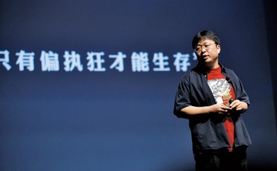

 

比如熊猫直播。2016 年，熊猫直播还荣登中国泛娱乐指数盛典“中国文娱创新企业榜 TOP 30”。然而 3 年之后，2019 年 3 月 30 日，熊猫直播宣布正式关站。王思聪也用他的实际行动告诉大家：首富的儿子坐拥再多的资源，该失败还是会失败。

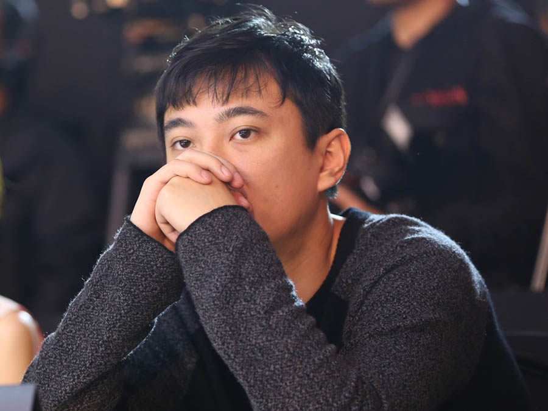

 

外国人也过得没那么舒服。

世界级 AI 网红吴恩达创立的公司 driving.ai 永久关闭。这家公司曾被估值 2 亿美元，然而，在 2019 年提交了文件进行项目清盘。越来越多的人开始意识到：真正的无人驾驶，可能离我们还很远。人类对科技的发展，似乎有些谜之自信。

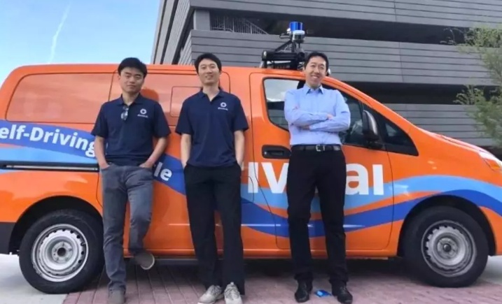

 

曾被预测为 2019 年美股年度第二大 IPO 的十倍独角兽 Wework，更是让所有人大跌眼镜。市值从 470 亿美元，瞬间缩水至 80 亿美元，跌幅超过 80%。一时间，创始人离职，企业大批裁员，一个神话的倒塌，告诉了我们：二房东就是二房东，不是顶一个“互联网公司”的马甲，就能成为高科技企业的。

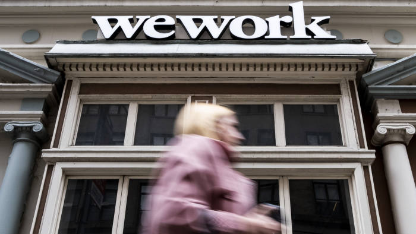

 

**2019 年，还有一些人退休了。**

6 月 18 日，索尼前 CEO 平井一夫退休。至此，他在索尼耕耘了 35 年。从 25 岁，到 60 岁。

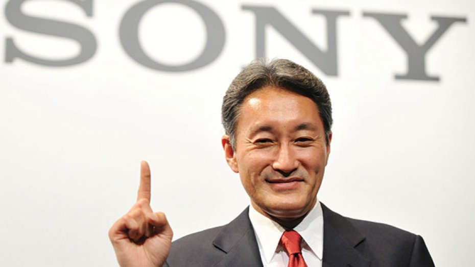

 

在大洋彼岸，Google 的联合创始人 Larry Page 和 Sergey Brin 于 12 月 4 日决定辞去 Alphabeta（Google 的母公司）CEO 的职位，由现任 Google CEO：Pichai 同学——国内有的时候管他叫劈柴同学，来担任 Alphabeta 的 CEO。

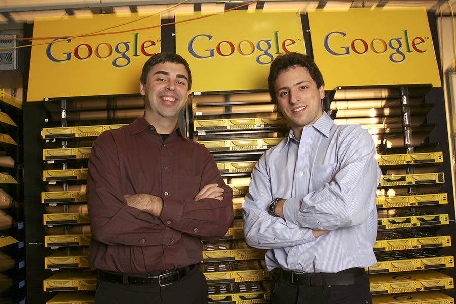

劈柴同学 2004 年加入 Google，仅仅用了 15 年的时间，爬到了 Google 母公司 Alphabeta 的最高职位，可谓全球职业经理人的典范。

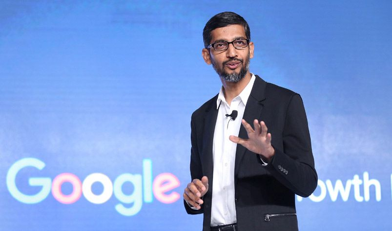

 

当然了，国内大家更关注的，一定是 9 月 10 日，马云老师的退休。张勇接任阿里巴巴集团首席执行官。

马云在退任演讲时含泪说道：**没想到，等了10年的这一天，来得这么快，来得这么美好。**

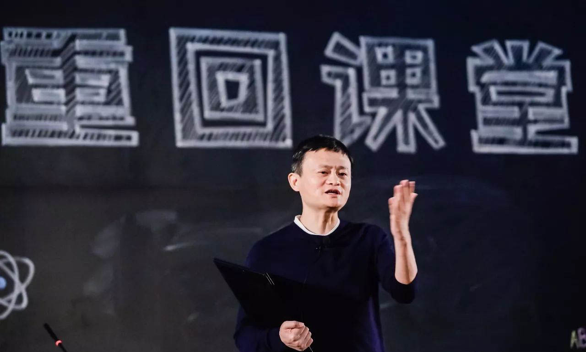

 

**2019 年，很多事儿不算顺。**

1 月 27 日，有赞 CEO 白鸦在公司年会宣布执行 996，从而引发了长达一年时间，全网对 996 工作制的大讨论。参与讨论的不乏互联网大佬们。

马云说“996 是福报”；刘强东说“混日子的不是我兄弟”。

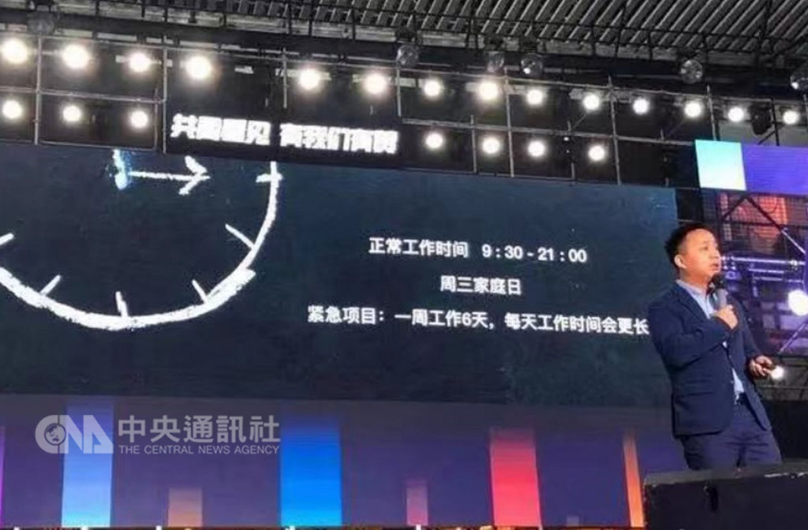

 

3 月 27 日，996.ICU 项目在 github 上上线。如今，这个项目已经有了近 25 万个 star，是 github 上 star 数排名第二的项目。而其增长速度，应该是 github 历史上，成长最快的项目。

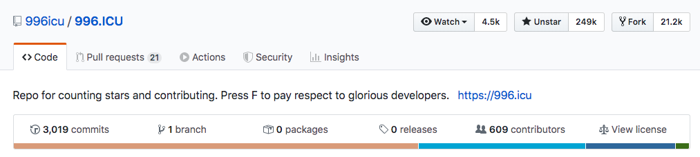

 

至于百度，7 月 3 日，李彦宏在百度 AI 开发者大会上，被人泼了一瓶冷水。这一行为虽然是违法的，不值得提倡，但却颇有些行为艺术的意味。

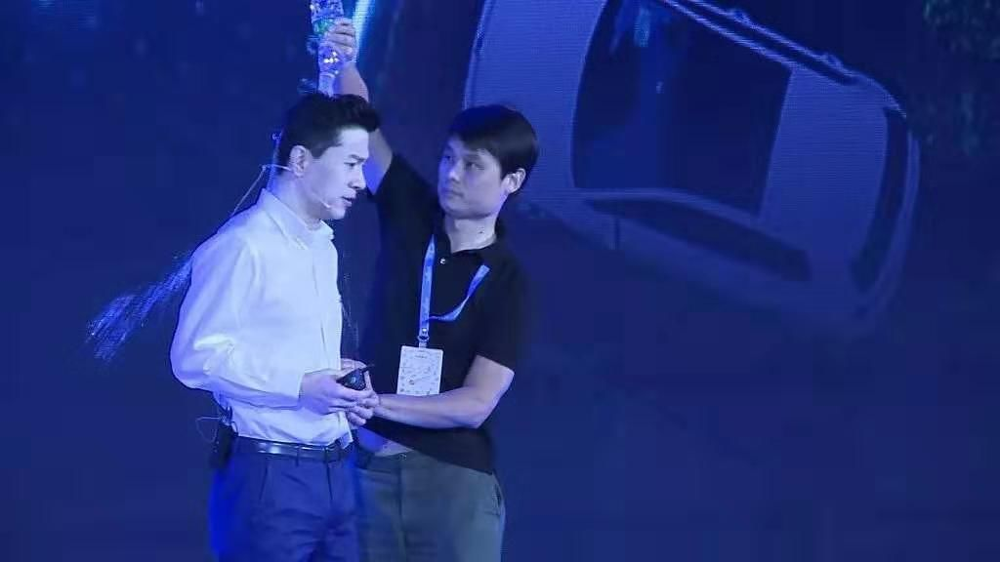

2019 年，市场可谓给百度泼了一盆冷水。2017 年，百度还是中国互联网三巨头之一；2018 年，被字节跳动追上，滑到了第四；到了 2019 年，百度突然滑到了第 8 名。

排在百度前面的中国互联网企业分别是：阿里巴巴；腾讯；字节跳动；滴滴；美团；京东和拼多多。

 

不过，2019 年，最受国人关注的企业，还是华为。

在孟晚舟事件后，美国开始限制华为。一时间，华为成为国内外的焦点。与之相对应的，则是 5G 这种新一代的通信技术，成为大家关注的热点技术。

6 月 6 日，移动、联通、电信三大运营商和中国广电获颁 5G 牌照。在此后约 5 个月的时间里，8.6 万座基站开始发射 5G 信号，20 款 5G 手机终端入网测试，5G 产业链进一步成熟。2019 年被称为是 5G 元年。

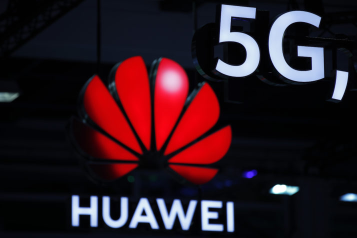

华为事件也让越来越多的人意识到了，底层核心技术的重要性。这也让国家，包括越来越多的企业，开始注重底层技术的发展。很多政策相应出台。

我相信，如果一切顺利的话，10 年，20 年后，回头看，2019 年，将是很具有历史意义的一年。而我们所有人，都置身其中。

 

除了 5G 的发展。2019 年，还有更多新的技术产品诞生。

苹果如约推出 iPhone 11，全新的“浴霸”摄像头，大家都说丑。但是发售一分钟，销售额就破亿；发售不到 40 天，销量就突破 1200 万台。

iPhone 11 在中国最受欢迎，在中国市场上，相比去年同期，增长了 230%。但是，大家都喊着要支持的近乎是同期的手机——华为 Mate 30，销售量却远低于预期，几倍小于苹果 iPhone 11 的销量。

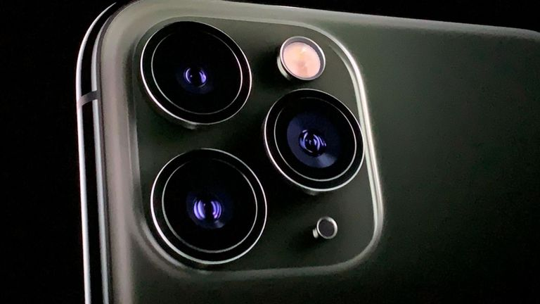

 

苹果在今年还重磅推出了 airpod 2 和 airpod pro。继触控屏手机之后，苹果再次激活了一个全新的市场——无线耳机市场。

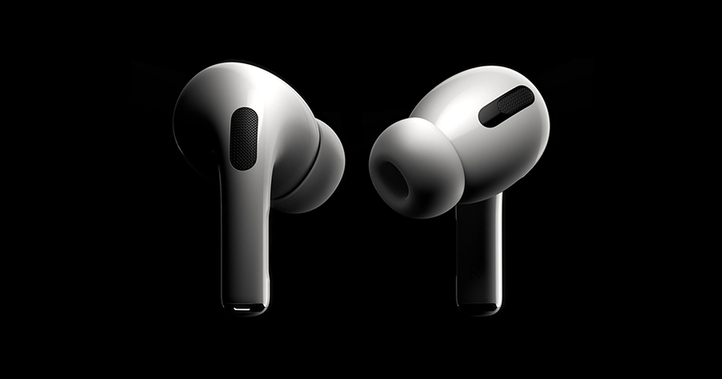

 

坚信人类是生活在虚拟世界中的"钢铁侠"马斯克，在 2019 年也没有闲着。先是在 7 月 23 日，发布了 Neurolink 的最新脑机接口技术；紧接着，在 11 月 21 日，发布了造型极具未来感的电动皮卡：Cybertruck。

虽然 Cybertruck 的发布会有些翻车，但是，这台据说可以开上火星的皮卡，在发布三天后，预定量就达到了 20 万台。

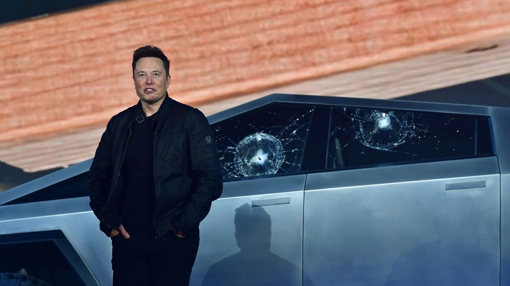

 

2019 年，最激动人心的科学新闻，或许就是事件视界望远镜（EHT）项目团队发布了人类历史上的首张黑洞照片。这个黑洞位于巨椭圆星系 M87 中心，距离地球 5500 万光年，质量为太阳的 65 亿倍。

这是人类首次目睹黑洞真容。

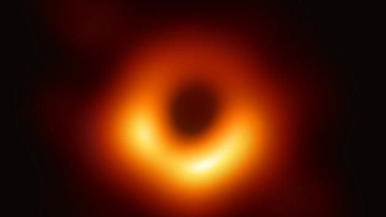

 

但是，在 2019 年，我个人却特别喜欢这样一个新闻：

在 7 月 25 日，一颗小行星悄悄与地球擦肩而过。这颗小行星，直径约 57-130 米，以 24.5 千米/秒的相对速度掠过地球，距离最近时，离我们仅 7.4 万千米，约为地月平均距离的五分之一。

如果这个小行星真跟地球撞上，结果不堪设想。

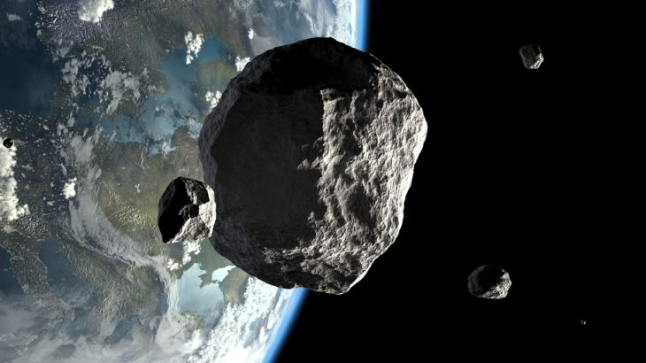

小行星一直是地球生存的巨大威胁。在全球，有超过 400 个观测站，正在密切关注跟踪着有可能对地球产生威胁的小行星。这些观测站把观测数据上传至国际小行星中心，全球信息共享。

但是，由于人类的技术还有限，宇宙中的小行星数量又太多。现阶段，全球主要观测的目标，是“直径大于 140 米，对地球构成潜在威胁”的近地小行星。

截至目前，人类已经发现的，具有潜在威胁的近地小行星，接近 2000 颗！每一颗小行星，都是地球的一颗定时炸弹！要知道，当年恐龙灭绝，就是一颗小行星惹的祸。

但是，可能还有不少这种直径小于 140 米的小行星，我们尚未发现。如果他们出现，我们只能听天由命。

所以，2019 年，人类挺幸运，这颗小行星，没有撞上地球。感谢小行星不杀之恩。

因此，天文学家给这颗小行星起了一个非常有趣又恰当的名字，叫：2019，OK。

这个名字，我觉得作为 2019 年的总结，挺不错。

2019，OK。

毕竟，2019 年再糟糕，我们也都活了下来了。

 

至于 2020 年。

我们来了！

**大家加油！**
