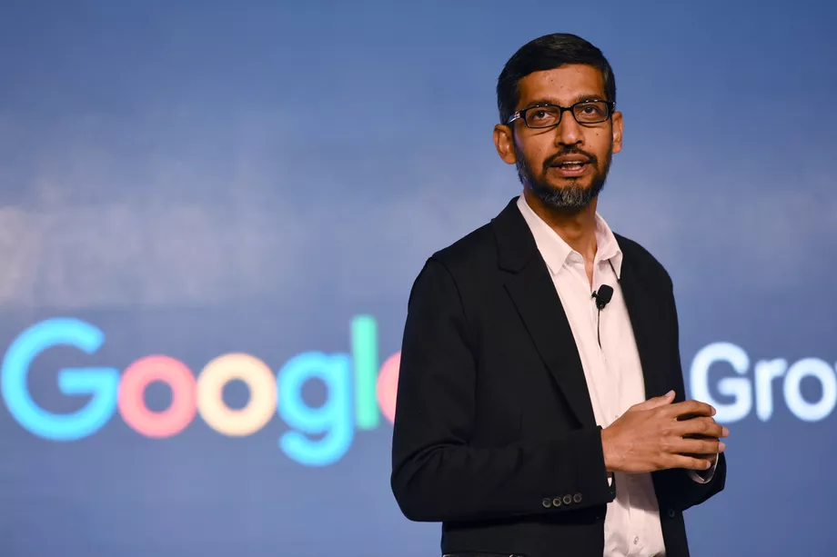
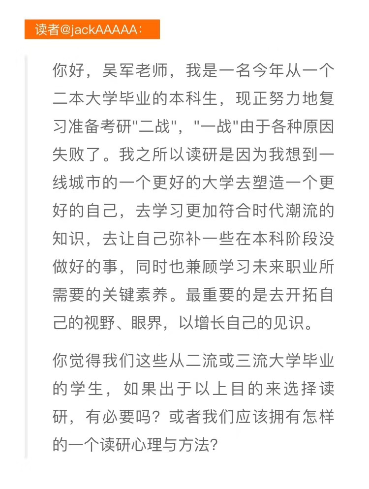
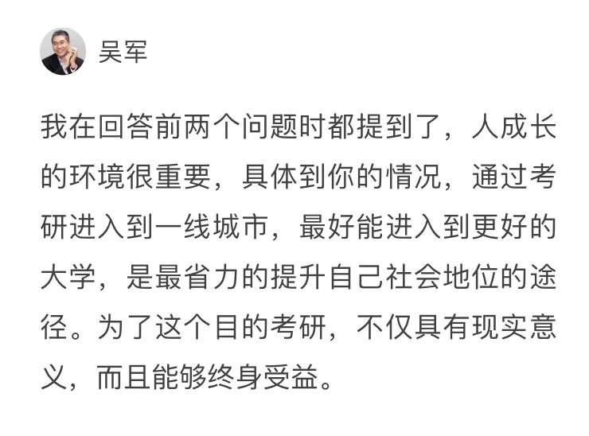

## 电梯模式和徒手攀岩

罗振宇 2020 年的跨年演讲，估计大家都看了。

如果没有看的，并且感兴趣的，可以参考这里：[罗振宇2019-2020“时间的朋友”跨年演讲未删减全文](https://mp.weixin.qq.com/s?__biz=MjM5NjAxOTU4MA==&mid=3009235758&idx=1&sn=5d9ceb8017eb44208ef656c8af3d8830&chksm=9046473da731ce2bdabe55db23186d857009e235fad9d2912f7ff65b922738e28df0195f782e&mpshare=1&scene=1&srcid=&sharer_sharetime=1578243931061&sharer_shareid=0566f3f179bbd90cc34134f211d4d75f&exportkey=Acm%2B%2F0cxQaRwt6k4U%2FpTycc%3D&pass_ticket=p8U6S7ZcLqokoXiV9F6JG0u%2BqXfUHOX0ZVEZaKz6SP93z7G5OM6qXTHZJh%2BgNqEN#rd)，大概四万字。

 

在罗振宇的演讲中，提到了一个观点。就是：在中国，已经从电梯模式，转换到了攀岩模式。

什么叫电梯模式？按照罗振宇的原话：

> 所谓电梯指的就是，那些稳定的、确切的通道。过去我们理解这个世界的方式，只要搭上电梯，就能往上走，而且非常确定：好好学习，就能考上好大学；学历越高，就越能进好单位；进了好单位，就肯定比卖口红的挣钱多，今年这话，你在李佳琦面前再说说试试？

换句话说，罗振宇的意思就是，以前净是电梯模式。但现在，大环境不好了，要变成攀岩模式了。

都是爬山，攀岩比坐电梯累多了。说白了，这是大家要做好准备过苦日子的另一种表达。

 

猛地听，挺有道理的。仔细想，经不起推敲。

为什么这么说呢？罗振宇自己后面举了一个反例——陆步轩。

陆步轩何许人也？1966 年，陆步轩出生于西安市长安县，家境贫困。1985 年陆步轩参加高考，最终以高出录取线 100 多分的成绩，成为长安县文科状元，后被北京大学中文系录取。陆步轩在北大度过了四年时光。

如果罗振宇说，以前净是电梯模式，那陆步轩坐的，绝对是电梯中的快梯。北大中文啊！

北大就不用说了，尤其在那个年代，出国的人还很少，北大基本上就是国人文科的最高学府了。

而中文专业，在那个年代，也是最热门的，堪比这个年代的计算机或者金融。

那个时代，普通家庭基本上没有电视，更不用提电脑了。因此，民众的日常消遣主要是读书。金庸，古龙，琼瑶，三毛等的作品，可谓传遍大街小巷。与此同时，中国内地当代文学也发生了大爆炸。贾平凹、莫言、路遥、史铁生、王小波，余华，韩少功、马原、叶兆言、王安忆......

在这样的时代背景下，中文是极好的一个选择。但是，这位坐上电梯中的快梯的北大才子，却转而去杀猪卖肉了。当然，这里的原因很多，但关键是，我们可以看到，在那个年代，电梯也不是成功的保证。

之后的陆步轩，从在肉铺卖肉，到成为做猪肉生意的企业家，一点一点“攀岩”，2018 年企业的销售额达 18 个亿。

 

实际上，罗振宇自身的经历，也在告诉我们，那个年代没有电梯。

如果你去搜索罗振宇的生平，是这样的：

> 罗振宇出生于安徽芜湖，就读芜湖市第一中学。1990年考入华中科技大学新闻系本科，1994年考入北京广播学院电视系攻读硕士学位，2004年入中国传媒大学读取博士学位。
> 
> 罗振宇曾历任中国中央电视台《商务电视》、《经济与法》、《对话》制片人。曾担任第一财经频道的总策划以及《决战商场》、《中国经营者》、《领航客》等电视节目主持人。

北广硕士，中国传媒大学博士，中央电视台诸多大牌栏目的制片人，第一财经频道总策划，诸多栏目主持人......

这些经历，哪个不是罗振宇自己说的电梯？

但是罗振宇做罗辑思维之前，大多数人不认识他。他是在做了罗辑思维之后，切换进了“攀岩模式”，开始探索自媒体怎么玩儿，进而创造了得到，开始研究知识付费这门生意要怎么做，才一点一点走到今天的。

 

你可能觉得我想说的是，这个世界没有电梯。但恰恰相反，我想说的是，**虽然电梯不是成功的保证，但是电梯意义重大。**

说这个时代，要想取得成功，就要扔掉电梯，去徒手攀岩，我也是万万不同意的。

这里说的电梯，是指读一个好的学校，或者到一个好的企业，或者来到一个好的城市，**总之，是踏入一个好的平台。**

家长拼命买学区房，把小孩儿往好的学校送；高考大家都拼了命一样，要上好的大学；2019 年研究生报考人数已经达到 290 万人了，再创新高，这还不算准备出国深造的人群；毕了业，大家都拼了命的想去大厂......

这背后，就是大家有意无意地，都想去坐电梯。

有毛病吗？我觉得一点儿毛病都没有。

就上面说的两个例子，陆步轩和罗振宇，谁没做过电梯？电梯让他们迅速达到了同龄人或者同时代人更高的位置。从这个更高的位置开始攀岩，才能有更大的概率到达顶峰。

之前我写过一篇文章，叫[《成功者的年龄》](../../2019/2019-07-31/)，其中说到了一个数据：中国科创板上市的首批 25 家企业的创始人，其中有 11 个人拥有博士学历，8 个人拥有硕士学历。而科创板的创始人，平均年龄是 52 岁。在那个年代，这个学历水平，可谓是把电梯坐到头了。

如果觉得这个样本太少，我们也可以看一下 2017 年的一份分析报告。调查了 476 名国内企业家的学历数据。结果是，48% 毕业于 985 高校；15% 毕业于 211 高校；11% 毕业于海外高校。这三项加起来，就占 74% 了。还有 14%，毕业于普通本科。整体是 88%。

这 88%，在我看来，都算坐过电梯的。教育能迅速提高一个人的视野，让一个人站在一个更高的起点，开始攀岩。

 

除了教育是电梯，一个好的企业平台也是电梯。

雷军是最典型的例子。雷军在武汉大学计算机系毕业以后，开始在金山软件实习，一步一步做到了总经理的位置，之后又出任卓越网董事长，然后才创建了小米。

金山，卓越网，都是雷军的电梯。

同样，李彦宏也不是在美国一毕业，就回国创业的。李彦宏拿下北大信息管理的文凭以后，到美国布法罗纽约州立大学读了计算机硕士。毕业以后，先后担任道·琼斯公司高级顾问；《华尔街日报》网络版实时金融信息系统设计者；Infoseek公司资深工程师。这些企业，也都是李彦宏的电梯。

 

最后，我们来看一个去年，全球的风云人物：Sundar Pichai。中文我们经常亲切地管他叫劈柴哥。

劈柴哥去年，成为了 Google 的母公司——Alphabeta 的 CEO。他爬上这个全世界最著名的企业的顶端位置，仅仅用了 15 年的时间。现在每年收入大概是 1 亿美刀。

 

劈柴哥是 2004 年加入谷歌的。加入谷歌的时候，已经 32 岁了。你看，现在大家都在焦虑 30 岁以后怎么办，人家劈柴哥的职业起点，从 32 岁刚开始。

那他之前的 32 年在干什么呢？在我看来，就是在“坐电梯”。

劈柴哥的本科院校是印度理工学院。坊间的段子：在麻省理工，有位教授问一名印度籍的学生，为什么来这里求学？印度学生回答说，就是因为考不上印度理工，我才来了麻省。

虽然是段子，可以看出来，这所学校，是印度最好的理工类大学。所以，劈柴哥先努力登上了印度的最快电梯。

然后，劈柴哥拿到了斯坦福大学奖学金，来到了斯坦福大学。你看，他又搭上了美国的最快电梯。

斯坦福大学毕业以后还不够，劈柴哥又读了一个沃顿商学院的 MBA。他再坐了一把商学院的最快电梯。

从商学院毕业以后，劈柴哥还短暂地在麦肯锡工作过一段时间。麦肯锡大家应该都知道，可以说是咨询行业里最快的电梯了。

就这样，折腾到 32 岁，2004 年，劈柴哥看好互联网的发展，来到了谷歌。其实，此时的谷歌，也是一部电梯。因为谷歌 1998 年就上市了。在科技企业“血赚”的年代，大家都在想着怎么创业，或者加入一个创业公司，趁着上市，走上人生巅峰。而劈柴哥则选择了一个已经上市 6 年的巨头，这绝对还是在继续坐电梯。

可以肯定，劈柴哥在谷歌的升迁之路，从某个节点开始，肯定会进入攀岩模式。但是，曾经的那些电梯，助力劈柴哥，快速到达了一个更高的位置。从这个位置开始攀岩，才帮助他完成了攀登“全世界职业经理人顶峰”的壮举。

 

有很多同学问过我要不要读研的问题。对于这个问题，在大多数情况下，我是鼓励的——除非你真的特别不适合考研究生。但通常，不适合的话，也不会问这个问题了。

同理，还有很多同学问过我，有机会去更大的城市，或者一些发达国家工作，是否应该去？对于这类问题，我的回答，大多也是偏鼓励的。

因为在我看来，这些都是电梯。有电梯，为什么不坐？虽然这会意味着，脱离你的舒适区，并且伴随着一点点风险。

 

无独有偶，之前，有个同学转给了我在得到上，吴军老师的一个问答。问题是这样的：

吴军老师的回答是这样的：

我深以为然。

 

对于大多数人来说，好的学校，好的企业，好的城市，就是电梯，会帮助你快速来到更高的地方。如果有这样的机会，千万不要错过。

坐电梯来到了更高的地方，我们每个人也终将开始徒手攀岩，攀登更高的山峰。

**电梯虽然从来不能保证成功，但我们也绝不能忽略电梯的意义。**

 

所以，在中国，是不是从电梯模式，切换到了攀岩模式？

可能对于那些企业家来说，从做企业的角度，电梯越来越少了。但是，对于我们大多数普通人来说，电梯一直都有。

**别高估电梯的作用，也别忽视电梯的存在。**

 

**大家加油！**
