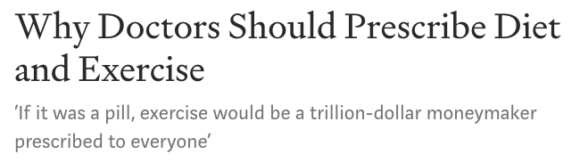
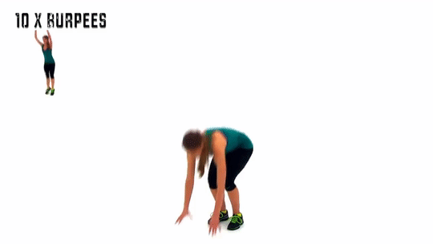

## 对抗早亡的良药

抱歉，这个标题可能看起来有些惊悚，毕竟，死亡是谁都不想谈及的话题。

但是，前阵子，有个同学给我留言，说：

> 我像周围很多同学同事IT工作者一样，感觉到有些胸口疼痛。最近接触的负面新闻比较多有点慌，所以像老师来问下有没有什么程序员养生指南?

这个留言我不敢马虎，马上回复让这个同学去医院做一个检查，以防万一。

 

虽然我不是医学专家，但毕竟老婆是在医学院混的。即便不是临床医生，平常关注这方面的新闻，文献，资料，也多一些。

医学上，某个症状，背后真正的病因可能有很多。但不管怎样，胸口疼都不是好现象，如果长期胸口疼，就更要好好检查一下了。

因为，胸口疼，八九不离十，是心脏发出的警告。虽然不一定是什么严重的心脏病，但可能预示着：心脏功能的下降。

心脏功能下降有什么危险？危言耸听地说，可能增加猝死的风险。

 

世界卫生组织（WHO）对猝死的定义是：平素身体健康或貌似健康的患者，在出乎意料的短时间内，因自然疾病而突然死亡。

医学上对猝死分为两类：心源性猝死和非心源性猝死。

所谓的非心源性猝死，可能是因为药物，短时间过度酗酒，过敏，或者中毒产生的猝死。这些离我们大多数人可能比较远，不经常发生。

大多数社会新闻突发的猝死事件，不管是前一阵子的高以翔，还是一些程序员突然在工作岗位或者回家的路上猝死，基本都是心源性猝死。

**心源性猝死占比全部猝死的 80%。**

 

怎么预防心源性猝死。**第一条就是避免频繁地熬夜导致睡眠不足。**

如果我们经常熬夜赶工，或者压力比较大，需要在短时间内完成高强度的工作，身体的交感神经也会处于高度兴奋的状态，产生大量的血管活性物质。这将导致血管收缩和血压升高。长久的这种状态，就会对心脏和血管造成伤害，导致心脏功能弱化，甚至是心脏功能的衰竭。

值得一提的是，过度劳累不一定发生在工作中。可能有些同学因为上班时间过长，回家以后为了“犒赏自己”，疯狂地熬夜刷剧或者打游戏，其实是一样的。

 

有意思的是，我在美国看的讨论猝死话题的文章，很少会强调不要过度工作这一点。可见，美国在工作强度上，对于大多数人，确实不是什么大问题。

那么国外的文章一般强调什么呢？其实特别简单，就是**健康饮食和锻炼**。

因为猝死的另外一大诱因，就是不良饮食习惯，比如因摄入大量高脂肪，高蛋白的食物，造成的肥胖，高血脂，或者高血压，也就是我们通常说的三高。

很多学术研究都表明，健康的饮食和锻炼，实际上比任何昂贵的药物都有效。

但是，大多数临床医生面临一个困境：患者来到医院，如果医生只是建议患者健康饮食，并且坚持锻炼，很容易被患者误以为是不负责任。

所以，很多医生只好硬着头皮开一些药，但是，从科学的角度讲，这些药都不如健康饮食和锻炼有效！

因此，会有这样的标题：

**我的翻译：**

主标题：为什么医生应该开出“健康饮食和锻炼”的药方？

副标题：如果“健康饮食和锻炼”是药的话，那么这么一个简单的药方，价值万亿美元。

 

可能有一些同学，尤其是严谨的程序员朋友，一听到健康饮食，就会想到营养学这样一个复杂的科学分支。

但其实，对于我们大多数普通人来说，并不需要了解什么高深的营养学知识，才能健康饮食。大多数医生给出的指导原则极其简单：

**每天吃 350 克到 500 克的水果和 500 克到 750 克的蔬菜。**

美国的统计数据表明，在全美国，只有 12.2% 的人口，每天摄入的水果量能够达到这个标准；只有 9.3% 的人，每天摄入的蔬菜量能达到这个标准。

“搞笑”的美国人甚至做了这样一个研究：假设医生能够把蔬菜和水果当做药品开给病人，会怎样？

换句话说，假如你被检查出来有三高，或者轻微的心血管疾病，医生不给你开任何药，就给你开蔬菜水果，要求你用吃药的精神吃蔬菜水果，每天 500 克水果，750 克蔬菜，结果会怎样？

答案是，在美国，每年会减少 35 万人因心血管疾病而导致的死亡，并节省下来近 400 万亿美元的医疗费用。

甚至，有医生呼吁，政府与其补贴医药行业，不如直接补贴水果和蔬菜价格，鼓励民众购买。

社会学家为此还真做了研究，发现，对水果和蔬菜价格做 30% 的补贴，就能提高民众多摄入 26% 的水果和蔬菜。

当然，健康饮食还包括多吃谷物，粗粮，海鲜，等等。但是这些的效果，都没有水果和蔬菜显著。

所以，如果只是普通人，所谓的关注身体健康，不需要整多复杂的食谱，**多吃水果和蔬菜就够了。就这么简单！**

 

另外一剂良药，就是**健身**。

说到健身，估计严谨的程序员朋友们又觉得，这里面学问深了。减脂还是塑型，不同的健身目的，健身方式不同；人的身体有那么多肌肉，不同的肌肉，对应的锻炼方式又不同。健身也是一个很严谨的学科分支。

话虽没错。但是，和营养学一样，研究表明，对于大多数普通人来说，以保持健康为目的的健身，没那么复杂。

根据不同人的运动偏好，专家建议了三种运动方式。**每天坚持这三种运动方式之一，就能有效保持健康。**

而这三种方式，甚至连健身房都不需要！

这三种方式是什么呢？

 

第一种，简单难度的方式。就是**走路**。

研究表明，每天走 4400 步的话，相较于每天走的步数低于 2700 步的人群来说，能降低 41% 的早亡风险！

一般成人的步速，一分钟是 130 步左右，这样算来，走 4400 步，就需要 35分钟左右。注意，从家走到地铁，或者从公司走到停车场，这些都能算数！不用特意找时间散步。当然，如果能闲下心来，到公园里或者江边海边走走，缓解压力，身心愉悦，效果更好。

但如果你时间紧，研究表明，2200 步，也可以很好地维持健康，大约 17 分钟左右。比不走强！

当然，如果时间再紧，也可以用下面的方式。

 

第二种，中等难度的方式：**爬楼梯**。

研究表明，坚持六周，每天爬 10 分钟楼梯，就能很好地改善心肺功能，增强心脏活力。

如果经常不运动的同学，可以试一试，爬楼梯还是挺累的。所以，最好做一些准备活动，比如蹲起一类的。

如果爬楼梯的话，10 分钟就够！

但如果你时间再紧，可以用下面的方式。

 

第三种，困难难度的方式：**高强度的运动**。

一般人，每天只需要一分钟高强度的运动，就能有效保持健康。

什么叫高强度运动呢？有很多种。最典型的，就是波比跳。融合了深蹲、伏地挺身以及跳跃一系列的动作。

波比跳怎么做？我特意给大家找来了示范。

就这么简单，不需要任何器械，有一块地儿就成。如果出差在外，应酬很多，时间很少，每天早上在酒店房间里做一下就好。

一分钟的时间，做三组，每组 20 秒。但如果体质比较差，坚持不了 20 秒，减少每组的时间，适当增加组数，也 ok。

注意，这个动作运动量比较大，做之前应该有 3 分钟左右的热身运动时间。这么算来，至少也需要 4 分钟了。

 

上面的三种健身方式，可能不能让你减脂，可能不能帮你塑身，但是足以维持健康。

可能有同学说了，这些方式，每天都要抽出时间来锻炼，也坚持不了啊！

好！再告诉大家一个研究成果。来自澳大利亚的研究团队发现：**每周只要找一天，抽出 50 分钟进行慢跑，都能显著地降低早亡的风险！**

如果你连一天找 50 分钟都做不到的话。这个研究说了，每周找一天进行慢跑，**哪怕十分钟，都比没有强！**

 

以上这些，就是学术界公认的，对抗早亡的良药。**健康饮食和运动，就这么简单。**

 

最后，我想说的是，我很能理解，很多人，为了家庭，为了父母，在职场上特别拼。我们中华民族恰恰又是一个特别提倡奋发图强，拼搏精神的民族。这使得我们在工作中，或多或少都会一定程度地被“道德绑架”。

但是，盲目地拼搏，不仅没有效率，更损害自身健康。这篇文章，主要是讲健康，我之前写过一篇文章，叫[《软件工程师，工作效率，以及网易》](../../2019/2019-11-26/)，是从效率角度聊这个话题的。有兴趣的同学，也可以阅读一下。

愿所有人都能健康，平安。

 

**大家加油！**