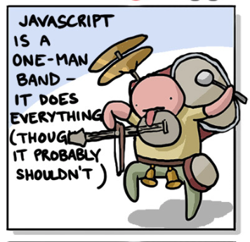
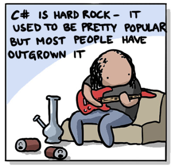
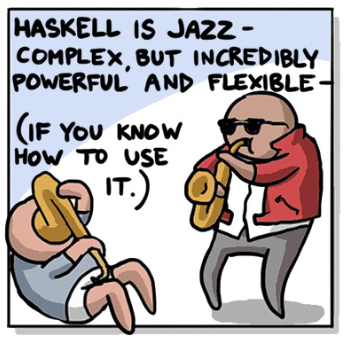
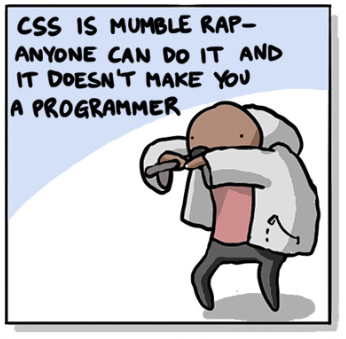
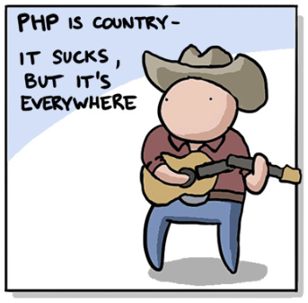
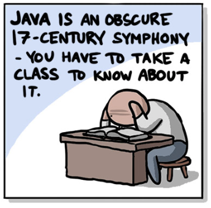
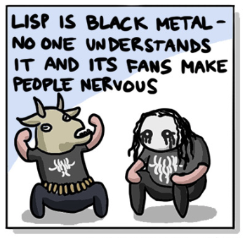
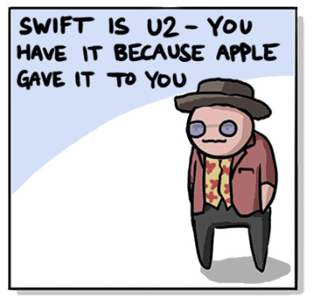

## 如果程序语言是音乐

在网上看到一组漫画，觉得特别有意思，和大家分享一下：）

如果不同的程序语言是音乐的话，**那么不同的语言，是什么类型的音乐？**

 

**Javascript 是一个人的乐队。他什么都能做，虽然，有可能，他不应该什么都做。**

 

**C# 是硬核摇滚。它曾经非常流行，但是，那些曾经为它疯狂的人们，已经长大了。**

 

**Haskell 是爵士乐。虽然复杂，但却不可思议的强大，灵活。当然，前提是，你知道怎么使用它。**

 

**CSS 是 mumble rap。近乎任何人都可以做，但这并不会让你成为一个真正意义上的程序员。**

**注：**mumble rap 是说唱音乐的一个分支。mumble 就是“咕哝，含混不清地说”的意思。顾名思义，mumble rap 就是跟着伴奏，然后用谁也听不懂的方式来说唱的一种说唱方式...... 又被称为是...... 模糊说唱......

 

**PHP 是乡村音乐，很多都不好听，但他无处不在。**

**注：**我个人是很喜欢乡村音乐的。但是，在美国，乡村音乐的门槛太低了，拿把吉他随便选一组和弦，跟着唱几句词，聊聊家乡的姑娘和小镇的人民，就能叫乡村音乐了。所以平均而言，有大量水平很烂的乡村音乐......

请 PHP 党不要打我，毕竟，我也同意，PHP 是世界上最好的语言：）

 

**JAVA 是晦涩难懂的 17 世纪交响乐。你必须正儿八经地上课学习，才能真正了解他。**

**注：**在我看来，C / C++ 也是如此......

 

**Lisp 就像黑色重金属，没有人可以理解，而且，这种音乐的粉丝也让人觉得紧张。**

**注：**哈哈哈。这个笑死我了。虽然其实 Lisp 很酷吧，但这个还是戳中我的笑点了。记得我看过一篇文章，叫[《Lisp 是怎么成为上帝的编程语言的》](https://zhuanlan.zhihu.com/p/50463116)，好怕怕啊...... 哈哈哈。

 

**Swift 是 U2，我们使用它，是因为苹果。**

**注：**不知道是不是有的同学不了解这个梗。

2014 年 9 月 9 日，苹果的秋季产品发布会如期而至。在这次产品发布会上，苹果发布了 iPhone 6，同时发布了 Apple Watch 第一代。

在这次发布会的结尾，Tim Cook 也使用了乔布斯在发布会上著名的伎俩：one more thing，宣布：U2 乐队的最新专辑：Songs of Innocence，将可以让 iTunes 的所有用户免费收听！

这本来是一个福利，但是却成为当年苹果的灾难。这是因为，苹果的做法是：所有 iTunes 用户的音乐架上，强制会出现这个专辑的封面，用户想删都删不掉！

这个做法，激怒了大部分用户。而且，当时的时间节点，U2 确实有一些过气了，大多数年轻人对 U2 并不买账，反而对这种“强制消费”怒不可遏。毕竟，U2 是 1976 年组建的乐队，就算火起来，也是在上个世纪八十九十年代的事情......

所以，就有了这个梗，**我们之所以听 U2，是因为苹果非让我们听，就像 Swift 一样......**

 

最后，这组漫画竟然没有提大名鼎鼎的 Python。要我说，**Python 当然是流行乐啦。为什么？因为，它流行：）**

 

---

既然这篇文章提到了这么多音乐，最后又提到了 U2，在文章的最后，就放一首 U2 的歌，普及一下这个曾经火到爆的爱尔兰摇滚乐队吧。

滚石评选的 U2 最著名的一首歌，是 《One》。

但我估计，U2 在国内最流行的一首歌，应该是《Beautiful Day》。

不过，我个人最喜欢的 U2 的一首歌，是《I Still Haven't Found What I'm Looking For》，来自 1987 年的音乐。

P.S.  不要被这段视频之前的“闷骚”所迷惑，唱到后来，大家大合唱，还是很 high 的：）

音乐地址：[https://www.youtube.com/watch?v=F7wit8_8SqA](https://www.youtube.com/watch?v=F7wit8_8SqA)

 

**I Still Haven't Found What I'm Looking For.**

祝大家都能找到自己想要寻找的东西。

即使找不到也没关系。

找就是了。毕竟，这就是人生：）

**大家加油！**

 

漫画来源：[https://blog.toggl.com/programming-languages-explained-with-music-comic/](https://blog.toggl.com/programming-languages-explained-with-music-comic/)

所有中文注释皆由作者原创。