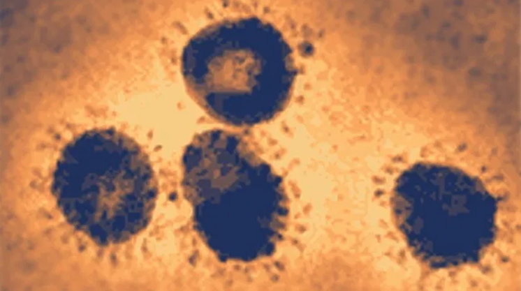
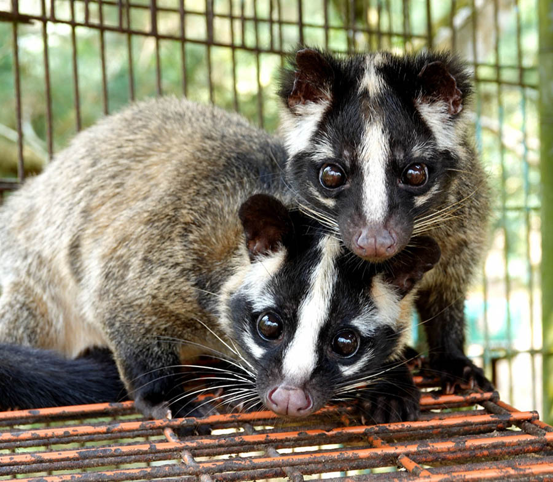
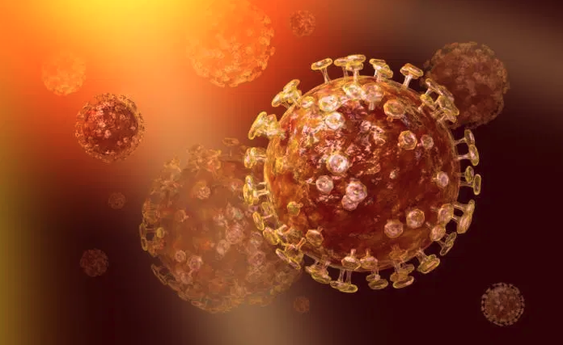
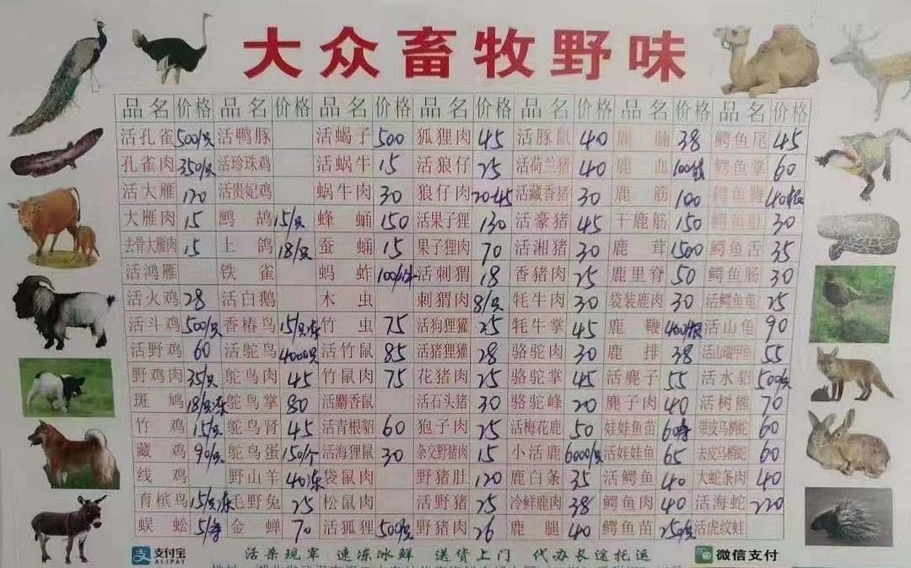

## 来自动物的病毒

1976年，埃博拉病毒登上历史舞台，首次亮相就展示了它恐怖的杀伤力。

在扎伊尔境内一片偏远的地区，人们开始发烧并呕吐。有的病人口鼻流血不止，甚至双眼都在出血。一位医生在救治一个垂死的修女时，从她身上采集了血液样本，放到热水瓶里。后来，这名医生把这份样本送到了扎伊尔首都金沙萨，一路又搭飞机带回比利时，交给了年轻的病毒学家彼得·皮奥。

通过电子显微镜，皮奥观察到了一大群蛇形的病毒，后来，被命名为埃博拉病毒。

埃博拉病毒的致死率，高达 70%。在扎伊尔的一间宾馆，一些修女和牧师躲在里面，门口拿绳子挡住来访者，绳子上还挂着一块牌子，上面写着：请勿入内，进入可能导致死亡。

埃博拉病毒出现以后，皮奥和他的团队在当地展开了流行病学调查，以确定感染者和具体发病时间。不久，他们就查到了埃博拉病毒的传播途径，原来，这种病毒会在人和人之间传播。

没有证据表明这种病毒能像流感或麻疹病毒一样飘浮在空气中，实际上，它是借助受害者的体液传播的。当地一家医院曾经重复使用注射器，结果将病毒传播给了许多病人。照顾病人和给死者清洗身体的工作人员也都有感染情况。

尽管埃博拉病毒极为致命，但它的传播是比较容易切断的。皮奥和他的同事们关闭了医院，隔离了有症状的人，三个月后，疫情得到了控制；318 人在这场瘟疫中死亡。如果没有皮奥的及时干预，影响一定远远不止于此。

同年，埃博拉病毒出现在苏丹，夺走了 284 人的生命。3 年后它在苏丹卷土重来，造成 34 人死亡。然后它销声匿迹 15 年，1994 年又在加蓬发起了攻击，杀死了 52 人。

每一次疫情爆发，都让人们对埃博拉病毒的了解更进一步。人们逐渐认识到：只要追踪病人的行踪，并适当隔离，就能阻止新的感染。

关于人类抗击埃博拉病毒的故事，就在去年，美国还拍了一个美剧，描述在后来，1989 年，埃博拉病毒突然出现在了美国华盛顿郊区一个科学实验室的黑猩猩身上之后，医学工作者，包括科学家们的故事。整个剧一共六集，用双时间线的方式，也讲述了当年，发生在非洲这片土地上，人类和埃博拉病毒斗争的故事。

这个美剧中文翻译叫《血疫》，英文名是 The Hot Zone。大家在放假期间闲来无事，不妨找来看一看。

 

关于埃博拉病毒，有一点很清楚：它是一种古老的病毒。

演化生物学家在仓鼠和田鼠的基因组中发现了类似埃博拉病毒的基因。这些埃博拉病毒的祖先感染了啮齿类动物，并在不经意间留下了可以追踪的DNA痕迹。

科学家们还在蝙蝠身上发现了埃博拉病毒的抗体，这种抗体似乎说明：在现代，经过几千万年的时间以后，蝙蝠这种生物可以和埃博拉病毒和平共处。一般情况下埃博拉病毒会在蝙蝠个体间传播，但不对它们造成任何伤害。但是，有些时候，这种病毒会突然进入人类社会。

人类是埃博拉病毒最新的攻击对象，被蝙蝠唾液污染的肉或水果可能携带病毒，人吃了这些被污染的食物就有可能感染。

不管通过什么途径，埃博拉病毒一旦进入我们的身体，就能迅速入侵免疫细胞，病人会猛烈腹泻、呕吐，有时还会大出血，直到失去生命。

埃博拉病毒是一种来自动物的病毒。

 

---

来自动物的病毒不止埃博拉病毒一种。

2002 年 11 月，一位中国农民因发高烧来到医院，不久就去世了。接着，同一地区的人相继出现了同样的病情。

这种疾病一直都没有得到世界范围的关注，直到一位美国人被传染。这个人来中国做生意，在从中国飞回新加坡的飞机上，突然开始发热。飞机在河内停了下来，这位商人再也没能活着离开那里。

尽管大多数病例仍然集中在中国内地和香港，但世界各地的人们都开始生病。这种病的死亡率高达 10%，而且夺人性命通常只消几天。

这场流行病在医学史上是全新的，医生称它为严重急性呼吸系统综合征，对应的英文缩写，就是 SARS。

基于过往对艾滋病毒和埃博拉病毒积累的经验，科学家怀疑 SARS 病毒也是从动物身上的病毒演变而来的。于是他们着手分析了中国人经常接触的动物身上的病毒。每当发现一种新病毒，科学家们就在 SARS 演化树上添加相应分支。几个月后，科学家终于重构了 SARS 的历史。

这种病毒起源于中国的蝙蝠，其中的一株扩散到一种长得酷似猫的哺乳动物身上——果子狸。

在中国的动物市场上，果子狸是较为常见的。人类可能在买卖果子狸的过程中成为了宿主。这种病毒的生物学特性恰好让它们适于在人和人之间传播。而与埃博拉病毒不同，SARS 病毒能附着在细小的气溶胶颗粒上，在空气中传播。

尽管 SARS 疫情已经扩散到亚洲以外，但幸运的是，阻止埃博拉早期流行的公共卫生措施，也成功制服了 SARS。这一场肆虐，全球 8000 余人被传染，近 900 人死亡。

与之相比，流感每年大概会导致 25 万人死亡。可以想象，如果 SARS 病毒像流感病毒一样传播开来，结果不可想象。

可以说，在 17 年前，我们成功躲过了 SARS 朝人类射出的一颗原子弹。

那一年，我还在上高中，互联网还不发达。北京的学校破天荒地停课了近一个月。什么都不懂的我，那时还在欣喜不用上学了，全然不知人类经历了如此浩劫。

 

---

又过了十年，沙特阿拉伯出现了另一种和 SARS 同类型的病毒——冠状病毒。

2012 年，沙特的医生注意到，一些病人患上了病因不明的呼吸系统疾病，其中近 1 / 3 死亡。

这种疾病被称为 MERS，是“中东呼吸综合征”的简称。病毒学家从患者体内分离出这种致命病毒，并对其基因进行研究。

他们拿这些基因在其他物种中寻找类似的片段。很快，人们的目光就锁定在了非洲的蝙蝠身上。

不过，非洲蝙蝠如何成为中东呼吸综合征疫情的导火索？答案在中东人民赖以生存的一种哺乳动物——骆驼身上。

科学家们发现，骆驼身上普遍携带 MERS 病毒，病毒通过骆驼鼻子的分泌物源源不断地释放出来。

对 MERS 起源的一个较为合理的解释是：蝙蝠可能将病毒传染给了北非的骆驼。北非到中东的骆驼贸易频繁开展，一只生病的骆驼把病毒从北非带到了中东。

科学家又重构了 MERS 的传播史，并有充分理由担心，一旦 MERS 爆发，疫情可能比 SARS 还要可怕。因为，每年超过 200 万穆斯林前往沙特阿拉伯进行一年一度的麦加朝圣活动。不难想象，MERS 病毒会在密集的人群中迅速传播，然后和朝圣者一起前往世界各地。

所幸到目前为止，科学家的担心还没有成为事实。截至 2015 年 2 月，1026 人被诊断为感染了 MERS，其中 376 人死亡。几乎所有病例都发生在沙特阿拉伯，尤其集中在医院。

可能 MERS 最擅长的，还是攻击免疫系统脆弱的病人。除非 MERS 再发生剧烈的演化，否则，它可能永远只是中东医院内部一个危险却罕见的威胁。

 

---

MERS 是最后一种来自动物的病毒吗？一定不是的。

科学家预测，下次再有某种病毒从野生动物身上转移到人类身体内，很可能还会引发大规模疫情，而我们完全有可能对这种致病病毒一无所知。

现在的武汉病毒，就是如此。

虽然现在武汉病毒的规模，还不算是“大规模疫情”，但是全球各个国家对这种新的病毒相当重视。

而且，我们暂时对这种病毒知之甚少。不过， 1 月 22 日，中国科学院院士、中国疾病预防控制中心主任高福在发布会上表示：新型冠状病毒的来源，是武汉一家海鲜市场非法销售的野生动物。

**武汉病毒，也是来自动物的病毒。**

 

为了让人类更加了解这些来自动物的病毒，科学家们一直在展开诸多和动物相关的研究，从它们体内寻找病毒的遗传物质。

但是，这一工作量是巨大的。

来自哥伦比亚大学的一项研究表示，科学家们在纽约捕获了 133 只大鼠，并对这 133 只大鼠身上的病毒进行研究，结果发现了 18 种，与人类病原体亲缘关系很近，并且是全新的病毒。

在孟加拉国开展的另一项研究中，科学家们在一种名为印度狐蝠的蝙蝠身上进行了彻底的病毒搜查，鉴定出 55 种病毒，其中 50 个都是前所未见的。

在这些新发现的病毒里，我们不知道哪些会造成瘟疫。有可能这些新病毒都不会对人类社会造成威胁，但这并不意味着我们可以直接无视它们的存在。

相反，我们恰恰需要保持警惕，这样才能在它们有机会进入我们这个物种之前就采取措施，阻止它们的脚步。

 

对于普通民众来说，怎么保持警惕？

最简单的方式，就是**对“野味”说 No。**

根据媒体报道，武汉长期以来存在不少售卖野味的餐馆。在最近网传的一张图片上，大家甚至可以看到近 100 多种野味的详细价格。

大家可以点击放大看一下这个价目表，其中包括孔雀，竹鼠，袋鼠，狐狸，骆驼，狼等大量野生动物，甚至有像娃娃鱼这样的国家二级重点保护野生动物，以及像果子狸这样的，曾经是重要的 SARS 传染源的野生动物。

1 月 22 日，人民日报官微发出了呼吁：为了你我的健康，禁绝野味市场！

 

**为了全人类的安全，请大家对野味说 NO。**

**也请大家一定注意，多多防范。**

**愿所有人健康，平安。**

---

本文关于埃博拉，SARS，MERS 病毒的描述，参考了美国卡尔·齐默的出版书籍：《病毒星球》。

