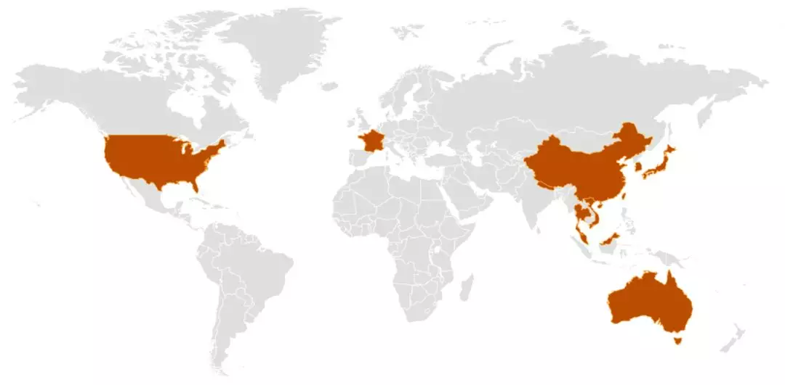

## 美国疾病控制中心发布新冠状病毒指南

文章题图：目前，新冠状病毒在世界范围内分布的国家示意图。红色区域为确认感染的国家或者地区。

---

就在这两天，美国的疾病控制中心发布了2019 年新型冠状病毒（2019-nCoV）的一份暂行指南。而且，非常少见的，这份指南包含中文版，而没有西班牙文版。

要知道，CDC 官网上，近乎所有的文件，除了英文版本以外，都附有西班牙文版本。而这份文件不包含西班牙文版，却包含中文版，很明显，主要目标受众是华人。

这份文件，可以[参考这里](https://www.cdc.gov/coronavirus/2019-ncov/guidance-prevent-spread-chinese.html)。

 

比较有意思的是，这份暂行指南的目标受众是如下的四类人：

* **患者已确诊患有 2019-nCoV 感染，但无需住院治疗，并且可以在家中接受治疗**

* 患者正在接受由医务人员进行的 2019-nCoV 感染评估，其无需住院治疗并且能在家中接受治疗

* 已确诊患有 2019-nCoV 感染或正在接受 2019-nCoV 感染评估的患者的照护者和家庭成员

* 与已确诊患有 2019-nCoV 感染或正在接受 2019-nCoV 感染评估的患者有密切接触的其他人

 

大家可以看到，这份指南意味着，现在美国的评估是，**即使患者确认感染了 2019-nCoV 病毒，也有可能无需住院，在家即可接受治疗。**

当然，只是有可能，并非 100%。这也不意味着这个病毒不厉害，我们还是不能掉以轻心，必须要有防范意识，做好防护工作。

但是，这个病毒到底有多厉害？最准确的答案是：**我们还不知道。**

毕竟，这是我们人类刚刚发现了不到两个月的一种病毒。不过，现在，一个**基本的，暂时性的结论**是：这个病毒的毒性（危害性）比 SARS 弱，因为无论是重症比例还是死亡率，都比 SARS 低；但是传播性比 SARS 强。

美国已经有一些科学家的观点认为，这个病毒**很有可能**还不如普通的流感病毒对人群的危害大。但是，这只是一种推测，现在还不敢断然下定论，核心原因依然是：这种病毒太新了，我们对它的了解还太少。**我们不能掉以轻心，但根据现在的数据和情况，也完全没必要恐慌。**

这两天有时间，我会整理一下这派科学家的观点和目前基于的基本事实，和大家分享一下。不过，不管怎么样，大家真的没必要过度恐慌。

 

那么具体，什么情况，大家只需要在家自行隔离观察就可以了？

我查了一下，武汉协和医院给出了一个疫情防治的《协和解决方案》，给出了一个行之有效的自测标准。

这个标准就是**发热低于 37.3 度，且无呼吸困难。**如果大家只是有咽喉痛，咳嗽等症状，但发热程度较低，且无呼吸困难，完全没必要去医院，在家进行自我隔离，并且持续观察，就好了。

实际上，我比对了一下武汉协和医院的这个标准，已经**比世界卫生组织（WHO）给出的标准还要严格**了。世界卫生组织给出的体温界值是 38 度。所以，这个标准已经非常谨慎了。

这里有一个关键，其实不是体温，而是**是否有呼吸困难的症状。**如果有呼吸困难，急促的症状，比如明明没有运动，但是呼吸的感觉跟剧烈运动以后一样，气喘吁吁的，那么一定要去医院检查。

另外一个和症状无关的标准，就是**是否曾经去过武汉，或者接触过去过武汉的人。**

如果没有这些问题，大家在家进行自我隔离观察就好了，多半没有大的问题，毕竟现在本身也是流感的高发季节，有些感冒的症状是正常的。不过要随时保持警惕，如果觉得身体情况有恶化的趋势，马上去附近医院就诊。不然，盲目去医院就诊，其实还加大了交叉感染的风险。

至于自我在家中隔离观察，要做什么，国内已经有很多文章在做指导了，我在这里就不赘述了。

由于这篇文章的标题是[《美国疾病控制中心发布新冠状病毒指南》](https://www.cdc.gov/coronavirus/2019-ncov/guidance-prevent-spread-chinese.html)，希望大家有时间仔细阅读一下原文，其实非常短的。

 

**武汉加油！中国加油！大家加油！**