## 新型冠状病毒是阴谋？非凡的理论要有非凡的证据

给大家讲一个笑话。

最近很多国外网友在热烈地讨论：新型冠状病毒是我国的生化武器，不幸泄露。

其实，这个言论，我很早就看到国外互联网有人讨论了。那会儿就是当笑话听。但是没想到，最近这个观点似乎受众越来越广，讨论的人越来越多了。

本来这种言论我觉得不值得一聊，因为基于的事实依据实在是太弱了，大多数是主观推测。

但是，现在看到很多人，尤其是小撮国外的网友，正在认真地，煞有其实地聊这个话题，所以在这里，我就根据我可以看到的关于这个观点的讨论，简单聊一聊。

 

这一观点基于的最主要的事实，是在武汉有中国唯一一个公开的生物安全四级实验室。这个实验室标志着中国正式拥有了研究和利用烈性病原体的硬件条件。

这并不是什么秘密，实际上，大家随便一搜，就能搜到。百度百科就有**武汉 P4 实验室**这个词条。

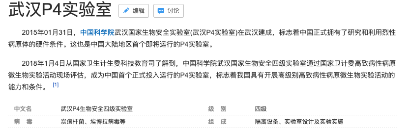

 

同时，也有大量的相关新闻报道。对此，我国毫不隐晦。比如新华社就曾经报道过：我国首个 P4 实验室正式运行，致力于最危险病毒研究。

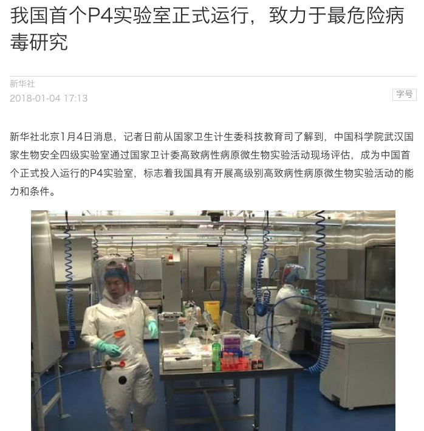

 

**第一种说法**

有人说了，武汉拥有中国唯一一个生物安全四级实验室，用来研究最危险病毒；同时，新型冠状病毒又是在武汉爆发的。这样的巧合，发生的概率有多大？这让人不得不去认为，这不是巧合。

那么我问你，像科比这样的篮球巨星，世界传奇，拥有着一架相当安全的直升飞机——S-76：每十万小时飞行事故发生概率为 0.22。那么这样一个特定的人，坐着自己的这架特定的直升飞机，发生事故的概率有多高？

可以想象，其实是相当相当低的。科比不是傻瓜，不会拿自己的生命开玩笑，更不会拿自己的女儿吉安娜的生命开玩笑。但是很遗憾，这样的小概率事件，这样的巧合，发生了，而且就在昨天。

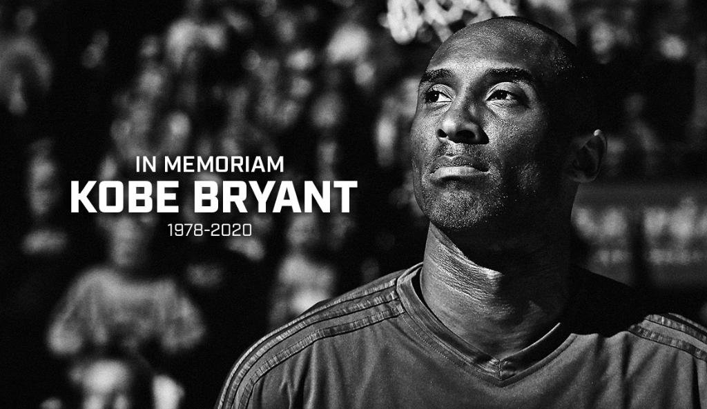

在这里，也允许我悼念一下这名巨星的陨落。

 

近些年有一个热词，叫“黑天鹅”，是由纳西姆·尼古拉斯·塔勒布（Nassim Nicholas Taleb）于 2007 年提出来的。《黑天鹅》其实是一本书，一经推出就风靡全球，曾连续一年多位于《纽约时报》畅销书榜，近乎成为了华尔街投资人士必读的经典著作。

《黑天鹅》描述的，就是这种发生概率极低，但是对世界，对社会影响极大的事件。事实证明，这样的事情，在过去的十年，正在不停上演。武汉爆发新型冠状病毒，很有可能又是一起黑天鹅事件。

注意，我的用词是“很有可能”。我没有排除其他可能性。但是，我们要讲证据。武汉拥有一个生物安全四级实验室，不是证据。

 

**第二种说法**

国外很多网友认为有一个疑点，就是这次的病毒，中国完成基因测序的速度太快了。

在 2019 年 12 月 30 日，武汉市卫生健康委员会医政医管处发布《关于做好不明原因肺炎救治工作的紧急通知》，通知称武汉部分医疗机构陆续出现不明原因肺炎病人，临床表现均表现为病毒性肺炎或肺部感染。

14 天后，2020 年 1 月 12 日，世界卫生组织（WHO）宣布，已收到中国分享的从武汉不明原因病毒性肺炎病例中检测到的新型冠状病毒基因序列信息。

中国用短短的两周时间完成了新病毒的测序工作，没想到却成为了阴谋论的证据。

但实际上，国外专家认为，这个效率是完全可能的，只要是 7 * 24 地做。

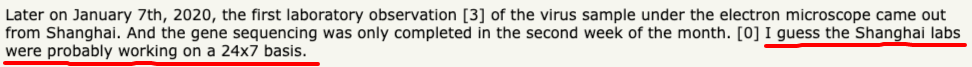

那么上海的实验室是不是在 7 * 24 地做这个测序工作呢？了解国内工作环境的同学一定明白，这简直是必然！

只有外国人才觉得：面对一个新的，毒性不明，传染性不明，已经散播的病毒，实验室的工作人员也必须享受每周工作 5 天，每天工作 8 个小时的“基本”工作待遇。

 

实际上，2002 年在中国爆发的 SARS，我国没有率先完成基因测序工作。

在那时，尽管中国大陆地区首先发现了感染病例，但确定病原体、对病毒进行分离、基因测序和发现病毒受体的工作却并未走在世界前列。来自加拿大温哥华的迈克尔・史密斯基因组科学中心（Michael Smith Genome Sciences Centre），提前中国一天，测定了这个 SARS 病毒的基因序列。

2003 年 7 月 18 日，Science 杂志以《中国错失良机》（China's Missed Chance）为题，报道了 SARS 病毒发现的过程和细节，并慨叹中国科学家“失去了一次在全世界面前闪耀的机会”。

自 SARS 以后，中国一直在病毒科研方面努力。实际上，上文中所说的这个武汉的生物安全四级实验室，也是 SARS 后，我国决定要在病毒研究方面做到世界领先而建造的。

这一次基因测序，我国证实了自己的努力没有白费。但不想，这又被一小撮人认为其中有鬼。

我只能说，**中国真的太难了。**

 

另外，值得一提的是，这次中国很快完成基因测序，确实还有另外一个可能：这个病毒并非像报道的那样，是 12 月 30 日才被中国的科学家真正关注的，有可能更早。

实际上，现在大家都应该知道了：2019 年 12 月 8 日，官方就已经通报了首例不明原因肺炎患者发病。这个日期比 12 月 30 日早了整整三个礼拜。

瞒报误报延报的情况肯定是存在的，对此，武汉政府有着不容推卸的责任。连官媒都已经罕见地侧面批评了武汉政府有“侥幸心理”，“行动慢了”。

 

所以，即使完成这个基因序列，两周的时间真的太紧张了，那么大概率的，我更相信，是因为我们比报道的更早地开始了基因测序，而非是因为这个病毒本身是我们制造的。

 

**第三种说法**

有人翻出了一篇 2016 年发表在 Journal of Virology 上的论文。

这个论文的标题看上去很吓人：在蝙蝠身上找到了一种新的冠状病毒，和 SARS 的祖先高度相关。

这篇论文的作者都是中国人，单位里，武汉赫然在列。

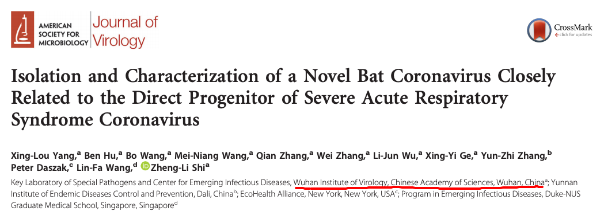

看上去，这似乎就证明了，中国早就发现了这样一种病毒。

先不说这篇论文中描述的病毒，和武汉的新冠状病毒完全不是一回事儿。如果我们在 Journal of Virology 论文库中搜索这个论文的标题中的开头：Isolation and Characterization，就会发现一大票论文向你袭来，大多会涉及新的病毒：

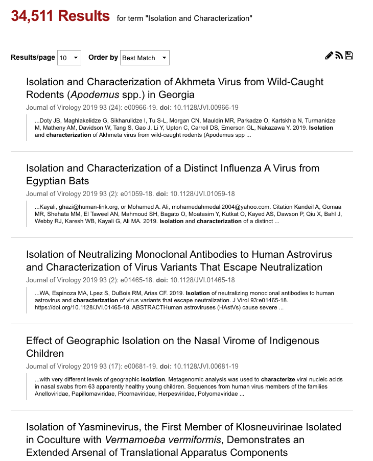

结果有多少个呢？截图上面的大字告诉我们了，34511 条，三万多条！

这么多研究，背后的国家和机构，都在搞生化武器？

 

**第四种说法**

有人发现，新的冠状病毒的基因测序的结果是这样的：

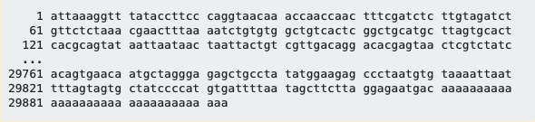

结尾全都是 A！

所以有人觉得，这不是自然产生的结果，因为不够随机，而是人为操作的结果。所以，这种新冠状病毒，是人类研制的。

这个说法看起来很有道理，但是很快，就被病毒领域的专家辟谣了。

实际上，结尾的 A，是冠状病毒和小核糖核酸病毒的普遍特征！

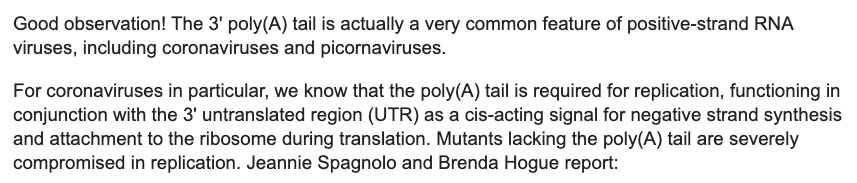

如果对此不相信的同学，我向大家推荐一篇论文。这篇论文专门论述冠状病毒末尾这一堆 A 是怎么回事儿。论文标题就是：[Requirement of the Poly(A) Tail in Coronavirus Genome Replication](https://link.springer.com/chapter/10.1007/978-1-4615-1325-4_68)，简单翻译就是：冠状病毒进行复制，基因序列末尾需要这一堆 A！

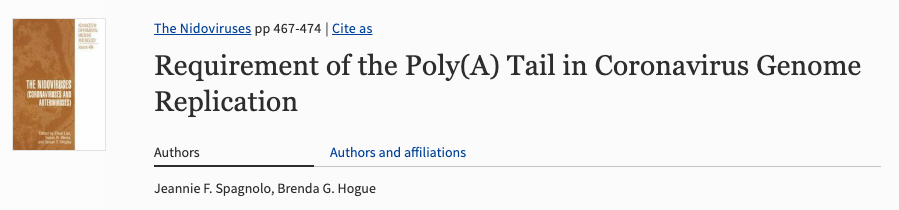

 

**第五种说法**

香港大学新发传染性疾病国家重点实验室主任以及流感研究中心主任管轶，在 1 月 23 日接受媒体采访时指出，华南海鲜市场封掉，洗地，使得病毒感染的 “犯罪现场” 没了，导致追溯动物源头困难，难以 “破案”。

这使得有一些人认为，武汉政府掩盖了证据。

对此，请大家看下图，这两天在网络疯传，相信很多人都看过：

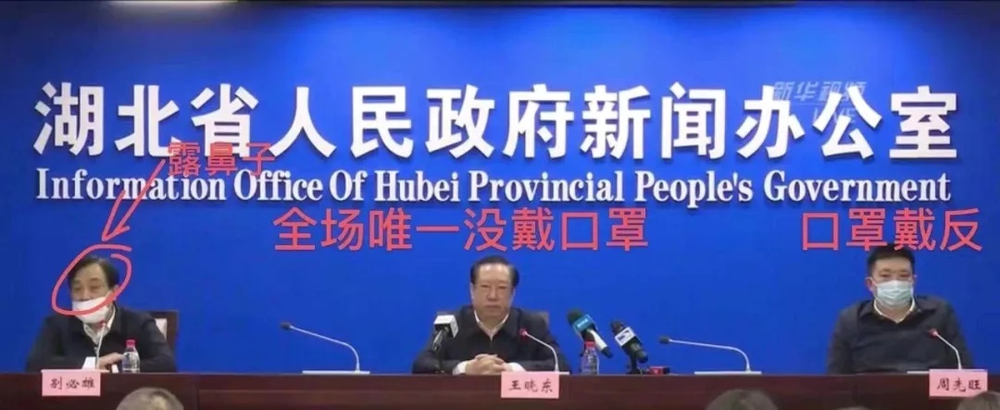

这是在 1 月 26 日，湖北新型肺炎疫情发布会的照片。此时对于这个新型病毒，已经人尽皆知，诸多省市地区都已经启动了最高级别的疫情防控机制。但是，此时，这些地方最高官员表现出的状态，却是这个样子。

请问，你觉得他们在了解到病毒的威力后，是因为无知，而封掉华南海鲜市场，并进行全面清理的概率大？还是因为极度聪明，第一时间销毁证据的概率大？

另外，值得一提的是，武汉，包括湖北省，真的没有面对重大疫情的经验。

我不是湖北人，为此我特意采访了几个经历过非典时期的湖北朋友，包括武汉人。大家纷纷表示，在上一次非典疫情中，SARS 病毒近乎对湖北省，包括武汉，没有什么影响。

 

**第六种说法**

这两天，科学杂志官网上的一篇文章火了。这篇文章直接指出，新型冠状病毒的源头，很有可能不是武汉的那个海鲜市场。

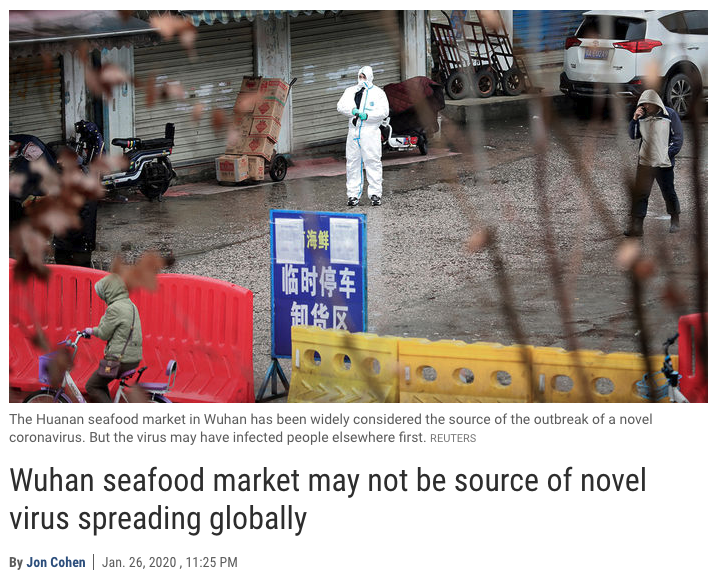

于是，就有人跳出来表示，这个病毒因此一定是中国的阴谋。

对此，我承认，新型冠状病毒的源头确实可能不是武汉的海鲜市场。实际上，**任何病毒的源头都不是某一个市场！**

请问，SARS 病毒的源头是哪个市场？

SARS 病毒最后被确认，其源头是在一种叫做“菊头蝠”的蝙蝠身上，之后传染给了果子狸，又经过果子狸这个中间宿主，传染给了人类。

现在，科学界的一个共识是：这个新型冠状病毒的源头很有可能也是蝙蝠，同时，也很有可能经过另外一个中间宿主生物，传染给了人类。

一旦确定了这个中间宿主的话，那么病毒的源头不是这个海鲜市场，简直太正常了。追溯这个中间宿主生物在人类活动中的路径，才能找到真正的源头。

而这一切，和什么生化武器，一点儿关系都没有。

 

最后，我想说一个小故事。

2012 年，我刚来美国的时候，参加过几次一个教堂的活动。教堂的人都很善良，对我们也很好。我听他们聊聊圣经，然后一起吃顿晚饭，气氛挺融洽。

但是有一次，我发现事情不太对，因为晚饭聊天的内容，变成了达尔文是个大骗子。

后来我才知道，达尔文的进化论，是和圣经冲突的。因为达尔文说人是从猴子进化来的嘛；但是圣经说，人是上帝创造的。

那么，这两种理论，哪种理论对呢？

**其实，在科学界，并不能 100% 地肯定达尔文是对的。进化论确实有错误的可能性。**

可是，在这种情况下，那些近乎是全世界最聪明的科学家们，为什么还是会更倾向于相信达尔文，而不是上帝造出了人类呢？

这是因为，进化论已经有了大量的实证支撑，这些证据包括化石，地层，同位素的衰变和丰度，土壤中的孢粉，现在动物的行为以及基因上的变化，等等等等。

对于这些证据，虽然我们还搞不清楚很多细节，但是，在大多数情况下，它们在进化论的理论框架中是自洽的。

如果仅仅一味地强调“进化论可能是错误的”这个观点，以此证明“上帝造人”可能是正确的，这其实是一刀切地，把大量的实证研究抹去了。

**正确的说法是：暂时，以人类的认知看，没有哪种理论是 100% 正确的。但是，进化论正确的概率，大于上帝造人的正确概率。**

毕竟，对于上帝造人，除了一本不知道什么人编写的圣经以外，近乎没有任何实证。如果你想证实“上帝造人”是正确的，你需要举出更多的实证来说明，而不能靠说“进化论有可能是错误的”，来证明“上帝造人”是正确的。

而且，因为“上帝造人”这个结论太过“非凡”——毕竟，我们很难想象有一个叫上帝的存在，凭空就把这个世界，包括人类给造出来了——所以，为了证明这一理论，你还需要举出更多的，非凡的证据。

所谓**非凡的理论要有非凡的证据。**

 

举个例子。

昨天，我的公众号没有更新文章，为什么？

一个理论是：我出去玩儿了，所以没更新。

另一个理论是，苹果的 CEO 库克同学突然想让我当苹果 CEO，可不巧，与此同时，Google 的 CEO 劈柴哥，也想让我当 CEO。两个人因此打得不可开交，我只能去劝架，花了一天时间，说服了他们，我哪个 CEO 都不想当，就想宅在家里。

你相信哪个？

从理论上，两个都是有可能是正确的。但是头脑正常的人肯定相信第一个。

为什么？因为第二个理论太过奇特，太过非凡了。要想证明第二个理论是正确的，你一定要管我要很多证据来支撑。

 

这是一个很简单的道理，但是，在阴谋论面前，很多人却愿意相信那个更奇怪的理论。

现在，如果再让你想一想，新型冠状病毒，是因为某种蝙蝠身上的病毒经由中间宿主传播，意外产生变异，感染了人类；还是中国密谋已久的生化武器惨遭泄露。你更相信哪一个？

依然是，严谨地说，两个理论都可能是正确的。但是，历史上已经有多次来自动物的病毒感染人类产生疫情的事情发生，这些历史证据，让第一种理论正确的概率更大，而第二个理论相较则过于非凡。

如果要说明第二种理论是正确的，我们需要大量切实的证据，而不能仅仅靠推测。因为**非凡的理论要有非凡的证据。**

 

对了，昨天有人跟我说：不会有哪个国家会傻到，使用一种可以感染任何人，主要症状和流感差不多，致死率可能也就比流感高一点儿的病毒，当做生化武器的。

我深以为然。

 

文章题图是位于武汉的我国首个公开的生物安全四级实验室。

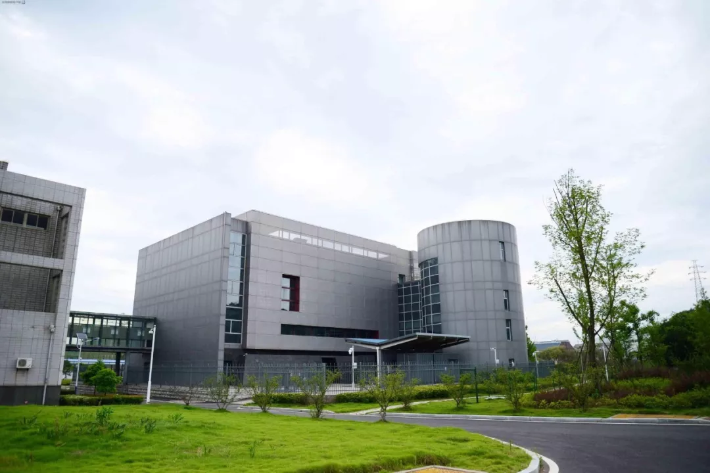

 

**武汉加油！湖北加油！中国加油！大家加油！**