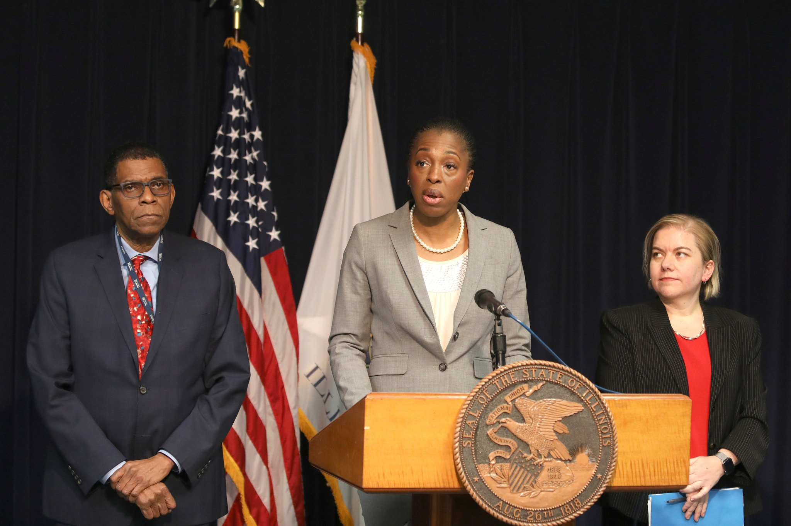
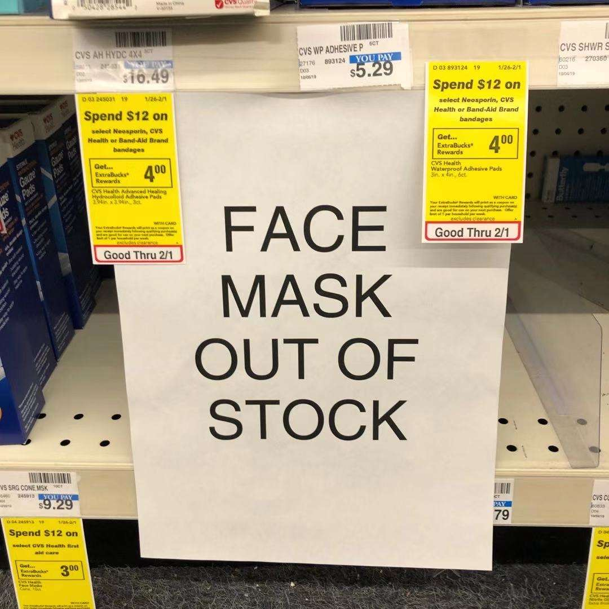
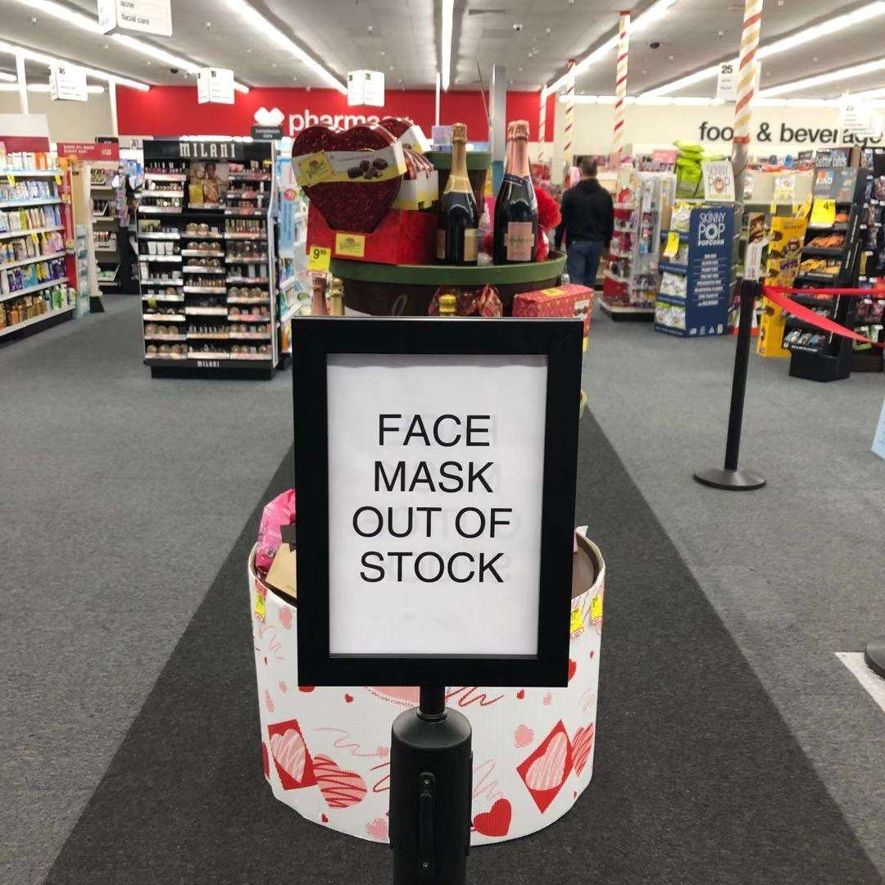
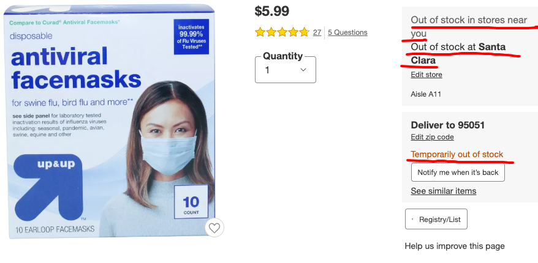
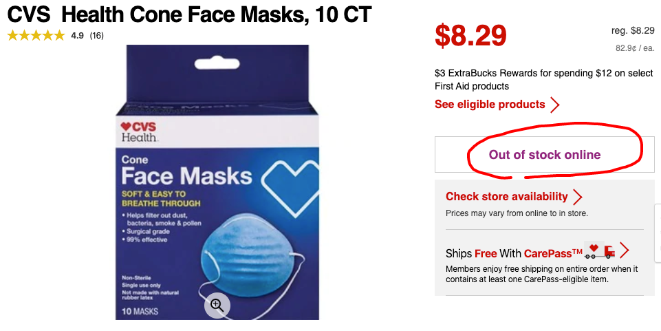
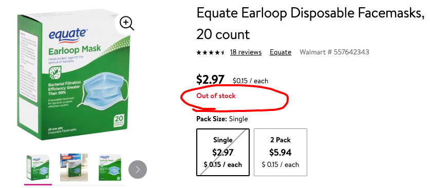
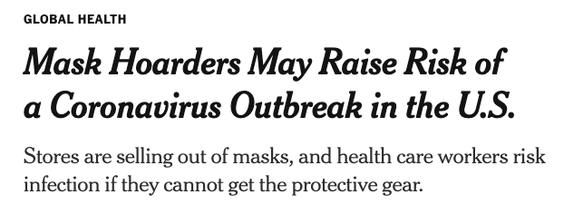
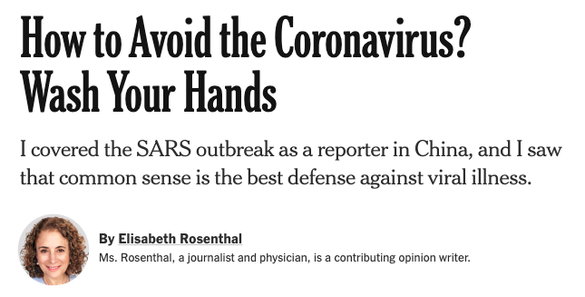

## 美国专家说，普通美国人不要屯口罩

新冠病毒对世界的影响继续进行着。

今天的头条新闻绝对是**WHO 宣布：中国的新冠病毒疫情构成了国际公共卫生紧急事件。**

对于这一声明，相信今天大家就会（或者已经）被铺天盖地的相关新闻报道轰炸了。各种靠谱的不靠谱的解读都会有，所以我就不凑热闹了。

 

同时，**美国出现了首例人传人新冠病毒感染病例。**

这个病例是之前在美国芝加哥确诊的美国第二例新冠病毒患者：一名 60 岁的老奶奶，她的丈夫被传染。这个病例同时也是美国的第六例确诊病例。

现在，专家们正在调查这名老奶奶的丈夫去过什么地方，接触过什么人。

伊利诺伊州（芝加哥所在的州）的公共卫生部为此开了一个简短的发布会。

在会议上，相关官员表示：

> experts have expected to see some person-to-person spread in the United States.

翻译：专家预期：在美国本土会产生一些人传人的案例。

> We understand that this may be concerning,

翻译：我们理解这个病例会让很多人担心，

> But our assessment remains that the immediate risk to the American public is low.

但是，我们对这一事件的评估保持不变。我们认为美国公共卫生安全受到直接影响的**风险依旧很低**。

 

美国民众大致是怎么反应的呢？

过去这一周，恰好赶上我要去美国医院做常规体检。

预约体检去一次医院；抽血去一次医院；体检结果出来以后和医生讨论我的体检报告去一次医院。我去了三次医院。

这么说吧，我见过的医生和护士，都没有戴口罩。抽血的时候，旁边还有一个老奶奶，疯狂地咳嗽，但是完全不戴口罩。。。

当然，我去的也不是医院的呼吸科，不能代表全部情况，只是我的所见所闻而已。

我唯一见到戴口罩的，是在抽血的时候，看到几个亚洲人戴口罩。对了，在超市，也能看见一些亚洲人戴口罩。

至于其他种族的人民，我暂时没见过戴口罩的。

 

但尽管如此，美国的口罩也开始紧俏起来。

上个月底，中国疫情刚爆发的时候，我在家附近的超市买了一点口罩备用，以防万一。今天，我又去那个超市看了一眼，发现口罩没有了。

 

最近，我的朋友圈流传着这些照片：

这张照片是 CVS 的照片。CVS 是美国最知名的连锁药妆店，基本是上大部分美国民众买健康类产品的首选店家。

但是口罩已经卖没了。

 

这张照片来自 Target。Target 是美国仅次于沃尔玛的第二大零售百货集团，也是美国标准普尔 500 指数的成员。2019 年，Target 位于世界 500 强企业排行榜 122 的位置。

口罩已经卖完了。

 

说实话，这两家店最近我都没去过。为了证实，我特意去网上查了一下这两家店在我家附近的库存。

Target 确实没货了。

 

CVS 也没货了。

 

我顺便查了一下沃尔玛，也没货了。

 

嗯，但美国政府说，风险是很低的。

看来这一定是美国人民群众不理智了。嗯，一定是的。

 

于是，我又到网上看其他新闻，看到《纽约时报》上这么一条新闻：

翻译：**囤积口罩可能会导致新冠病毒在美国爆发的风险变高。**

链接：[https://www.nytimes.com/2020/01/29/health/coronavirus-masks-hoarding.html](https://www.nytimes.com/2020/01/29/health/coronavirus-masks-hoarding.html)

 

文章的核心观点是：对于健康人群来说，戴口罩的保护作用其实是很小的。

为什么这么说呢？健康专家认为，口罩主要是给病人和医护人员戴的。

病人要戴口罩，是因为病人本身就是巨大的传染源，口罩让这个传染源的传染力大大下降。

医护人员要戴口罩，是因为医护人员在工作时间，近乎完全暴露在可能被污染的环境中，因此，口罩是一个很好的防护。

但是，对于大部分普通民众来说，如果没有疾病，平时生活去的场合没有那么危险。另外，因为戴口罩很不舒服，于是会大概率错误地戴口罩，或者不时地摘下口罩，让口罩失去作用。

所以，现阶段，在生活场景中，口罩对大部分普通人起到的防护作用是极其有限的。

甚至，在学术界，对于病人与医护人员，带上口罩以后对病毒的传播到底有没有抑制作用，有多少抑制作用，都是有争议的。

更重要的是，普通民众囤积口罩，会致使真正需要口罩的医护人员资源紧张。这是最致命的。为此，**很多健康专家甚至希望美国政府能够站出来，教育民众，不要盲目囤积口罩。**

然后，我才知道：**口罩真的是战略物资。**美国有国家战略物资存储库（National Strategic Stockpile），其中存储的物资就包含口罩。在必要的时候，政府会开始动用这些物资。

但是，健康专家表示担心：不确定战略物资存储库中的库存有多少，够用多少天。。。所以还是号召民众，不要屯口罩。

**反正不信任政府这事儿，美国人真是天生的。**

 

为了教育美国民众口罩没什么用，最近我看到很多美国主流媒体都在引用这么一篇文章：

翻译：**如何躲开冠状病毒？洗手！**

链接：[https://www.nytimes.com/2020/01/28/opinion/coronavirus-prevention-tips.html](https://www.nytimes.com/2020/01/28/opinion/coronavirus-prevention-tips.html)

口罩确实会起到一些作用，但相较而言，**她相信更起作用的是：不要去人流密集的地方。**

这也是她在 2003 年，北京非典疫情爆发的时候，没有让她的两个小孩子回美国的原因。**她认为：小孩子在飞机这个人流密集的封闭空间里，染病的概率更高**，远远高于虽然身在北京，但是做好防护以后，染病的概率。

甚至她说，在非典期间，她的小孩儿所在的国际学校都没有关闭。而且，在 SARS 爆发早期，这所国际学校里，还有一名学生家长患病！

那么这所国际学校在非典期间采取什么行动呢？

首先就是警告所有家长：如果小孩子有任何可疑的症状，绝对不能上学。

同时，学校也每天监测学生的体温，尽量提前发现可能的病患。

更关键的是，学校的老师每天会更加频繁地带着小朋友们去洗手。在洗手过程中，需要唱一首“加长版”的洗手歌，以此来延长小朋友们洗手的时间。

最后的结果是怎么样呢？按照她的说法：在非典时期，这所学校**没有一个小朋友请病假，出勤率近乎 100%，比平时还高！**

 

嗯，这些就是我最近看到的，除了报道事实以外，关于这次疫情，美国媒体对民众的教育。

反正，我觉得，**少去人流密集的地方**以及**多洗手**，肯定是正确的。

但是说戴口罩没用，我是不信的。**可能更准确的说法是：美国现在的情况，戴口罩的必要性不大。**

但是，中国情况不同。一方面是疫情更严重；另一方面是：中国的人口密度真的很大，再加上春节时期。**因此，我认为大家还是要戴口罩防范的。**

我特意找了找和戴口罩相关的论文，发现大多数论文其实都是在论述：在手术室中，手术用口罩的作用和效率。但是，口罩在公共生活中的作用和效率，相关严谨的学术研究近乎没有。

不过这也正常，因为在学术研究中，对比是需要极其严格的。必须在保证其他所有因素都一样，只有“是否戴口罩”这一个因素不一样的情况下，看人群染病的数量是否有显著变化，才够格。

但是，我们怎么可能让一组人和另外一组人生活的完全一样，区别只是戴不戴口罩呢？即使可能，如果不是在疫情情况下，大概率地也很难看出差别。因为大家都很健康嘛。

 

---

最后，我想说一个在美国的小见闻。

如果来过美国的同学应该都知道，美国社会是非常谦让的。即使没来过，相信很多人也都听说过。

比如，在美国，从来都是车让人的。在一个没有红绿灯的路口，一个行人慢悠悠地过马路，一排车安安静静等着这个行人走过马路的情况并不罕见。

另外，平常在大街上，是近乎听不见汽车鸣笛的。在美国，开车的过程中鸣笛，除非特别特别极端的情况，否则近乎和骂人是差不多的意思了。反正，我觉得我没有遇到过需要开车鸣笛的情况。

很多人都认为这是美国人素质高。

有一次，在一个美国的公共假日，我去一个特别火的购物中心。因为那个购物中心那天太火了，所以没有停车位了。我只能把车停到一个稍远的停车场，再走过去。

走过去要经过一个马路，恰好那一天，那条马路还有一条车道施工，导致车流行驶缓慢。同时，因为有太多人需要过那个路口，所以路边等着过马路的人也特别多，并且还在源源不断地增加。

这个路口有一个红绿灯。但此时，这个红绿灯留给路人的绿灯时间，已经不足以让马路边上等待过马路的所有人都走过路口了。

于是，闯红灯出现了。因为新到路口的人发现：虽然已经是红灯了，但是前面由于人太多，所以末尾的人其实还没走出去几步。如果自己跑两步，就跟上上一波的“大部队”，可以提前过马路了。

一出现闯红灯的人，汽车们不干了，开始疯狂鸣笛。因为有道路施工，汽车本来就过得慢，再加上有闯红灯的行人，汽车每次只能走过去两三辆。

后面的车疯狂地鸣笛，前面的车也着急。于是，一些汽车开始缓慢地朝人群逼近，试图用“钢铁之躯”驱赶过马路的人群。

行人有人开始大声埋怨。一片混乱。

那一刻，我突然觉得自己置身于 20 年前的北京街头。

原来美国人也有素质这么低的时候。

为什么说是 20 年前呢？说实话，我上一次回北京，觉得北京的街头很安静，鲜有鸣笛；同时，行人闯红灯的现象好了很多。

后来我反思，觉得说美国人素质高是假的。大家都是人，人性的区别不大。

真正的区别，**一个源于制度上**，不多说。

另外一点，就是**美国地广人稀，资源多。**因为资源多，所以大家不用着急，不用急扯白脸地去抢占资源。谦让一点儿，也能拿到属于自己的那一份，还不失自己的风度，何乐而不为？

而一旦资源变得紧张，像那个路口一样的时候，美国人的素质，也并没有高多少。

 

或许这次疫情，对美国也是一次考验。且看这次疫情，美国局势的发展。

实际上，这次疫情，对任何国家都是一次考验。

不过，我最希望的，还是疫情能够早早结束，大家都早早地，回归到正常的学习生活中。

**武汉加油！湖北加油！中国加油！大家加油！**
