## 美国确诊第七例在湾区；宣布进入紧急状态；美股暴跌

美国确诊了第七例新冠病毒，在湾区。

准确的说，是在圣克拉拉县，这是中文翻译，英文是 Santa Clara County。

现在有很多中文媒体报道说是在 Santa Clara City，这是不对的。Santa Clara County 是一个比 Santa Clara City 大得多的概念。Santa Clara City 只是其中的一个城市。

对了，我就在 Santa Clara City。

 

Santa Clara County 有多大呢？大概是这样的：

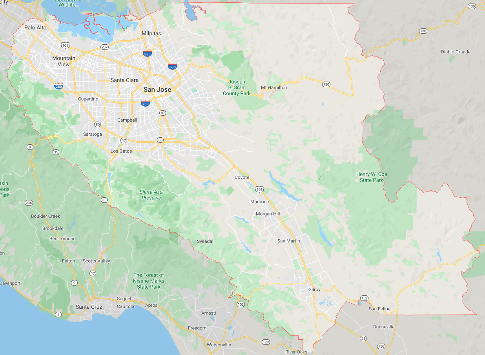

在 Santa Clara 县里，有著名的城市 Palo Alto，斯坦福大学就在这里。旁边的 Menlo Park，就是 Facebook 总部在的地方。

在 Santa Clara 县里，有著名的城市 Mountain View，翻译成山景城。这个城市估计很多同学都听说过，因为 Google 的总部就在这里。

在 Santa Clara 县里，有著名的城市 Cupertino，就是苹果总部在的地方。

Santa Clara 县的县府是 San Jose，中文翻译是圣何塞。去年，苹果的开发者大会就在这里召开。这次确诊的第七例新冠病毒患者，就是在圣何塞机场下的飞机。

Santa Clara 县有大量的互联网企业，是一个华人密集的地区。因为互联网企业本身华人工程师就很多，再加上 Santa Clara 县是湾区人口最多的地区。所以，Santa Clara 县的公共卫生部发言人 Sara Cody 表示：他们对此并不觉得太惊讶，早就为此做好了准备。

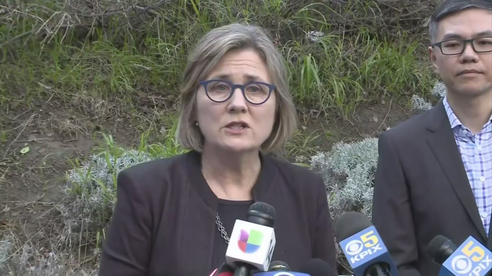

这名确诊病患是名成年男性。据新闻称，这名成年男子之前曾到过武汉，24 日回到美国。

但具体这名成年男子的年龄，国籍，包括具体住在 Santa Clara 县的哪里，都没有透露。

而且，发言人表示，这名男子回到美国以后，就一直隔离在家，没有去过任何人口密集的地方，只去了两次医院，所以我们大家都非常非常非常幸运（lucky）......（虽然我对此表示怀疑......）

而且，因为这名男子的症状很轻微，所以虽然确诊了新冠病毒，但是目前是采取的是在家隔离治疗的方式......

之前美国媒体吹嘘的，新冠病毒的第一例确诊案例，是大量使用机器人进行护理治疗的。有媒体报道截图为证：

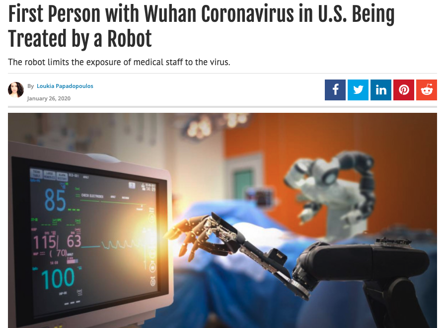

不知道为什么，这一切在科技最发达的湾区，并没有发生......

可是，同样不知道为什么的是，我对此也并不觉得很意外......

 

---

把全世界搞得沸沸扬扬的病毒，患者在家治疗就可以？听起来这个病毒没什么大不了不起？

这和我现在接受的美国主流媒体教育是一致的。

比如今天，这张图在美国媒体上非常火：

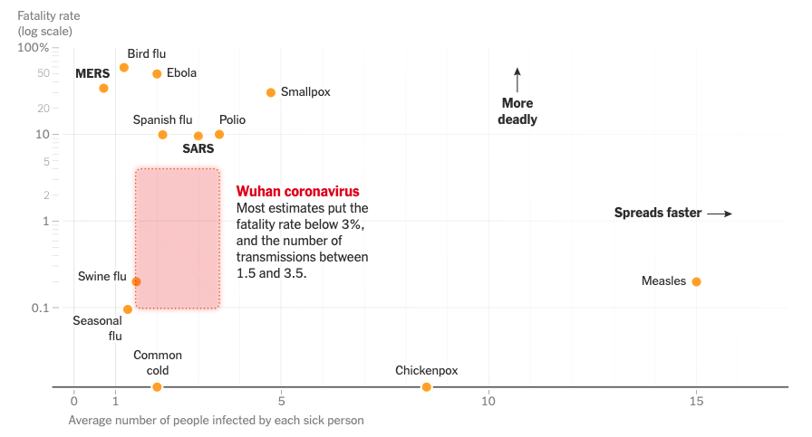

在这张图中，对比了新冠病毒和一些其他病毒的传染性和致死率。

横轴表示传染性，越往右表示传染性越高；纵轴表示致死率，越往上表示致死率越高。

大家可以看到，左下角分布了一些传染性低，致死率也低的疾病，比如季节性流感（Seasonal flu），普通感冒（Common cold）；

右下角分布了一些传染性高，致死率低的疾病，比如麻疹（Measles），水痘（Chickenpox）；

左上角分布了一些传染性低，但致死率高的疾病，比如 MERS，禽流感（Bird flu），埃博拉（Ebola）。

然后，现在的新冠病毒，大致就在图片红色方块标识的区域里。

为什么是一个区域？因为现在关于新冠病毒的数据还不全面，我们对新冠病毒的理解还太少，所以只是一个估计，在一个区间里。

整体上，现在的估计，新冠病毒的致死率比起很多“狠角色”不算高，传染性似乎也不算太强。这份研究认为：新冠病毒的致死率大概在 3% 左右，基本传染数 R0 在 1.5 到 3.5 之间。 

简单地说，**基本传染数 R0 表示的，就是一个人得病，可以传染给多少人**。

虽然 1.5-3.5 这个估计区间看起来不高，但实际上，**只要 R0 > 1，就意味着这个传染病将以指数方式扩散。**

学习计算机的同学都应该明白指数扩散的威力。设计一个算法，如果是指数级别的，数据规模哪怕只有 100，普通计算机都转不了。其实 50 都够呛。

放到人口上，按照 R0 是 2.5 （1.5 和 3.5 的平均值）；世界人口是 78 亿计算，**大概 25 轮的传染以后，全世界人口都将染病。**

所以，已经有一些悲观的学者认为，新冠病毒将会成为“新常态”，大家以后每年除了迎接流感季，还要做好准备迎接“新冠季”......

希望疫苗快点儿出现，将会大大降低新冠病毒的传染性。

 

---

不管怎么样，今天，美国宣布进入国家公共卫生紧急状态。

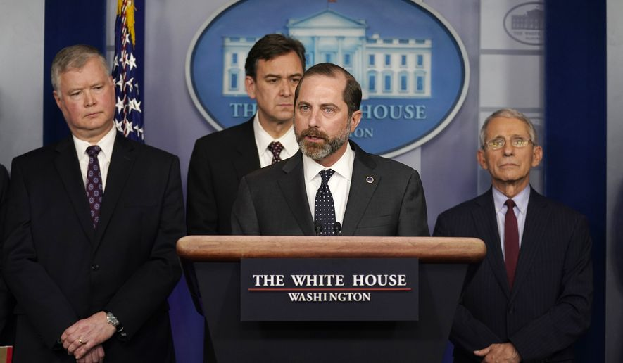

到现在为止，美国采取的行动包括：

1）**建议**所有在中国的美国人员回美国，而**不仅仅局限在武汉市或者湖北省**；

比如美国社交媒体有这样的新闻：

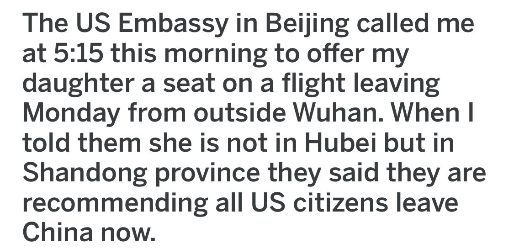

**翻译：**美国驻北京大使馆在今早 5:15 给我打电话，会給我的女儿提供一班飞机，在周一离开武汉外围地区。我告诉他们，我的女儿并不在湖北省，而在山东省。他们说，现在他们建议所有的美国公民都离开中国。
 
 
 
2）美国国务院的旅行建议中，将中国提升至警告的最高级别——四级，即**不建议前往**。同时，**区域是整个中国**，而不仅仅是武汉市或者湖北省。

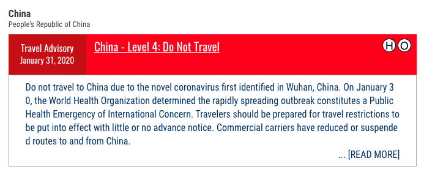

 

3）白宫**建议**美国的航空公司取消美中之间的**所有航班**。

到目前为止，我知道的，Delta 达美航空宣布暂停全部中美航线，直至 4 月 30 日；

American Airlines 美国航空宣布暂停全部中美航线，直至 3 月 27 日；

United Airlines 美联航已经宣布暂停部分中美航班，取消了美国至北京，香港，及上海的 332 架航班。

另外，Air Canada 加拿大航空也暂停了加拿大往返北京 / 上海的直航飞机，至 2 月 29 日；

欧洲的法国航空；

英国航空；

德国汉莎航空；

芬兰 FINNAIR；

荷兰皇家航空公司；

北欧航空公司，

以及亚洲的印度航空；

缅甸嘎莫萨航空；

首尔航空公司；

大韩航空；

以色列航空公司；

印度的 IndiGo 航空公司等，

都宣布全部或者部分暂停去往中国的航班。

 

4）美国**全面禁止**从中国来的**所有人**入境。只要在过去 14 天，去过中国，即使没有去过武汉市或者湖北省，同样禁止入境。

当然，这一条是针对非美国公民和非永久居民来说的。但如果是美国公民或者永久居民的话，只要在过去 14 天去过中国，在入境美国前，就必须隔离检查 14 天。

这次美国宣布进入公共卫生紧急状态，是六十年来头一遭。上一次美国宣布进入公共卫生紧急状态，要追溯回 1960 年的时候，因为天花（smallpox）。

 

市场的反应是怎样的？

毫无疑问，大跌。

道琼斯指数因此下跌高达 600 点，下跌幅度 2.09%。

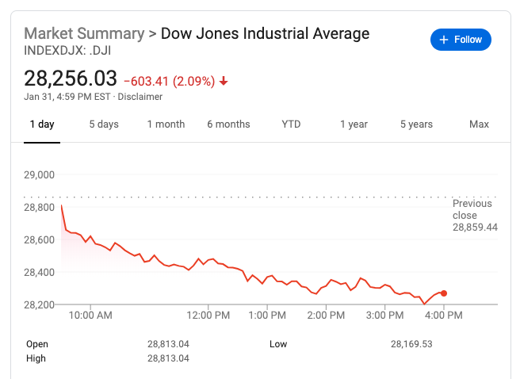

 

纳斯达克下跌 148 点，下跌幅度 1.59%。

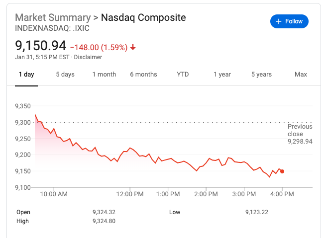

 

S & P 500 指数下跌 58.14 点，下跌幅度 1.77%。

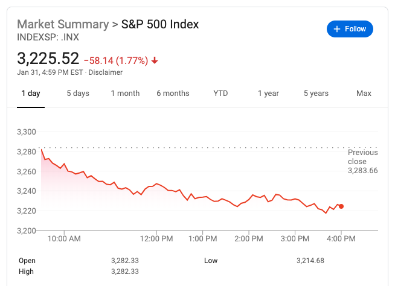

 

---

嗯。

外交部发言人华春莹就美方在中方抗击疫情时发表不友善言论答记者问。

提问：当前，中国正在全力抗击新型冠状病毒感染肺炎疫情，美国一些官员却不时发表对华不友善的言论。美商务部长称，疫情有助于部分就业岗位流回美国。还有美方官员影射中国在应对疫情问题上与美国不合作。今天，美国国务院发布公告，将对中国的旅行警告提高至同伊拉克、阿富汗一样的最高级别。美国务卿甚至继续恶毒攻击中国的国家制度。中方对此有何评论？

华春莹回答：

当前，中国人民正在全力抗击疫情。中国政府本着公开透明、负责任的态度及时向包括美国在内的国际社会发布信息，分享数据。患难见真情，许多国家都以不同方式表达对中国抗击疫情的支持和帮助。相比之下，美方的言行既不符合事实，更不合时宜。世界卫生组织呼吁各国避免采取旅行限制，但话音未落，美国就反其道而行之，带了一个很不好的头，实在太不厚道。

艰难困苦，玉汝于成。中华民族是厚德载物、自强不息的民族。我们坚信，有中国共产党的坚强领导，有中国特色社会主义制度的巨大优势，有国际社会的大力支持，伟大的中国人民团结一心，众志成城，一定能战胜疫情，一定能战胜前进道路上的一切艰难险阻，一定能实现中华民族伟大复兴。

 

最后，昨天，人民网发布新闻，表示：中科院研究发现：双黄连口服液可抑制新型冠状病毒。

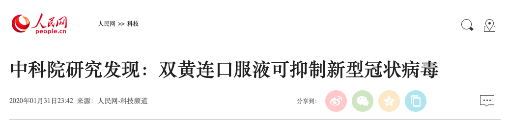

我跟我妈说：你们千万别去抢购双黄连，那玩意儿没用。抢购的人多，反而有风险。

我妈高兴地跟我说：没有没有，我们才不会去抢购呢。

因为我和你爸发现：冰箱里还存着三盒双黄连呢！

O_O

 

**武汉加油！湖北加油！中国加油！大家加油！**