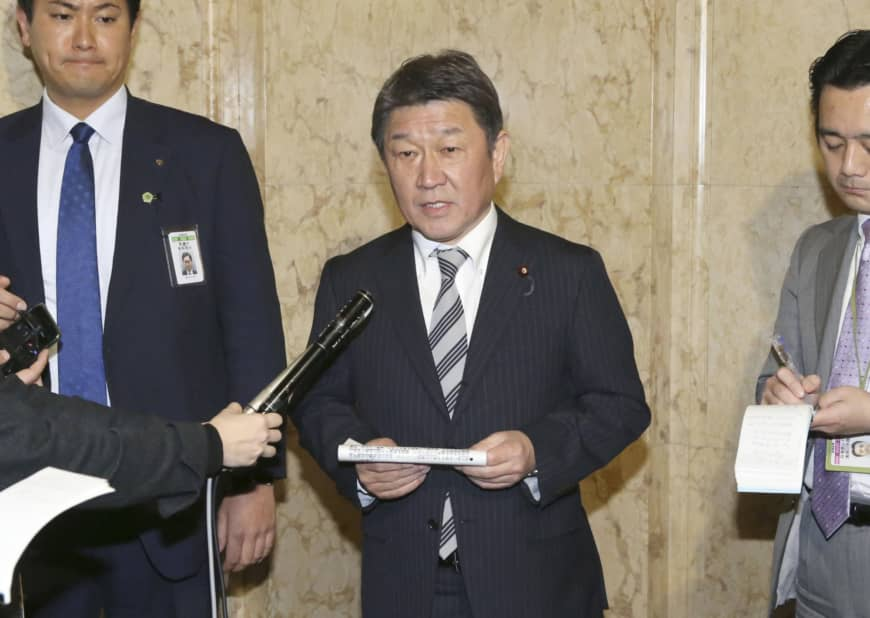
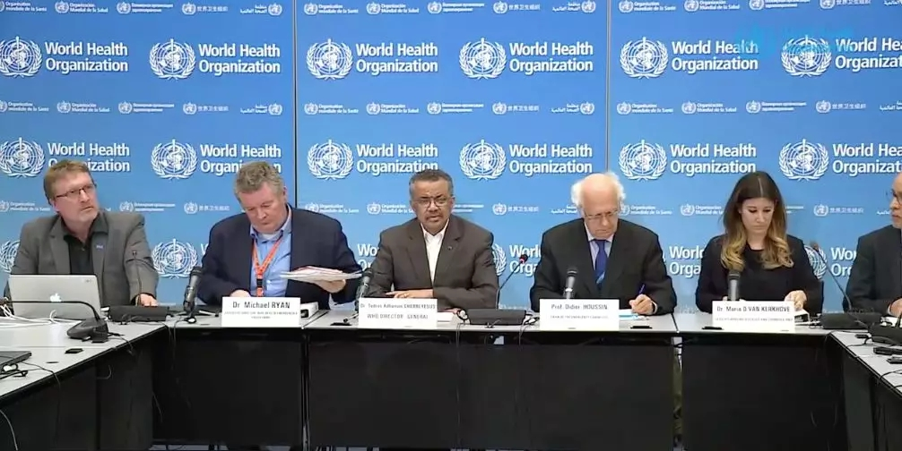
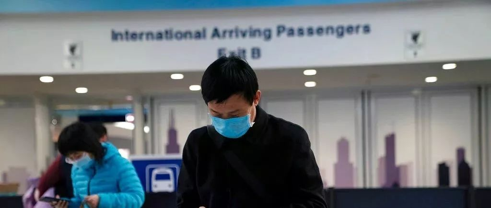
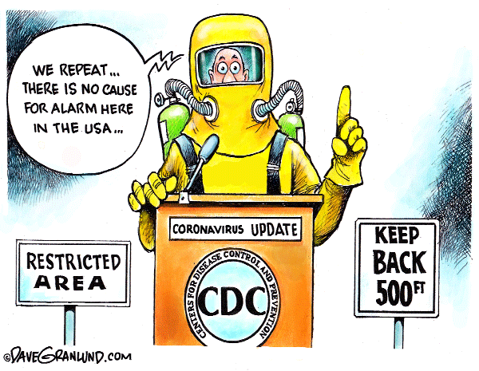

## 很多人批评武汉的做法，那美国的做法呢？

武汉封城的做法是非常有争议的。

这个做法对不对，我不是搞公共政策的，不敢轻易断定。实际上，我认为现阶段，任何专家都不敢也不能轻易断定，只能留给历史评判。

对武汉封城，很多人批评的一个点在于：下令武汉封城的通告，比具体执行，提前了整整 8 个小时。这使得很多人能够利用这 8 个小时，“逃离”武汉。

这一做法背后到底是因为政策失误？还是背后实际有什么考量？依然是，因为我不是搞公共政策的，我也不懂。

但是，就在最近，美国做了一件差不多的事情。

 

在我上一篇文章[《美国确诊第七例在湾区；宣布进入紧急状态；美股暴跌》](../2020-01-31/)中，我向大家介绍了：美国在 1 月 31 日，宣布进入公共卫生紧急状态。

因此，美国将拒绝在最近 14 天内到过中国的非美国公民入境（绿卡持有者和美国公民的直系亲属除外）。

但是，这一政策在 2 月 2 日美国东部时间下午 5 点才开始执行。而这一政策的公布时间大概是 1 月 31 日下午，整整提前了两天！

提前两天意味着什么？

最近，著名的美家留学申请和求职论坛——一亩三分地上的一篇帖子，作者描述了他的紧急返美经历，我觉得颇有代表性。

 

---

我们暂且称这个同学是 A 同学吧。

A 同学原定 2 月 5 日返回美国。

因为在我国，从 1 月 20 号开始，疫情被大规模公开报道，有越来越严重的趋势，所以 A 同学有了提前回美国的念头。可是由于飞机改签费比较高，一直在观望。

但是，后来发生了几件事情，改变了 A 同学的想法。

首先，日本出现了第一例没有武汉旅行史的病例，属于在日本的人传人案例。

A 同学看过李兰娟院士的一个采访。其中，李兰娟院士认为，需要关心几个特殊事件，其中就有在武汉之外出现人传人现象。如果这种现象出现，说明了病毒在进一步扩散，有可能引发国际社会的高度重视。

1 月 28 日，这件事情在日本发生了。

 

其次，在 1 月 29 日，世界卫生组织的总干事谭德塞结束了在中国的访问，回去之后立刻开会召开第二次会议，重新讨论：这次疫情是否构成了全球公共卫生紧急事件。

最终的结果大家都知道了：世卫组织宣布新型冠状病毒疫情为国际关注的突发公共卫生事件。

但关键是，第一次会议发生在 1 月 23 日，当时认为不构成国际关注的突发公共卫生事件，并且声称，在 10 天以后会重新开会评估讨论。

结果没有等到 10 天，在 6 天后就重新开会了，所以说明事态**可能**在升级。

 

最后，在 1 月 29 日，A 同学的一些其他在美国大公司工作的朋友，陆续收到了公司的建议：立刻回到美国，**最好在 24 小时以内。**

大公司可能有一些内部的消息渠道，公司的 HR 给出这样的建议，应该是有原因的。在这个建议下，很多在美国工作学习，春节只是回国探亲的同学，开始紧急寻找回美的机票。

 

也正是因为如此，A 同学决定重新购买机票回美，最终在 1 月 29 日买到了 1 月 31 日回美国的机票。

1 月 31 日，A 同学登机，发现值机的队伍意想不到的长，远超之前做国际航班的队伍长度。相信有很多人都临时决定早一点回到美国。

在飞机上，A 同学得知了新闻，自 2 月 2 日起，美国将禁止所有在过去 14 天去过中国的外国人入境。

A 同学入境以后，才发现很多自己的其他朋友，在美国公布这一消息后，纷纷不惜一切代价，订 2 月 1 日的机票，赶回美国。

很多人甚至选择先飞往夏威夷入境，再转机飞到其学习工作的城市。这是因为美国飞夏威夷的时间相对较短。我从北京直飞旧金山，大概要 12-13 个小时，而北京直飞夏威夷，只要 9 个小时。

提前 3-4 个小时，就有可能赶在禁令生效之前入境美国。

 

这样的故事并不是个例。

一亩三分地上的另一个帖子表示，2 月 1 日在机场，发现大家都在抢票，经济舱的票价甚至达到了 4000 刀。

我查了一下，我上次回国，往返机票的价格只有 800 刀，还是超级经济舱！虽然提前安排行程买机票和临时买机票价格肯定不一样，但这个价格还是太夸张了。

我想说的是，这和武汉封城前一堆人逃离武汉有什么区别？

在这里，**我没有做道德评判的意思**。其实，无论是武汉人逃离武汉，还是国外党赶回美国，我都充分理解。

毕竟，这些人是健康的，或者认为自己是健康的，不希望自己被封锁，想尽快回归到正常的学习工作生活中。

但是，真正让我思考的是，**如果武汉的做法值得批评；那么美国的做法，也值得批评**；

以及，**我们不应该谴责在武汉封城前 8 个小时逃离武汉的人**，这是人性使然。

如今，这样的行为同样发生在了国外党的身上。

如果这样的事情发生在你我身上，我们也不能保证是否会采取同样的行动。

 

至于现在，美国封境前，有大批人赶回美国，会不会让这种病毒在美国扩散？

说实话，我是悲观的。因为这个病毒传染性很强，已经有证据表示，没有症状也可能传染。

从概率的角度，紧急返回美国的这批人，一个都没有携带新冠病毒，概率实在是太低了。

道理上，这些人回美国，都要自我隔离 14 天，很多公司学校，在流程上也是这样要求的。

但关键是，这个自我隔离的过程，是没有强制措施实行的，近乎完全靠自觉。我很难想象这些人不去超市，不去饭馆儿，完全靠网购在美国生活 14 天。

实际上，在网络上，已经有了这样的“忠告”：

> 如果 Facebook 建议你在家办公，那么请不要去 LinkedIn 的食堂吃饭。
>
> 在家办公就是在家不出门，而并非只是“不能去 Facebook 而已”。Facebook 不让你进入，你应该理解成所有公司、餐厅、超市等人多的地方，都不应该去。
>
> 而 LinkedIn 的同学，如果知情，应该拒绝对方混饭的请求。

 

在我写这篇文章的时候，美国确诊了第九例新冠病毒患者，依然是在 Santa Clara County，有武汉旅行史，1 月 23 日到的美国，今天才确诊。

关于 Santa Clara County，在我的这篇文章有介绍：[《美国确诊第七例在湾区；宣布进入紧急状态；美股暴跌》](../2020-01-31/)。

关键是，现在新闻报道的情况，在我看来，和 Santa Clara County 的第一例情况一模一样。

发言人同样表示这名患者回到美国以后，就一直自我隔离在家，除了两次去医院以外；

发言人同样表示：遇到第 2 例，并不觉得奇怪，在预期以内，大家不要恐慌，整体风险很低很低。

我是不太信，不过美国人开心就好。

 

对了，发言人还表示，在未来的两周，应该还会有更多人确诊。

**本文都是个人观点，纯属胡诌。**

 

题图来自 Davegranlund.com 的漫画：

翻译：美国疾病控制中心 CDC 的发言人全副武装，正在开新冠病毒的新闻发布会。

发言人说：我们重复，在美国本土，大家没必要慌张....

旁边的两个牌子，一个写着：限制区域；一个写着：请保持 500 英尺的距离。

当然，**这也是漫画家的个人观点，漫画家的胡诌。**

 

**武汉加油！湖北加油！中国加油！大家加油！**