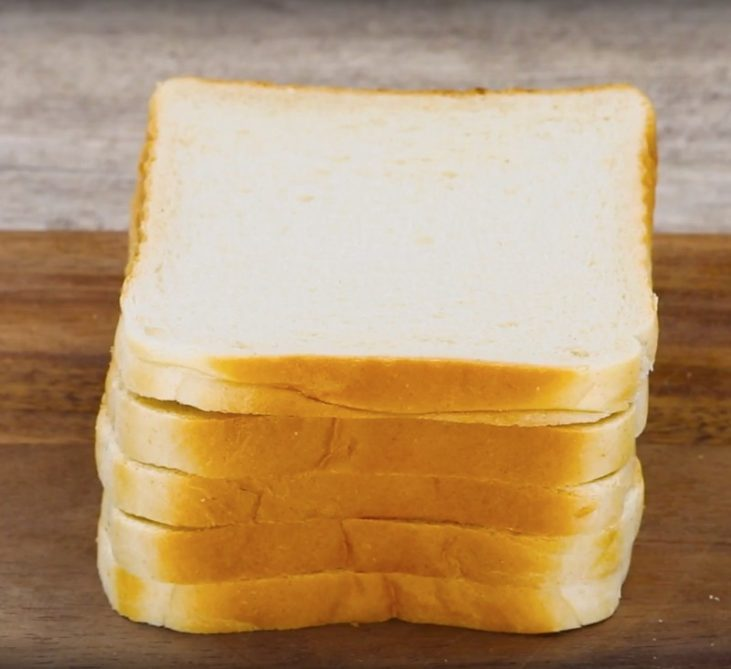
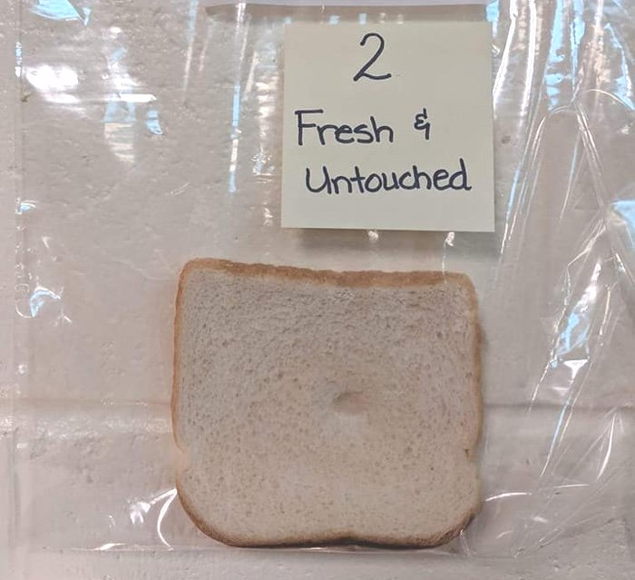
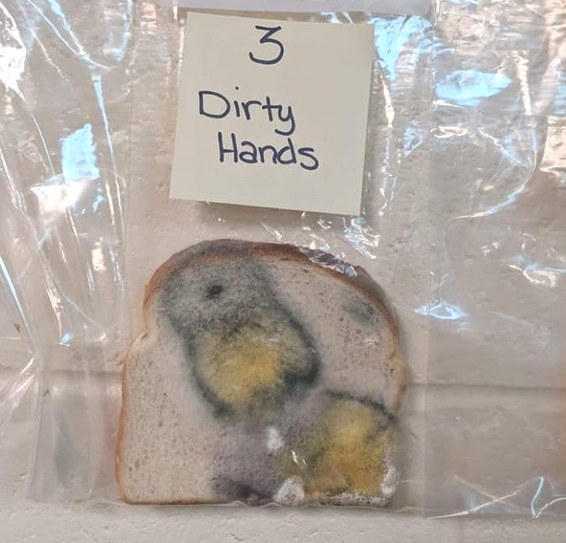
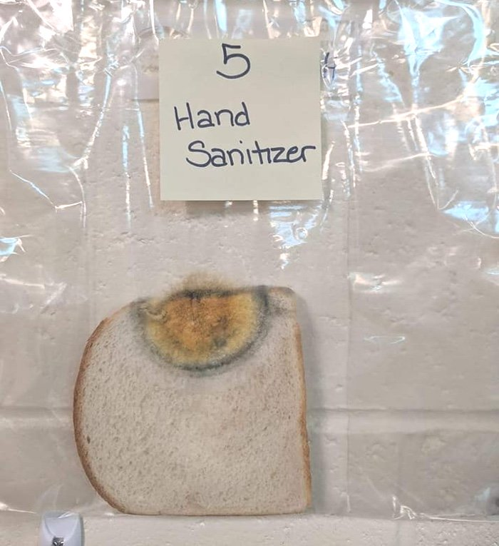
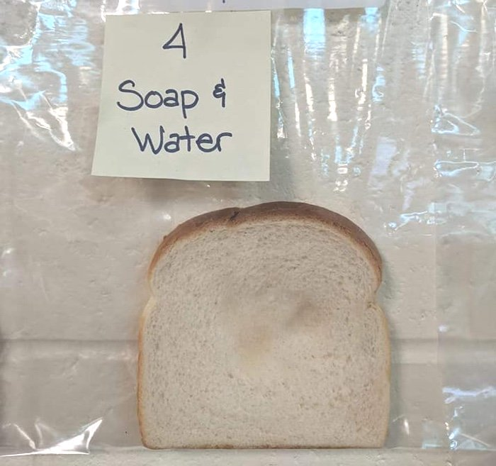
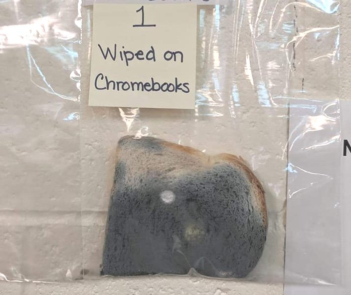
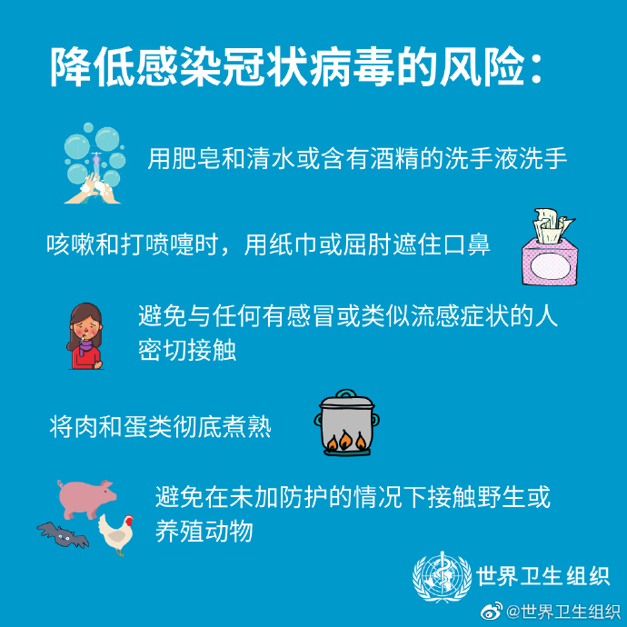
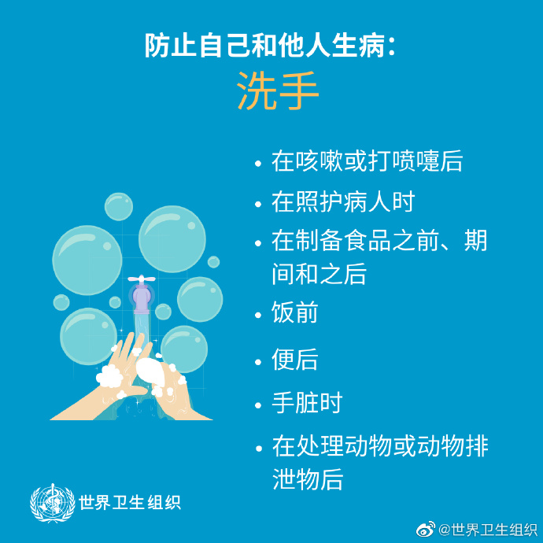
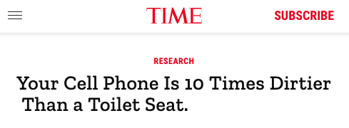

## 一片面包，带你理解洗手的重要性

这是美国的一个小学老师带领他的学生们做的实验。

在这个实验中，老师拿出了 5 片面包。

其中一片保持新鲜，不去触碰它。

对于另外的 4 片面包，分别用：

* 没有洗过的手触碰；

* 经过免洗消毒液的手触碰；

* 经过肥皂和流动水洗过的手触碰；

* 还有一片面包，擦拭了一下学生的 chromebook（笔记本电脑）。

大家猜猜，大概一个月以后，这五片面包分别会发生什么样的变化？

实验结果是这样的。

 

首先，没有触碰的面包片，依旧保持新鲜：

 

而用没有洗过的手触碰面包，面包会变成这样：可以看到，会发生相当大面积的霉变。

 

如果使用免洗洗手液消毒以后，面包的霉变面积明显缩小。

 

但是，如果使用肥皂和流动水洗手的话，触碰面包后，面包近乎也不会变质！

 

最后，那个擦拭了一下学生的笔记本电脑的面包变成了什么样子呢？是这个亚子的。。。

 

这个简单的实验，是美国爱达荷州的小学老师 Dayna Robertson 和 Jaralee Metcalf，在去年（2019 年）11 月初，带领 Discovery Elementary School 的小学生们完成的。实验结果在去年（2019 年） 12 月初公布，历时一个月。

做这个实验的时候，新冠病毒还没有爆发。老师带领小学生们做这个实验，是因为流感季的到来，老师希望大家能直观地理解洗手的重要意义。

不得不说，这个实验非常天才。极其生动直观地展示出了洗手的重要意义，以及我们生活中的一些常用品的肮脏程度。比如笔记本电脑。

据这个老师说，经历这次实验的学生，明显更加爱洗手了：）

 

如今，新冠病毒肆虐，卫生部门相关专家们给出的一条非常重要的建议依然是：勤洗手。

在世界卫生组织给出的预防新冠病毒的建议中，洗手名列第一位。

再有，这个实验也告诉我们，使用免洗消毒液，不能代替使用流动水和肥皂洗手。**使用免洗消毒液，是在没有流动水可用情况下的一个替代方案。**

另外，对于家里或者公司里人们的手经常接触的地方，**比如：手机，电脑，门把手，各种电器的开关部分，等等等等，也都要注意消毒。**

以我们经常使用的手机为例。《时代周刊》就曾经公布过这样的一个研究结果：**你的手机很可能比马桶盖要脏十倍之多！**

反正，今天我给自己的电脑手机，都用 75% 的药用酒精里里外外擦一遍。

P.S. 看了这个研究，我短时间内不会想吃面包了 ：）

 

希望对大家有帮助。

**武汉加油！湖北加油！中国加油！大家加油！**