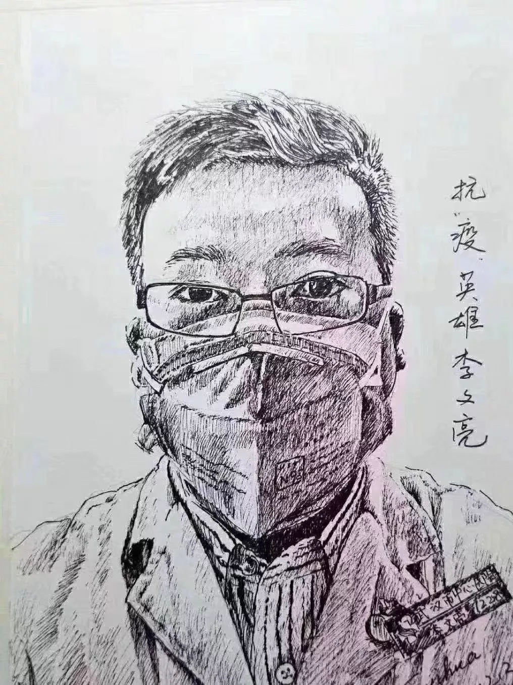

## 你听见这歌声了吗？

你是吹哨人。

你轻轻地吹了一声哨，

哨音不算优美，甚至有些刺耳，

但响彻东方。

 

今天，

所有的人都在纪念你。

都在向你致敬。

可是，

所有人都能明白你的哨音吗？

**能。**

**明白。**

 

一直在单曲循环这首歌。

听着听着，竟哭了；

一定是因为，

想起了你的哨音。

 

音乐链接：[https://www.youtube.com/watch?v=47E2tfK5QAg](https://www.youtube.com/watch?v=47E2tfK5QAg)

 

Do you hear the people sing?
你可听见人们的歌声？

Singing a song of angry men
他们唱着义愤者的歌

It is the music of a people
Who will not be slaves again
那是一个民族的呼唤
不再甘愿为奴的呐喊

When the beating of your heart
Echoes the beating of the drums
当你心跳激昂回荡
和着那战鼓声声响

There is a life about to start
When tomorrow comes!
我们将浴火重生
迎来明天的曙光！

 

Will you join in our crusade?
你是否也愿加入我們的征程？

Who will be strong and stand with me?
谁愿意坚定地站在我的身旁

Beyond the barricade
Is there a world you long to see?
跨越這些阻碍
你是否渴望看到一个新的世界？

Then join in the fight
That will give you the right to be free!
那么加入进来，一起并肩作战
实现自由的理想！

 

Do you hear the people sing?
你可听见人们的歌声？

Singing a song of angry men
他们唱着义愤者的歌

It is the music of a people
Who will not be slaves again!
那是一个民族的呼唤
不再甘愿为奴的呐喊

When the beating of your heart
Echoes the beating of the drums
当你心跳激昂回荡
和着那战鼓声声响

There is a life about to start
When tomorrow comes!
我们将浴火重生
迎来明天的曙光！

 

Will you give all you can give
你是否愿意奉献一切

So that our banner may advance
让我们的旗帜高举前进

Some will fall and some will live
将生死置之度外

Will you stand up and take your chance?
你是否愿意挺身而出？

The blood of the martyrs
Will water the meadows of France!
就让烈士的献血
浇灌出自由之花！

 

Do you hear the people sing?
你可听见人们的歌声？

Singing a song of angry men
他们唱着义愤者的歌

It is the music of a people
Who will not be slaves again!
那是一个民族的呼唤
不再甘愿为奴的呐喊

When the beating of your heart
Echoes the beating of the drums
当你心跳激昂回荡
和着那战鼓声声响

There is a life about to start
When tomorrow comes!
我们将浴火重生
迎来明天的曙光！

 

