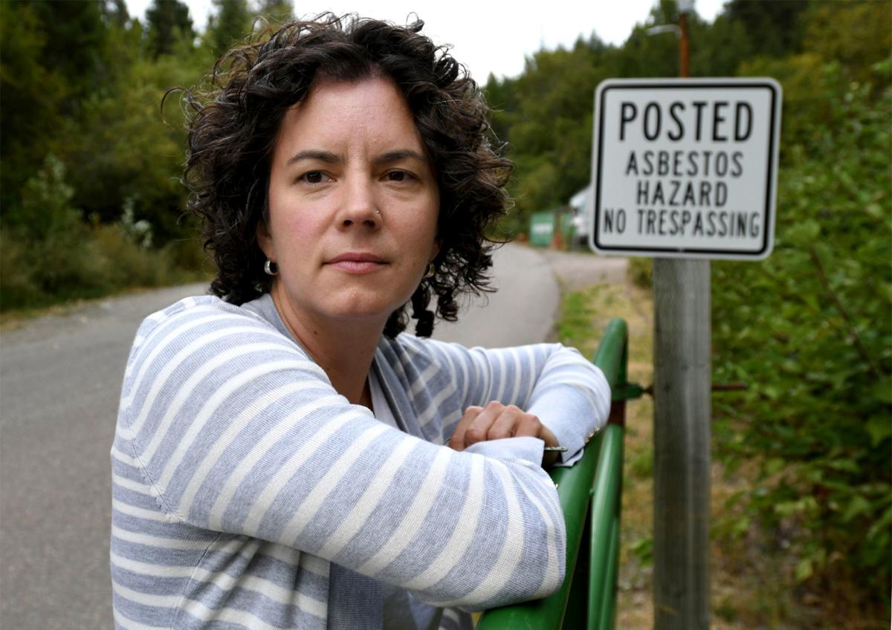
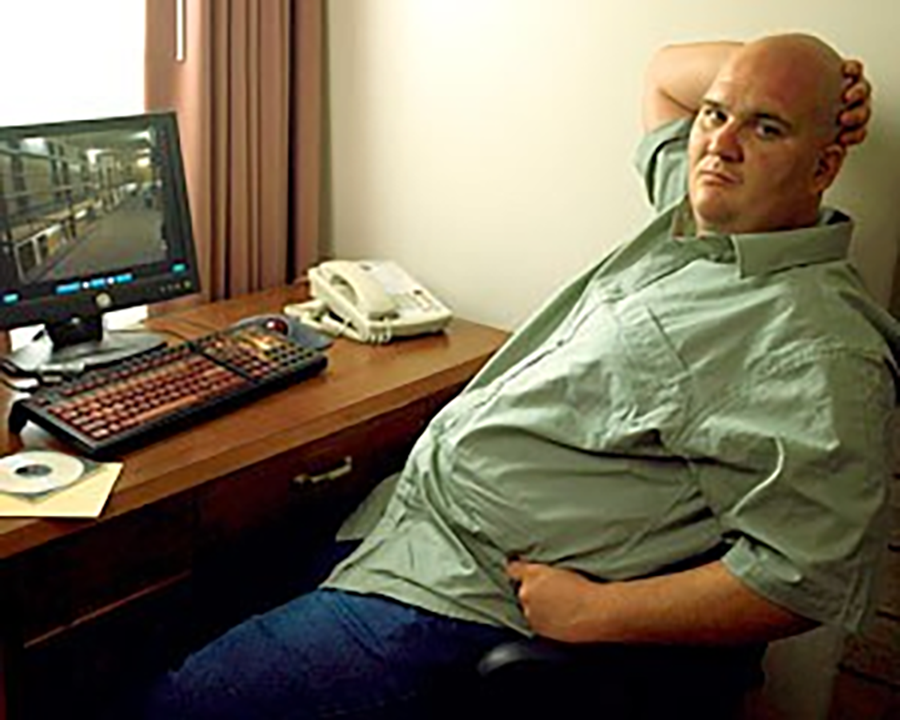
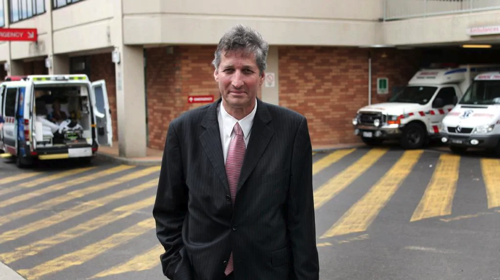
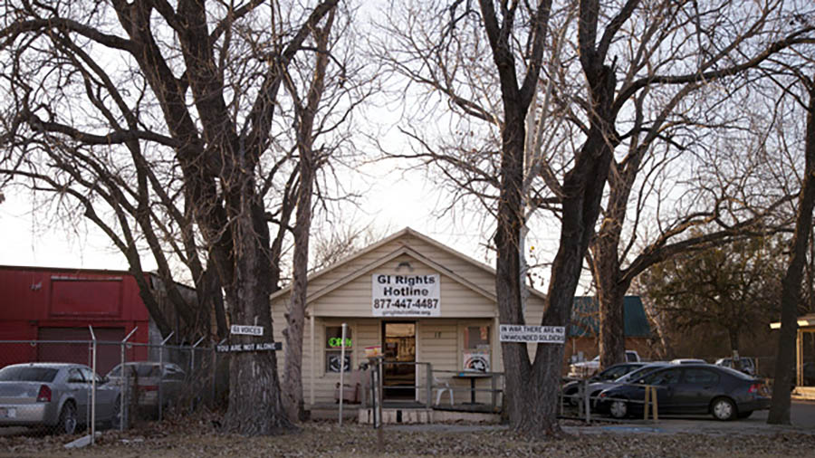
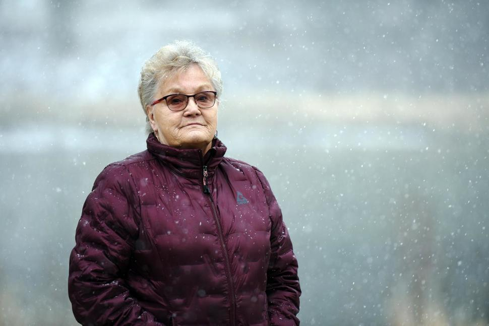
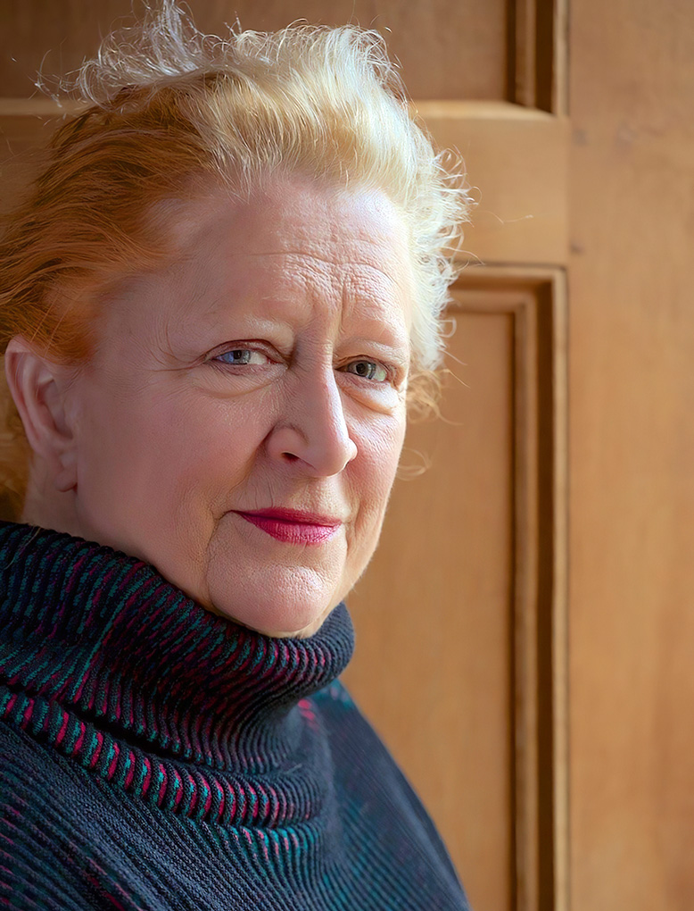
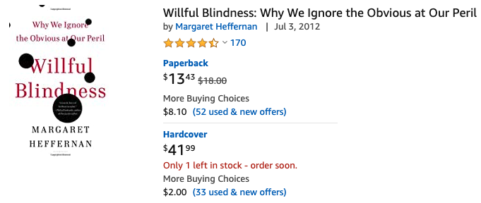

## 故意无视

这是一个 TED 的演讲。朋友推荐给我的。我希望能分享给更多人。

演讲的英文题目是：The Dangers of Willful Blindness，我直译成《故意无视的危险性》。不过，很多国内媒体把这个演讲的题目另取名为《她发现家乡死亡率奇高的真相，可大家都拒绝知道》。

**视频链接：[https://www.ted.com/talks/margaret_heffernan_the_dangers_of_willful_blindness](https://www.ted.com/talks/margaret_heffernan_the_dangers_of_willful_blindness)**

如果你没有时间看视频的话，以下是完整演讲稿。文字的中文翻译来自 TED 官方网站，我稍加润色，可能和视频中配的中文翻译稍有不同。

---

在美国的西北角，靠近加拿大边境的位置，有个小镇叫利比，位于蒙大拿州。那里有很多的松树和湖泊环绕，非常美的野生环境，数不尽的树木高耸入云。

那个叫利比的小镇，我曾去过，让人感觉有点孤寂，有点与世隔绝。

在这座蒙大拿州的小镇上，有一个非常不寻常的女人，名叫盖拉·本尼佛蒂（Gayla Benefield）。尽管她在那里几乎生活了一辈子，但还是觉得自己有点像个外来者。

她是俄罗斯后裔。她告诉我：上学时，她是唯一一个会选择机械制图专业的女孩。

后来，她找到了一份挨家挨户抄燃气表和电表读数的工作。

有一件事情特别地引起了她的注意。每天中午，她去小镇居民家中工作时，看到镇中很多男人，岁数差不多都是中年以上，都在用氧气瓶。这事让她感到很奇怪。

几年后，她的父亲就在马上要拿退休金的前五天去世了，享年59岁。他曾经是一名矿工。盖拉以为她父亲一定是因为工作过于劳累而去世的。

但是，又过了几年，她母亲也去世了。这看起来更奇怪了，因为她母亲家的人普遍都很长寿，看起来能长命百岁似的。盖拉的舅舅至今仍健在，而且正在学跳华尔兹舞。这不正常，盖拉的母亲不应该那么年轻就去世了。

盖拉一直对这些异常的死亡大惑不解。与此同时，她也想起了另一些事情。

比如，她记得当她母亲腿部受伤骨折时，在医院做了一大堆的 X 光检查，其中有两张是腿部 X 光检查，是正常的；但是另外六张胸部 X 光检查却显示异常。

她将自己和父母的每一个生活片段一点一点拼凑起来，试图理解她所看到的一切。 

她想到了她的小镇。

这个小镇有一个蛭石矿。人们用蛭石作土壤调节剂，能令植物长得更快更好；用蛭石作绝热材料封阁楼，大量的蛭石被垫在屋顶下为房屋保温，抵御蒙大拿州漫长而寒冷的冬季；蛭石被用于操场上、橄榄球场上、溜冰场上……

直到她开始着手研究问题所在时，她才发现：蛭石是一种毒性很强的石棉。

当她找到答案时，她开始竭尽所能地告诉每一个人发生了什么，以及在她父母身上发生了什么。她下午跑到别人家里，告诉那些依靠氧气瓶生存的人们这些真相。

但是，她非常惊讶。她本以为，当每个人知道真相后，人们会采取些行动。**但事实是，没有人愿意知道真相。**

她变得很气愤，以至于她不得不继续坚持要将真相告诉她的邻居们、朋友们、社区里的其他人们。

最后，那些人聚集在一起，做了一个大贴纸，贴在了她的车上。贴纸上面写道，“YES，我来自蒙大拿州的利比镇；NO，我没得石棉肺。”

但是，盖拉没有停下来。

她继续做调研。互联网的出现无疑帮了她大忙。她尽可能地要把真相告诉所有人。她不停地辩论。终于，当一位研究人员来到小镇研究小镇矿区的历史时，盖拉开始走运了。

她跟这位研究人员说了她的故事。最开始，像所有人一样，这位研究人员根本不相信她的话。但是当他回到西雅图，开始了自己的研究时，他发现盖拉说的是对的。

盖拉多了一位同盟者。

但是，人们依旧不想知道真相。他们总这么说：

**“如果真的那么危险，肯定会有人告诉我们的。”**

**“如果那真的能让每个人丧命的话，医生会告诉我们的。”**

有一些过去从事繁重体力工作的人说：“我不想当一名受害者。我不可能是一名受害者。**再说了，哪个产业不发生点事故呢？**”

但是，盖拉继续大声疾呼。最后，她成功地邀请了一个联邦机构来到小镇。他们对小镇的 1 万 5 千名居民进行筛查，最后发现：这个小镇的死亡率比美国其他地区高出了 80 倍！

那是 2002 年。甚至，在那个时候，没有一个人说：“盖拉，去孩子们的操场查一查吧，那里都是用蛭石铺的。”

 

这不是忽视。这是“**故意无视**”（willful blindess）。

“故意无视”是一个法律概念，指的是：**对于一个你能知晓或者你应该知晓的信息，你设法不去知晓。**法律认为你是故意无视——**你选择了不去知道。**

近些年有许多“故意无视”的案例。

在银行里，你能看到“故意无视”：成千上万的人们把按揭出售给那些根本付不起款的人们。

在银行里，你还能看到利率被操纵。虽然身边的每个人都清楚怎么回事，但大家都故意忽视这个事实。 

在天主教堂里，你能看到“故意无视”，孩子们几十年遭受虐待的事实被无视。

在伊拉克战争中，你能看到“故意无视”。

 

“故意无视”不仅存在于那些大的范围，它也存在于非常小的范围，在人们的家庭里，在人们的屋檐下，在社区里，而且特别是在组织和机构里。

那些被调研“故意无视”现象的企业们经常会被问到这样的问题：“工作中是否存在 一些人们不敢提出来的问题？” 

学者们对在美国的企业进行调研时，他们发现 85% 的人们会对这个问题回答“是的”。

**85%的人们知道存在一个问题，但是他们都选择沉默。**

当我将调研复制到欧洲时，问了人们相同的问题，我得到了完全一样的调研数字——85%。那么多的沉默。那么多的视而不见。

最有意思的是，当我到了瑞士的企业，他们告诉我“这是瑞士特有的问题。” 

当我到了德国，他们说“哦，是的，这是德国人的毛病。” 

当我到了英格兰，他们说，“哦，是的，英国在这方面是挺差的。”

真相是：**这是人类的通病。我们所有人，在某些情况下，都是故意视而不见的。**

 

调研结果显示：一些人视而不见是因为恐惧，他们害怕被打击报复；

一些人视而不见，是因为他们认为，看见问题是无用的，什么都不会改变。如果我们提出抗议，如果我们抗议伊拉克战争，什么都没改变，那我们干嘛要抗议呢？最好眼不见心不烦。

而且我总能反反复复地听到人们说 “你知道吗，那些看到问题的人，他们是吹哨人。我们都知道在他们身上会发生什么。”

 

有这么一套根深蒂固的说法围绕着吹哨人。

首先，人们会说他们全都是疯子。

但是，我在世界各地所见过的，交谈过的那些“吹哨人们”，他们事实上都是非常忠诚的，甚至经常是很保守的人。他们非常愿意献身于自己工作的组织机构。他们之所以站出来指出问题，之所以坚持他们所看见的，恰恰因为他们非常关心那个组织机构，希望能保持它的健康运营。 

其次，关于“吹哨人”，人们经常提到的是 “没有半点用，因为，你看看他们身上都发生了什么？他们被打压。谁愿意经历那样的遭遇啊。” 

但是，当我和那些“吹哨人”对话的时候， 从他们的语气中，我总能听到一种自豪感。 

 

我想起了乔·达比（Joe Darby）。

我们都记得阿布格莱布的照片（译者注：2004 年阿布格莱布监狱的美军虐囚事件），那些照片震惊全球，而且也向世人展示了伊拉克战争的一些情况。

可乔·达比其实是一名非常服从命令的好士兵。正是他，发现了那些相片，并把它们交了出来。

他说：“你知道，我不是那种爱打小报告的人。但是，有些事做得太过分了。他们都说眼不见为净。但是，我不能容忍这样的事。”

 

一位英国医生——史蒂夫·博森（Steve Bolsin），抗争了五年时间，试图警示人们关注一个谋杀幼童的危险的外科医生。

当我问他这么做的原因时，他说：其实是我的女儿促使我这么做的。有一天晚上，她对我说，“爸爸，你不能让那些孩子们死去。”

 

我想到辛西娅·托马斯（Cynthia Thomas），一位非常忠诚的军人的女儿，也是一名军嫂。当她看到她的朋友和亲人们从伊拉克战场上回来，她非常震惊于他们的精神状况，以及军队拒绝确认和承认他们患上了“创伤后压力综合症”。

于是她在驻军的小镇上开办了一个咖啡厅，为这些人提供法律，心理，和医疗援助。

她对我说：“你知道吗，我过去总说我不知道我长大了要做什么。但是，通过帮助他们，我找到了自己，我将因此而永远不一样了。”

 

今天，我们都享受着如此多的，来之不易的自由：写作和出版的自由，我上次来匈牙利时，这种自由还不存在呢；选举的自由，特别是妇女们为之奋力争取的自由；不同的种族，文化，和性取向的人们可以依照他们渴望的生活方式生活的自由......

但是，如果你不使用的话，自由就不存在。

那些吹哨人们，那些像盖拉·本尼佛蒂一样的人们，他们所做的，正是使用他们所拥有的自由。而且，他们已经充分意识到——是的，我会面对争议；是的，我的邻居，我的同事，我的朋友们都会反对我。但是，在这场冲突中我会变得非常好，我要去迎接那些反对者，因为，他们将使我的辩论更完善，更强大。我能和我的反对者们合作，把我所从事的事情变得更好。

这些人都有着巨大的持久力，超强的忍耐力，和绝对顽强的决心。他们拒绝视而不见，拒绝沉默。

 

当我到了蒙大拿的利比小镇，我参观了由盖拉·本尼佛蒂促成所建立的石棉沉滞症诊所。起先，一些人希望得到帮助和医疗关注时，他们都从诊所的后门进去。因为他们不想承认盖拉是正确的。

我坐在一家小餐馆，看到卡车在高速路上来来回回，将花园中的土挖出来，运走，然后填埋上新的、没有污染的泥土。

我 12 岁的女儿和我一起去的， 因为我很想让她认识盖拉。

她问我：“为什么啊，这有什么了不起的？”

我说：“她不是电影明星。她不是名人，也不是专家。而且盖拉自己也说自己不是圣人。

**盖拉的闪亮之处，就在于她的平凡。**她和你一样，也和我一样，她拥有自由，并且已经准备好去使用它。”

老年时的盖拉·本尼佛蒂（Gayla Benefield）

 

---

**P.S.**

这个 TED 演讲的演讲人，名叫玛格丽特.赫弗南（Margaret Heffernan）。

她是一名企业家，也是一名作家。她曾经在英国广播公司（BBC）任职十三年，参与制作过很多高质量的电台或者电视节目。后来，她担任 InfoMation，ZineZone，iCast 等多家公司的高管。

格丽特.赫弗南写过六本书。她的第三本书，就叫《故意无视》。通过书名，你也能看出来，这份演讲，是这本书的一个“超级精简版”。

这本书曾经被《金融时报》评为近十年最重要的商业书籍之一。

很可惜，据我搜索，这本书并没有中文版。感兴趣的同学，可以找一找这本书的英文版。

转载这个演讲，无他，因为无论是演讲中提到的盖拉·本尼佛蒂（Gayla Benefield），乔·达比（Joe Darby），史蒂夫·博森（Steve Bolsin），辛西娅·托马斯（Cynthia Thomas）；还是这个演讲的作者玛格丽特.赫弗南（Margaret Heffernan），都深深震撼了我。

**他们，是这个世界上最酷的人。**