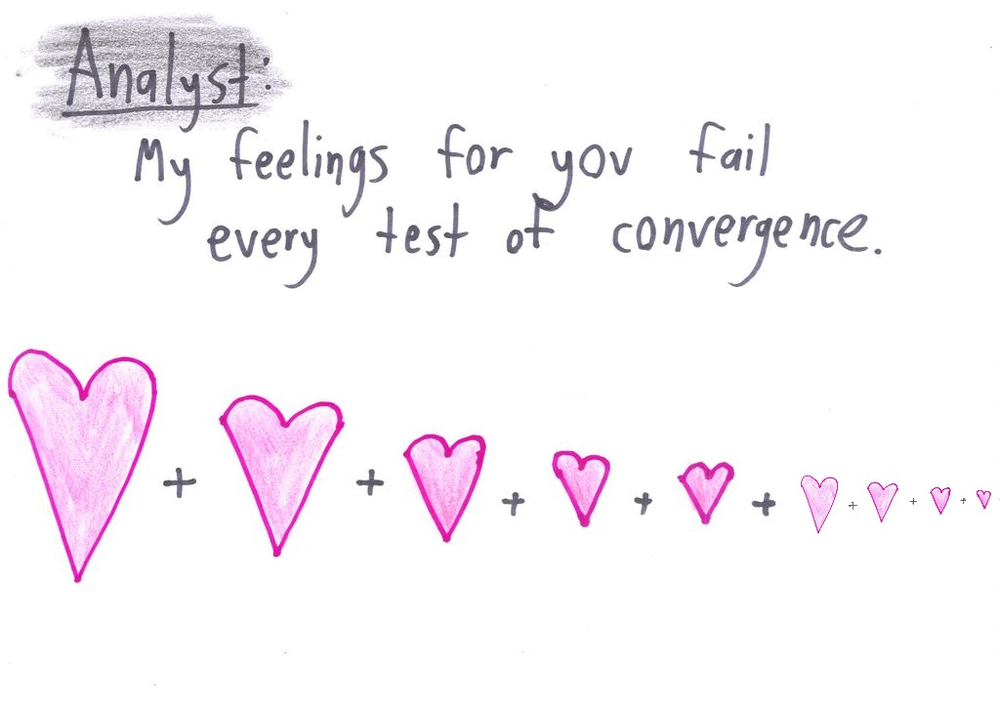
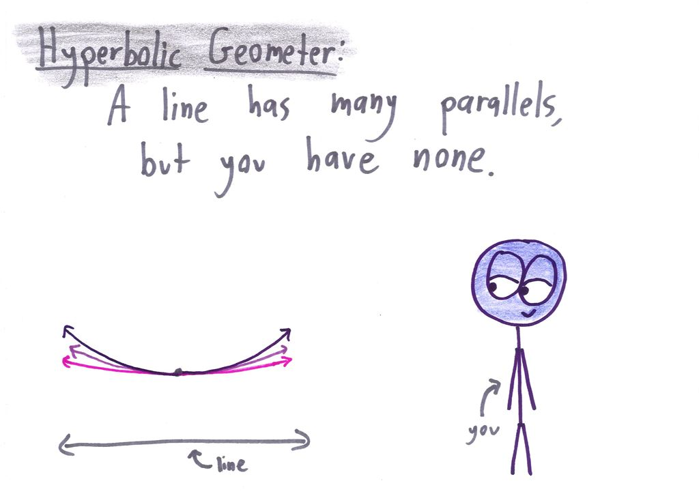
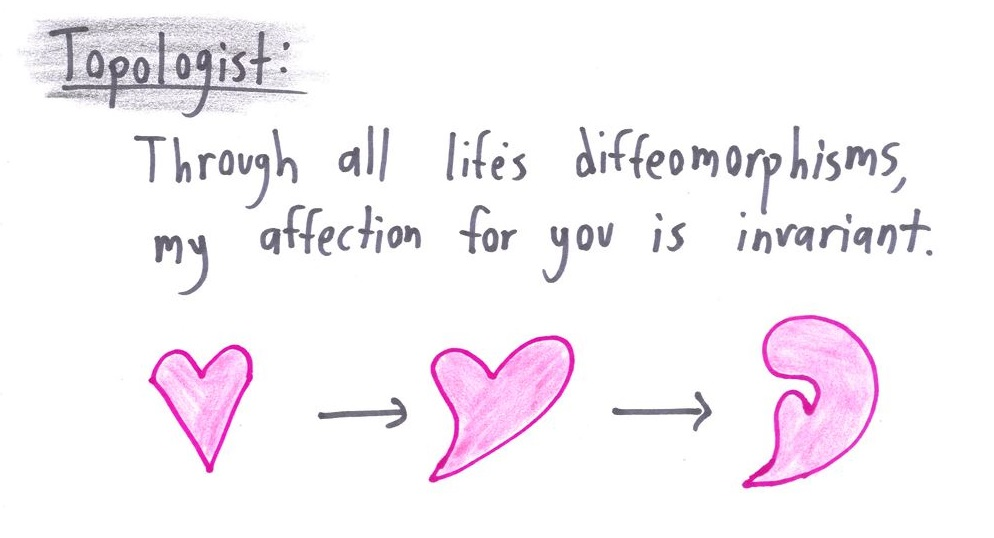
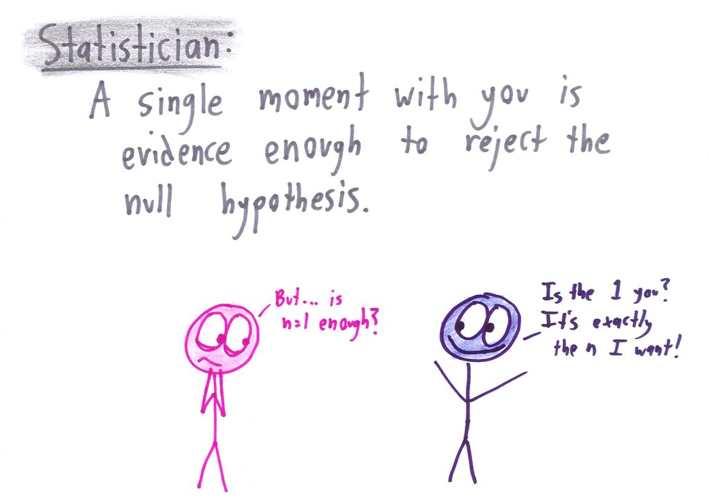
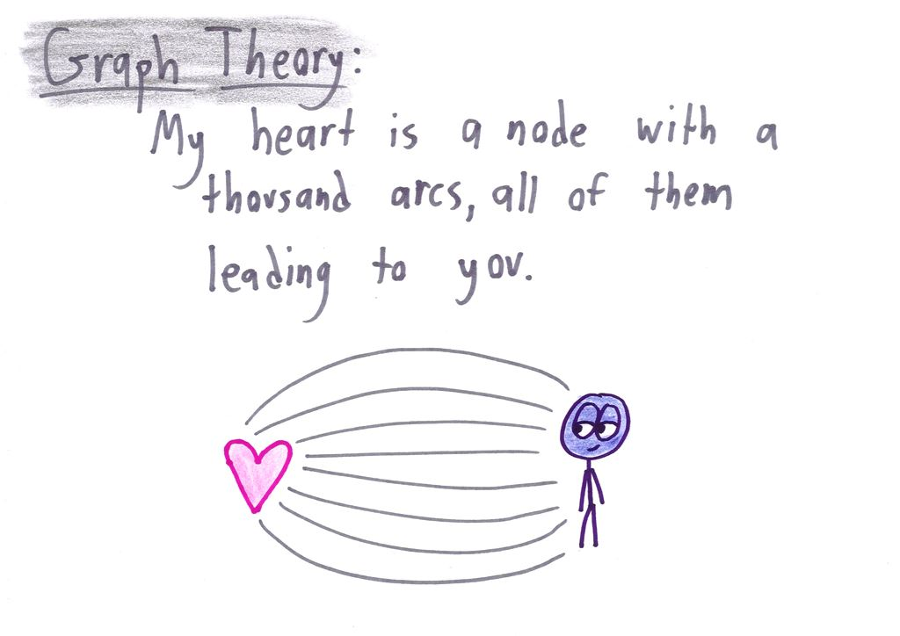
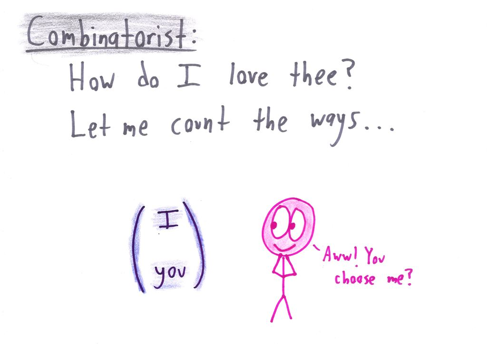
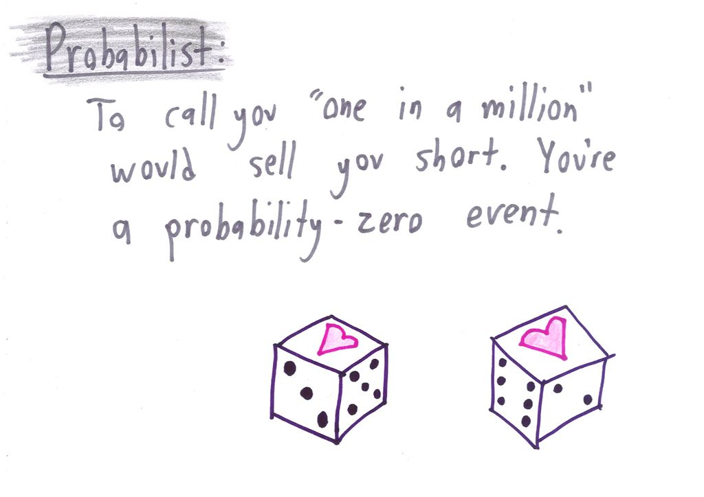
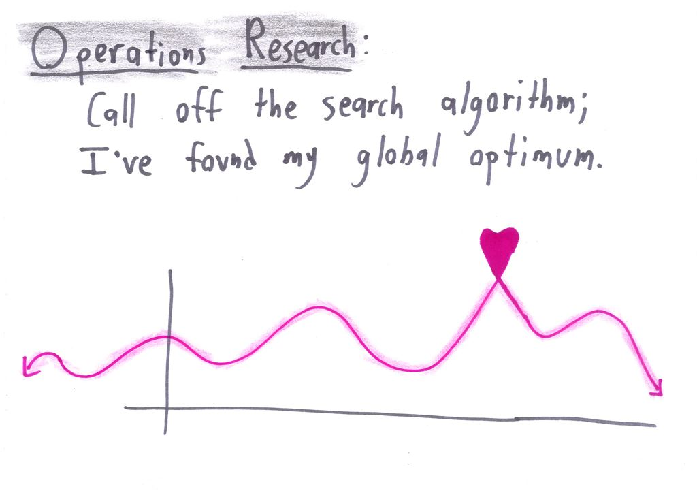
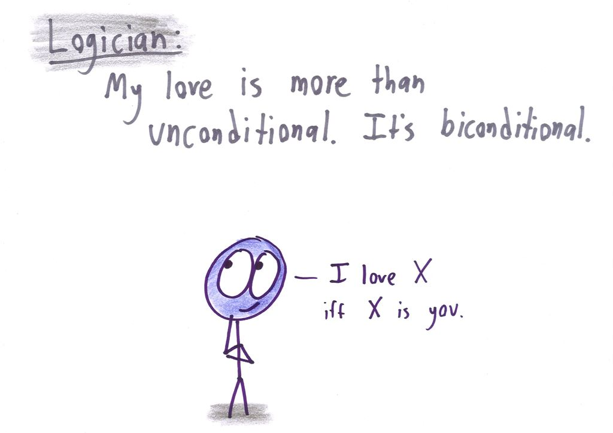
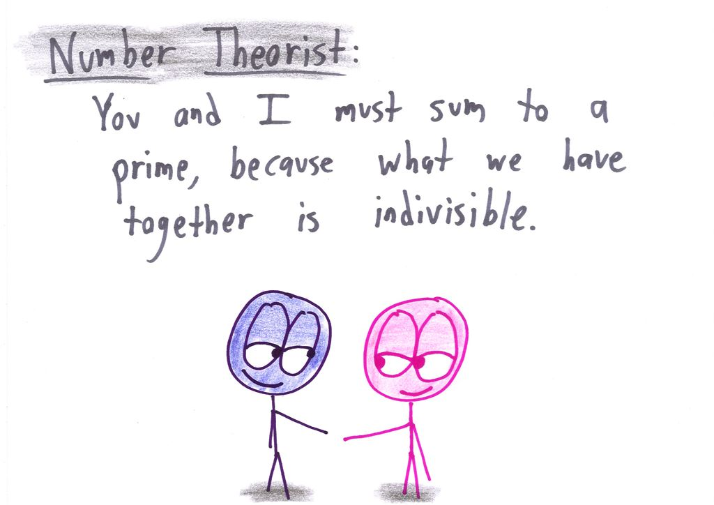

## 数学家的情人节

今天是情人节。

如果你是一个理工控，想用一个不一样的方式和自己喜欢的人表白，可以尝试一下这篇文章中的方法：）

来自美国的 Ben Orlin，在他的个人博客上分享了一系列图片，来告诉你：**如何用数学的方式，和他/她表白。**

下面的中文翻译是我随便写的，仅供参考。

---

**数学分析**

翻译：我对你的感觉，一直无法收敛。

 

**双曲线（解析几何）：**

翻译：一根直线有无数条平行线，但是没有任何一根线和你平行。（没有任何人能和你比拟）

 

**拓扑学：**

翻译：虽然世界上的一切都可以是微分同胚的，但是我对你的爱是不变的。

 

**统计学：**

翻译：和你在一起哪怕一小会儿，都足以让我拒绝掉零假设。

 

**图论：**

翻译：我的心是一个节点，从这一点出发，有成千上万条边，指向你。

 

**组合数学：**

翻译：我有多爱你？让我数一数...

 

**概率论：**

翻译：用“万里挑一”形容你绝对是对你的低估。你是一个“零概率事件”。

 

**运筹学：**

翻译：取消所有的搜索算法吧，我已经找到了属于我的全局最优解。

 

**逻辑学：**

翻译：我的爱绝不仅仅是无条件的，更是逻辑双条件的。（充分必要）

 

**数论：**

翻译：我和你加在一起，结果一定是个素数。因为我们在一起，无法被分割。

 

**祝天下有情人终成眷属。**

纵使有疫情，也不能忘记爱。

祝大家情人节快乐！：）

 

**武汉加油！湖北加油！中国加油！大家加油！**