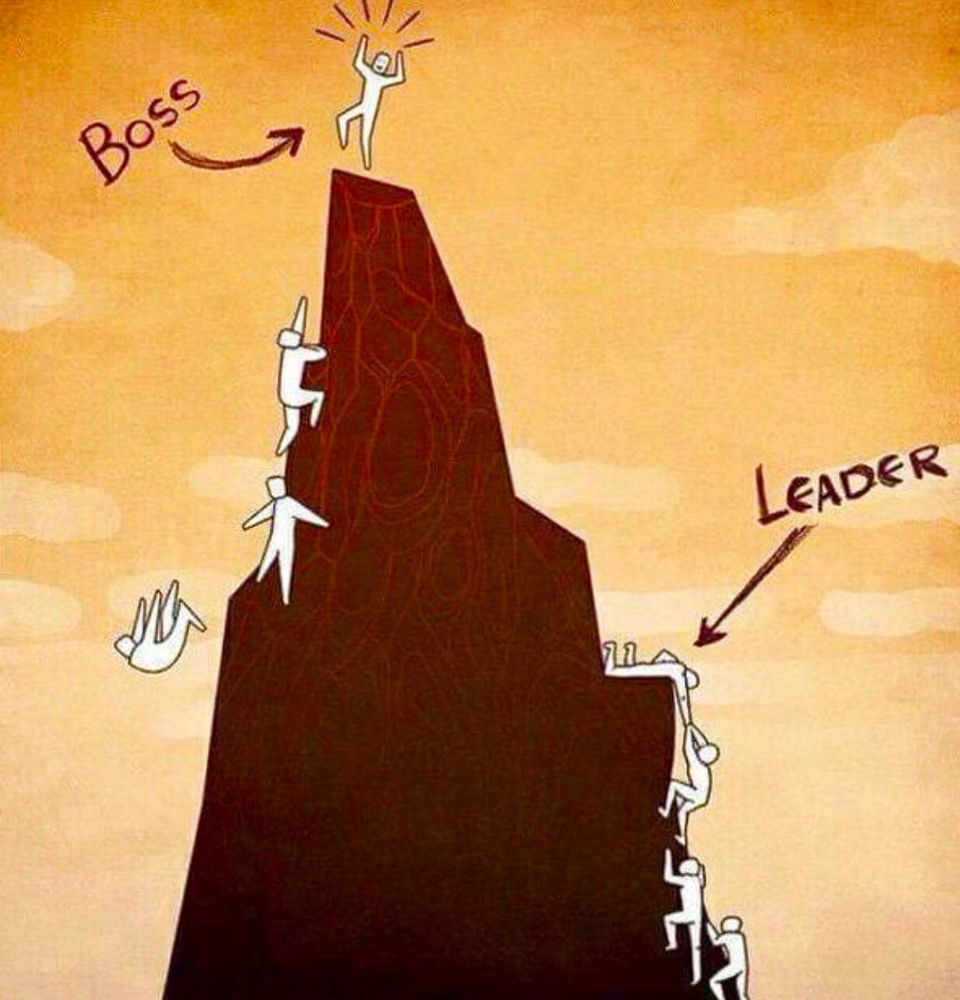

## 从技术，到管理

这是在我的知识星球上，一个同学问我的问题。

> bobo老师，作为一个团队的技术leader，如何才能管好整个团队？如何带领一个团队？
>
> 感觉团队中的成员执行力有点差，理解能力有所欠缺，学习能力也一般，怎么把手里的普通牌打好呢？

 

我觉得这是一个很有代表性的问题。很多同学在技术岗位上，慢慢做到了管理岗，但会觉得无所适从。

为什么会这样呢？因为技术岗和管理岗面向的对象截然不同。

对于技术岗，我们面向的对象主要是代码。我们要做的事情，是让代码能够满足需求，解决问题。为此，我们学习各种语言的语法，逻辑的编写规则，性能的优化方式，等等等等。

但是，**当我们走上了管理岗之后，我们面向的对象，变成了人。**我们要做的事情，变成了要让人，能够满足公司或者部门的需求，解决问题。

 

很多时候，当我们没有在管理岗的时候，会觉得似乎管理很轻松：不就是指挥别人干事儿嘛？

但是，当我们一旦走上管理岗，就会马上发现，问题没有那么简单。

**就好像代码天生不会完成任务一样，大多数人也是天生不会完成任务的。**

代码可能语法错误，可能逻辑崩溃，可能性能不优，可能设计不够灵活，无法满足经常变动的需求，越来越臃肿，组织越来越混乱......

这些事情，在人身上也会发生。就是这位同学提问中说的：执行力差；理解能力欠缺；学习能力也一般......

怎么办？

**实际上，解决这些困难，处理这些问题，恰恰是管理者的任务。**

 

团队成员的执行力差？或许是因为目标不够清晰；或许是因为计划不够明确，不够合理；或许是因为团队成员的动力不够足；或许是因为反馈不够到位。

提供目标，制定计划，给予反馈，激发动力，这些都是管理者的职责。

团队成员理解能力欠缺？或许是对于整个团队成员需要理解的内容，管理者的表达不够清晰。

管理者必须不断总结自己到底想让团队理解什么，团队又可能错误地理解了什么，然后不断改进自己的表达，明确自己的目标，让团队成员做到自己心目中的理解。

团队成员的学习能力差？或许是管理者需要更加明确自己希望团队成员学习什么？学习到何种程度？达到何种目标？进一步明确考核的方式，激励的措施以及惩罚的措施。让团队成员更有目标，更有动力的去学习。

所有的这些，都是管理者的职责。

 

管理者不能指望自己的团队成员天生执行力超强，理解能力超高，学习超级主动，对于所有的任务，都可以准确无误，保质保量地完成。

如果是这样的话，大多数管理者的工作没有意义。

**管理者的核心任务，恰恰就是：让执行力差的成员执行；让理解能力差的成员理解；让学习能力弱的成员学习。**

 

管理是另外一个学科，有无数的学者，企业家，高层管理者，在不断地研究这些问题。

就好像计算机是一个专门的学科，我们为了能够顺畅地让代码帮助我们解决问题，我们需要专门的学习。

同理，管理者为了能够顺畅地让形形色色的人帮助他们解决问题，也需要专门的学习。

上面的叙述中，已经提及了很多具体的方向，比如“激励”，就是每个管理者都必须面对的问题。大家可以简单搜一搜，无论是股权激励，还是薪酬激励，或者是绩效考核，都有很多专门的书籍资料论述。

对于这些具体的方向感兴趣的同学，可以看一看各个高校的管理学院所设计的各种课程，也可以多翻翻管理类的书籍杂志所探讨的各种问题。

 

但是，对于很多刚刚从技术转型到管理的同学来说，可能最需要逾越的鸿沟，是**沟通**。

当然，管理者的任务不仅仅是沟通。做出决策，指明方向，提供解决方案，制定目标，凝聚团队，即时反馈，激发动力，这些统统都是管理者的任务。

但是，**沟通是最重要的管理手段。**

只有通过沟通，管理者才能了解团队成员在想什么，遇到了什么困难，当前项目的人员在执行上的具体问题在哪里。也只有通过沟通，管理者才能将自己期望的目标和要求传递给所有团队成员。

这就好像编写代码是最基本的手段一样，不管我们是要做工程架构调整，还是性能调优，亦或满足新的需求，技术的世界里，最终目标林林总总，但我们最后都要落实到编写代码这一手段上来。

因为管理的主要对象是人，要想和人打交道，就要通过不断的沟通。所以，你会看到，大多数管理者都在不停地开会，不停地打电话，不停地发邮件，就是这个原因。

至于能否高效沟通，这是另外一个问题。但是沟通在管理中的意义，怎么强调都不过分。

很多优秀的技术人员，自己埋头苦干惯了，很容易忽略沟通的意义。他们会不自觉地认为，所有的团队成员都应该和自己一样，努力学习新技术，日以继日地为公司解决技术问题。

这个假设是不正确的。

大多数人并没有方向，大多数人希望自己的管理者能够为自己提供方向。对大多数人来说，这才是自己的“老板”存在的意义。如果没有沟通，很多人觉得自己的“老板”什么事情都不干；“老板”也觉得自己的员工什么都不干。时间长了，团队的凝聚力就没了。

 

对于如何沟通，这又是一个大话题。大家可以看到市面上有很多著作，都在讨论这个问题。

但是，在这里，我要强调管理的另外一个和具体技术截然不同的特征：**没有一定之规。**

我在我的文章[《吴军说的基因论，到底有没有道理？》](../../2019/2019-07-20/)一文中，曾经举过这样一个“经典”的商业案例：

 

美国作为一个“车轮上的国家”，汽车产业一直很发达。大名鼎鼎的福特汽车众所周知，加上通用和克莱斯勒，这些车企塑造了美国上世纪汽车产业的辉煌。而底特律，则是那个时代的“硅谷”。

但是上世纪六七十年代，日本车企大举进入美国市场，竟然逐渐蚕食掉了美国汽车品牌的市场份额。

为什么？因为质美价廉。

但是，要知道，当时的日本，还是战败国的身份，经济体量也和美国相差甚远。日本怎么做到这一点的？

这里面，原因有很多，大家如果随便在网上搜一搜，就能搜到这个案例，基本上是任何一个 MBA 学生必学的经典案例。

这些原因中，有一个原因，我特别感兴趣。

以自由民主为傲的美国人，平时自由散漫惯了，管理成本很高，再加上很多人有吸毒的恶习，经常旷工，根本无法实施精细化管理。

相较而言，日本人以集体主义精神为主，更加重视自己的工作，也更加服从上级管理，勤勉，肯吃苦，这就使得丰田等车企的效率奇高。

大家可以想想看，面对两种完全不同性格的员工：美国人和日本人，管理方式显然应该是不同的。

这种不同，需要深入到企业的每一个角落：从薪酬制度，到组织结构；从绩效考核，到沟通方式；甚至是办公室的布置和具体语言的措辞。

这种不同只有在美国人和日本人这样不同的民族之间才存在吗？显然不是。

 

管理私企和国企，显然不同；

管理低端产业和中高端产业，显然不同；

管理高学历人才和低学历人才，显然不同；

管理不同的领域，方法都不同；

即使是同一个领域，管理 Google 和百度，应该很不一样；

就算都在 Google 内部，管理研发部门和业务部门的方式，也不一样；

就算都是研发部门，管理探索性的研发部门和已经稳定盈利的研发部门，方式应该不一样；

就算都在同一个具体的组里，管理你和我的方式，还是有可能不同。

 

这就是管理复杂的地方。管理没有一定之规，需要灵活应变。**实施好的管理，需要管理者有相当深刻的底蕴，对文化的深入理解，以及对人性的洞见。**

一名中国优秀的工程师，可以到美国来做工程师；

一名美国优秀的外科医生，也能到中国的医院来做手术；

唯独管理这件事，一个在中国成功的管理者，近乎一定无法胜任一个美国的管理岗位；反之亦然。

或许，这就是管理者能拿高薪的原因。他是如此的重要，指挥整个团队一起前进；又是如此的困难，需要面对相当多的不确定性。

 

尽管如此，对于管理来说，一个大的原则还是有的。

是什么？就是一名好的管理者，一定是在**服务团队成员**的。

你可能会决策失误，也可能会不小心说错话，但只要你的所有行动，都围绕着“服务团队成员”而展开，那么，大概率的，你的团队不会太差。

 

最后这张图是题图，希望每一个人都能从中看出些什么。

 

**大家加油！**