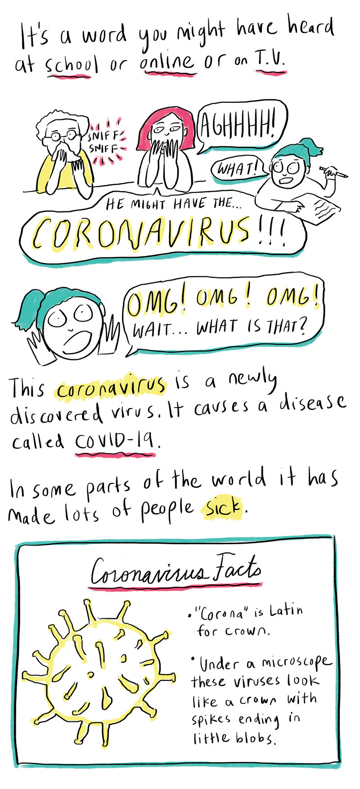
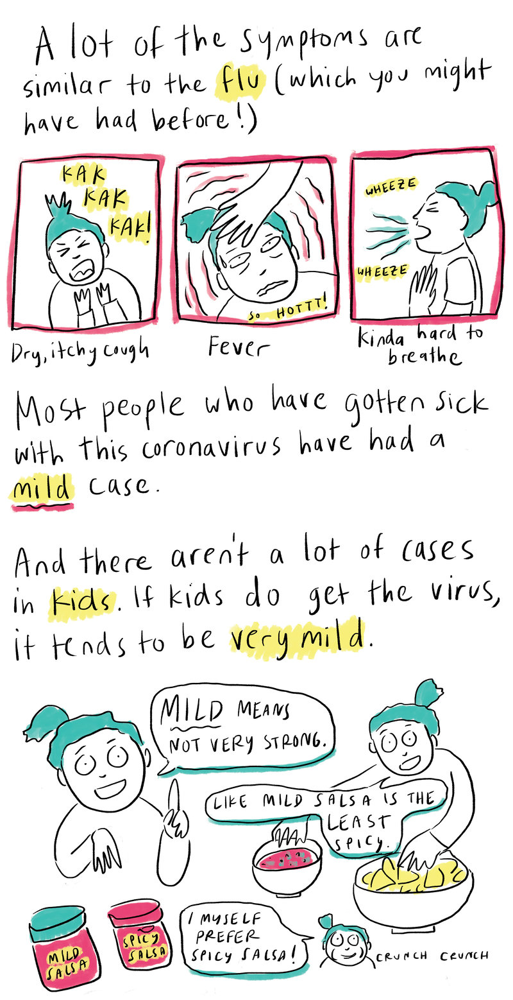
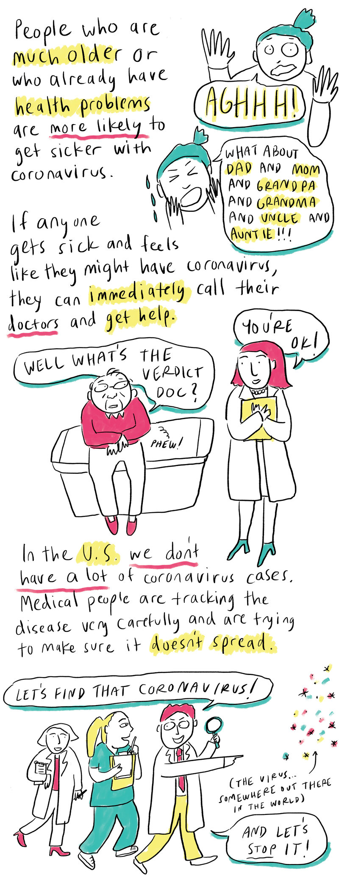
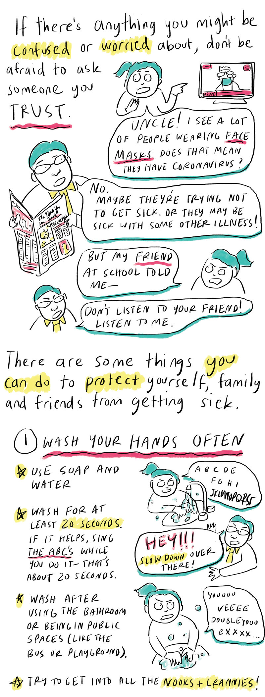
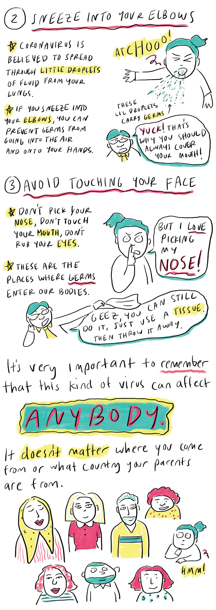
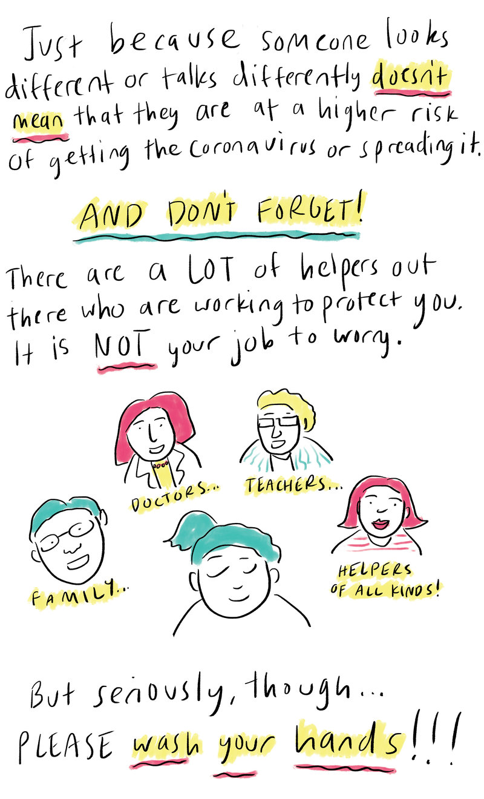

## 为了抗击疫情，Coursera 推出了一个活动

这篇文章转载的是美国的国家公共电台（National Public Radio，简称 NPR）在昨天发布的一个漫画。

这个漫画是给小朋友们看的科普新冠病毒知识的漫画。其实，大人们看起来也是很有意思的：）

现在，新冠病毒在美国愈演愈烈，看来，美国全民都要动员起来，科普起来了。

漫画中也反映了一些美国的真实情况，比如检测试剂盒严重缺乏。至于态度倾向，那每个人读出来的滋味就不一样了。

漫画的文字是英文的，大人也可以周末闲得没事儿读一读，权当锻炼英语了：）

好啦，各位大盆友小盆友，带你了解新冠病毒的旅程，开始啦！

---

 

P.S. 

今天是美国的 2 月 29 日，忍不住露个脸。毕竟，下一次这个日子再见，就是四年后啦！

**大家加油！**