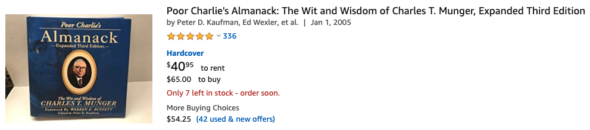

## 如何建立属于自己的知识体系？秘诀在这里

> 波波老师你好。我今天在看慕课网的实战课程视频时，发现老师讲解知识内容非常系统，而且深入。我之前也自己学习过相关的内容，但是感觉学的知识点很零散而且不深入，想把相关的知识点整理形成体系却不知从何入手。
>
> 我想知道为什么会产生这样的差异？老师是通过什么样的方式去学习，并整理自己的知识体系，然后再去教授别人的？我如何学习才能做到这一点？
>
> 期待老师的回复。

 

---

**bobo 老师的回答：**

我的回答可能要让你失望了。简单来说，我觉得并没有什么特别的秘诀。

如果一定要说“秘诀”的话，下面几点，可能会对你有启发：

 

**1）学习一个领域，看一本书是不够的。**

这一点，我在我的文章 [《高效学习的秘密》](../../2018/2018-04-18/) 中强调过。

以算法为例，我看过的书，妥妥在 10 本以上。从不知名的国内算法教材，到《算法4》《算法导论》《算法手册》这样的经典；从《编程珠玑》《编程之美》这样的“休闲读物”，到 ACM 训练题大全。

我一直认为，从不同的角度，去看同样的知识，特别特别重要。这将帮助你更加全面地了解一个知识点。

我曾经以为，只有学习文科需要这样。但十几年的计算机学习经验告诉我，学习理工科也应该如此。

只有通过大量的阅读，不断地对比，才能发现不同书对同一个知识点介绍的区别；

看不同的例子，不同角度的阐述，才能促使自己开始真正思考：每一个知识点的核心到底是什么。

就比如《算法4》吧，大家都说它是经典，我当然承认他非常非常经典。事实上，《算法4》的作者 Robert Sedgewick 是我的偶像。

但是，我认为《算法4》也是有很多很多缺点的。有机会我会写一篇公众号文章，说说我认为《算法4》的缺点是什么。

我的这些看法，来自于大量阅读其他算法书籍后，做出的对比，以及自己的总结思考。

不过，我完全没有黑《算法4》的意思。瑕不掩瑜，《算法4》很经典，甚至绝对是数据结构入门的最佳教材。

在我上本科的年代（15 年前），大多数学校都是用严蔚敏的《数据结构》做教材，但清华的姚班就是拿《算法4》做教材。

在这里，我只是举例说明，如果大家觉得我对知识的理解更深入的话，这种深入的理解，可能只是来自大量的接触与学习而已。

 

**2）多总结。**

我看书的时候有一个习惯：每看完一个小部分，就尝试用一两句话总结，这一小部分到底在讲什么。

其实，这就是小学语文题中的归纳段落大意或者概括文章的主要内容。我现在非常感谢在我接受的初等教育中，包含大量这样的语文训练。

在这个时代，我看到很多同学读书的时候做思维导图。我觉得也可以，其实是一个意思。

只不过我觉得做思维导图太“炫”了。我也尝试过，但发现需要顾及的东西很多，什么用怎样的图表示，线条用什么颜色，分多少级，怎么布局好看，等等等等。对我来说，这些东西太容易分散注意力了。当然，也可能是因为我不太会做思维导图。

我比较懒，在心里总结一遍段意，觉得就够了。

 

值得一提的是，我看书也不爱做笔记，可能也是因为懒，除非是应考复习。不过我已经有近十年不考试了，所以我也已经有近十年看书不做笔记了。

**我不太害怕忘记，因为我觉得遗忘是很正常的事情。**有很多同学问我看书看完了就忘怎么办？我的回答就是：**再看一遍。**

忘记了然后再看一遍，再总结一遍，也就加深印象了，下次就不容易忘了。就这么简单。

这个重复的过程，就是学习。

**重复**是学习的一大秘诀，所谓**万事无他，唯手熟尔。**

 

扯远了，说回总结。

看一本书的话，应该能总结出一本书的“体系”：这本书在按照什么思路介绍这个领域的知识？然后再细化进去，每一个知识点具体是什么。

所谓的把书从厚读薄。而不能读完一本书，只记住一堆零碎的知识点。

好的书，作者在写作的时候，会在字里行间流露出自己的写作逻辑：章节为什么要这么安排？每一部分都在处理什么问题？这些问题是如何有机地联系起来的？

但即便如此，我们在读的过程中，还是会不自觉地深入到细节里，很容易只见树木不见森林。这是正常的。

所以，每隔一段阅读学习时间，应该有意识地把自己从细节中抽离出来，站在更高的地方，再看一下全局：我学习到了哪里？这里在整个领域中是什么位置？

当然，我并不认为读什么书都要这样做，那样太累了。我一般只有读教材的时候会强迫自己这么做。

可是我发现，我现在读书养成了这样的习惯。有的时候读小说，读完一章，会不自觉地想：这一章都发展了什么情节？不同的人物有了怎样的变化？作者有可能在布怎样一盘“棋”？

 

**3） 尝试给别人讲。**

我上学的时候，特喜欢给别人讲题。我发现，给别人讲，提高得特别快。

这一点，相信很多人都懂，所谓的 **learning by teaching**。

所以，大家可以尝试把自己学习的目标定成：能给别人讲出来。

通常，一旦要这么做，就会发现：会开始不自觉地思考“知识体系”这样的问题了。

不过，这个目标其实是挺高的一个目标。以算法为例，理解一个算法，能写出一个算法，和把一个算法讲明白，区别还挺大的。

但是，大家不妨平时有机会做一下这样的练习。毕竟，**在职场上，表达能力也是非常重要的一项技能。**

我在 [从技术，到管理](../2020-02-18/) 一文中曾经说过：很多时候，大家在职场往上走的过程中，拼的就是表达能力。

这不是说要让大家油嘴滑舌，只说不做。而是简洁清晰有效的表达，才能让你的领导，你的下属，你的合作伙伴，更理解你的思考，你的愿景，你的苦衷，才能让合作更加有效。

毕竟，人类社会能发展到今天，我们站在地球食物链的绝对顶端，一个最重要的原因，就是我们可以进行极大规模的合作。而这种规模的合作之所以能够产生，就是因为人类发展出了丰富得吓人的语言系统。

其实，我现在写公众号文章，很大一部分原因，也是想锻炼自己的表达能力。

一个问题，自己明明觉得想明白了，却不能恰如其分地表达出来，实在是一件让人很捉急的事情。

我也会遇到这样的情况，我也很捉急，所以我也会经常思考：这件事儿到底要怎么表达才好？

我还在练习，还在探索。

 

---

上面我说了三点，简单总结就是：1）多看；2）多总结；3）多表达。

我认为这三点是有先后顺序的：

1 > 2 > 3。

 

大量的阅读，大量的学习，最重要。即使你看书并不擅长总结，但是在大量接触的情况下，不自觉也能慢慢形成自己的体系。

所谓熟能生巧。

反之，如果只按着一本书看，再怎么精心总结，最后也不过是那一本书的体系而已，这是有局限性的。

 

至于给别人讲，看似是很好的方法，但这是建立在大量学习，深入总结的基础上的。

我们完全可以只是在网上随便查一查，就去给别人讲。实话实话，这也是锻炼表达能力的。但恐怕这样做，对知识的掌握不可能深入，更不用说形成属于自己的知识体系了。

这样做，复述一遍可能还行，但要是听者随便问几个问题，马上就会觉得力不从心，露出马脚。

 

这让我想起一个笑话。

这个笑话是查理芒格在 2007 年 USC 法学院的毕业典礼上讲的。

普朗克在获得诺贝尔物理奖之后，经常受邀去各个学府演讲。他的司机每次都跟着他，反复听同样的内容。

一次，他的司机说：“普朗克教授，我们老这样也挺无聊的。不如这样吧，到慕尼黑，让我来讲，你戴着我的司机帽子坐在前排，怎么样？”

普朗克同意了。

于是，在慕尼黑，司机走上了讲台，滔滔不绝地对量子物理进行了一番演讲。和普朗克讲得一样精彩。

演讲结束以后，一位教授提了一个非常专业的问题。

站在台上的司机说：“哇，我真没想到，我会在慕尼黑这么先进的城市遇到这么简单的问题。我想请我的司机来回答。”

 

讲完这个笑话以后，查理·芒格说：**知识有两种，一种是真正的知识；另一种是知识的表演。**

许多人，其实并没有掌握真正的知识，而是像普朗克的司机一样，只是学会了表演。

这种表演，对当事人，并没有任何帮助。

如果一味地盲目追求“给别人讲”，可能很容易陷入到这种“知识的表演”中。

所以，纵使现在很多人都提倡把学到的知识讲出来，我还是将它的优先级放在大量学习和深入总结之后。

在我看来，学习和总结，是讲出来的重要前提。甚至，对于很多表达能力比较强的人来说，**能讲出来，只不过是学习和总结的自然而然的结果而已。**

 

最后，随便聊一聊查理芒格。

查理芒格是巴菲特的重要合伙人，今年已经 96 岁高寿了。

巴菲特回顾自己投资成就时说：“我之所以能有现在的成就，是因为遇见了查理芒格。”

查理芒格的经历比较简单。他出生在美国内布拉斯加州的奥马哈，小时候给巴菲特的祖父老巴菲特的杂货店打过工。

他在哈佛法学院荣誉毕业，做了几年律师，然后不干了，搞起了投资。命运让他和巴菲特走在了一起，成为了一名超级投资者。

查理芒格的偶像是美国开国元勋本杰明.富兰克林。对，印在面值 100 元美钞上的那位。

富兰克林有一个笔名，叫穷理查（Poor Richard）。注意，是理查，不是查理；是 Richard，不是 Charlie。

在 1732 年到 1758 年期间，富兰克林使用这个笔名，创建了一份类似杂志的读物，叫《穷理查年鉴》（Poor Richard's Almanack）。

富兰克林没受过什么良好的教育。但是《穷理查年鉴》的文章，全部是他自己写的。

他的写作水平不太好，至少他自己觉得不好。所以，他就把他欣赏的文章找来，模仿其写法，反复练习。

富兰克林不走捷径，用的是笨办法，但是十几年后回头看，却是大智慧。**所谓伟人，大多如此。**

芒格如法炮制，把自己的人生经验和投资心得也放到了一本书里，叫《穷查理宝典》。

其实，这本书的英文名是 Poor Charlie’s Almanack。大家可以看到，这本书的名字其实就是富兰克林的 Poor Richard's Almanack 这个名字，将中间的 Richard 替换成了 Charlie。

芒格在用这种方法，向自己的偶像致敬。

因为这只是一本书，而不是一份持续很长时间的“杂志”，所以在中文翻译上，最后变成了“宝典”，而非“年鉴”。

 

芒格在自己的母校加州理工大学和哈佛大学，受邀作过很多次演讲，主题都是人类误判心理学。

芒格认为：我们所处的这个世界，就是被各种误判打造而来的。无论你想要避免落入同样的误判陷阱；还是想要避免受别人误判之害；甚至是想利用误判获益，都需要了解人类误判的心理学机制。

芒格翻了几本心理学教材，觉得没用，于是结合自己的演讲内容，使用富兰克林的方式，打造了这本《穷查理宝典》。

这本《穷查理宝典》，不仅仅是投资界人士必读的书籍之一，在我看来，普通人读一读，也会收获甚大。

这本书有中文版，由中信出版集团出版。

我不知道会不会有同学想买精装本收藏。这本书国内还出了一版超贵的精装本。

说实话，对于大多数投资类书籍，只要不是讲具体技术的，我们非专业人员都可以读一读。

因为抛开具体投资技术以后，投资讲究的，就是如何看待这个形形色色的世界。

又扯远了。希望对大家有启发：）

 

**大家加油！**