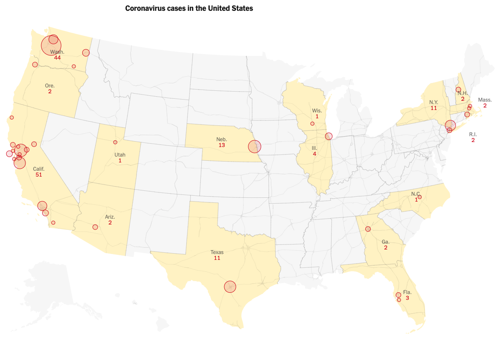
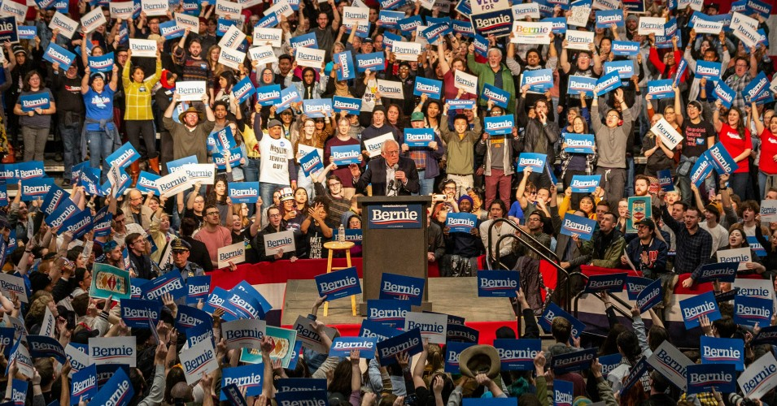
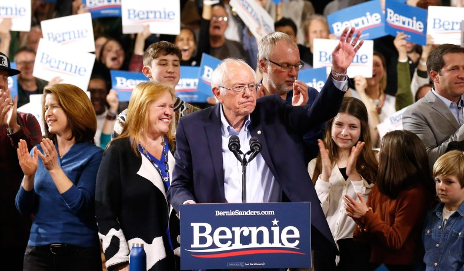
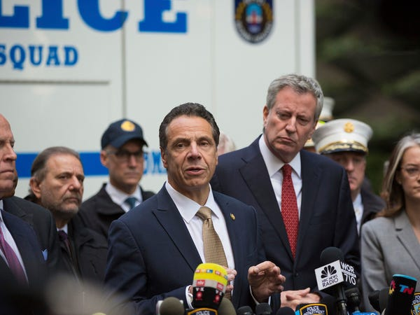
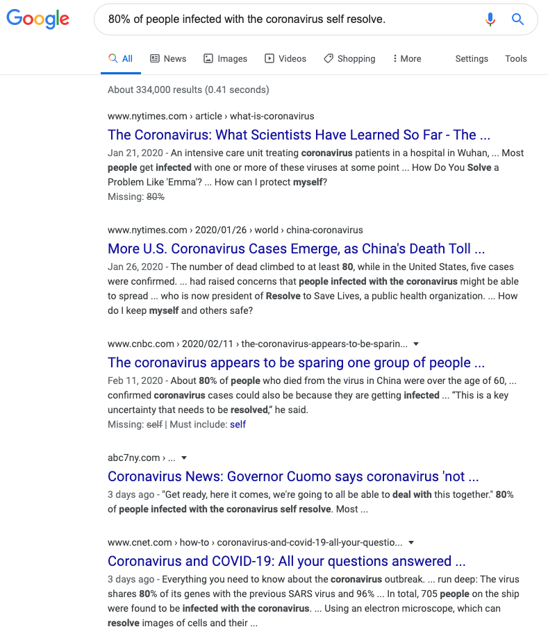

## 新冠疫情下，我在美国的所见所想

最近中国有很多关于美国的新冠疫情的消息。有很多同学问我在美国怎么样，让我注意防范。

在这里，先感谢大家对我的关心了。给大家鞠躬：）

昨天，又有一个同学在我的知识星球问起美国的疫情情况。在这里，我简单写一些这段时间里我的所见所想。

没什么价值，权当一个记录。

 

首先，我要说明，每个人住在美国不同的地区，感受应该非常不同。这点在中国一样的。住在武汉或者湖北；或者住在北上广深这样的人口输入型大城市；或者住在二三四线城镇乡村；或者住在青海西藏；相信感受是绝然不同的。所以，**我的所见所想，一定是片面的。**

毕竟，现在美国绝大多数州的数字还是 0；而且很多有确诊的州，数字也只是个位数。我找到《纽约时报》在美国时间 3 月 4 日更新的数据，是这样的：

我在加州，现在加州的确诊数量在美国是最多的。但就算只看加州，差距也特别大。比如我住在湾区，相信就比旧金山，洛杉矶一类的大城市好一些。

美国和中国相反。在美国，大城市反而脏乱差，安全问题严重。而在大城市周边的 country side，反而干净卫生，人口密度低，绿化高，更安全，也更适宜居住。

所以，以下只是我个人的所见所想而已。

另外，值得一提的是，这个事情有可能发展特别快。每一天都会有巨大的变化。所以，这篇文章中的见闻是有时效性的。

我写这篇文章的时间是美国西部时间 2020 年 3 月 4 日下午 3：00 PM。

 

**1.**

首先说说口罩的问题。

真心的，我看到的，除了亚裔，近乎没有什么人带口罩。

据说这是美国人的文化习惯。因为在他们眼里，口罩首先是给病人用的，防止传染别人；其次是给医护人员用的，因为他们会密切接触患者。在西方人眼里，大多数普通人出入普通场合，不需要带口罩。

这或许也和美国人的生活方式有关。因为确实在大多数地方，人口密度比中国低太多。再加上家家户户出门都开私家车，如果不去人群密集的地方，人和人之间的物理距离特别远。

所以，如果美国人遇到带口罩的亚裔躲得远远的，或许真的不是歧视（虽然我没遇到，但听说东部有），而是在他们的潜意识里，带口罩就意味着你是病人，就要躲一躲。

顺便一提，我在美国真心没太感受到什么歧视。反而是在新加坡和香港，感受到过歧视。香港远远大于新加坡。

有的时候想想也觉得挺有意思：离我的血缘越近的地区，反而越歧视我。这让我不得不反思：或许东西方文化的骨子里，真的有特别特别不一样的东西。

扯远了，说回口罩。

美国大多数媒体也是这么宣传的：普通人不要带口罩，没什么用，反而可能会导致口罩资源紧张，使得医护人员没得用。如果医护人员出现大面积感染，导致医疗资源跟不上，那对整个社会来说，风险就太大了。

不过其实，这个宣传也没啥意义。因为就算你想带，现在也根本买不到。媒体这么宣传，可能也有稳定民心，让大家买不到口罩也不要恐慌的意味吧。

我个人认为，如果口罩量充足，当然每个人都带是最万无一失的措施。但现实情况是资源紧张，要分一个优先级，所以我觉得毛病不大。

就算有毛病，真的没用，因为真的买不到口罩。。。

说到口罩是给医护人员使用的，上两周恰好我和老婆轮流到了要做年度体检的时候，经常跑医院。医院里从医生到护士，没有一个人带口罩。我也不知道他们怎么想的。🤷‍♂️

 

**2.**

聊聊囤食物。

我昨天晚上刚跑了一趟家附近的超市。确实，不易变质类的食品，货架上少了不少。但是，数量依然非常充足。

神奇的是，在这个头号资本主义国家，道理上如果这类商品卖得好，大家疯抢，应该涨价才对。但是我昨天去的超市，方便面还大特价，我一气儿买了一大堆。。。

我昨天没去华人超市，不是不敢去，是离得远，犯懒。但我周末刚去过华人超市。

本来是想囤货的，但我和老婆到了以后，发现物资充足，于是我们愉快地只买了一只烧鸭就回家了。。。

我们最近没去 Costco，因为听说人特别多。我们还是避免去人多的地方的。但因为只是听说，没有亲眼看到，也就没法证实。

网上流传很多 Costco 排大队的视频，应该是真的。但是不是每一个 Costco 都那样，就不知道了。

昨天看到一篇文章，我觉得也有一定的道理。这篇文章的大意是，很多人喜欢去 Costco 囤货，是因为那里退货政策更宽松：

[请您手下留情，疯狂抢购后，请勿退货！](https://mp.weixin.qq.com/s/7fy-jVw_19QjUSQt5ByxUQ)

我现在暂时的体会是：整体确实大家都在多买一些吃的囤起来，但超市的物资还是充足的，物价也是很稳定的。

 

**3.**

关于囤枪，200% 被一些国内的自媒体夸大了。

恰好昨天看到这篇“辟谣”的文章，大家也可以看一看：

[新冠疫情爆发后，美国老百姓真的急着囤枪囤子弹吗？](https://mp.weixin.qq.com/s/BtplI3ChGJ7kxEmfiaAfJQ)

实际上，即使看那篇疯传的说美国人囤枪的文章，如果抛开煽动情绪的描述，只看事实的话，就会发现数据是这样的：

> 三天内旧金山教堂区枪店 Fightback 247 的枪支销售增长了45%，弹药销售增长了 130%。 

理性地想一想，其实这个数字一点儿也不可怕，基本上就是一小部分拥枪家庭多买了一把枪和一些子弹备份。

要知道，昨天我去超市，家里也没有食用油了，就一次性买了两桶，那么我这一个家庭食用油的购买增量，就是 100%；至于方便面的购买增量，就是 500% 了。

不过对于枪支问题，美国各个州法律规定也不一样。我只知道，加州的枪支管控，是公认全美国最严格的地方。

但因为我没有考持枪执照，也不懂枪，没有握过枪，更没开过枪，甚至小时候都不爱玩儿玩具枪。所以在这方面，我并没有发言权。

 

**4.**

已经有风声，一些企业开始要推广在家办公了。但还没有全面实行。

其实在美国，至少 IT 企业，我认为推广在家办公要比中国容易。因为即使没有疫情，大多数人也都经常在家办公，甚至是规律性的每周一天在家办公。

 

在美国的很多大型活动也确实取消了。主要是国际活动。毕竟现在也有不少航空管制措施。就算没有管制，世界各地很多人民出行也都慎重了不少。

今天我看到一个网站，觉得挺有意思，叫“is it canceled yet？”，简明扼要地用 yes / no 展示了：今年比较著名的各种国际活动至今为止是否有被取消。有兴趣的话，大家也可以围观

[https://www.isitcanceledyet.com](https://www.isitcanceledyet.com)

确实，有很多活动取消了，但是看下来，还是有不少活动还没有决定取消。当然，这些活动大多在今年晚些时候，可能随时会产生一些变动。我相信这个网站也会不断更新的。

对了，奥运会还没有决定取消。之前有人告诉我奥运会确定取消了，是谣言。

 

**5.**

昨天是美国的超级星期二。

超级星期二（Super Tuesday）是指美国大选年的二月或三月，多个州同时举办总统候选人初选的星期二。在这一天，多个州会同时选出两党的候选人。

由于超级星期二的结果对最终选情影响巨大，各个候选人都特别注重该日的表现，所以称为“超级星期二”。

我来给大家看看昨天超级星期二的现场情况。

咱不分析政治，就看这现场的人山人海，人挤人，人堆人。

但是，没人带口罩。包括总统候选人。。。

上面这张图片，站在中间讲台的是桑德斯老爷子。

我们再来张近景。因为这篇文章主要关注“人山人海”，所以我就不放单独一个人帅气的特写了。

咳咳，后面还有一个人，是在抠鼻子吗？。。。

 

Bernie Sanders 今年已经 78 岁了。这么一把年纪了，还这么拼。我要向他学习。。。

但话说回来，川普也已经 73 岁了。

其他的咱不懂，但这拼劲儿，他们都是我学习的榜样。。。

至于他们，包括所有参与集会的选民不怕病毒的精神，咳咳，时间会给出答案的。。。

 

**6.**

整体，我认为：即使美国新冠数量继续上升（一定会的），也很难出现中国那样级别的管控措施。因为大家的理念差别太大了。

纽约州长说了，80% 的人可以自愈。大家体会一下。

纽约州长说的这句话的原话是：**80% of people infected with the coronavirus self resolve.**

有意思的是，我用这句英文在 Google 搜索，找不到一个新闻，用这句话当标题。

 

但是，我用**“纽约州长说，80% 的人可以自愈”**的中文进行搜索，中文新闻一大票：

 

我这里没有批评中国媒体的意思。因为我现在也不知道，纽约州长这个说法，到底对不对？对于整个社会来说，释放的信号，到底是利大于弊？还是弊大于利？

我只是想指出，不要说政府层面，即使是媒体层面，**两国关注的重点，似乎差距甚远，完全不一样。**

自上而下，我相信民众也是如此。

 

至少到现在为止，我看的情况是：大家基本是该干什么干什么，生活完全没有受到影响。

大家现在来美国，走在大街上，如果心里不知道新冠这个事儿，我相信是察觉不出有什么异样的。

不过依然是，病毒这事儿发展会特别快，过一周过两周会变成什么样子就不好说了。

比如如果在昨天超级星期二的现场，出现超级传染者，发生大规模感染的话。。。

 

以上只是到如今为止，我在美国加州湾区的所见所想。

这篇文章，我没有写什么专家认为新冠病毒大爆发是早晚的事儿。其实美国媒体也报道这些，很多美国专家也在这么说。但是写这个的文章太多了，我不赘述了。

而且，我看到的，整个社会确实没有特别紧张起来。

因此，再次强调：**本文一定片面主观，不理性不中立。**

 

**祝每个人健康平安。大家加油！**