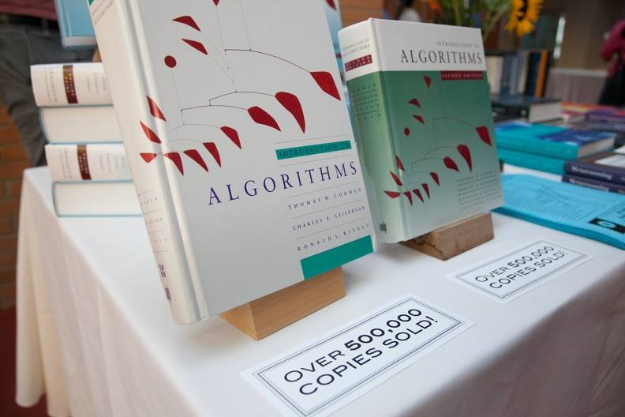
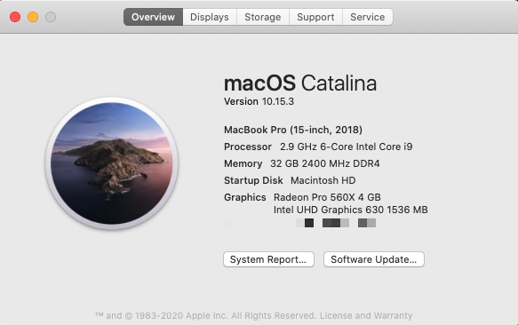
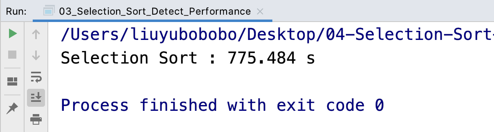
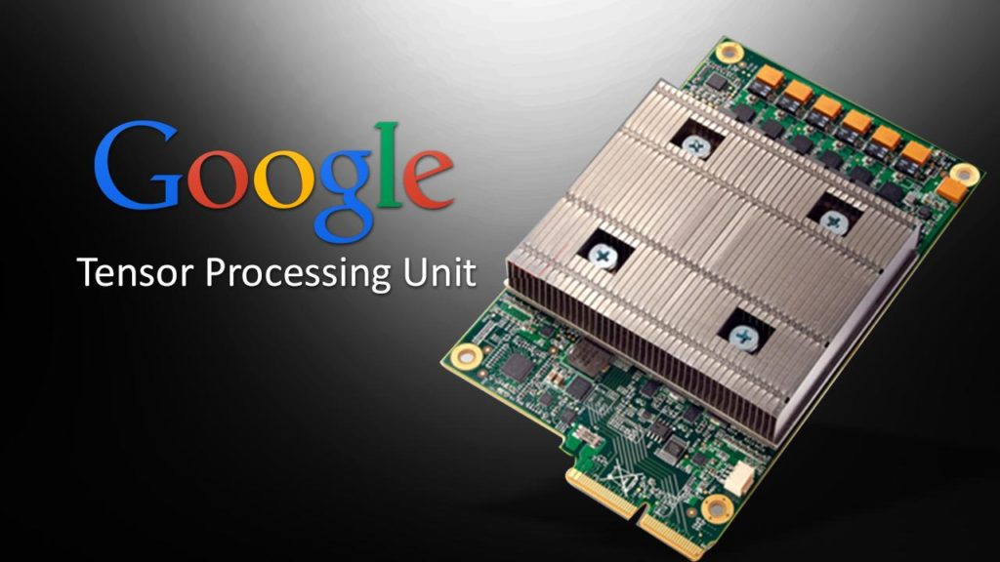
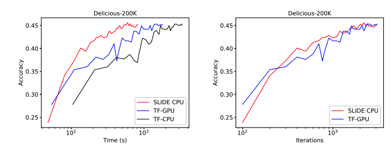
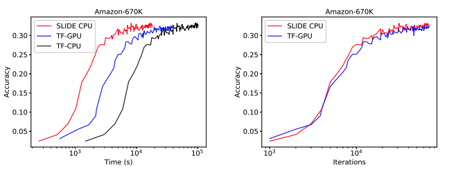

## 不要忽视算法最朴素的意义

去年我和一个本科同学吃饭，席间有番对话，我觉得挺有意思。

我大一开始就搞算法竞赛。我的同学也是牛人，但他不玩儿算法竞赛。

和大多数初学计算机的同学一样，他也怀疑算法的意义。

这不是贬义，我也怀疑过，甚至现在还会写[《学算法有什么用？没用》](../../2019/2019-03-18/)这样的文章。

然后他说，你记不记得，我大一曾经问过你，硬件会越来越快，算法有什么意义？

据他说，我大一给出的回答是：即使硬件越来越快，但算法仍然在帮助我们节省时间和空间，我们就可以使用这些节省的时间和空间做更多的事。

这个回答他当时觉得很有说服力。

我说，我完全忘了这件事儿了。但是现在看，大一的我肯定是还没读《算法导论》。

这本算法界的圣经，在全球已经卖出了超过 50 万册了；其在全球论文中的引用次数，也达到了 5 万余次之多。

 

《算法导论》在序章就仔细讨论过这件事情。印象里林林总总说了很多，大多数其实我也忘记了，但我印象最深的一点就是：**实际上，硬件的发展速度，是无法赶上算法的优化速度的。**

也就是，如果你将一段 O(n^2) 的算法，放到 2020 年的机器上运行，相较于放在 2004 年的机器上运行，获得的效率提升，拼不过在 2004 年，我们把这段算法改成 O(nlogn) 的算法。

n 越大，越明显。

为什么我敢这么肯定？因为 2004 年，我已经开始在 OJ 上做题了。但凡是需要排序的问题，肯定要使用诸如归并排序或者快速排序这类 O(nlogn) 的算法。使用这类算法，对于 100 万级别的数据，绝对在 1 秒钟搞定。这是 2004 年。

我们试验一下，在当代的机器上，如果使用一个 O(n^2) 的算法，对于排序任务，100 万的数据规模，需要多少时间呢？

我自认我的计算机速度应该还是可以的。6 核 i9 处理器，主频 2.9GHz。内存 32 GB。

 

我使用 C++ 编写的选择排序进行实验。这是一个实现起来最简单的 O(n^2) 级别的排序算法。

对于 100 万的数据，在我的机器上，需要的时间为 775 秒的时间。

大家可以看到：在 2004 年，如果我们使用高效的算法，一秒就能处理完的事情，放在 2020 年的计算机上，使用低效的算法，依然还是需要 775 秒才能处理完。

我们如果假设摩尔定律不会失效的话。根据摩尔定律：每过 18 个月，芯片的性能会提高一倍。那么为了弥补这个 775 倍的差距，往少里说，也还需要 9 个时间周期（2^9 = 512），相当于 9 * 18 = 162 个月，也就是 **13** 年之久。

 

这还只是对于百万级别的数据。而对于 1000 万级别的数据，计算结果将更加夸张。

实际上，对于现在我的这台计算机，我不需要使用 1000 万级别的数据实验，就能大概估算出所需要的时间。答案是 77500 秒左右。也就是要比 775 秒再多 100 倍时间。

为什么？因为数据规模扩展了 10 倍，那么对于 O(n^2) 的算法来说，性能就需要多 100 倍。这就是 O(n^2) 的意思：性能和数据规模之间成平方的关系。

但是，对于我的这台计算机，使用 O(nlogn) 的排序算法，1000 万的数据规模，妥妥地在 1 秒钟之内完成。

77500 秒的时间不到一天，看起来似乎也可以忍受。但是这样的性能差距，在很多情况下是无法忍受的。

比如现如今，我们做很多机器学习任务，训练过程动辄就要几个小时，我还见过计算两周的情况。

就算我们的训练过程只需要 1 个小时就可以计算完毕。但倘若我们使用了低效的算法，性能差距达到了 77500 倍的话，就变成了需要 77500 个小时完成。

77500 个小时是什么概念？一年不过 365 * 24 = 8760 个小时。77500 个小时，就是 9 年之久。

1 个小时对比 9 年，这就是算法的威力。

 

---

尽管如此，在当今时代，硬件的发展依然是计算能力提升的一个重要渠道。

尤其是近些年，在人工智能领域，硬件变得越来越重要。GPU，TPU，为人工智能专门设计的 ASIC，FPGA 层出不穷。甚至成为了企业，乃至国家的重要发展战略。

比如 Google 的 TPU——即 Tensor Processing Unit，中文翻译成张量处理器，简称 TPU——就是只租不卖的。

 

突然想起聊这个话题，是因为前几天偶然看到一篇论文，觉得很有意思。

这篇论文设计了一个计算引擎，叫 Sub-LInear Deep learning Engine，简称 SLIDE。论文的研究组使用这个引擎在 CPU 上做深度学习，无论是训练速度还是推断速度，都超过了在 GPU 上运行 TF 的结果。

根据论文的说法，测试的数据都是工业级的大规模数据。

下图的测试结果来源于这篇论文。对这篇论文感兴趣的同学，可以点击这里了解更多：[https://arxiv.org/abs/1903.03129](https://arxiv.org/abs/1903.03129)

当然，对于这个结论，我们还是有很多可以质疑的地方；对于测试的方式，也可以探究是否全面。

但我觉得这个方向本身还是很值得重视的。

即使在如今这个智能时代，大家似乎都在强调算法可以做多么“酷”的事情，但是算法本身，还是有一点它最基本，也是最朴实的作用：

**性能优化。**

当然了，就算我们将性能问题全部都托付给硬件，**其实，设计这些专门的芯片，还是离不开算法。**

 

**大家加油！**