## 弱小和无知不是生存的障碍，傲慢才是

最近，关于新冠疫情在世界范围内的坏消息不断。

就在昨天，雷霆对阵爵士，比赛还没开始，裁判和球员却开始退场了。同时，现场也开始组织球迷退场。

之后，联盟宣布，戈贝尔（Rudy Gobert）新冠病毒检测结果为阳性；不久，他的队友多诺万.米切尔（Donovan Mitchell）也确诊。

 

值得一提的是，就在上一场爵士对阵猛龙的赛前新闻发布会上，戈贝尔还为了表现自己“漠视疫情”，主动去触摸每一个麦克风与录音设备。

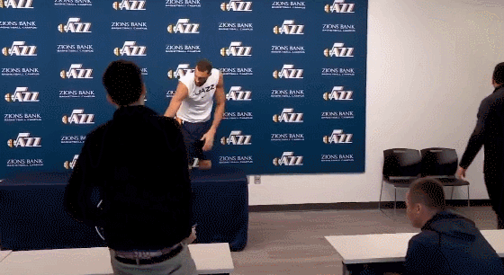

 

现在 NBA 宣布停赛。从正常比赛到停摆，只花了一天不到的时间。

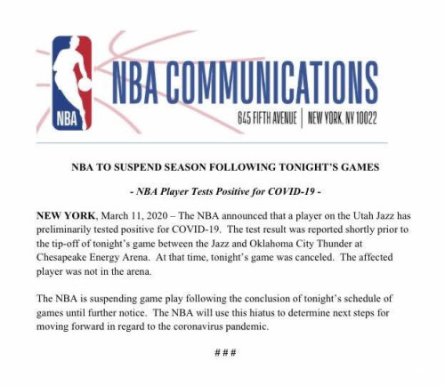

 

同时，在足球界，尤文图斯的后卫丹尼尔·鲁加尼（Daniele Rugani）确诊感染新型冠状病毒。

这意味着尤文图斯全队将会立即被紧急隔离，包括当今足坛最著名球员之一：C 罗。

如今，意甲联赛从当地时间 10 日起已经暂时停摆。同时，随着疫情的发展，欧洲多个联赛面临停摆。

体育界一片哀嚎。

 

---

昨天，和体育界一起哀嚎的，还有娱乐界。

好莱坞影帝汤姆.汉克斯（Tom Honks）以及其妻子丽塔·威尔逊（Rita Wilson），在澳大利亚确诊感染新冠。

汤姆.汉克斯是我最喜欢的好莱坞演员之一。他的诸多作品，可以说是对一代人，甚至是几代人影响深远。

从《拯救大兵瑞恩》，到《猫鼠游戏》；从《幸福终点站》，到《萨利机长》。

但汤姆.汉克斯最重要的，对世界影响最深远的作品，当属《阿甘正传》了。

《阿甘正传》中有一句传世的台词，近乎每一个人都倒背如流。

> Life is like a box of chocolates. You never know what you're gonna get.

如今看这句台词，我竟觉得有些许的讽刺。

谁也没有想到，这些巧克力里，还会有一枚装着新冠病毒。

或许，这是上帝又在跟阿甘开玩笑。

在《阿甘正传》里，一个“傻子”也能扼住命运的喉咙。相信这一次，汉克斯夫妇也能。

 

---

政界也并不轻松。

英国卫生部长纳丁·多里斯（Nadine Dorries）已确诊感染新冠肺炎。

据了解，她曾在过去的一周内，在议会上与上百人会面，并且与英国首相约翰逊在唐宁街 10 号一同参加了招待会。

 

据 CNN 报道：巴西总统博索纳罗（Jair Messias Bolsonaro）的新闻秘书法比奥·瓦金加藤（Fabio Wajngarten），在新冠病毒检测中呈阳性。目前，巴西总统的健康状况正受到监控。

而更严峻地是，就在上周末，这位已经确诊的巴西新闻秘书瓦金加藤先生，曾陪同巴西总统博索纳罗一同前往美国。期间，和美国总统特朗普、副总统彭斯等人有过接触。

他甚至前几天，还在 Instagram 上发了一张他和特朗普等人的合照。

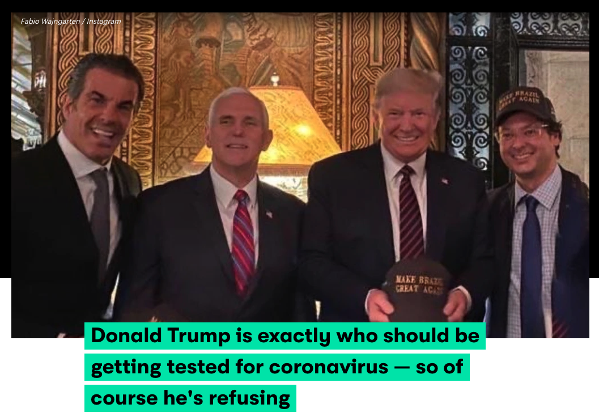

在这张照片中，有巴西总统（左一），美国副总统彭斯（左二），美国总统川普（左三）和现在已经确诊的巴西新闻秘书瓦金加藤（最右）。可以看到，瓦金加藤就在川普的旁边。

上图来自美国一家媒体的新闻，新闻的标题是：川普总统是最应该接受新冠病毒检测的人，但是他拒绝接受检测。

截止到目前为止，美国媒体报道：无论是川普总统，还是副总统彭斯，都拒绝接受新冠病毒检测。他们的理由是：他们几乎没有和瓦金加藤有过交互。

而另一位参议员 Rick Scott 正在接受隔离观察。

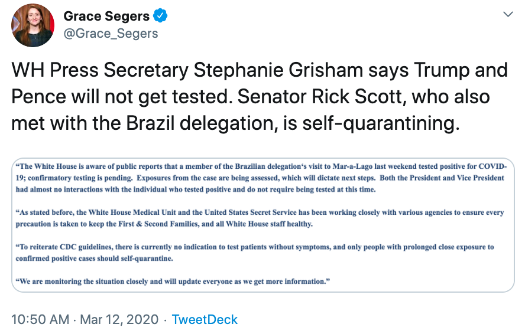

 

---

以上基本上是在过去两天左右的时间里，涌入美国民众视线的新闻。

或许正因如此，虽然昨天美国总统紧急发表电视讲话，应对新冠疫情，安抚民众情绪，宣布了包括针对欧洲国家的旅行禁令、针对企业和个人的紧急救助等在内的多项措施。

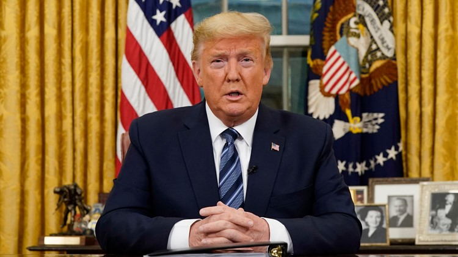

但是，似乎没有什么效果。投资者们依旧很恐慌。今天美股开盘即大跌 7%，直接又一次触发熔断。

 

网上的段子：

美股熔断，在历史上只发生过三次。上一次熔断，还是在 2020 年 3 月 9 日。那一天的情景，至今还历历在目，仿佛就在几天之前......

嗯，因为真的就在几天之前。

 

今天已经成为美国继 1987 年 10 月 19 日黑色星期一之后，股市最惨的一天。

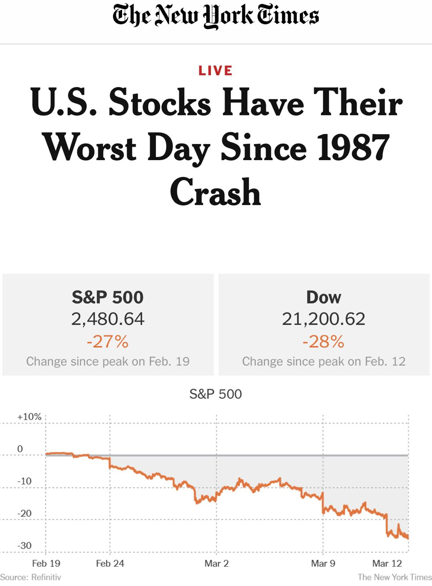

 

---

诸多名人相继确诊，美国的网络上，已经有了这样的声音：

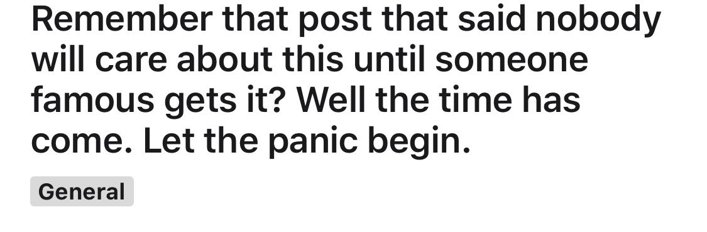

翻译：还记得曾经有人说，没有人会在乎这个病毒，直到有名人确诊吗？现在名人们确诊了。让我们一起恐慌吧。

下面有一条回复也很有意思：

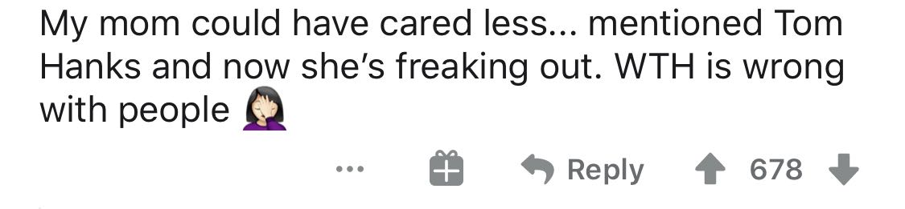

翻译：我的妈妈一直不在乎新冠病毒，直到她知道汤姆汉克斯确诊了，她现在吓坏了。这年头儿，人们都怎么了？...

 

是的，我认为现在，西方世界必须重视新冠疫情了。

希望这还不太晚。

不仅如此，西方世界还必须要重视中国的防疫经验。因为，现如今，**傻子都能看出来：中国已经成功地控制了新冠疫情。**

今天，一名身在硅谷的美国人 Tomas Pueyo，在 Medium 上发表了一篇文章，用数据，有理有据地阐明了：中国采取的隔离措施的意义。

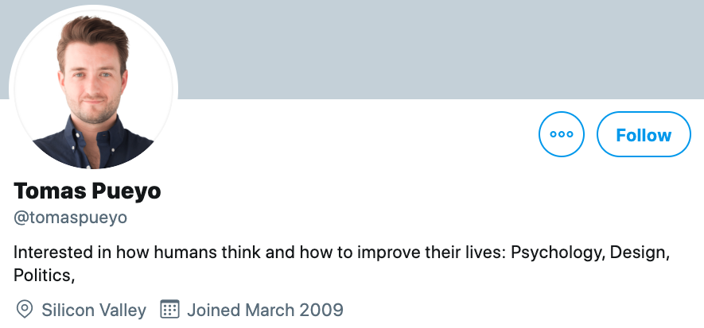

他的这篇文章，可以点击这里阅读原文：[https://medium.com/@tomaspueyo/coronavirus-act-today-or-people-will-die-f4d3d9cd99ca](https://medium.com/@tomaspueyo/coronavirus-act-today-or-people-will-die-f4d3d9cd99ca)

 

在这篇文章中，他做了一个很有意思的数据图表。如下：

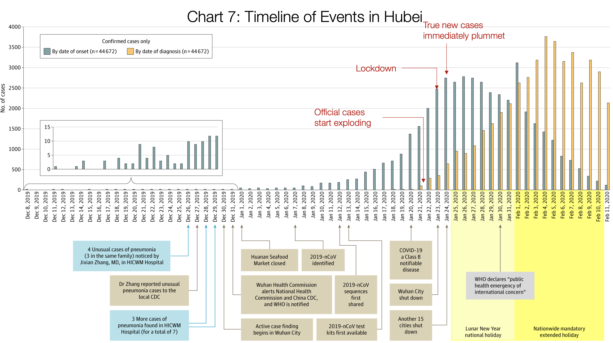

这个图表的信息量很大。如果大家在手机上阅读的话，我不确定能否看清楚细节。大家应该可以通过点击获得大图。

不过，在下面的叙述中，我会把我重点关注的局部图像进行放大，方便大家阅读。

 

整张图整体重点就是这一部分:

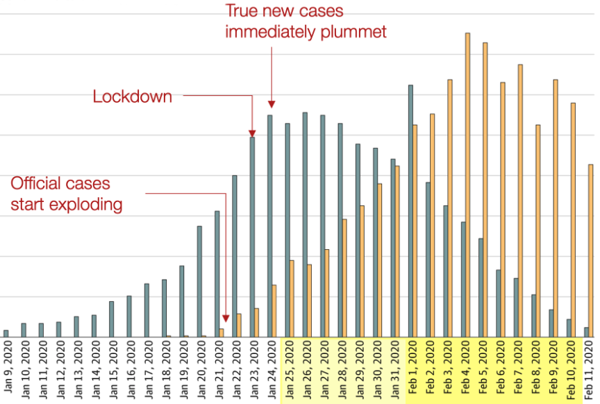

大家可以看到，在这个图表中，有两组柱状图，分别用灰色和橙色表示。这两组数据是什么意思呢?

橙色的数据，是指在湖北省中，每天在医院确诊的人数。

而灰色的数据，则是在确诊过程中，医生询问这些患者，你的症状大概是什么时候出现的？然后统计出来的数据。

换句话说，灰色的数据，可以粗略地表示：这些确诊患者真正感染新冠病毒的时间。

也正是因为如此，大家可以看到，灰色的数据，基本上是橙色的数据，向左，也就是向前面的时间平移了一下。平移的时间间隔，大概是 10 天。

有了这个数据，我们就能分析出一些有意思的结论了。

 

首先，我们可以看到，基本上，1 月 20 日，1 月 21 日，1 月 22 日这三天的时间，湖北省医院的确诊人数（橙色数据），在呈指数及增长。

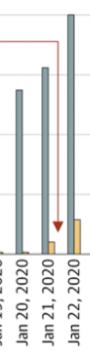

在 1 月 20 日，橙色的数据还很少；到了 1 月 21 日，确诊数量陡然增高。这个数字大概是 100 左右；到了 1 月 22 日，又一天，新的确诊数字就已经接近 300 了。

很显然，确诊人数正在指数级的增长。注意，现在我们看的是橙色的数字，也就是真实确诊的数字。

或许正是因为这个原因，1 月 23 日，我国当机立断，对武汉进行了封城。之后很快，对湖北省多个城市也实施了封城措施。

封城后管用吗？如果我们看医院获得的确诊数据，也就是橙色的数据，似乎并不管用。在很长的一段时间，确诊病例继续持续增高，甚至是指数级的上涨。直到 2 月 4 日以后，才开始有了下降的趋势。

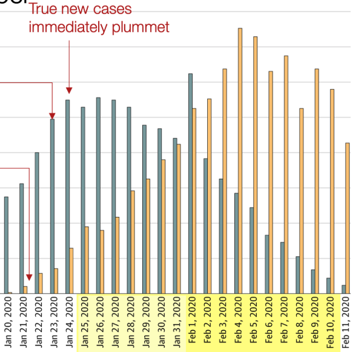

或许正是因为这种确诊数量的继续升高，在那个时候，大量的西方媒体都在质疑：这样的封城措施到底有没有用？

但是现在，更完整的数据出现之后，我们或许可以进一步看到事情的原貌。

 

大家要知道，前面说，在湖北省，1 月 20 日，1 月 21 日，1 月 22 日这三天的确诊人数（橙色数据），在呈指数及增长。但这个数据只是医院知道的数据而已。

真正的感染数据，医院是不知道的。现如今，我们回头看，就会明白：新冠病毒在湖北省指数级别的感染，发生在更早的时候，或许是 1 月 7 号左右。此时，我们要看灰色的数据！

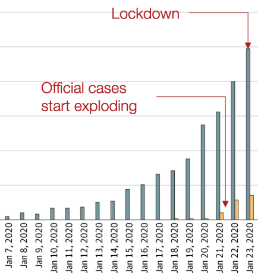

这很好理解。由于潜伏期的存在，病毒在 1 月 7 日开始，就已经指数级别地感染人群了。但直到 1 月 20 日，大量病患涌入医院，医院才意识到：问题很严重。

如果用这个视角看，我们来看一下，武汉封城以后，实际的感染数据。也就是在采取封城措施以后，灰色数据是怎样的？

请大家关注灰色数据：

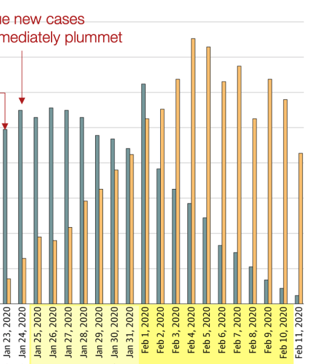

上面的图表中，包含从武汉封城，也就是 1 月 23 日，直到 2 月 11 日的数据。大家可以看到，如果只关注灰色数据，就能明白：**这近乎是一个往下走的曲线！**

因此，我们或许能得出这样的一个结论：**武汉封城是很有意义的措施，这个措施真的遏制了病毒的传播！**

在这个背景下，如果我们再看中国其他省份的确诊数据，就是这样的：

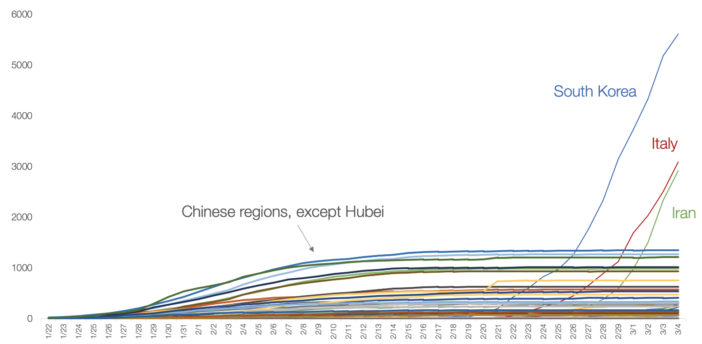

大家可以看到，下面一堆平滑的曲线，就是中国其他省份的数字。近乎没有指数增长的情况。

但是，三根耀眼的，显然在指数增长的曲线，分别是韩国，意大利和伊朗。

现在，除了中国，韩国，意大利和伊朗，其他国家的数字都还相对较少。但如果我们放大他们的确诊数字，就会发现：指数增长正在发生！

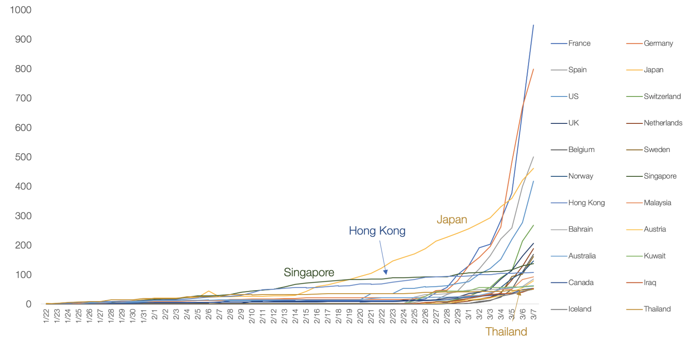

注意，这些数字只是我们知道的确诊数字。根据湖北省的经验来看：实际感染数字，要比确诊数字高很多！

也就是说：**留给世界其他国家的时间窗口，可能真的不多了。**对于一些国家来说，即使现在采取相对强硬的隔离措施，可能最后的结果，也要奔着湖北省的数字去。

而湖北省，乃至全中国的经验告诉我们：这样的强制隔离，是有效果的！

 

在这里，我当然明白，**大家国情不同，制度不同，资源不同，所以在设计具体政策的时候，不可能完全一样。**

但尽管如此，**西方世界的其他国家，能不能至少不要轻视这个病毒？**

**西方国家的媒体报道，能不能不要污名化中国的措施？**

举个例子，就在两天前，意大利封城了。其实，现在意大利近乎封国了。

在同一天，《纽约时报》发了两条报道，前后相隔仅有 20 分钟。是这样的：

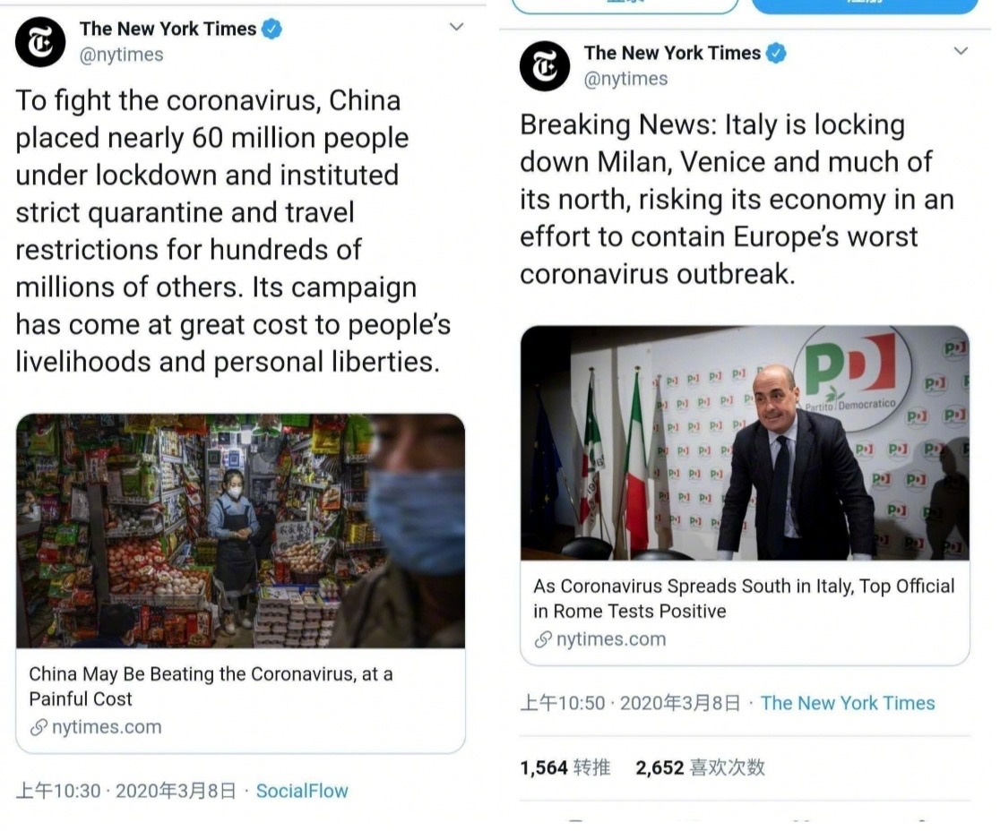

左边第一条报道是在说中国。题目是：为了对抗新冠病毒，中国将 600 万人封锁，并对上亿人实施了严格的隔离措施和旅游管制。**这些措施对人民的生活和自由造成了极大的损失。**

右边第二条报道是在说意大利。题目是：突发新闻！意大利封锁了米兰，威尼斯和北部大部分城市。**意大利正在为遏制新冠病毒在欧洲的蔓延，承受着巨大的经济损失。**

Excuse me？

我知道你们双标，也不能这样厚颜无耻吧？我真地想骂人了。

 

现在不是争执意识形态的时候，不是比拼制度优越的时候，所以，咱也不多说。

毕竟，**病毒面前，人人平等。**

就算大家国情不同，制度不同，西方国家的现实情况，确实不能“抄”我国的防疫作业。

但是，**西方国家是不是也该正视中国的防疫经验，承认中国做法的合理性和有效性，并且一定程度加以借鉴？**

 

早在 1000 年前，中国晚唐诗人杜牧，就在《阿房宫赋》中写道：

> 秦人不暇自哀，而后人哀之，后人哀之而不鉴之，亦使后人而复哀后人也！

 

这句话，中国的中学生都能背下来。但想必对西方国家的人来说，太难了。

毕竟中华文化，博大精深。

但就在大概 9 年前，中国科幻小说家刘慈欣，亦在他的小说《三体III》中写道：

> 弱小和无知不是生存的障碍，傲慢才是。

 

好吧，中文你们不懂。

但是，《三体》三部曲已经被完全翻译成了外文，摘得多项科幻界的大奖，甚至被列在了比尔盖茨要读的书目列表中。

我来告诉你们，这句话的英文怎么说：

> Weakness and ignorance are not barriers to survival, 
>
> but arrogance is.

希望你们能听懂。

 

题图是网友为《三体》中的水滴制作的图片。

看过《三体》的同学，都知道水滴是何物。

希望新冠病毒，不是地球的水滴。

