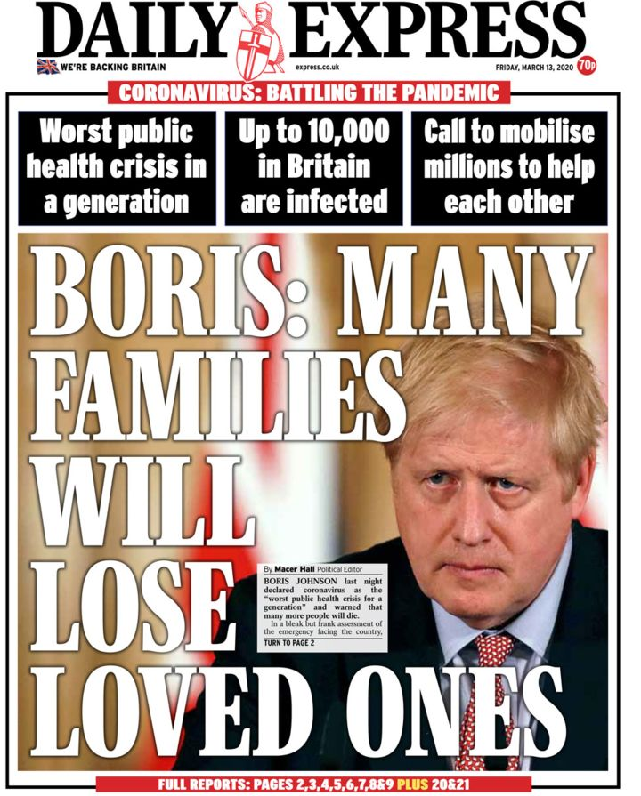
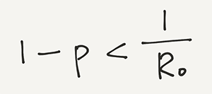
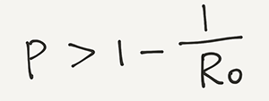
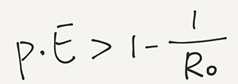
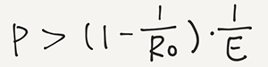

## 群体免疫背后的数学

最近有一个词火了，叫“群体免疫”。

在世界卫生组织宣布新冠病毒是大流行（Pandemic）之后，英国首相 Boris Johnson 紧随其后，在一个新闻发布会上宣称：英国已经不能再“控制”这个病毒了，而是进入下一个阶段：尽量推迟病毒的传播。

原文是：... moving to delay the spread of the virus rather than containing it.

英国首相在新闻发布会上还说了一句话，“很多家庭都会失去他们挚爱的人”。

原文是：many more families will lose loved ones.

这句话瞬间登上了英国各路媒体的头条。

说实话，我没有看英媒的报道。我不确定英国媒体报道背后的意思，到底是要渲染这个病毒的严重性？还是对英国首相政策的讽刺？也或者是二者兼而有之？

然而，至此为止，这些内容其实都没有引发网上的热议。

随后，英国的首席科学顾问 Patrick Vallance 告诉大家，英国的感染率可能会达到 60%，然后形成**群体免疫（herd immunity）**。

至此，群体免疫成为全网热词。

是的，不仅仅包括中国的互联网，也包括美国的互联网，我相信更包括英国的互联网，大家都在讨论群体免疫。

 

本来对这个话题，我没有什么发言权。因为这背后所涉及的，无论是传染病学，还是公共政策的制定，都不是我的专业。

但是，我简单查了查维基百科，发现“群体免疫”这个术语是一个由来已久的科学概念。在搞明白这个概念的过程中，有很多数学计算，其实都非常非常初等，我觉得很有意思。

所以，我决定简单写一写，权当是科普：）

 

---

事实上，“群体免疫”理论是疫苗可以起作用的核心原因！

是的，要理解疫苗可以控制病毒的原因，必须结合“群体免疫”这个理论才行。

为什么呢？原因很简单，疫苗不可能 100% 有效。

首先，从疫苗制作的角度考虑，疫苗本身就不可能完美地在所有人身上有效。

疫苗产生作用的原理，是刺激人类的免疫系统，让免疫系统产生相应的保护物质。

但我们人体的自身情况千差万别，就算疫苗本身是完美的，也不可能 100% 对所有人有效。如果一个人的免疫系统本身受损，最典型的情况是艾滋病患者，或者正在接受化疗的癌症患者，那么对于这类人群，“完美”的疫苗也失效了。

另外，因为各种社会原因，疫苗也不可能达到 100% 的接种。

这里面有经济的原因，政府的宣传原因，甚至在一些个别地区，交通原因都可能使很多人不去接种疫苗。

但尽管如此，疫苗还是帮助人类控制了很多疾病。最典型的例子就是天花。

为什么？因为**群体免疫**。

 

---

在具体看群体免疫背后的数学之前，我们可以先看一看，病毒是怎么爆发的？

很简单，一传十，十传百。

在传染病领域，这叫做 R0，表示基本传染数。

什么叫基本传染数？就是指在没有外力介入的情况下，一个病人可以把一种病毒传染给多少人？

一传十，十传百，R0 就是 10。

如果 R0 = 2，就是说对于一种病毒，一个病人可以传染给两个人；那么两个病人就可以传染给四个人；四个病人就可以传染给八个人；以此类推。

相信学习计算机的同学对此很熟悉，这叫指数增长。即使 R0 不是 10，而是 2，这个增长速率也是非常可怕的。

实际上，只要 R0 > 1，都叫指数增长。用高等数学的话说得不通俗易懂一些，就是我们其实是在看一个几何级数，这个几何级数是发散的。

如果说得简单一些，就是：只要 R0 > 1，一个人得病，最终一定所有人都得病。

但是，如果 R0 < 1，事情就不一样了。懂高等数学的同学会知道，此时，这个几何级数收敛了。也就是只有有限的人会得病，而不会无限传播。

不说的这么“学术”，也很好理解。假设 R0 = 0.5，就代表一个人得病，只能传染 0.5 个人。

如果觉得 0.5 个人太抽象，可以想象成，假设有 8 个人的病，因为 R0 = 0.5，这 8 个病人只能传染给 4 个人；这 4 个病人只能传染给 2 个人；这 2 个病人只能传染给 1 个人；而这 1 个病人，已经不能传染别人了。

至此，我们总共得病的人数，是有限的。这个病毒没有在人群中无限传播，那么我们能控制这个病毒。

 

---

如果明白了上面的数学计算，我们就知道了：控制疾病爆发的关键，是减小 R0。

怎么减小？一个方式就是打疫苗。

因为打完疫苗以后，人群有了免疫力。假设有 80% 的人群接种了疫苗。此时，就算这个病毒传染性超强，R0 = 10，也就是每一个病人能传染 10 个人。但是这 10 个人里，8 个人有免疫力，那么，真正传染的人，其实只有两个。

R0 瞬间从 10 降低到了 2。

当然了，大家可以想象，如果有 95% 的人群接种了疫苗，那么在 R0 = 10 的情况下，每一个病人就只能传染 0.5 个人了。因为 9.5 个人此时有了免疫力！那么 R0 就是 0.5 了！

R0 = 0.5，就意味着这个病毒被控制住了。

通过上面的分析可以看到：通过接种疫苗，哪怕人群中不是 100% 有免疫力，只要有很多人有免疫力，我们就能将传播系数 R0 控制在 1 以下，这就意味着这个病毒得到了控制。

 

---

下面我们就要抽象一点点儿了。

对于一个基本传染系数为 R0 的病毒来说，人群中拥有免疫能力的人，占比要达到多少，才能控制这个病毒？

相信如果看懂了上面的分析，这个问题并不难。

我们假设拥有免疫能力的人群占比要达到 p（p 是一个百分比），才能控制这个病毒。那么对于一个人得病，就能传染 R0 个人的病毒来说，由于这 R0 个人中，有 R0 * p 这么多人有免疫力，所以最终，只会传染 R0 * (1 - p) 这么多人。

为了控制这个病毒，我们只需要让：R0 * (1 - p) < 1，就好了。 

我们求解这个不等式，挪一下 R0，就是：

最终得到：

也就是说，如果 R0 = 10，我们需要让 1 - 1/10 = 90% 的人有免疫力，才能控制这个病毒。

如果 R0 = 2，我们需要让 1 - 1/2 = 50% 的人有免疫力，就能控制这个病毒。

可以看到，R0 越高，我们为了控制这个病毒，需要的拥有免疫力的人口就越多，才能控制住这个病毒。也就是我们控制这个病毒越难。

 

---

这就叫**群体免疫**。人群中只要有一定比例的人口拥有了免疫力，病毒就被控制住了。

实际上，为了让这么多人获得免疫力，最常见的方法，就是给人群接种疫苗。

此时，p 可以理解成是人群中接种疫苗的比例。

但是，还记得之前说过的，其实，疫苗的成功率并非 100%？

假设，我们将疫苗的有效性也放入上面的式子中的话，也就是实际具有免疫力的人群比例 p，是由两部分组成：一部分，是接种疫苗的比例，我们还叫 p，另一部分，就是这个疫苗的有效性，我们叫 E。

我们可以得到：

注意，此时的 p，是人群中接种疫苗的比率，E 则是疫苗的有效性。不等式左侧的 p * E，还是表示具有免疫力的人群。

我们把 E 挪到不等式右侧，就有了：

换句话说：假设这个病毒的 R0 = 2 的话，按照我们之前的计算，只需要 50% 的人接种疫苗就好。

但是，由于疫苗的有效性不是 100%。假设这种疫苗的有效性是 90% 的话，那么根据我们新的公式，上面得到的这个 50%，还要再除以 90%，结果是 55.5%。

也就是，因为我们的疫苗的有效性不是 100%，我们还需要相应地提高接种疫苗的人群比例，才能够达到“群体免疫”的目标。

值得一提的是：如果这个病毒的 R0 = 10，而我们的疫苗的有效性是 80% 的话，代入上面的式子，就会发现，计算出的结果，是 112.5%！

也就是，我们的接种人群数量必须超过 112.5%，才能达到“群体免疫”的效果。但我们的总人口数最多是 100%。这也就意味着，在这种情况下，这种疫苗无法做到“群体免疫”。

因此，我们可以得到结论：如果一个病毒的传染性超强，那么我们也需要疫苗的有效性超高，才能达到“群体免疫”的效果。

 

---

至此，关于群体免疫，我就科普完了。

当然，上面我们用的模型非常简单。实际上，我们还可以引入各种其他参数变量，对于各种不同的情况，做出更复杂的模型。

但是基本的骨架，就是这个样子。

下面我们就可以聊聊新冠病毒了。

 

因为现阶段，对于新冠病毒，还没有疫苗。所以，获得免疫力的方法，就是感染。

因此，上面公式中的 p，就变成了感染比例。

而 E 呢，就是感染以后，可以真正地获得免疫力的人群比例。

这个人群比例是多少呢？我查了一些资料，由于现在人们对新冠病毒的认识还比较少，所以观点不统一。不过，**现阶段的主流观点是：感染新冠病毒的患者，短时间内不会二次感染。**

所谓的短时间内不会，是指：新冠病毒并不是一个变异非常快速的病毒，所以感染以后，免疫系统能够正确识别这个病毒。但是，在更长的时间周期里，新冠病毒有可能变异得免疫系统都不认识了，于是，可能再次感染了。

我们之所以每年都可能得流感，其实就是因为流感病毒变异得很快。其实，我们每年感染的流感病毒，严格来讲，并不是一种病毒。

所以，现阶段，我们可以暂时把 E 想成是 100%，即所有感染新冠的人，都有了免疫力，暂时不会出现二次感染。

这样一来，在上面的式子中，关键就是看新冠病毒的 R0 是多少。

依然是，由于我们现在对新冠病毒的认识很少，所以，对于新冠病毒的 R0，大家没有统一的结论。

我在网上查到的资料，大多数的观点认为，新冠病毒的 R0 在 2 - 2.5 之间。我们取高值：R0 = 2.5，E = 1，带入上面的式子，得到的结果是：p > 60%。

这或许就是英国的首席科学顾问 Patrick Vallance 告诉大家的，英国的感染率可能会达到 60%，然后形成群体免疫（herd immunity）的由来。

实际上，不仅仅是英国，早前德国总理 Merkel 也曾说过，可能会有 70% 的德国人感染这个病毒。

如果带入这个式子，那么 Merkel 说这话的时候，依据的 R0，反算回来，就是 3.3 左右。

 

---

上面的分析，都是纯粹的数学计算。

最后随便聊聊英国的这个措施。

实际上，我看了很多国内外的报道。整体，我觉得国内报道对英国有一定的误读；当然，国外也有不少误读。

英国首席科学顾问的意思，更多的是：这个病毒最终的**结果**，会导致 60% 的英国人感染。为什么不是 100%，而是 60%？因为有“群体免疫”的效应。

但是，**英国的意思并不是：现在马上去让 60% 的人得病，然后我们就群体免疫了，这个问题就解决了。**

实际上，在这个新闻发布会上，英国首相还是给出了一定的建议的。

比如，英国首相宣布：出现发烧或者咳嗽症状的人，要进行自我隔离。

如果真的是要让 60% 的人赶紧感染达到“群体免疫”的话，那么就不应该建议他们隔离，赶紧出来传染别人才好。

英国首相还反复强调洗手对预防新冠病毒的重要性。同理，如果要让 60% 的人赶紧感染达到“群体免疫”，就应该呼吁不要洗手。

当然，英国并没有采取相对“激进”的措施做进一步的防范，这是很多人，包括很多专家争论的焦点。到现在，已经有来自英国各个大学的 229 名科学家联名写信给政府，敦促政府采取更严厉的措施来应对新冠病毒了。

但结果会怎样？

我预测不出来，这已经超出我的能力范围了。

反正大家，不管是在国内，还是国外，勤洗手，减少不必要的出门，在这个阶段，就是保护自己和家人的最佳措施了。

希望所有人健康平安。

**大家加油！：）**

