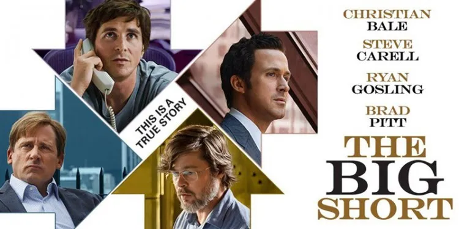

## 不要错误地理解“危机”

美股又熔断了。

我不搞经济不做金融，所以在这方面没什么发言权。但还是有一些思考，和大家分享一下。

简单来说，就是：现在的情况，**不要老想着抄底。**

当然，如果你钱多，当我没说；能无限补仓，当我没说；是赌神，当我没说。

为什么？全球因为疫情的原因，处在巨大的不确定性中。而**不确定性，是金融市场最讨厌的属性。**

**什么时候疫情的态势明朗了，什么时候才适合再次投资。**

 

很多人都说，现在是经济危机的节奏，危机危机，有危就有机。所以有机会。

但我不这么看。**既然叫危机，危一定大于机。**2008 年金融危机，无数企业和个人破产，甚至多个“百年老店”轰然倒塌，所以才称为危机。而不是无数人在其中能赚到钱。

相反，在过去几年甚至十几年里，世界整体平和发展，逐渐向全球一体化行进，各行各业在科技发展的带动下稳定前进，贸易往来平稳，在这样的一点危机的影子都没有的过程中，大多数人才都能赚到钱。

 

有没有人在经济危机中赚到钱？有。

贾瑞德·韦内特，迈克尔·布瑞，马克·鲍姆，本·霍克特。他们赚到钱了。

他们是谁？就是著名电影《大空头》中描述的人物。

要知道，他们是如此的稀有，竟然能在巨大的危机中赚到钱，所以才会被拍成电影，成为传奇。

如果你觉得自己也是电影主角，传奇人物，当我没说。

 

现在，在这样一个大环境中，现金为王。直到疫情结束，或者个别的行业领域有着非常明朗的局势发展，才可以考虑在这些局势明朗的领域投资。

过去中国十几年的经济高速发展，使得我们根本没有经受过金融危机。很多人会下意识地觉得：要把钱投出去，钱才不会贬值。

但这个逻辑，在大的经济震荡下并不成立。在当下，**少输，就是多赚。**

 

再次声明：我不是金融专家，**以上纯属胡扯。**

只是，作为一名逻辑和数学的爱好者，单纯地提醒大家：无论是从逻辑分析的角度，还是从概率的角度，现在都不是投资赚钱的好时机。

但是，诸多被疫情打击重大的行业，在疫情结束后，一定会重新崛起。比如航空业，比如旅游业。完全没有道理人们以后不坐飞机了，或者不再旅游了。

如果是这样的话，长期来看，现在购买这些行业的股票或相关基金，其实是没毛病的。

但问题在于，由于疫情产生的不确定性，所以这些行业很有可能还完全没有到达底部；从短期的角度看，就会觉得很赔。

所谓抄底抄到半山腰。

所以，还是要等疫情结束，一切局势明朗之后，再开始做投资，或许是最明智的。

**大家加油！**

 

**P.S.1**

今天有一个小思考。没有答案，不是事实，只是**胡思乱想**。

川普政府要给每个美国人发 1000 刀的支票。而且搞不好，总共要发 2000 刀，甚至有人建议，每个美国人在这场疫情期间，要发 4500 刀。

我们就看比较确定的这 1000 刀。每个美国人拿到这 1000 刀，他们会花在哪个领域？

如果想明白这一点，是不是意味着，这个领域，甚至是某个特定的公司，短期内有上涨的可能？

不知道为什么，我觉得很多美国人会去买新的苹果手机，苹果电脑，或者苹果无线耳机。尤其是今天，苹果还发布了诸多新品。

如果真是这样，是不是意味着，短期内，苹果股票有逆势增长的可能？

注：本段内容不构成任何投资建议。

 

**P.S. 2**

《大空头》被拍成了电影，其实是根据美国作家迈克尔.刘易斯的书：《大空头》，改编的。

迈克尔.刘易斯的这本书，不仅仅描述了一场“小人物”的财富传奇，呈现了人性的缺陷和金融体系的弊端，更有很多引人深思的东西隐藏在字里行间。

投行如何用风险的复杂化掩盖产品的风险？评级制度存在怎样的盲点？金融界怎样运用术语的谎言欺骗客户？危机过后，我们应该如何行动？

相信这本书会给你全新的思考和启发。