## 美国要钱不要命？

关于美国，我是真的看不懂了。

我只摆出我知道的事实，记录一下这魔幻的世界。

美国在最近一周的疫情发展，相信很多同学都是知道的。简单来说就是指数增长。

是的，你没有看错，今天一天新增确诊 1 万多。我查了一下中国的数据，除了 2 月 12 日因为检测手段的改变，中国单日新增达到了 15152 例，在其他时间，中国新增确诊的峰值，不过是 3887 例。

这还要考虑，中国人口密度不知道比美国高多少倍，疫情爆发时正值春节期间，人口流动也不知道比以往高多少。

当然，美国的重灾区是纽约。单单一个纽约州，拿下来美国 50% 的确诊病例。而纽约市本身确实是一个人口密度超高的城市。再加上纽约的国际化程度不知道比武汉高了多少数量级，每天往返纽约的国际航班数不胜数。川普虽然早早地切断了和中国往来的航班，但是对欧洲的行动明显晚了。而最近，欧洲的大爆发，大家也应该看到了。

在这样严峻的情况下，从上周一开始，美国大部分州陆续实施了一个称为 shelter in place 的行政命令。字面的意思就是原地庇护。

这个命令强制让非民众生活必需的企业关门，大多数人都在家办公，甚至是待业。

这个命令就是现阶段西方世界的“封城令”了。说白了就是鼓励大家都尽量待在家里，别乱跑，减少传染。

虽说如此，但是，这个命令并没有强制大家 24 小时待在家里，而是可以在“必要”的情况下外出。

什么叫必要的情况呢？比如要去医院看病，去超市购物，就是必要的情况。

除此之外，遛狗也是必要的情况。所以，可能很多人都在网上看到过类似的段子。

 

貌似在欧洲的措施也是如此，所以我在网上还看过关于西班牙的这样的段子。

 

除了遛狗，其实，到附近的公园遛弯儿，也是必要的情况！所以，一家子还是可以开开心心出去遛弯儿的。但是，碰见邻居朋友，不要走近，保持距离就好。

上周，我出去买了一趟东西，给我的感觉是：明显的，在户外遛弯，跑步，甚至是骑行的人，**变！多！了！**因为大家现在都在家办公或者**在家不办公**，闲得没事儿就跑出来透气儿了。

所以，虽然我所在的 Santa Clara County 是加州的重灾区，但是走在街上，却看见大家若无其事地漫步，遛狗，闲谈，骑行......，想象医院里有无数医生护士正在发愁防护用品不够，有无数患者正在和病魔甚至是死亡做斗争，我感觉这个世界无比的魔幻......

 

在过去的一周，我不停地思考：这样级别的“封城”，到底是否有效？毕竟，无论是欧洲的数据，还是美国的数据，就无情地摆在我们面前。

但事实证明，我太单纯了。从今天白宫的记者会看，川普下一步措施，很有可能不是加强“封锁”，不是进一步控制病毒，**而是... 直接复工...**

是的，川普觉得，这样的行政命令，已经太极端了（？？？）。所以，今天《纽约时报》上，新闻报道是这样的：

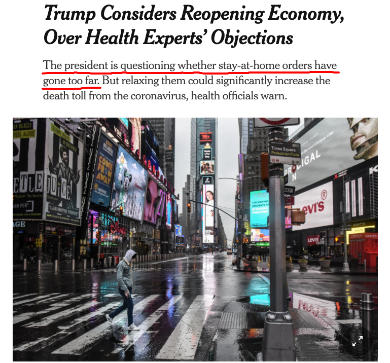

简单翻译：尽管卫生健康专家极力反对，但川普仍然在思考重启经济。总统质疑：“待在家里”的行政命令是不是太过分了？

 

在这篇文章中，表露出了川普政府和保守派的一个顾虑：**现在这样“封城”，国家所承受的经济打击，可能比病毒导致的死亡还严重。**

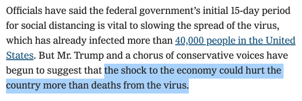

 

川普表示：我们的国家不是为了封城而建立的。**我们不能让问题的解决方案，比问题本身还糟糕。**

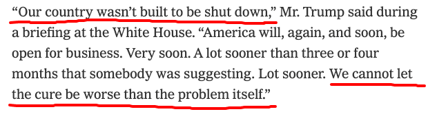

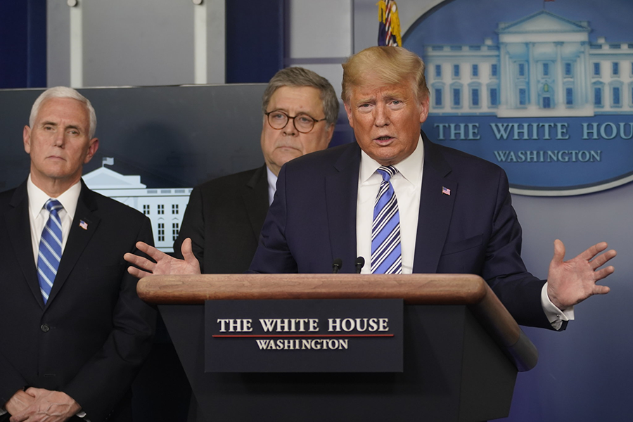

 

这话是什么意思呢？**说白了，就是要早复工。**

紧接着，高盛集团前首席执行官 Lloyd Blankfein 发表了推特。其中明确表明：**在很短的几个星期之内，我们就需要让那些低风险的人回到工作岗位中。**（年轻人？）

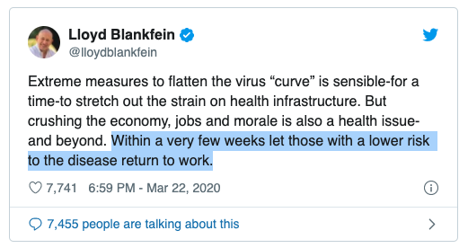

 

川普政府的经济团队也表示，这个病毒并没有对美国人的生命和经济造成巨大的威胁，和普通流感差不多。**甚至很多智囊专家认为：白宫已经反应过度了。**

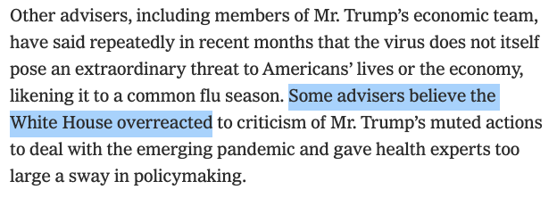

 

Excuse me？这种随时随地大家都能出门遛狗买菜遛弯骑行的管控措施，反应过度了？所以因为美国已经反应过度了，于是确诊人数开始指数上升？

嗯，反正**川普说：新冠病毒对美国人的威胁，和流感与车祸，是一个级别的。**

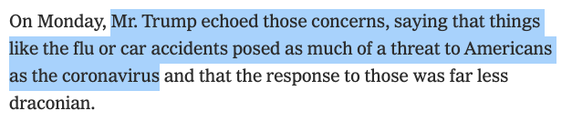

 

共和党和保守派说说这话也可以理解。但是，现在全美国最严重的地区——纽约州的州长 Cuomo，在今天也表示：我们不得不思考：是不是所有人都需要离开工作？年轻人是不是应该更快回到工作岗位中？

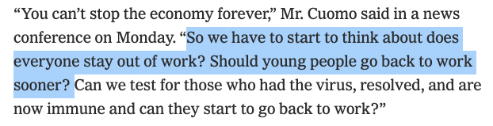

通过上面 Cuomo 的发言，可以看到，Cuomo 说的还是挺含蓄的。后面表露出了：**我们有没有可能让那些已经感染病毒的，但是自愈了，现在已经免疫的人群，回到工作中？**

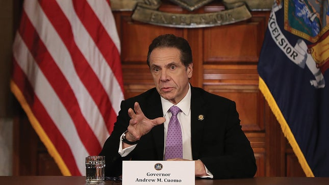

 

不管怎么样，现在美国各个州发布的 shelter in order 行政命令，大多是 15 天的时间，也就是两周的时间。按照今天川普表露的意思，他希望顶多再延期 1 个礼拜，也就是 3 周以后，就开始复工。

然而，这 3 周已经过去了 1 周，目测美国的峰值还没有来临。此时谈复工，是不是太早了？

当然，我不是经济学家，不懂这些政策。可是，我们面对的是一种烈性传染病。**此时，我们是不是应该以尊重传染病专家的意见为主？**

实际上，近乎所有的医学卫生领域的专家，都对此表示抗议。因为，很明确的，**中国和韩国的经验告诉大家：控制这个病毒的核心，是严格地管制和广泛地测试。**

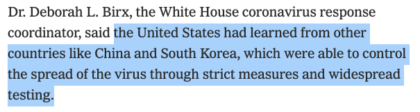

 

否则的话，很有可能将会出现尸体堆积如山的情况。

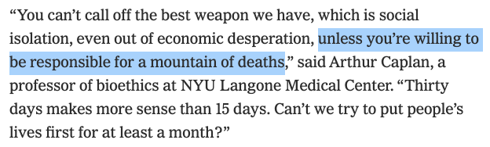

 

而美国的国家传染病研究所主任福奇（Fauci），则明确表示，至少需要好几周的时间，人们才能回到正常的生活中。

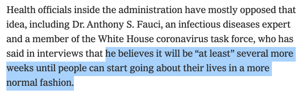

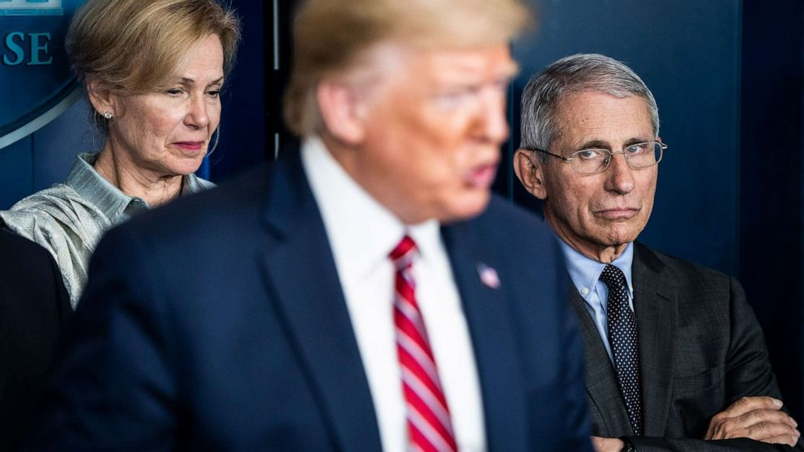

 

这位福奇先生，此前已经多次和川普意见不合，包括在川普高喊“中国病毒”的时候，福奇也表达了强烈地不满。于是，在今天的白宫简报会上，福奇消失了。

很多人都在猜测：福奇为什么不见了？不会是被川普政府踢出去了吧？

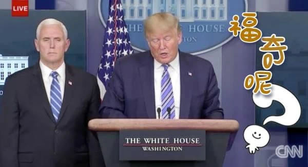

 

虽然现在，白宫对于具体下一步的决策还没有明确。但是，在美国确诊人数指数增长，丝毫没有减缓的情况下，“领导们”就已经开始谈复工，这实在让很多人有些担心。

今天，我见到的最多的评论就是：**要钱不要命。**

可关键是，这钱，大多是给资本家赚的；但是命呢？是千千万万普通劳动者的性命。

命要没了，钱有什么用？

于是，今天在 Twitter 上，一个新的标签火了，叫 General Strike。翻译过来，就是**全面罢工**。

比如这条推特，我觉得挺能代表大多数人的心声：

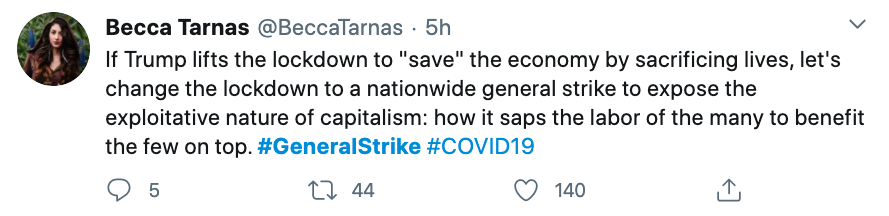

翻译：如果川普要牺牲大众的生命来“拯救”经济的话，那就让我们开始一场全面的罢工，来揭示资本主义的本性：靠剥削千千万万的劳动者，让属于顶端的极少数资本家受益。

 

美国下一步要走的路，是不是要钱不要命的路？虽然现在下结论还为时过早，毕竟，不靠谱的川普临时突然改变主意也是常事儿。

但是，现如今，在上层社会发出了这样的声音，实在是让普通民众心里不很舒服。

我在之前，刚刚写过一篇文章：[《群体免疫背后的数学》](../2020-03-15/)，向大家科普“群体免疫”。

在这篇文章中，我向大家解释了：**英国政府说的群体免疫，是一种结果，而不是一个措施。**英国政府的意思是：最终，英国会达到有 60% 的人口染病这一结果；但这并不要让每个人赶紧去染病，以达到群体免疫。实际恰恰相反，英国政府需要想办法减缓这一过程。

结果今天，美国政府来打我脸了。川普好像在说：凭什么群体免疫不能是措施？

相较而言，英国弱爆了。

 

不过，一百多年前，马克思在《资本论》中就告诉我们了：“资本自从来到世间，从头到脚，每一个毛孔都滴着血和肮脏的东西。”

我们的历史课本也在不断告诫我们：资本主义社会是吃人的社会。

看来，我要好好复习一下中学历史了。

 

**P.S.**

这篇文章的题图，是 New Yorker 今年 3 月 9 日刊的封面。是一幅漫画，我觉得挺有意思。

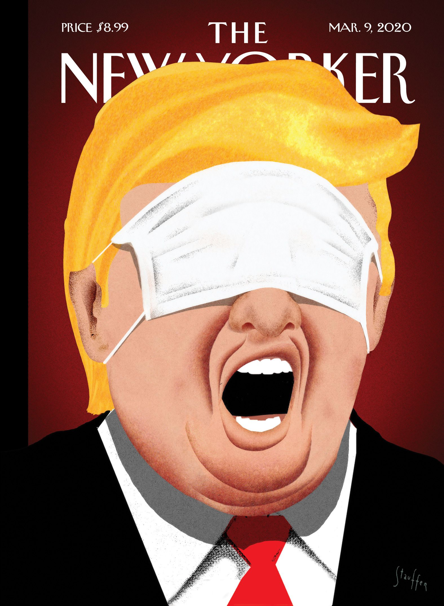

在这样一个时期，口罩本来应该遮住鼻子和嘴巴，阻止病毒传播。但川普却被口罩蒙住了眼睛，嘴巴依然大张着，胡扯着。