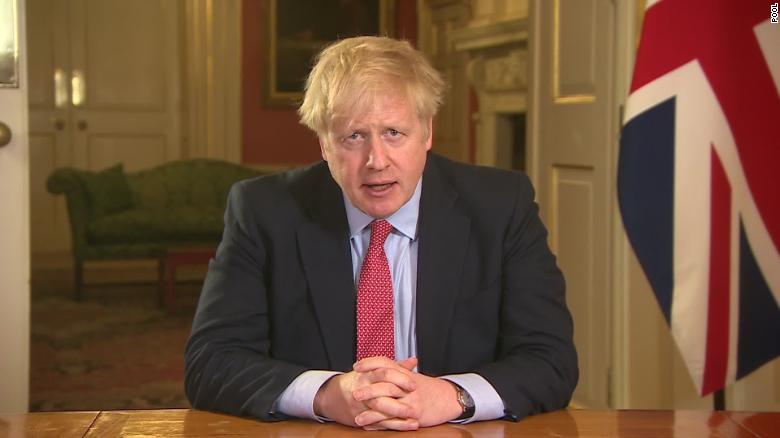
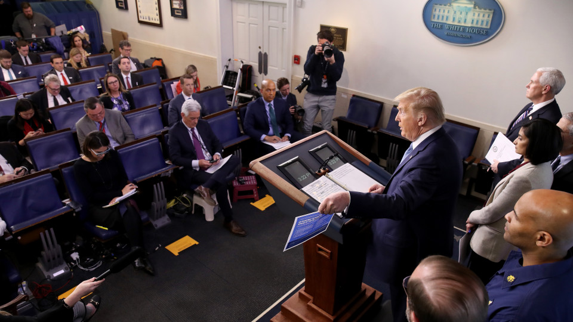
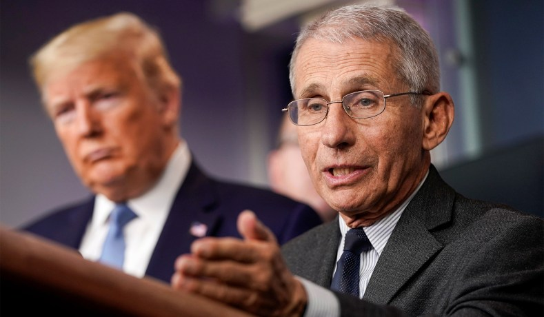
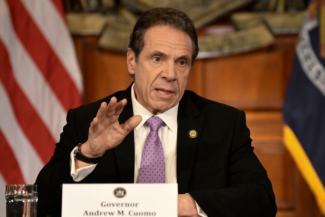
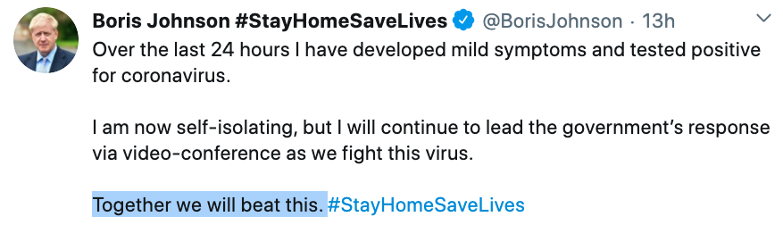

## 英国首相傻？

大家应该都知道了，英国首相 Boris Johnson，新冠病毒确诊为阳性。

一时间，大家炸锅了。

因为，这是至今为止，最高级别的国家领导人，确诊感染了新冠病毒。

 

网络上一时炸了锅。很多人都在问，“为什么这个新冠病毒，看起来专门攻击各国政要和达官显贵？”

有的人说，“这其实是一种错觉。毕竟全球有那么多人感染，其中达官显贵还是只占小部分的。但是达官显贵们更具有新闻价值，所以当这些新闻出现在大家面前时，给了大家一个‘新冠病毒专攻达官显贵’的错觉。”

但有的人说，“可达官显贵的数量，本身也少啊。这么解释，似乎不够。”

有的人说，“不完全是错觉。毕竟，在其他的灾难中，似乎没见那么多名人出事儿。”

有的人说，“其实这是医疗资源分配不平等的体现。有钱有权的人，可以在第一时间获得检测。”

很多专家都认为，新冠病毒感染的人群数量，已经远远超过现在已知的确诊数字了。只不过，我们做不到给每个人都检测而已。

甚至，昨天《金融时报》的新闻报道，有科学家的模型表示：在英国，很有可能已经有 50% 的人口，感染了新冠病毒。

但还有的人认为，是因为这些名人的社交活动更多，更频繁。

有的人说，“我在过去三天，只接触了三个人，但我通过电视，可以想象，那些政要名流，在过去三天，至少接触了 300 人。”

如果你去看美国每天的白宫记者会，就会知道，现在的情况是这样的。

虽然参与的记者应该已经减少了很多，虽然大家已经有意识地隔着位子坐着，但这依然是一个狭小的，密闭的空间，其中容纳了几十个人。大家都没有戴口罩。

我觉得不可思议，更为川普捏一把汗。

毕竟，川普今年已经 74 岁了。而他旁边站着的彭斯，也已经 61 岁了。至于美国的传染病专家福奇，今年 70 岁了。

 

讲真，很多时候，我都有种错觉，**觉得我每天关注的不是疫情，而是一场大型励志秀。**

在这帮老家伙你来我往针锋相对吵得不可开交的时候，很多人都觉得这是一个世界级的笑话。

可我再看微信里一帮人讨论程序员 35 岁要怎么办，我笑笑不说话。

 

那么英国首相 Boris Johnson 感染新冠病毒，其传染源究竟在哪里？

没有人知道。

据媒体报道，英国内阁内部已经开始了大规模的检测。

英国首相 Boris Johnson 自己说，“我在医院和所有的人都有握手，包括确诊了新冠病毒的病人。”

很多人都批评他。因为英国政府现在建议陌生人之间，应该尽量保持两米的距离。但他身为的首相，竟然带头无视这一建议，还和所有人都握手。

对于无视自己制定的规矩，美国也不甘示弱。

美国早就让公众停止了大型的集会活动。从 100 人，到 35 人，到 25 人，到 10 人。现在更是建议大家，只要没有住在一起，哪怕是邻居，两个人也别聚了。请自觉保持 2 米，这叫社交距离，social distance。

但大家可以数数上面美国白宫记者会的照片里的人头，这分明是每天一场大型集会啊！

 

有的人说，“没办法，这就是他们的工作。”

但有的人说，“有办法的。办法总比困难多，就看你愿不愿意采用。”

有人说，“英国首相傻，现在轮到自己了吧？”

我搜了一下维基百科。英国首相 Boris Johnson 是牛津大学的高材生。

他真的傻吗？

可能在很多人心里，他真的傻吧。

但我相信，在另外一些人眼里，他是非凡的。

而在这个世界上，哪怕有一个人，仅仅是一个人，真心地相信，你是非凡的，我都觉得，不枉此生了。

这话说得跟悼词似的。

但其实，英国首相 Boris Johnson，现在还活蹦乱跳呢。他今年才 56 岁。

纽约州长 Cuomo 说，“80% 的人都可以自愈。”我相信英国首相 Boris Johnson 一定觉得自己是那 80% 里的一个。

对了，顺便一提，纽约州长 Cuomo，今年 63。

 

现在，英国首相 Boris Johnson 开始在家隔离了。

但是，他其实是在家办公。

他在 twitter 上说，他还会继续，通过视频会议的方式，领导英国政府，抗击病毒。

他说：**我们一起，会战胜这一切。**

**Together we will beat this.**

 

**大家加油！**