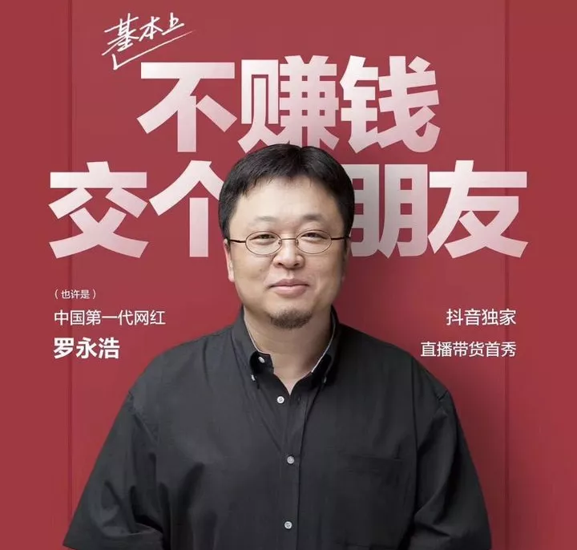

## 随便聊聊老罗的直播

有同学让我聊聊老罗的直播。

首先声明，因为时差，我并没有看这场直播。同时，我也完全不是直播购物的用户，完全没有使用这种渠道买过东西。

今天早上看到朋友圈里很多人晒单，随便聊聊自己的感觉。不一定对，和大家分享。

我的核心观点就是：老罗在直播带货这条路上能不能特别成功，还有待观察。

凭借老罗的人气，前两三次的数字肯定不错。但是后续怎么样？不好说。

为什么我这样以为？我要是没理解错，这次参与直播的，大多数用户，其实是第一次使用抖音的直播电商服务。他们主要不是来直播购物的，而是来看老罗表演的，或者是看热闹的。

那么这次以后，这波用户的留存率是怎么样的？需要观察。

或许也正是因为这个原因，那个中性笔卖得最火。因为笔这个商品，使用场景广，买来肯定能用，价格也便宜，下单不需要做太多心理建设。

如果我参与这场直播，想买点儿什么来“纪念”，或者证明，我参与了这次活动，恐怕我的第一选择，也是这杆笔。

但是以后，老罗的直播购物场次多了，用户还会不会场场都来买“纪念品”？我觉得不好说。

而且，大家明白了老罗直播带货是怎么回事儿以后，真正参与的主力军，肯定还是直播购物的用户。那么横向比拼，肯定还是要和李佳琦或者薇娅这样的专业选手比拼。

换句话说，**最后拼的一定是专业能力，而不是人气。**

人气能给你带来一波流量，但并不能带来持续的流量。这就是为什么柳传志做柳桃，潘石屹做潘苹果，都没做起来的原因。

别说这些大佬跨界做水果了，就算是微软，曾经市值世界第一，在桌面操作系统已经是妥妥的霸主了。但是，做一个移动操作系统 Windows Phone，还是会翻车。为什么？专业不同。过去积累的人气，并不能保证绝对的成功。

当然，我不懂直播带货行业的专业门槛是什么。可能是价格谈判，可能是选品，可能是节奏把握，可能是观众心理分析。但不管怎么样，根据我的经验，**任何能赚钱的行业，都是充满竞争的，都绝不是简单的。**情怀能管一时，但不能管一世。

这就是为什么，老罗一说做手机，有那么多粉丝拥护，每年发布会座无虚席，媒体轮番报道，但最终，锤子手机还是失败了的原因。

当然，道理上，直播带货应该比做手机难度小了很多。

不管怎样，希望老罗这次能成功。

毕竟，我也是在大学，听着《老罗语录》，成长起来的那批人：）

**老罗加油！**

**大家加油！：）**

 

P.S.

我很喜欢这个广告语。

不赚钱，交个朋友：）

