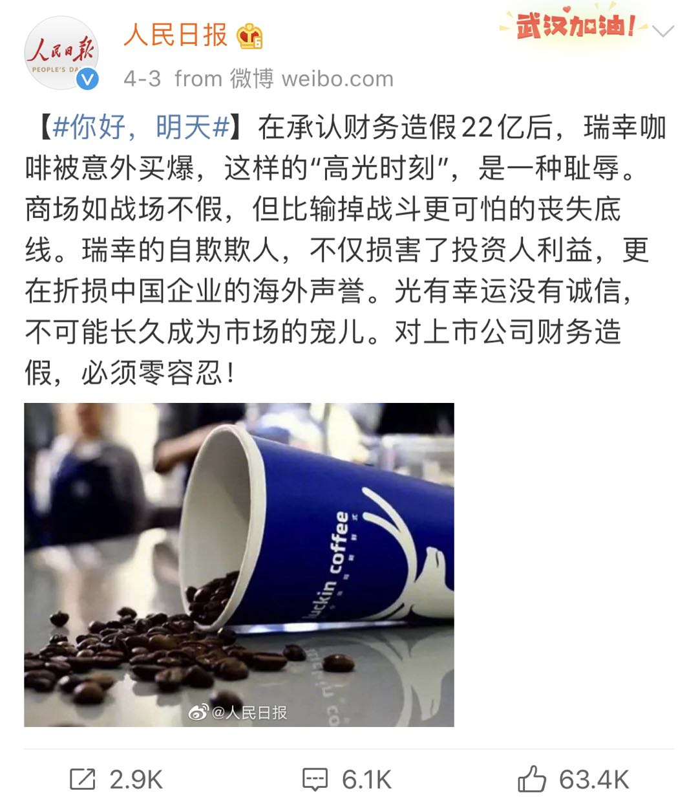

## 还要不要喝瑞幸咖啡？

瑞幸咖啡的事情，相信大家都知道了。在这里不赘述了。

瑞幸咖啡肯定不是什么民族之光，这没什么可争辩的。不管坑的是谁的钱，我们也不能把一个造假的企业看作民族之光。

更何况，从更长远的角度看，造假这样的行为，大概率是在坑我们自己企业的海外信用。

对此，人民日报也已经定调了。

 

转而一个有意思的问题来了：现在，我们还应该喝瑞幸咖啡吗？

网上有人高呼瑞幸咖啡是民族之光，去支持它；有人高呼瑞幸咖啡可耻，抵制它。

我倒觉得，喝不喝瑞幸咖啡，和它是不是民族之光，是不是民族之耻，或者有没有财务造假，没什么关系。

因为作为顾客，来到瑞幸咖啡的门店，掏出真金白银来，是为了购买一杯安全，好喝的咖啡，而不是来做审计，来查账，来看这个企业背后的账目是否有问题的。

决定我们该不该喝这杯咖啡的条件，只有：

1. 我们需不需要这杯咖啡；

2. 这杯咖啡是否是满足基本的食品安全标准；

3. 我们是否认可商家对这杯咖啡的定价。

 

这有点儿像街边不停喊着“清仓大甩卖，两元两元，一律两元”的小店。

可能小店的老板真的急需用钱，所以商品全都特价处理。此时，我们作为消费者，其实无需，也无权去调查，老板清仓甩卖，急需要钱，到底是因为赌博？还是吸毒？或者做了什么妖？这些和我们消费者八竿子打不着。

只要这家店的东西是合格的，我们觉得自己需要，价钱又值得，那就可以买。至于老板到底出了什么事儿，自然有该处理这个事情的机关或者组织，来完成他们的工作。

但是，如果我们发现东西不够好，两块钱都不值，那我们也不会去买的。如果是不合格的假冒伪劣商品，我们还要把他举报给工商局。这和老板缺不缺钱，为什么缺钱，一点儿关系都没有。

哪怕老板家人身患重病，也不能因为急需用钱，就出售假冒伪劣商品。一码归一码。

这就像瑞幸的咖啡再实惠，再好喝，也不能财务造假，是一个道理。**这是两个层面的事情。**

所以，**瑞幸咖啡造假是可耻的；但我不认为喝瑞幸咖啡是可耻的。**

这里提醒一句：如果瑞幸咖啡突然搞什么充值活动，一下子冲几千块钱那种，大家还是要小心，别是公司准备跑路前最后坑一下消费者。

依然是，有一说一，搞这种活动之后跑路，和他家咖啡质量怎么样，没什么关系。

 

当然，如果你看不惯它，坚决不喝他家的咖啡，我觉得也没毛病。只是我不赞成给依然喝瑞幸咖啡的人贴道德标签。

反过来，继续喝瑞幸咖啡的人，也无需打着支持民族之光的旗号。这杯咖啡要是卖 100 元，还真没什么人买。这就是市场经济而已。

大家其实都是普通人，用自己辛苦赚的钱，喝杯便宜的咖啡。这绝不是扬我国威，也绝不是丧权辱国。事情没那么复杂，也没什么可升华的。

至于资本市场的那些事情，什么审计造假，来不来几个亿几十个亿，其实跟我们大多数人关系不大。一杯咖啡，只是我们生活的一角而已。

 

我第一次喝瑞幸咖啡，也是目前为止唯一一次喝瑞幸咖啡，是在北京的故宫。

上前一问，听说下个 App 才能点单。第一次购买，完全免费。我和老婆二话不说，一人下了一个 App，领了一杯免费咖啡。

至于这杯咖啡好不好喝？我不是咖啡专家，甚至平时不会主动喝咖啡。但我还是要承认：免费的，真香。

如果真要变成 38 元一杯，我也不知道我的评价会不会有所改变。

如今，看到瑞幸咖啡出了这么一档子事儿，我和老婆聊起这个品牌，脑海中浮现的，不过是我俩在太和殿前的广场，端着一杯免费的咖啡，心中的窃喜。

或许，这就是我们的生活吧，平平淡淡的，和几个亿十几个亿，一点儿关系都没有。

而我想，终有一天，每个人都将明白：平平淡淡是多么的美好。

 

**大家加油！：）**