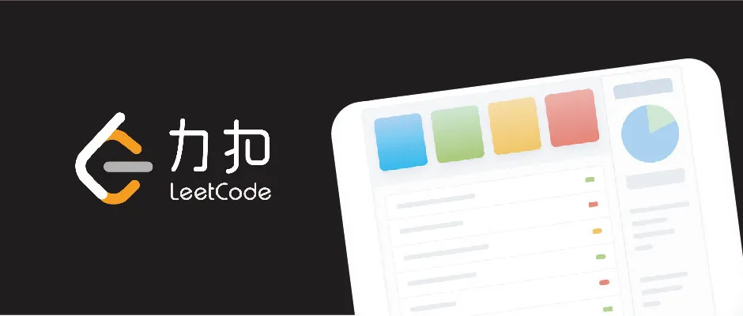
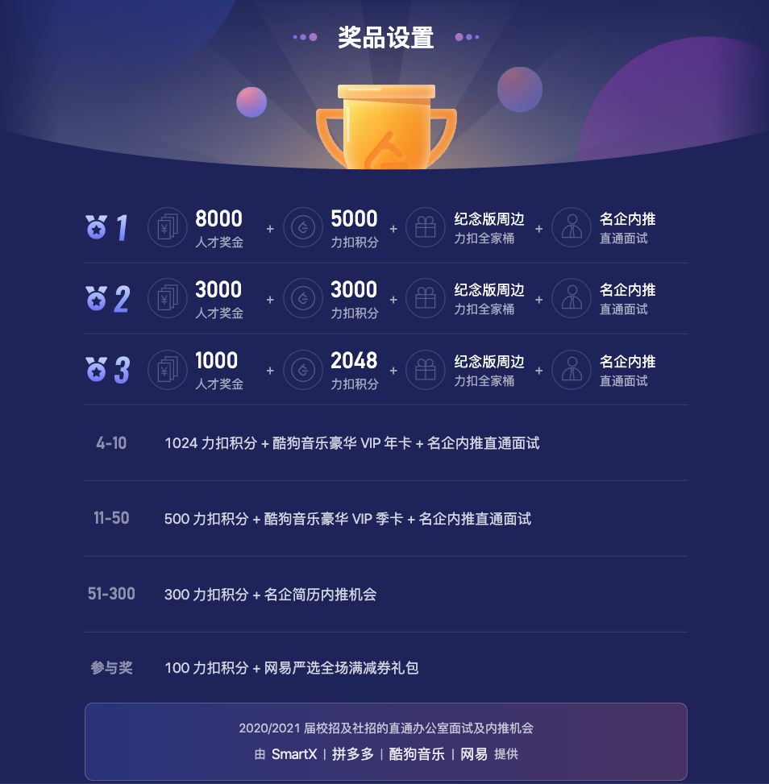

## 如果刷题有秘诀

在慕课网的算法课程中，有很多同学会问我关于刷题的问题。在这篇文章中，我挑一些典型的问题，简单聊聊我的思考，希望对大家有启发。

尤其是最后一条，希望大家一定要看看，可能是很多同学都有的问题：）

 

---

**问题一：刷题就是应试，所以到底要不要刷题？**

首先，刷题是不是应试？实话实说，我认为是的。

所以，当很多同学问我该不该刷题时，我都会反问：**你想刷题的目的，到底是什么？**

如果是在准备算法面试，我认为应该刷题；但如果你是想提高算法水平，并非是应付面试，我觉得可以选择不刷题。

在我看来，有很多书，都能很好地提高算法水平，加深对算法的理解。有机会我会向大家推荐一下这些书籍资料。因为这篇文章主要想聊刷题，就先不聊这些资料了。

为什么我认为准备算法面试应该刷题？

一方面，算法面试本身就是某种形式的“考试”。准备考试，应试一点，无可厚非。

实际上，由于国内的教育环境，使得“应试”一定程度成为了一个贬义词。但我倒觉得，我们可以更“中性”地看待它。就算你不刷题，面试前，看看面经，总是无可厚非的。但仔细想，看面经，也是另一种形式的“刷题”。

另外一方面，我接触了很多同学，拿到了大厂的 offer，他们的面试经历都在告诉我们，对于算法面试，刷题确实是有意义的。

尤其是力扣（LeetCode）上的问题，非常具有代表性。**甚至有同学告诉我，大厂一场面试七八道算法题，都是力扣（LeetCode）的原题。**

我和 LeetCode 的 CEO 一起吃过饭，聊过天儿。他告诉我，力扣的面试题，都是实打实的，最新的，一线大厂的实际算法面试题，是非常宝贵的资料。高效利用这些资料，将帮助我们在准备算法面试的过程中，事半功倍。

 

**问题二：遇到很多问题都没有思路，是不是算法水平还不够？还不应该刷题？**

很多同学想刷题，但是看了几道力扣（LeetCode）上的算法问题，发现自己不会做，于是就觉得自己现在的水平不适合刷题。

其实，我们在学习基础的算法和数据结构的过程中，大多数时候，主要学习的是经典的算法和数据结构的底层实现。但是具体到面试问题中，考察的多是这些算法和数据结构的应用，包括算法设计。

**底层实现和应用设计，不一样。**

能实现出一个栈，不代表面对一个问题，你能够灵活使用栈解决。实际上，很多需要使用栈解决的问题，是相当有难度的；

同理，能够实现出一个哈希表，也不代表面对一个问题，你能够轻易看出来它实际可以使用哈希表解决。

所以，如果你发现力扣（LeetCode）上有很多问题不会做，我倒是建议大家**把刷题的过程看作是学习的过程，而非“做题”的过程。**

学习是什么意思？就是不会很正常，都会了还学什么？看到一个问题不会，力扣（LeetCode）上，每个问题都有那么多题解，网上还有那么多博客写题解，多多利用这些资源，把不会的问题搞明白，就学会了，下次遇到类似的问题，就有经验了。

**所谓学习，不过如此。**

当然，对于有些问题，确实需要基础知识的支撑。比如动态规划，是让很多同学头疼的问题。想掌握好动态规划，我认为确实应该先对动态规划的经典问题，比如背包，LCS，LIS，编辑距离等，有一个基本的认识，在这个基础上再刷题。

但是，即使如此，也不代表学习了几个动态规划的典型问题，就能无障碍地迅速做出每一个动态规划的问题。如果真是如此，算法也就太简单了，大家也不会因此觉得头疼了。

一定要调整好心态，在刷题的过程中，遇到不会的问题，太正常了。把他们搞懂，从不会到会，就是进步的过程，也是我们刷题的目的。

 

**问题三：每次做力扣（LeetCode）的问题，不会的问题直接看题解，抄代码，但却发现没有进步，怎么办？**

上面我说，遇到不会的问题很正常，通过题解进而学习，是进步的源泉。

但有同学问我：我每次看完问题，想了几分钟，没有思路，然后就看题解，抄代码。这样坚持一段时间了，为什么觉得自己没进步？

道理很简单：因为，学习不是一个看问题，抄代码，如此反复，就能进步的过程。如果是这样，那么学习就太简单了。

学习之所以难，就难在**总结**这一步。

遇到一个问题，几分钟就放弃，实在是太快了。当然，不排除对于有些问题，大家很快就意识到超出了自己的能力范围，可以直接切换到学习模式。但是对于更多的问题，其实是我们努力一下，能够到的。

不妨多给自己一点时间，多给自己几次机会，哪怕最终自己无法完全把问题解决，能够凭自己的力量，离问题的解决更近一些，也是好的。

这个时间，我认为至少要有半个小时。甚至有时候，给自己一天的时间都不过分。把一个问题放到脑子里，吃饭的时候，跑步的时候，心思空闲了，就想一想，很多时候，就能有新的思路，进步就在这个过程中。

我甚至曾经把一些问题放到脑袋里一周的时间：）

实在想不出来，再看题解。看题解的时候就可以总结了：这个解题思路，和我的思考有什么不同？自己为什么想不出来？还是其实想出来了，但是在某一个地方只差临门一脚？**这样不断的对比和总结，是积累经验的关键。**

然后，试一试，根据题解的思路，自己能不能独立实现代码？如果不能，再总结：自己为什么写不出代码？是思路其实没有理解？还是某一个经典的算法实现自己其实没有掌握？亦或是自己的编码能力欠佳？如果自己的代码有 bug，自己能不能调通？**进步就在这个过程中。**

这个过程当然可能会花很长时间。但是，学习就是这样的一个时间叠加的过程。简单地看题，抄代码，看似省时间，但其实，白白浪费了很多学习进步的机会，是在浪费时间。

我曾经写过一篇文章，叫[《万能学习法》](../../2019/2019-08-20/)，就是告诉大家：**学习的关键，其实是自己的总结。通过总结，才能做到对知识的内化。没有总结，大多数学习都将是低效的。**

 

**问题四：是不是应该按照问题标签进行刷题？**

有很多同学，都习惯按照标签来刷题。这样做，作为学习，效果很好，无可厚非。

但是，从面试准备的角度看，这样刷题，可能是有问题的。因为，**一个问题的标签本身，其实是包含巨大信息量的，是一个很重要的提示。**

比如，如果直接告诉你，一个问题是动态规划，那么大家就可以直接去思考：怎么设计状态，状态转移是怎样的。这其实将问题简化了。如果没有这个标签，很多同学可能想不到这是一个 dp 问题。

在算法设计领域，这类问题特别多。另外一个典型的例子是二分搜索。对于一些问题，没有经验的同学，可能很难想到使用二分搜索去解决，但是一旦告诉你这个问题可以用二分搜索解决，其实就没什么难度了。

对此，我的建议是：刷题到一定程度以后，可以开始**尝试做力扣（LeetCode）的周赛**。甚至，有些同学时间紧，可能只有一个月的时间，没有时间专门系统地对每一类问题进行练习，我都直接建议，做周赛就好了。

**大家可以把力扣（LeetCode）的每一次周赛，都看作是一场实际的算法面试的模拟。**

力扣（LeetCode）的周赛每期四个问题，问题质量都很高。每场比赛的问题类型不定，没有标签。大家在做的时候，需要从头分析，每个问题需要使用什么算法解决。这在我看来，是非常重要的一个训练。

在这个过程中，如果发现自己对某一个类型的问题不熟悉，可以再有针对性地根据标签进行“特训”。

 

说到力扣（LeetCode）的周赛，就不得不提力扣（LeetCode）马上要举办的**「力扣杯」全国春季编程大赛了。**

这次比赛，**由力扣（LeetCode）主办，合作企业有 SmartX、 拼多多、 酷狗音乐、网易。**通过这个比赛，不但有机会赢取万元现金奖励，更可以获得名企大厂的内推机会。

这次**「力扣杯」全国春季编程大赛**总共有两场。一场是个人赛，一场是战队赛。

**个人赛的报名时间是：北京时间，即日起 至 4 月 17 日 23:59**；也就是还有一周时间。

**个人赛比赛时间是：北京时间，4 月 18 日 15:00 - 17:30。**

 

战队赛则是这次力扣（LeetCode）全新的比赛尝试，其实是在学习 ACM 的赛制，一队最多三个人，大家配合，可以尝试挑战更难的问题，也能锻炼大家在软件开发过程中的协调配合能力。

**战队赛的报名时间是：北京时间，即日起 至 4 月 24 日 23:59；**也就是还有两周的时间。

**战队赛比赛时间是：北京时间，4 月 25 日 15:00 - 18:00。**

 

这次 Leetcode 春季挑战赛，设计了丰富的奖品：

不过，可能对大多数同学来说，这些奖品都是次要的。

关键是：这是一次很好地展示自己的机会，更可能获得诸多大厂的面试或者内推的机会。

就算成绩不理想，也没什么损失，反正是一次锻炼自己的机会。比完赛以后，好好总结一下，自己对哪些问题还掌握得不透彻，继续努力，就好啦：）

**大家加油！：）**