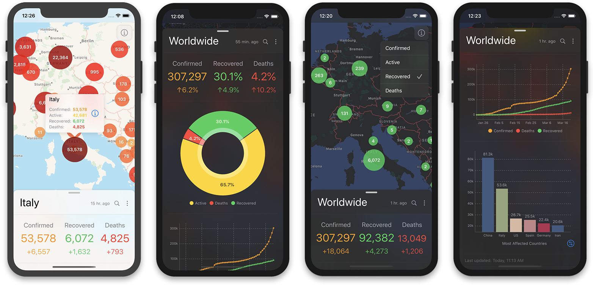
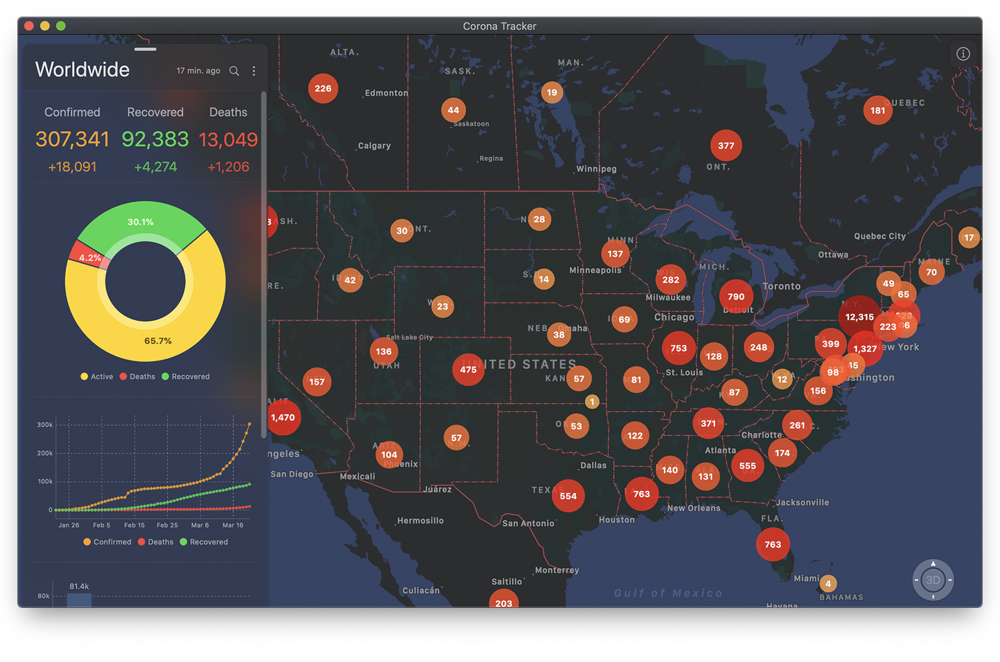
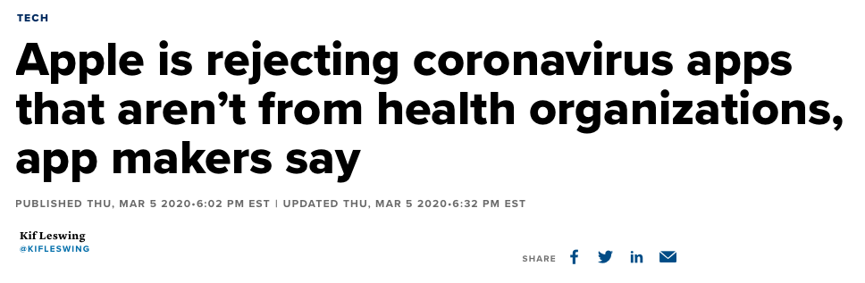
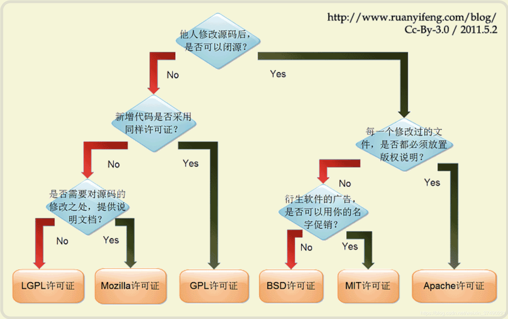
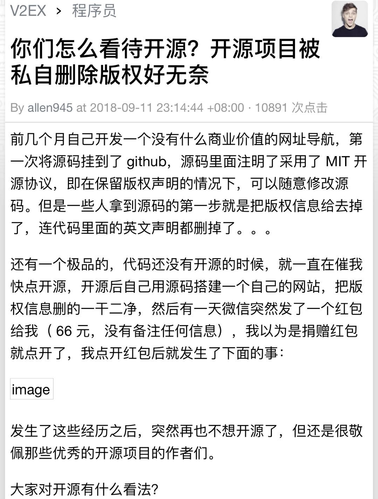
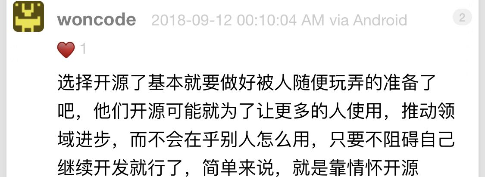

## 被沙特政府机构“盗用”的 iOS App

最近，在网上看到一个案例，觉得很有意思。

有一名国外的开发者，叫 mhdhejazi。他在新冠疫情期间，开发了一个 iOS App，叫 Corona Tracker。

这是一个追踪全世界各地区新冠病毒数据的 App。大家可以看一下，整体 App 设计是这样的：

可以看出来，界面设计相当专业，显然花费了不少心思。

 

不仅如此，这个 App 还针对 iPad 进行了适配：

 

同时，这个 App 也支持在 macOS 下使用。以下是在 macOS 下这个 App 的应用截图。

可以看出来，适配工作做得相当齐备。不夸张地说，比很多商业软件做得都出色。

作者甚至为这款 App 设计了完整的图标。 

 

这样一款出色的 App，开发者将它提交给苹果应用商店以后，被苹果公司拒绝了。

苹果的理由是：在现在这个疫情肆虐的时期，和疫情相关的数据或者新闻非常重要。为了避免虚假的数据或者新闻的传播，苹果应用商店规定，和新冠病毒相关的信息类应用，必须由权威的，经过认证的健康组织发布。

苹果公司的这个政策，在 3 月份就开始实施了。CNBC 对此也专门做过报道。

翻译：据 App 开发者说，苹果拒绝所有不来自健康机构的新冠病毒类 App。

 

苹果的这个政策其实无可厚非。这名开发者也认命了。反正他做这款 App，也没有什么商业企图。

于是，他直接将这款 App 完整地放在了 github 上，进行了开源。同时，整个项目使用 GPL 开源许可协议，声明不可商用。

在我看来，这也算是为世界做了不小的贡献。

对于这个开源项目，大家可以点击 [这里](https://github.com/mhdhejazi/CoronaTracker) 获得。

 

可是，另这名开发者没有想到的是，不久之后，他的这款开源的 App 项目，被沙特的一个政府机构：沙特国家健康信息中心，发布在了苹果的应用商店上。

可想而知，这名作者是非常气愤的。

对于这名作者的气愤，我非常理解。谁也不愿意自己的劳动成果，一转手，就成了别人名下的作品。

但是，从严格的法律意义的角度，这名开发者似乎真的没什么办法。

这里，就要简单和大家介绍一下什么是 GPL 协议了。

 

GPL 协议是 General Public License 的简称。翻译成中文，叫通用性公开许可证。

这个协议最主要的特点就是：**受 GPL 协议保护的开源项目，自始至终都必须以开放源代码的方式发布。**

换句话说，如果我看到一款开源的 App 特别好，只要这款 App 的源码是被 GPL 协议保护的，那我拿来修改，是没有问题的；甚至，我以自己的名义再发布一遍，也没问题。

**条件只有一个：我必须继续保持我的这个项目也是开源的。**也就是这个修改后的项目，也要遵守 GPL 协议。

如果，我在一个项目工程中，使用了受 GPL 协议保护的第三方代码，那么整个工程也就自动受到了 GPL 协议的约束，必须开源。

当然，这里其实有一个叫做“共同作品”的概念。但是对这些法律术语的详细解读，并非这篇文章的重点，也不是我的专长。大家大致理解 GPL 协议的主旨就好。

简而言之，**GPL 就是在说：这份代码，你去改，没问题；你去用，也没问题。但你必须保持开源。**

阮一峰大神曾经制作过一个非常简单清晰的图表，来说明这些开源协议的关系。

当然，这里面还有非常多的法律细节，不是这么一张简单的图表就可以解释清楚的。但是，各个开源协议的重点，在这张图中，已经表现得非常清晰了。

 

如果大家理解了 GPL，再看沙特国家健康信息中心的行为，就会发现，只要他们将上架的这款 App 开源，就没有违反 GPL 协议。**GPL 协议并不阻止源码的修改和二次分发。**

那么，沙特有没有对他们上架的这款 App 开源呢？我没有查证。但是，我个人认为，这没什么难的。毕竟，这并不是什么收费 App，也不涉及什么商业机密。

甚至，GPL 协议本身，其实并不阻止别人使用相应的源码，通过提供服务的方式来盈利，只要保证无偿提供源码就好。

比如，我修改一套受 GPL 保护的电商系统源码，上架了一个我自己的电商网站。那么基于这个电商网站的所有交易，都是合法的，并没有版权问题。**只要我保证：我自己的这套电商系统，也是开源的，所有人都可以很容易地无偿获得相应源码，就可以。**

我基于这个电商平台产生的所有交易收入，是我自己提供的服务赚取的收入，而不是贩卖这套源码获得的收入。那就不违背 GPL 协议。

 

所以，严格看沙特国家健康信息中心的做法，可能还真问题不大。但是，这个开发者非常不爽，我是非常理解的。相信大多数人也能理解。

对此，我其实在很早之前，刚接触开源项目的时候，就有一个思考。那就是：如果大家如果想避免此类问题，**不应该将完整的，可以直接商业化的，或者直接提交给应用商店的项目，进行完整的开源。**

大家可以选择自己项目中的核心部分做开源。

比如，对于这个新冠数据追踪的 iOS App 来说，作者可以封装一个获取世界各地新冠病毒数据的开源 API；或者包装一个能展示新冠病毒分布的地图组件，将这个 API，或者这个地图组件做开源。

这样做，既能为开源社区做贡献，又能积累自己的影响力。同时，也避免了软件直接盗用的问题。

其实，仔细观察很多企业或者部门机构的开源工程，大多也是遵循这一思路的。

当然，**既然选择了开源，就避免不了被人使用，也就无法避免被精于市场的组织或者个人拿去，赚更多的钱。**

如果对于这种可能性觉得非常不爽，我真心建议：不要开源。

**除非你非常清晰地想明白了自己开源的目的。**

**毕竟，鱼与熊掌不可兼得。**

 

**P.S.**

在写这篇文章的时候，我在 V2EX 上搜索到了这么一个话题。因为原作者是在公开平台上发布的信息，我也就不打码了：

 

作者描述的这个经历，其中的那个图已经显示不出来了。但是大家可以通过文字，大致了解这名作者的遭遇。

这个帖子下面有一个回复，我很喜欢。

 

开源能不能赚钱？能。有机会，可以和大家聊一聊这个话题。

但是，必须承认：还是有很多开源作者，尤其是老一辈开源作者，都是真正的理想主义者。

他们靠自己的情怀和热忱，极大地推动了整个计算机领域向前前进了一大步。也只有这样一群理想主义者，才可能想出 GPL 这种“奇葩”的协议吧。

曾经有一个人跟我说，他觉得大多数程序员真的傻，一点儿商业头脑都没有。

因为他去 github 转一圈儿，发现很多项目都有非常好的商业化前景，竟然就这样开源出去了，可惜。

对此，我笑笑不说话。

或许，很多程序员就是很傻，没有商业头脑；

或许，是他不理解程序员的情怀。毕竟，他不是一个程序员。夏虫不可语冰。

**向所有优秀的开源项目作者致敬。**

**大家加油！：）**