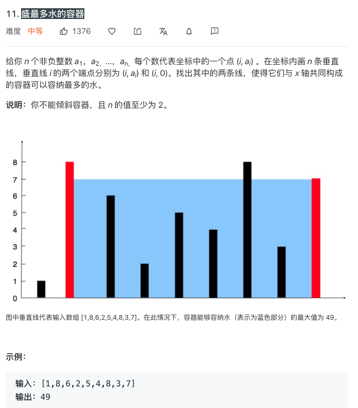
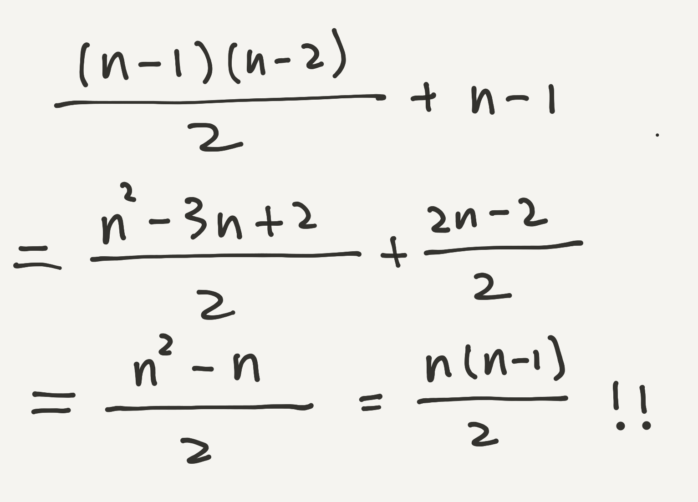

## 优雅地证明盛水容器问题

Leetcode 上第 11 号问题：盛最多水的容器，是一道非常经典的问题。不久前，一个同学还告诉我，他去字节跳动面试，考了一模一样的原题。



这个问题本身很好理解：在坐标轴的每个坐标位置都放上了一系列长度不等的竖板。要求在这些竖板中选出两块，这两块竖板和坐标轴组成了一个“容器”。这个容器的底就是这两块竖板所在的坐标之间的距离；而高则是这两块竖板之间的较短者。所谓短板效应。

问题是希望找到两块竖板，使得这个“容器”的面积最大。

<br/>

如果总共有 n 块木板可以选择的话，我们可以暴力枚举任意两块木板的组合，检查他们组成的容器面积，一共需要检查 n * (n - 1) / 2 对木板的组合。

如果会排列组合的同学，可以很轻易地使用组合公式得到这个结果，即：

**C(n, 2) = n * (n - 1) / 2**

<br/>

即使不擅长排列组合的同学，也可以非常容易地通过程序来分析出这个结果。我们的暴力枚举的程序伪码是这样的：（其中数组 a 存储了 n 个木板的高度）

```
res = 0;
for(i = 0; i < n; i ++)
    for(j = i + 1; j < n; j ++){
        // 判断使用 a[i] 和 a[j] 作为木板组成的容器是否是更大的容器
        // min(a[i], a[j]) 是容器的高度，即两块木板选短者
        // j - i 为容器的底
        res = max(res, min(a[i], a[j]) * (j - i));
    }
return res;
```

在上面的循环中，res 一共被比较计算了几次？

可以想象，当 i == 0 的时候，j 的取值范围是从 1 到 n-1，内循环一共计算了 n-1 次；

当 i == 1 的时候，j 的取值范围是从 2 到 n-1，内循环一共计算了 n-2 次；

当 i == 2 的时候，j 的取值范围是从 3 到 n-1，内循环一共计算了 n-3 次；

以此类推...

i 最大取值为 n - 2，此时 j 的取值为 n-1，内循环只计算了 1 次。

所以，整体，内循环计算的次数，就是 1 + 2 + 3 + ... + (n-3) + (n-2) + (n-1)。

这是一个等差数列求和，一共 n-1 项，首项为 1，末项为 n-1。带入等差数列求和公式，就是 **n * (n - 1) / 2**。

<br/>

很显然，这样暴力枚举，我们的算法时间复杂度是 O(n^2) 级别的。

实际上，这个问题有 O(n) 级别的解法，也就是大名鼎鼎的双指针解法，思路是这样的：

首先，使用 left 和 right 两个指针，分别指向最左边的木板 a[0] 和最右边的木板 a[n-1]。这样，left 和 right 就构成了一个容器。这个容器的面积，是我们的初始值。

下一步，我们只需要看 left 对应的木板和 right 对应的木板谁小，就好了。如果 left 更小，那么就 left ++，也就是下一步去检查 a[1] 和 a[n - 1] 组成的容器是否更大？如果 right 更小，那么就 right --，也就是看 a[0] 和 a[n - 2] 组成的容器是否更大？这个过程以此类推，如果发现了更大的容器，就更新结果。

算法伪码大概是这样的：

```
l = 0, r = n - 1;
res = 0;
while(l < r){
    // 判断使用 a[l] 和 a[r] 作为木板组成的容器是否是更大的容器
    res = max(res, min(a[l], a[r]) * (r - l)); 
    if(a[l] < a[r]) l ++;
    else r --;
}
return res;
```

可以看出来，这个过程，或者 left ++，或者 right --，木板之间的距离越来越小。直到 left 和 right 碰上，也就是两块木板重合了，容器的底为 0，此时，算法结束。

这个算法的复杂度是 O(n) 的。因为整个算法中，每一个木板都或者被 left 指针指过一次，或者被 right 指针指过一次，直到 left 和 right 汇合。

对应的，res 一共被计算了 n-1 次。因为两个木板才能形成一个容器。使用这种方式，n 个木板，**一共组成了 n-1 个容器。**

<br/>

这个算法看起来非常简单，但是，**一个很致命的问题是：这个算法为什么是正确的？**

一个直观的想法是：每次不管是 left 右移，还是 right 左移，容器的底都会减一。由于容器的底减小了，所以，如果我们要想得到更大的面积，就要让容器的高变大。整个容器的高是由最短的木板决定的，所以我们将两个木板中最短的那一个做改变，才有可能得到一个更大的容器。

这个解释模模糊糊说得通，但似乎并不是那么严格。关键在于，**这个解释没有说明：这个算法为什么没有漏掉一个可能的更大面积的容器？**

<br/>

Leetcode 的讨论区有很多关于这个算法的正确性的讨论，但我觉得大多数叙述的语言过于理论化了。也有同学在我的课程问答区问过我这个问题，所以，我写了这篇文章，尝试阐述一下这个问题。

我们来看初始的时候，left 指向 a[0]，right 指向 a[n-1]。我们假设 a[0] 是小于 a[n-1] 的，即 a[0] < a[n-1]。那么下一步，根据我们的算法，就是 left ++，即 left 下一步指向了 a[1]。

这意味着什么？这就意味着，使用 a[0] 和 a[n-2]；使用 a[0] 和 a[n-3]；使用 a[0] 和 a[n-4]；.... ；使用 a[0] 和 a[1]，这些木板的组合，我们都直接跳过去了，不去计算了。

换句话说，因为我们直接 left ++ 了，所以所有的以 a[0] 为左边木板的其他组合，都不看了。

为什么可以这样？

还记得我们的假设吗？a[0] 是小于 a[n-1] 的。所以，此时，整个容器的高度，是由 a[0] 决定的。因为，如果右边板的高度大于 a[0]，我们取短板，容器的高度还是 a[0]；如果右边的高度小于 a[0]，那么容器的高度比 a[0] 还要小。

而对于其他的以 a[0] 为左边木板的组合：a[0] 和 a[1]，a[0] 和 a[2]，a[0] 和 a[3]，...，a[0] 和 a[n-2]，底的长度都比 a[0] 和 a[n-1] 更小。而高度又不会超过 a[0]，所以，面积一定是更小的，我们就可以直接排除掉！

那么这个过程，我们一下子排除了多少组组合呢？答案是，左边是 a[0]，右边是 a[1] ... a[n-2]，一共 n-2 组组合，直接被我们扔掉了。

当然，如果我们假设 a[0] > a[n-1]，这个逻辑同样成立，只不过我们扔掉的组合，右边固定为 a[n-1]，左边是 a[1] 到 a[n-2]，还是 n-2 个组合。

<br/>

现在，假设我们的 left 指向 1 了，right 还是 n-1。再假设，这次是 a[1] > a[n-1] 了。那么，按照我们的算法，就应该是 right-- 了。

这次，有了上面的分析，相信大家就都理解了，我们不需要比较 a[2] 和 a[n-1]；a[3] 和 a[n-1]；a[4] 和 a[n-1]；...；a[n-3] 和 a[n-1]，a[n-2] 和 a[n-1]，这些组合了。

为什么？因为此时，a[1] 和 a[n-1] 这个组合中，容器的高度是由右边的板 a[n-1] 决定的。那么剩下的以 a[n-1] 为右侧板的所有容器，高度不可能大于 a[n-1] 了，而底却在缩小，所以，这些组合都可以直接扔掉，不计算了。

那么这次，我们扔掉了多少个组合？答案是右边固定为 a[n - 1]，左边是 a[2], a[3],...,a[n-2]，一共 n-3 个组合！

<br/>

相信大家可以看出规律来了。我们每次左指针或者右指针移动一次，其实都是扔掉了若干组合，不再需要比较了。

第一次移动，扔掉了 n-2 个组合；第二次移动，扔掉了 n-3 个组合；第三次移动，将扔掉 n-4 个组合，依次类推，直到最后一次移动，扔掉 1 个组合。

那么，我们在这个过程中，总共扔掉了多少组合？就是 1, 2, 3, ... , n-4, n-3, n-2 的和。大家可以看出来，这又是一个等差数列。首项是 1，末项是 n-2，一共 n-2 项。

带入等差数列求和公式，我们一共扔掉了 (n-1)*(n-2)/2 这么多个组合，不用去考虑。

现在，大家就可以计算一下了。回忆一下上面的叙述：

**我们一共扔掉了 (n-1)*(n-2)/2 这么多组合，只计算了 n-1 这么多组合。**

把他们加起来，是多少？



答案是 n * (n - 1) / 2！

大家回忆一下，这个数字正好就是 n 块木板，抽出两块，组成容器的所有可能方案！

**C(n, 2) = n * (n - 1) / 2！**

那么这也就证明了，我们的双指针算法，比较了 n-1 组木板，扔掉了 (n-1)*(n-2)/2 组木板，合在一起，已经完整地考虑了所有 n * (n - 1) / 2 组木板的组合了。

我们这个过程，不会漏掉任何一个组合，最终找到的解，一定是最优解！

怎么样？是不是觉得这个证明理解起来并不难？

<br/>

值得一提的是，虽然我们说这个问题是双指针的问题，但其实，在算法设计上，我们使用了贪心的思想。即每次把最短木板对应的所有其余组合都扔掉了。

而**对于贪心算法来说，最大的特点就是：通常代码都会比较简单，但要想证明贪心的正确性，会比较费劲。**这个问题就是一个很好的例子。

实际上，在 Leetcode 上，还有很多贪心的问题，拥有这样的特点。以后有机会，可以再向大家介绍。

<br/>

**大家加油！：）**