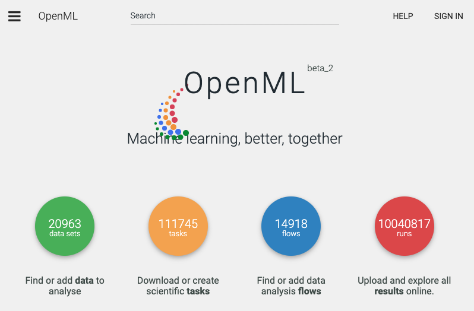
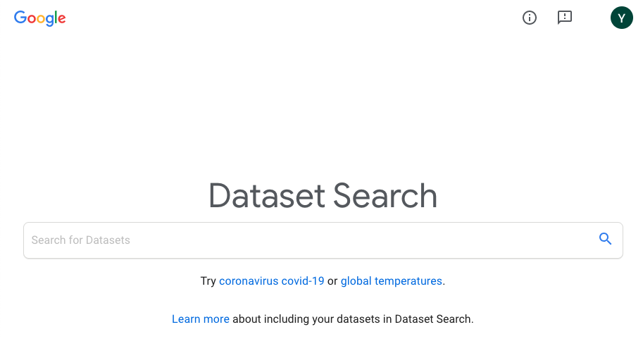

## 测试思维

这是在我的知识星球上，一个同学问我的问题。

bobo 老师，最近在看一些代码的时候遇到一个问题：要去哪里获取全面的测试用例呢？

那么多算法，那么多功能，自己实现之后，如果和模板代码不同，要怎么证明自己写的是正确的呢？不知道老师平时是如何解决这个问题的？

谢谢老师。

 

---

**bobo 老师的回答：**

如果是专门的领域，都有专门的测试数据库。比如人脸识别数据库，手写识别数据库，等等等等。

在这个公众号，我在[【是不是很酷】开源资源 分享 | 第 4 期](https://mp.weixin.qq.com/s?__biz=MzU4NTIxODYwMQ==&mid=2247484963&idx=2&sn=e7e5e2d0c3579a1a24f921141936784c&chksm=fd8ca965cafb2073bc3a444d2ab87bfa272dd2273e68f6758dac9911fb3dc9abe76f66c52491&token=52272915&lang=zh_CN#rd)中介绍过一个这类机器学习领域测试用例的下载站：[http://academictorrents.com/](http://academictorrents.com/)；

另外一个很重要的数据集的下载站是 OpenML：[https://www.openml.org/](https://www.openml.org/)

Google 也有一个专门的数据集搜索引擎：[https://datasetsearch.research.google.com/](https://datasetsearch.research.google.com/)

 

---

但这些都不是这篇文章的重点。

重点是，如果你说的是我们在平时开发过程中写的普通模块或者算法的测试用例，那对不起了，没有。

如果任何一个算法或者模块都能直接找到现成的完整测试用例的话，测试工程师这个岗位就没有意义了。

 

实际上，设计测试用例本身，也是每个开发人员都需要的素质。尤其是边界条件测试。因为如果开发者都不知道自己写的模块边界在哪里的话，也就不可能在程序中正确地处理考虑这些边界了。

大多数算法比赛，如果程序出错，也不会告诉你错误用例。这本质其实也是在考察参赛者的测试功底；在平时训练的时候，大家也需要锻炼自己的测试能力。

这并非没有道理，因为在很多企业或者项目组内部，都是做**测试驱动的开发**的。大家可以搜索一下这种开发模式，英文名称是 Test-Driven Development，缩写是 **TDD**。在我看来，是非常重要的一种开发模式。

 

除去边界条件测试，可能需要我们开发者进行手动设计以外（因为边界条件测试是具体问题相关的，需要具体问题具体分析），一个最简单的测试方式，就是根据问题的约束条件，随机生成数据做测试。

说“随机”显得太不高大上了。说得高大上一点儿，这叫**蒙特卡罗**。

随机生成数据就有了一个新问题：我们不仅仅需要输入数据，我们还需要知道这些输入数据所对应的正确答案是什么，才能和自己的代码输出做比对。

那么一个随机生成的，全新的数据，正确答案怎么来？

 

首先，**很多问题并不需要正确答案，我们可以直接验证答案的正确性。**

比如，为了验证一个排序算法是否正确，直接看最终的排序结果是否有序就好了。做一万轮随机测试，每一轮都生成一组随机序列，执行我们的排序算法，看结果是否有序，这是很可靠的一种测试方式。

**很多问题都是难求解，易验证的。**

再举个简单的例子：解方程就是这类问题。

解一个方程可能难死，甚至到现在，世界上大多数方程我们人类根本不知道怎么解。但是，验证一个解是否满足某个方程，则简单到爆。这也是很有意思的一个问题，更深入的分析涉及**计算理论**了。有兴趣的同学可以看看这门科学，不过和测试无关了。

 

当然，还有另外一类问题，确实需要我们有正确的答案。对于这种情况，其实也很简单：写一个暴力算法，算出正确数据，然后和我们的算法结果做比对。这叫**暴力对拍**。

比如，为了验证一个优化的矩阵乘法是否正确，可以写一个暴力的 O(n^3) 级别的矩阵算法去对拍；

为了验证一个 dp 算法是否正确，可以写一个暴力的回溯搜索算法做对拍。

很多算法竞赛的出题人都会用这种方式来验证标程的正确性的，这种方法在业界也很常用。

当然，这种方式的缺点是：不能测试大规模数据。不过，从验证算法正确性的角度，也并不需要大规模数据。

99.9% 的正确性问题，在小规模数据上就能验证出来。只不过，放到大规模数据上，可能会有不满足性能要求，或者申请系统资源过大的情况。而这些问题，已经不是正确性问题了。

说句题外话，我做算法竞赛的时候，一直秉持一个原则：一个问题可以做成 TLE，即超过时间限制；可以做成 MLE，即超过空间限制；但不能做成 WA，即答案错误。

因为 TLE，MLE，意味着没有使用某种优化方式；但 WA，意味着程序是有 bug 的。我认为这是基本功问题。程序可以超时，可以超空间，我们可以想办法优化它，或者学习更高效的方法。但是已经写出来的代码，不应该有错误。

 

最后，我经常使用的一个测试方式是：把自己写的一个模块封装成一个算法问题的解（如果可以的话），扔到 OJ 上做测试。比如为了测试自己写的二分搜索树是否正确，我会把这个二分搜索树的代码封装成一个集合类或者映射类，到 OJ 上找几个需要使用集合或者映射的问题，提交试一下。

这样做，省得我自己暴力对拍了。

不过，这基于我对很多典型的算法问题类型都很熟悉，也对一些 OJ 很熟悉，能够迅速将一些代码规约或者应用到某类典型算法问题上，然后通过 OJ 帮助我测试。

这种方法，我觉得其实不值得推广。

真正值得推广的是：**测试也是一门有深度的技术领域。**如果感兴趣，大家可以找找相关的书籍，学习一下测试领域的一些思维和技巧，资料应该还是挺多的。**最重要的是：培养测试思维。**

说实话，软件行业作为一门工程学科，行业整体对测试的强调，我认为是不够的。**这不仅仅是一个软件开发效率的问题，更是一个安全性的问题。**毕竟，软件已经和我们的生活越来越紧密地连接在了一起。

如果去看其他大部分工程学科，测试都是非常重要的一个工作。我们很难想象我们住的房屋结构，或者我们开的汽车，没有做过严谨的安全性测试；甚至，一个家具厂商在设计家具的过程中，做的测试，可能都比很多软件开发的过程做得测试还要多。

相信，随着软件行业的发展，测试会变得越来越重要。

因为，**测试思维是一种非常重要的工程思维，绝不仅仅只在计算机专业上。**

 

**大家加油！：）**