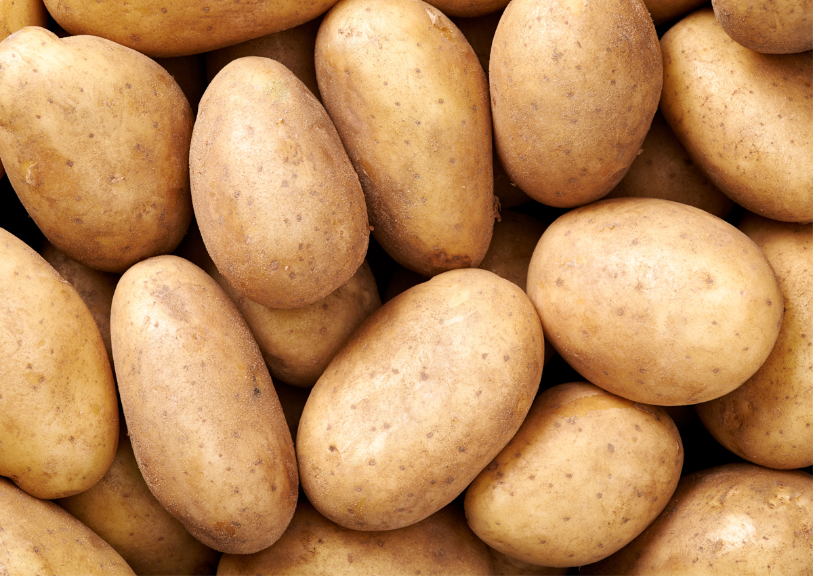
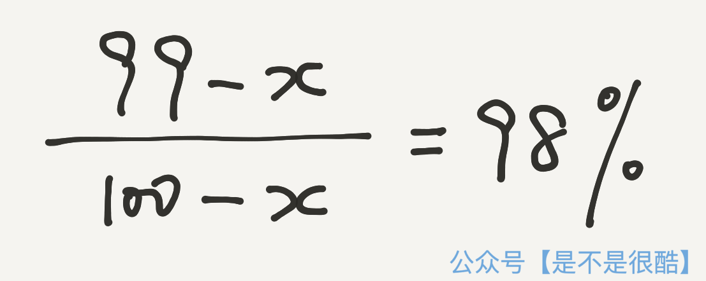
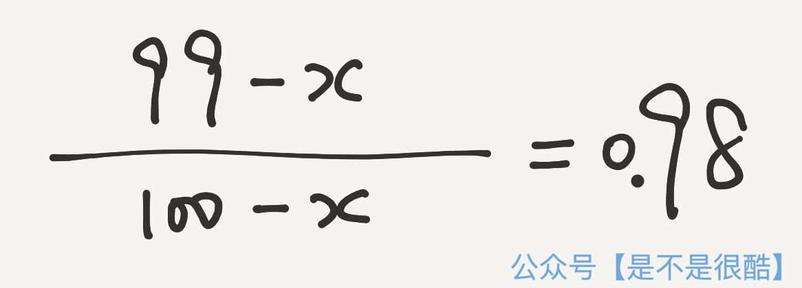
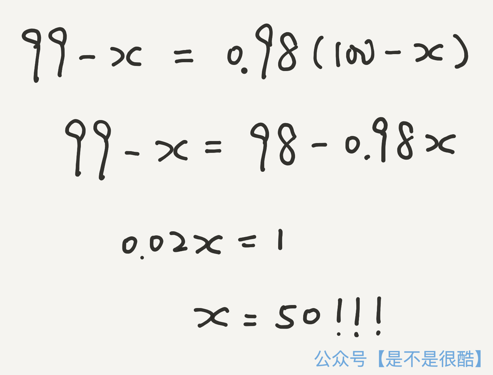
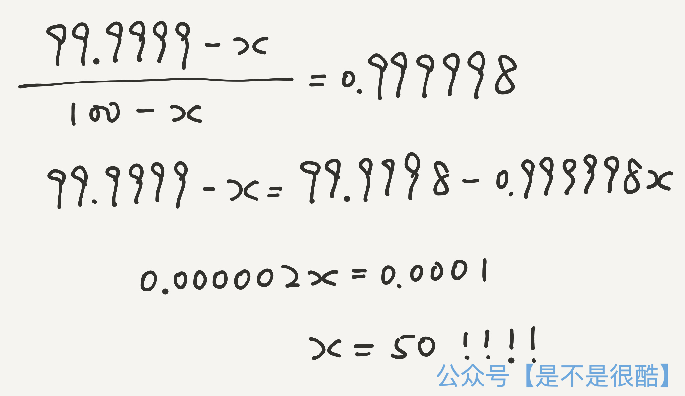
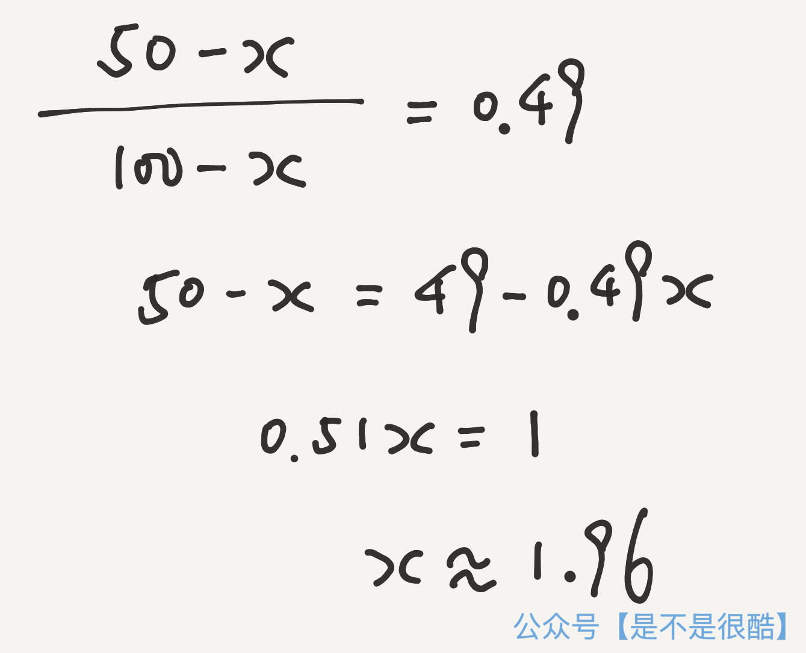

## 土豆悖论

你知道什么是土豆悖论吗？

土豆悖论来源于这样一个简单的数学问题：

你有 100 公斤的土豆，经过测量，这些土豆中含水量是 99%。你把他们放在阳台上，一晚过后，再测量，这些土豆的含水量变成了 98%。也就是土豆的含水量降低了 1%。

问：现在，这些土豆的总重量是多少？

严格的计算可能需要纸和笔。在这里，为了测试大家对数字的直觉，我给出几个选项，大家可以试试，不经过计算，选择一个你认为最接近的正确答案是多少？

A. 99 公斤

B. 98 公斤

C. 50 公斤

 

大多数第一次接触这个问题的童鞋，都会因为正确答案而感到惊讶。因为正确答案是：

**50 公斤！**

你猜对了吗？

 

---

要想计算这个问题，也非常简单，只需要最初等的解方程就可以。

初始的时候，100 公斤的土豆中，含有 99% 的水分，也就是有 99 公斤的水分。在阳台放一晚上以后，只含有 98% 的水分，也就是有一些水分被蒸发了。我们设蒸发的水分质量是 x 公斤。

所以，一晚上以后，剩下的水分就是 99 - x 公斤。

而现在，所有的土豆的质量，也不再是 100 公斤了，而变成了 100 - x 公斤。

现在，这 100 - x 公斤的土豆中，水分是 98%，我们就可以列出式子：

当然，98% 就是 0.98，为了计算方便，我们在方程中使用 0.98。

下面就是一个标准的解方程问题了，小学生都会算：

 

这个方程的解是 50。换句话说，一晚上要蒸发掉 50 公斤的水，也就是所有土豆重量的一半，才能让土豆的水分含量从 99%，下降到 98%。此时，剩余的土豆，从最初的 100 公斤，变成了只有 50 公斤了。

怎么样？是不是和你的直觉不相符？

这就是**土豆悖论**。

土豆悖论本身并不是一个可以推导出相悖结论的悖论，而是这个问题的解，和大多数人的直觉是相悖的。

 

---

土豆悖论说明了什么？

首先，就是人类对数字的感知，在很多时候，都是不准确的。尤其是当涉及到百分比的时候。

在统计学上，大名鼎鼎的**辛普森悖论**，在本质上也是这样一个和百分比相关的悖论。因为辛普森悖论太有名了，有很多文章介绍，所以我就不专门写了，有兴趣的同学，可以在互联网上搜索一下。

所以，当我们关注一个事物的时候，一定**不能仅仅关注百分比，而要看一下百分比背后的真实数字到底是多少。**

 

比如，程序员在做性能优化的时候，可能会通过一些性能分析工具，看到不同的函数（或者子过程）在每次请求的运行过程中消耗的时间占比。

假如有一个函数 f()，在整个过程中，消耗的时间高达 99%，那么显然，我们要优化一下这个 f() 了。

可如果大家通过努力，绞尽脑汁，发现只能把 f() 消耗的时间占比优化到 98%，看起来似乎只有 1% 的优化，但不要气馁。因为，土豆悖论告诉了我们：你已经将整个程序的执行时间，优化了整整一倍。

因此，我们不能紧紧盯着百分比看，而一定要看实际的执行时间，到底有了怎样的变化。

当然，可能会有一些竞争对手来攻击我们。他们会说，这没什么了不起，因为这个工作只将 f() 优化了 1%。此时，请毫不犹豫地告诉他们，什么是土豆悖论。

这些人，不是傻，就是坏。

 

---

另一方面，土豆悖论告诉了我们：挤掉水分是多么地困难。

让水分含有量下降 1%，竟然意味着要挤掉占总质量一半的水分！

实际上，我们可以再构造这样一个问题：100 公斤土豆，其中水分占比是 99.9999%，在外面晾一晚上，让水分变成 99.9998%。也就是，让水分含有量下降 0.0001 %。问，剩下的土豆质量是多少？

相信通过上面的分析，大家都会计算了，这还是一个初等解方程的问题。方法和上面一样，只是具体数字有所替换：

是的，最终的答案还是 50！

这一次，为了让水分含有量下降 0.0001%，我们也要挤掉一半质量，即 50 公斤的水分！

为什么？因为从数学的角度看，干货的含量太少了。这两组数据的共同点其实是：整个过程，干货占比都翻倍了，只不过一个是从 1% 的干货，变成 2% 的干货；一个是从 0.0001% 的干货，变成 0.0002% 的干货。

当干货占比很少的时候，增加一点点的干货，减少一点点的水分，都意味着干货占比的增倍。这也就意味着，我们需要挤掉大量的水分——比大多数人想象的多得多的水分。

但是，如果干货占比本身很大，事情就不一样了。

大家可以计算一下，如果 100 公斤土豆，其中水分占比是 50%，也就是干货占比也是 50%，干货占比其实似乎也并没有很大。但此时，让水分的含有量下降 1%，也就是让水分占比达到 49%，对应挤掉水分的重量是多少？

答案是：只需要挤掉 1.96 公斤左右的水分就可以了。计算过程如下：

有兴趣的童鞋可以试一试，如果初始水分的占比更少，干货的占比更高，为了让水分含有量下降 1%，我们实际要挤掉的水分的质量会更少。

结论：**学习也好，做人也罢，不要太水，多关注干货。**

否则，等真地想要挤掉水分的时候，会很费劲。可能比大家想象的，要费尽得多。

不要落进**土豆悖论**的陷阱。

 

**大家加油！：）**