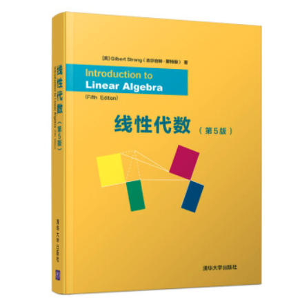
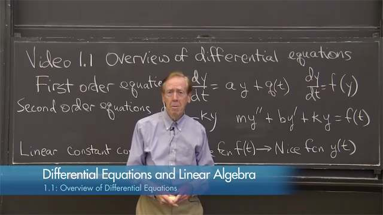
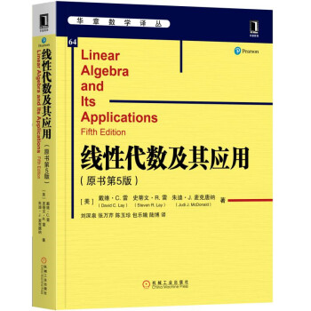
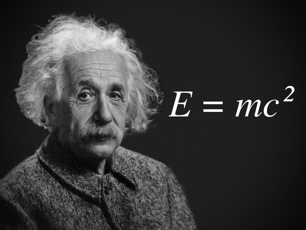
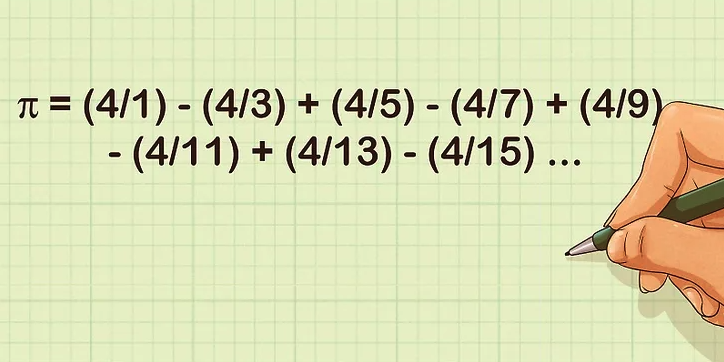

## 学习乘法不能帮助我们理解质能方程

这是在我的知识星球上，一个同学问我的问题。

波波老师您好，我是去年机械专业硕士毕业的。研究生期间我逐渐发现其实对机械专业并不特别喜欢，但是很喜欢图形学，决定把这个方向发展为我的特长。

经过我使用 DirectX 和 OpenGL 的情况来看，我发现线性代数特别重要。请问您有没有针对图形学的线代资料推荐？

 

---

**bobo 老师的回答：**

关于线性代数，我推荐两本教材。

一本叫《Introduction to Linear Algebra》，最新版是第五版。中国引入了这本教材，但据说没有进行中文翻译。封面上就叫《线性代数》。

这本教材的作者是 MIT 大名鼎鼎的 Gilbert Strang。去年被炒得沸沸扬扬的清华大学把线数教材换成了英文版，用得就是这本教材；前一阵子沸沸扬扬的 86 岁老爷子还录网课，说得就是这个作者。

如果你对这两条新闻不是特别熟悉，可以搜一下。关键词：“清华把线性代数教材换成英文版”；“86岁还在录网课”。

Gilbert Strang 老爷子在 MIT 的线数公开课很有名，相信很多同学都看过。如果没看过的话，推荐看一下。

MIT 的官方地址在这里：[https://ocw.mit.edu/courses/mathematics/18-06-linear-algebra-spring-2010/index.htm](https://ocw.mit.edu/courses/mathematics/18-06-linear-algebra-spring-2010/index.htm)；

2020 年更新的视频内容在这里：[https://ocw.mit.edu/resources/res-18-010-a-2020-vision-of-linear-algebra-spring-2020/videos/](https://ocw.mit.edu/resources/res-18-010-a-2020-vision-of-linear-algebra-spring-2020/videos/)

如果访问外网有困难，可以在 B 站搜索一下，应该很好找到。

他的课程基本是跟着这本教材走的，但是远不如教材详细，我认为可以看作是教材的一份很好的补充说明。也可以据此体会一下国外上课的风格：平时主要靠自学，老师上课就是点拨一下：）

 

另一本叫《Linear Algebra and Its Applications》，最新版是第五版。有中文版，叫《线性代数及其应用》。听名字，这本书似乎更强调应用，但其实 Gilbert 老爷子的书也有专门一章讲应用。

 

值得一提的是：Gilbert 的书有专门一小节介绍线性代数在图形学上的应用；《线性代数及其应用》还有专门一章介绍向量空间上的几何应用。这些内容对图形学的学习很有帮助。

但要说专门针对图形学的线性代数资料，有，就是几页纸，我相信你觉得没什么用。一定要找的话，可以在 google 搜索 **linear algebra in graphics**.

 

实际上，这里可能有一个重要的学习误区，也是这篇文章我想聊的重点，大家可以再审视一下自己学习的过程，是否有这个问题。

很多同学看图形学也好，机器学习也罢，看到一大堆线性代数的公式，头就大了，觉得自己的线性代数不够好，就想去补线性代数。但真的补线性代数的时候，发现其实一般的线性代数课本就是那些内容，自己似乎好像又都了解。

当然，如果你的数学真的不扎实，连矩阵是怎么回事儿都不明白，那学习线性代数无可厚非。但我的经验是：**很多人的问题根本不在数学上。**

我经常举的一个例子是：E=mc^2，这个式子大家都懂吗？

这个式子就是著名的质能方程式。反正我是不懂这个式子的。

不懂怎么办？难道去学习乘法和乘方运算吗？当然不是。乘法和乘方运算我是懂的，但**阻止我理解这个式子的瓶颈，是物理学。**

同理，在图形学或者机器学习领域，很多时候，我们看到一个式子，阻止我们理解这个式子的关键在于：式子中的每一个变量，到底和这个领域里的知识是怎么对应的？为什么可以这么对应？为什么这么算就能得到我们想要的结果？等等等等，而根本不是数学本身。

这些问题，是补数学解决不了的。这就好比我们再怎么学习乘法和乘方运算，还是无法理解 E=mc^2 一样。

怎么办？**必须和这个领域死磕。**很多时候，我们要去和图形学较劲，要去和机器学习较劲，而不是回头拿起本科的数学书重新看数学。

如果真的能把问题规约成就是一个纯粹的数学问题，其实从某个角度看，事情反而变简单了，就去有针对性地补这方面的数学就好了。甚至在一些情况下，不补都可以，把它当作一个结论就好了。反正大多数人也根本不知道 PI 是怎么算出来的。

 

我的观察：有些时候，很多同学只是缺乏耐心而已，或者对数学公式有畏难情绪。看到一大堆式子，头就大了，就不想深究下去了。很多同学总以为数学好到一定程度，看书上或者论文里的式子，就应该瞬间理解了。**实际不是这样的。**

面对一个公式，如果大家能静下心来，仔细去理解每个变量到底在表达什么？每个计算的结果到底是什么意义？对于矩阵，实际使用小规模的数据试试看？对于抽象的 n 维空间，用 2 维空间或者 3 维空间的例子试验一下，仔细研究一下式子的每一步到底在计算什么？其实很多同学完全可以搞明白这些公式在说什么。

更重要的是，这本身，也是在学习，复习，应用数学的过程！

很多同学都问我，觉得学习数学好枯燥，干巴巴的太抽象，学了也觉得用不上。什么教材能让我觉得自己学习的数学是有用的？

上面推荐的两本线性代数教材都是好教材。但是，**如果真的想应用数学，其实不应该找数学教材。**因为数学只是一个工具。去学图形学，去学机器学习，就是在应用数学！

这有点儿像如果想真实地应用算法，就不要再去看讲初级算法的教材了。哪怕是《算法导论》，也是一个导论而已，它不是应用。**去看操作系统，去看编译原理，到处都是算法和数据结构的应用！**

之前，我的公众号还写过一篇文章，叫[《觉得自己基础差，该不该系统补数学？》](../2020-04-26/)。文章中有句话，是：我认为和算法本身去较劲，比去学习数学，更能提升算法水平。

把“算法”替换成“图形学”，是同样适用的：

**和图形学本身去较劲，比去学习数学，更能提升图形学水平。**

我没有说所有同学都不应该补数学。只是提出一个角度，大家可以再根据自己的实际情况，有针对性地反思一下，自己的学习计划是否合理。

 

**大家加油！：）**