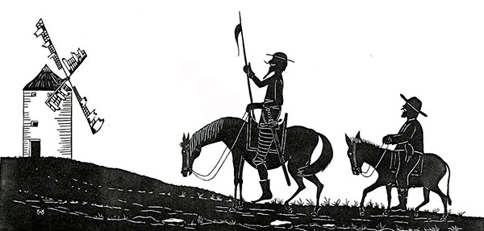
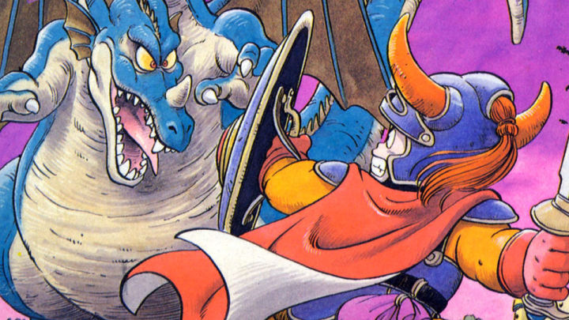

## 屠龙之术

小时候，我最喜欢的故事，是屠龙术的故事。

说喜欢，或许不很恰当，或许只是觉得它神秘而有魅力。

屠龙术的故事源于庄子的《列御寇》，它只有简单的一句话：

> 朱泙漫学屠龙于支离益，单千金之家，三年技成而无所用其巧。

这句话的意思是：有一个叫朱泙漫的人，想学习屠龙术，于是拜师了一个叫支离益的人。为此，他耗尽千金的家产，历时三年，终于学成了屠龙之术。但是，当他身怀屠龙绝技，闯荡江湖，想祭尽天下恶龙的时候，却发现找不到一条龙的影子。

 

我从小就对这个故事背后的道理不感兴趣。我痴迷于我第一次听完这个故事以后，头脑中的一连串问号：

朱泙漫到底是谁？支离益又是谁？他们的名字为什么这么奇怪？

如果这世上本无龙，支离益为什么能教屠龙术？是因为这世上原本是有龙的，支离益曾是一名屠龙的勇士？亦或者支离益就是个骗子？

而朱泙漫又为什么肯耗尽千金家产，要学习屠龙术？是不是他知道，这世界还有恶龙隐藏？

朱泙漫是怎么用三年时间学成屠龙术的？当朱泙漫学成了屠龙术，去做了什么？

他游历了哪里，遇到了谁？庄子的世界里，真的没有龙吗？会不会像所有的童话故事一样，朱泙漫经历了一场恶战，杀掉了这世上的最后一条恶龙，从此归隐山林，不为人知？

这世界上真正的英雄不为人知，反被耻笑。直到突然有一天，又一只恶龙不知从哪里冒了出来。这似乎是很多英雄故事的套路。朱泙漫的故事是否也是如此？

后来呢？后来呢？

 

所有的这一切，庄子都没有告诉我们。屠龙术的故事突然开始，又戛然而止。我恨不能横跨 2500 年，亲自去问问庄子他老人家。

但后人似乎并不关心这些。近乎所有的课本都告诉我们：屠龙术是指那些“深奥难学但是缺乏实用性的技巧”。我们不应该学习屠龙术。

但我对此并不买账，甚至因此，我会对那些冠以“屠龙之术”的知识多看一眼。

我不相信一个能讲出“北冥有鱼，其名为鲲。鲲之大，不知其几千里也；化而为鸟，其名为鹏”的老者，会讲出这么“浅显”的故事。

 

后来，我认识了堂吉坷德。

唐吉坷德是一名骑士。他爱读骑士小说，羡慕骑士作派，赞赏骑士精神。

但他沉溺于骑士的幻想中，脱离实际，沉浸在想象的世界，无法自拔。

所以他大战风车，把风车想象成巨人；所以他大战羊群，把羊群看作是一只军队。

《唐吉坷德》是一部反骑士文学。这部小说的时代背景，是西班牙的国家实力正在下降。可是教会依然鼓吹骑士精神，捍卫封建社会。

可衰败是一种趋势，继续怀着旧的理念，保持幻想，只能继续颓败，徒增笑耳。唐吉坷德，就成为了这样的一个象征。

但倘若抛开这层历史意义，就会发现，堂吉诃德的故事，似乎和屠龙术有着类似的内核。

时代已经改变，骑士精神是没有意义的；这就宛如，这世界并没有龙，屠龙术也没有用。

可或许，在唐吉坷德眼里，骑士精神是有意义的；就好像在朱泙漫眼中，这世界还有恶龙无数。

怪不得，有人也会把唐吉坷德解读成为理想主义的化身。理想和现实的差距，造就了悲剧的内核。

几百年后，荒诞哲学的代表人物，写出《西西弗的神话》，《鼠疫》，《局外人》的加缪说，每读一遍《唐吉坷德》，他都会放声大哭。

《唐吉坷德》不仅仅是喜剧，也是悲剧。

而我借此，似乎突然理解了朱泙漫。想起他的故事，竟也会觉得有几分落寞。

或许，屠龙之术，也是一个关于理想，关于现实的故事。

 

长大以后，理想和现实，是每个人都绕不开的问题。

或者，让我们把理想划去：现实，是每个人都绕不开的问题。

理想呢？

哪里还有理想。

就像所有人都在告诉你，哪里还有龙？

这个世界上没有龙。这个世界上没有龙。这个世界上没有龙。

世界上所有的英雄，最终，不过想着柴米油盐酱醋茶。大隐隐于世。

可突然有一天，我在想，**这“世上没有龙”的想法本身，会不会就是缠绕在我们每个人心头的恶龙？**

因为“世上没有龙”，我们放下了手中的剑；

因为“世上没有龙”，我们卸掉了身上的甲；

曾以为世上有恶龙，我们披荆斩棘，可走着走着，突然发现，“世上没有龙”，我们就这样，停在了路中央。

“世上没有龙”这条恶龙，早已经把我们打得落花流水，让我们毫无还击之力。

因为“世上没有龙”，我们也早就放弃了追求屠龙之术。

曾经那些闪闪发光的人，忽地就变成了凡人。没了热血，少了神通。

因为“世上没有龙”。

 

“世上没有龙”，就是这世上的恶龙啊。他数不清，道不尽，无处不在，无所不能。

或许，朱泙漫要屠的，就是这条恶龙。

或许，他师从的支离益，早已打败了自己心头的这头恶龙。

或许，这才是庄子所讲的真正的故事。

 

我不知道，我不知道。

我恨不能横跨 2500 年，亲自去问问庄子他老人家。

可我回不去。

但我的思绪，回到了自己的小时候。

那时候的我，手里拿着树杈，身后披着塑料布。我相信自己就是仗剑的英雄。我决心屠龙。

于是，我的世界没有恶龙盘旋。

我是大人眼中流着鼻涕泡的小破孩儿。大人们都知道，你不过是个凡人，斗不过疾病，挨不过贫穷；但只有我自己知道，我是屠龙的勇士，无人可挡。

无人可挡，无人可挡。

我相信你曾经和我一样。

那个曾经梦想屠龙的小破孩儿，其实早已经在那个年纪，屠掉了自己心中的恶龙；

可当他慢慢长大，恶龙又重新回到了他的身边。

我们每个人都一样。

于是，庄子讲了一个故事：

>  朱泙漫学屠龙于支离益，单千金之家，三年技成。

是的，我把最后的“而无所用其巧”删掉了。

朱泙漫有没有用到自己学到的屠龙之术，屠掉自己心中的恶龙？

或许，只有他自己知道吧。

说到这里，我忽然对这个故事的结局不感兴趣了。

我想，我要继续捡起儿时那把落灰的屠龙刀，开始练习儿时的屠龙技了。

 

谨以此文，献给你我都曾拥有的那些闪亮的童年。

祝所有人六一儿童节快乐。

祝所有人终像自己年少所期许的那样，习得屠龙之术，斩尽天下恶龙。

**大家加油！：）**

