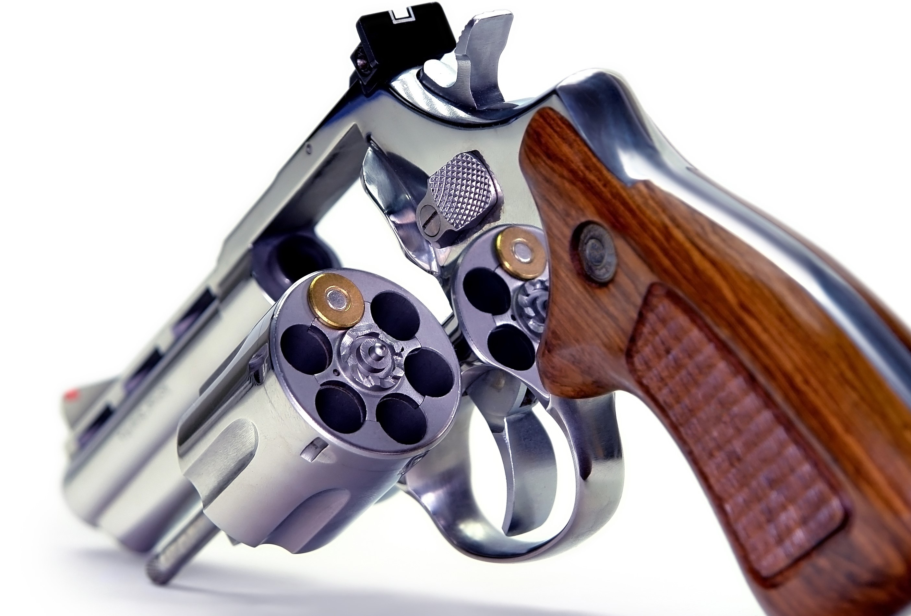
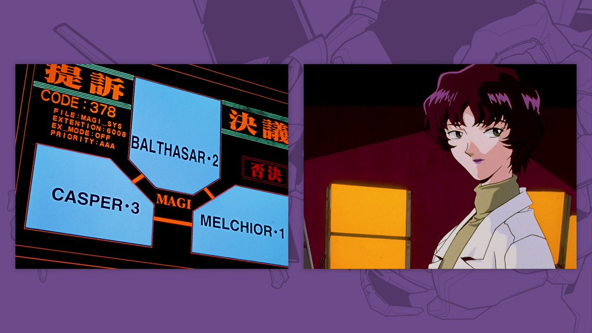
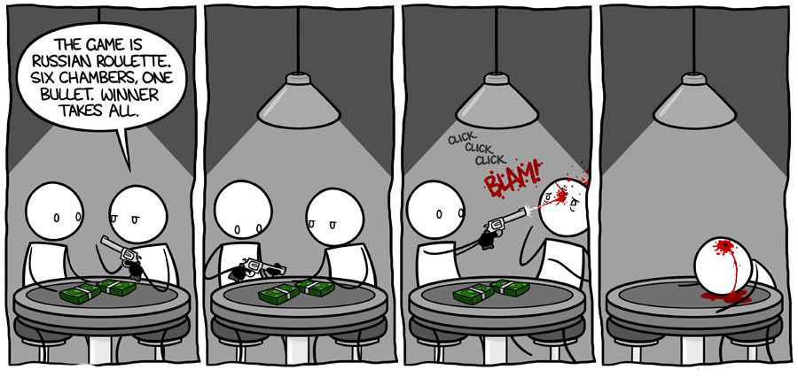

## 稀奇古怪面试题又三则

之前写过一篇文章，[《稀奇古怪面试题三则》](../../2019/2019-06-10/)，翻出来一看，已经时隔一年了。着实吓了一跳。

然后想了想，这一年又遇到了一些有意思的问题。于是，在这里再分享三道“非典型”的面试问题：）

<br/>

**1.**

bobo 老师最近收到了一名同学的求助。这名同学正在和另外一名同学玩儿俄罗斯轮盘赌。

俄罗斯轮盘赌是指在一个有六个弹槽的左轮手枪中放入一颗子弹，随机旋转转轮后，关闭转轮。两人轮流把手枪对着自己的头扣动扳机。

俄罗斯轮盘赌赢者生，败者亡，极其残忍。



当然，在现代社会中，我们不能拿生命做赌注。所以，两名同学使用橡胶子弹，并且约定，输者当即购买 bobo 老师的所有课程！

为了加快游戏速度，他们在一个玩具左轮手枪的**连续两个**弹槽中都放入了子弹。

现在，第一个同学已经开枪了，结果为空弹。

第二个同学想知道，自己在第二枪输掉的概率有多大？（即自己开枪，发射出子弹的概率是多少？）

<br/>

为了留给大家更多思考的空间，先给两个提示：

**提示 1**：注意，这两枚子弹是放在连续的两个弹槽中的。

**提示 2**：对于很多概率问题，思考的关键是：总共有多少种可能？而我们关心的事件真正发生，会在多少种可能中出现？

<br/>

**解析：**

六个弹槽，将两枚子弹填入连续的两个弹槽中，一共只有六种方式。

在下面，我用 X 表示子弹，o 表示空弹槽。

```
XXoooo
oXXooo
ooXXoo
oooXXo
ooooXX
XooooX
```

注意最后一种方式。因为弹槽形成了一个环，所以第一个弹槽和最后一个弹槽是相邻的。

现在，已知第一次扣动扳机，没有子弹。所以，上面的第一种布弹方式和最后一种布弹方式都被刨除了。

```
XXoooo // 不可能
oXXooo  
ooXXoo
oooXXo
ooooXX
XooooX // 不可能
```

在剩下的四种方式中，只有 oXXooo 一种方式，在第二个弹槽中是子弹。

四种方式，一种中弹，所以答案是：1 / 4 = 25%。

同学，你这一轮只有 25% 的概率购买 bobo 老师的全部课程。祝你好运！


<br/>

**2.**

再来一道概率问题。

bobo 老师发明了一种神秘的算法，可以 **100%** 的准确预测今天的天气！

诺贝尔奖级别有木有？


但是，bobo 老师觉得，100% 的准确度太没有意思了。这个世界的魅力就是不确定性啊！

所以，bobo 老师调整了算法，让**它有 1/3 的概率说谎。** 

但是，bobo 老师还是觉得不满意，因为这不够酷。

bobo 老师决定将这个算法复制成三份。

这是受著名动画片《EVA》的启发。《EVA》动画片中的 MAGI 超级电脑，就是由三台可以独立思考的电脑组成的决策系统。这三台电脑，分别代表设计者赤木博士的三种身份：作为科学家的她；作为母亲的她；和作为女性的她。

这个系统也被称为是“三贤者”。



当然了，bobo 老师没有这么厉害。所以，他的“天气预测三贤者”，其实是三台完全一致的，有 33% 的概率犯错（说谎）的算法。

今天，bobo 老师问“天气预测三贤者”：北京的天气怎么样？三个算法的回答都是：今天北京是晴天。

问：今天北京是晴天的概率是多少？

<br/>

**解析：**

以下是我初始给出的解答，**但是是错误的！！！**

只有在三个算法都在说谎的时候，北京才不是晴天。

所以，我们只要看三个算法都说慌的概率就好了。因为每个算法说谎的概率是 1/3，三个算法都说慌的概率就是 (1/3) * (1/3) * (1/3) = 1/27。

也就是只有 1/27 的概率，北京不是晴天。相应的，今天背景是晴天的概率就是 26/27，约为 96.3%。

<br/>

**以上解答是错误的！！！**为什么？因为当三台电脑都说今天是晴天的时候，**概率空间已经变了**。

此时，或者三台电脑都说实话，概率是 8/27；或者是三台电脑都说谎话，概率是 1/27。其他的概率已经是 0 了。

只有三台电脑都说实话的时候，北京才是晴天。此时的概率是： 8/27 / (1/27 + 8/27) = 8/9。

我使用蒙特卡洛验证了一遍。我的蒙特卡洛验证代码：

```
#include <iostream>
#include <vector>

using namespace std;

int main(){

    int N = 100000000;
    srand (time(NULL));

    int total = 0, sunny = 0;
    while(N --){

        int weather = rand() % 2; // 0 - cloudy, 1 - sunny；
        int a , b, c;

        if(weather)
            a = rand() % 3 ? 1 : 0, b = rand() % 3 ? 1 : 0, c = rand() % 3 ? 1 : 0;
        else
            a = rand() % 3 ? 0 : 1, b = rand() % 3 ? 0 : 1, c = rand() % 3 ? 0 : 1;

        if(a && b && c){
            total ++;
            sunny += !!weather;
        }
    }

    cout << sunny << " " << total << " " << (double)sunny / total << endl;
    cout << 8.0 / 9 << endl;

    return 0;
}
```

使用以上验证，我们还将看到一个重要的事实：北京天气是阴天还是晴天的概率，也会影响最终结果！

实际上，这是一个条件概率的计算，可以带入条件概率公式获得结果。

假设事件 A 是三台机器都说今天是晴天；事件 B 是今天是晴天。这个问题求得就是 P(B | A)。

根据条件概率公式：P(B | A) = P(B & A) / P(A)

P(B & A) 就是今天确实是晴天，并且三台机器都说是晴天的概率。注意，这里就要对今天是晴天的概率做一个假设，假设为 p。则 P(B & A) = p * (2 / 3) ^ 3。

P(A) 则是三台机器说今天是晴天的概率。注意，一台机器说今天是晴天的概率，会因为今天是不是晴天而改变。如果今天是晴天，每台机器说是晴天的概率是 2/3，因为是实话；如果今天不是晴天，每台机器说是晴天的概率是 1/3，因为是谎话。所以，P(A) 正义就是 p * (2/3)^3 + (1 - p) * (1/3)^3

二者相除，就是答案。这里，这个 p 是约不掉的。 


<br/>

**3.**

最后一个问题稍微难一点。

有一名同学突然联系 bobo 老师，因为他被绑架了！绑匪说，只有做对一个问题，才能放了他！

问题是这样的：

绑匪在一个桌子上，放了 **100 张扑克牌，其中 10 张朝上，90 张朝下。**

绑匪将这名同学的眼镜蒙上。所以，这名同学无法看到哪张牌朝上，哪张牌朝下。这名同学也无法通过触觉，摸出来桌子上哪张牌朝上，哪张牌朝下。

现在，绑匪要求这名同学把桌子上的 100 张牌分成两堆儿。并且，**在这两堆儿牌中，朝上的牌数量必须一致。**

问，这名同学要怎么操作，才能摆脱穷凶极恶的绑匪？


<br/>

三个提示：

**提示 1**：将 100 张牌分成两堆儿，每堆儿牌不一定包含 50 张牌。一堆儿 49 张牌，另一堆儿 51 张牌，也是可以的。

**提示 2**：虽然这名同学不能辨别每张牌的反正，但是，**这名同学可以操纵这些牌。**比如：他可以拿起一张牌，把它翻过来，使得如果这张牌本来为正面朝上，变成反面朝上；本来反面朝上，变成正面朝上。

**提示 3**：因为有提示 2，所以，最终的结果，不一定两堆儿中正面朝上的牌的数量都是 5 张牌。**只要正面朝上的牌相等就可以。**

你知道要怎么做吗？

<br/>

**解析**：

可以这样操作：

这名同学先把这 100 张牌**``分成两堆儿，一堆儿中有 10 张牌，另一堆儿中有 90 张牌。具体哪张牌在哪一堆儿，无所谓。**反正这名同学也辨别不出来。

然后，这名同学只需要**把 10 张牌的那一堆儿中的每张牌都翻过来**，就好了。这么做就能得到满足题意的结果。

为了证明这一点，我们可以假设：在初始分堆儿的时候，90 张牌的那一堆儿中，有 x 张牌是朝上的。那么，在 10 张牌这一堆儿中，就有 10 - x 张牌是朝上的。

注意，x 也可以为 0。

现在，如果将 10 张牌中的那一堆儿中，所有的牌都翻一面儿，那么，原来的 10 - x 张朝上的牌，就变成朝下了；而原来 x 张朝下的牌，就朝上了。

现在，两堆儿中，都有 x 张牌朝上了。

营救任务完成：）

<br/>

---

好啦，今天的分享到此结束。

等等，我突然又想到了一个问题！

今天的第一个问题是关于俄罗斯轮盘赌的。大家可以发现，在俄罗斯轮盘赌中，规则是：两人轮流把手枪**对着自己扣动扳机。**

为什么规则不能是对着对方扣动扳机呢？

给大家分享一幅漫画，来自 Tom Fonder。



论规则设计的重要性。🤔

是不是很酷？

<br/>

**大家加油！：）**