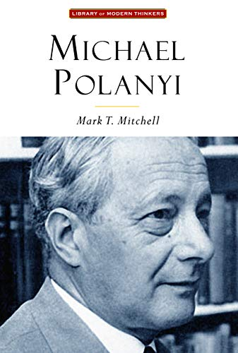
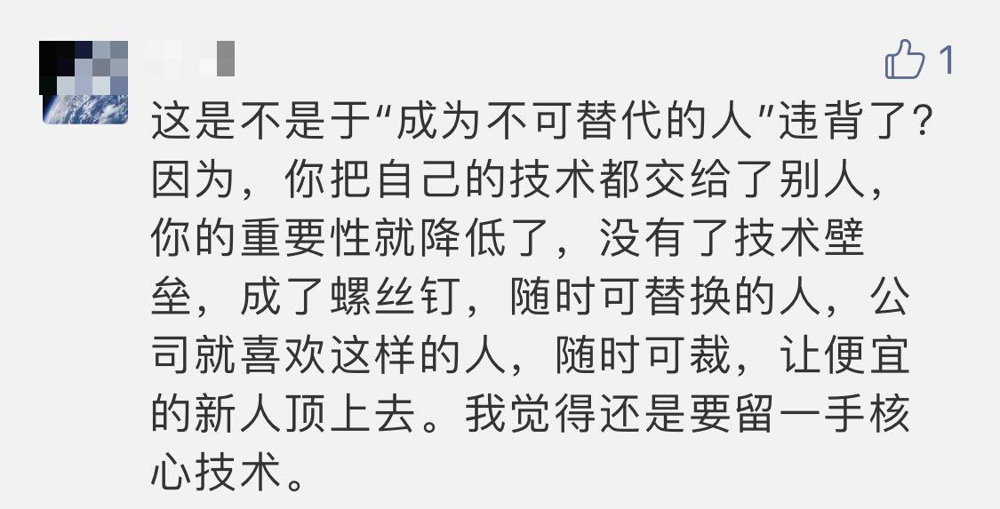

## 隐性知识

隐性知识是 1958 年，迈克尔.波兰尼（Michael Polanyi）从哲学领域提出的一个概念。

简单来说，隐性知识就是指**无法用语言清晰表述的知识。**

这个概念猛地一听，感觉很奇怪。毕竟，通过语言，文字，图表去学习知识，是我们上学以后接收知识的主要形式，至少表面上看是如此。

但是如果我们深入思考，就会发现，生活中到处都是用语言无法清晰表达的知识。

 

最简单的例子：游泳。

你可能能找到这样的图书：

别看封面上写着大牛做序，一群体育专家联袂推荐。但是我敢肯定：对于一个不会游泳的人来说，通读这本书，即便达到能够背诵默写的程度，一定也是依然不会游泳的。

相应的，我估计绝大部分会游泳的人，并没有读过一本和游泳相关的书。

游泳是一种隐性知识。到现在为止，还没有任何人能够做到，通过组织语言，变换说辞，找到一个词语的“排列组合”，按照这个排列组合表述出来，听者就突然神奇地“开窍”，跃入水中，学会游泳。

学习游泳的过程，近乎必须要求学习者真的跳入水中，去实际地体会，在错误中不断纠正自己的动作，不断总结正确的方式。呛几口水在所难免，但只有这样，才能学会游泳。

当你学会游泳了以后，如果问你，到底该怎么游泳？你也将哑口无言，承认自己也无法用语言清晰地描述出来到底是如何游泳的。你可以描述出一些心得，一些技巧。但是，这些都无法让学习者“学会”游泳。

要想真正学会游泳，每个学习者都必须下水。

大家可以很轻易地想到：近乎所有的“物理活动”，都是隐性知识。比如开车；比如轮滑。

但是，如果仔细思考，就会明白，在“脑力活动”的世界中，隐性知识一点儿都不少。

 

脑力活动的最高境界：**创造，就是一个典型的例子。**

如果你去问一个作曲家，如何创作出优秀的音乐？你八成不能得到令你满意的答复。

这里说的“满意”，是指：不管这名作曲家多优秀，这名作曲家创造过多少经典的音乐，他都无法通过语言，让你“听君一席话”，就能掌握作曲的“秘密”，变成一个优秀的作曲家。

他可能能告诉你一些自己的经验。比如他会说学习音乐史很有帮助；爱尔兰的音乐风格对他的影响很大；某些作曲工具能提高效率；等等等等。但是，你仍然无法成为作曲家。

要想成为优秀的作曲家，你必须在学习了作曲基本的理论知识以后，亲自去实践，去作曲，去倾听别人的反馈，去征询大师的建议，去改进，去完善，然后去做新的尝试，循环往复。

这就像下水游泳一样。**创作是一个隐性知识。**不仅仅是音乐创作，任何形式的创作都是如此，从视频创作，到文字创作。

 

但可能很多人还会说，自己的工作并不是创作啊？需要这么关注隐性知识吗？

需要！在我们的日常生活中，在每个人都能接触的领域里，**最核心的，其实都是隐性知识。**

比如学习英语。很多人会问怎么学好英语？有什么诀窍？我不否认学习英语是有一些方法论的。但我想，学习英语最大的诀窍，就是实际去使用英语。

如果你想提高英语阅读，就多去读；如果你想提高英语听力，就多去听；如果你想提高英语口语，就多去说；如果你想提高英语写作，就多去写。

 

再比如，关注这个公众号的同学，可能大多数是程序员。很多同学都曾经问过我，如何快速写出没有 bug 的代码？

对于这个问题，我有一些经验之谈。比如明确需求；比如定义清楚代码中每一个变量和函数的语义；比如用循环不变量的角度去审视自己写的每一个循环；比如关注函数式编程和设计模式；等等等等。

但是，很遗憾，听了这些“经验之谈”，大多数人还是无法快速写出没有 bug 的代码。实际上，**真正写出没有 bug 的代码的诀窍，恰恰是多写 bug**，然后意识到自己写了一个 bug，然后去调 bug。

为什么？因为“如何写出正确的程序”是一种隐性知识，语言是无法传授这种知识的。那么获得这种知识的方式，只能是自己去“下水”。

实际上，大多数专业领域都是如此，一个出色的医生可以快速对病情做出正确的诊断；一个优秀的海员可以对天气和航向做出准确地预估；杰出的技术专家可以迅速给出问题的解决方案，或者判断技术可行性，这些都是无法简单通过语言传授的隐性知识。

 

理解隐性知识，能够帮助我们理解很多事情。

比如，为什么“懂了那么多道理，似乎并没有卵用？”

就是因为，大多数人所谓的“懂了一个道理”，只是能用语言描述这个道理而已。但是，这个道理背后真正的技能，是一种“隐性知识”，使用语言描述是远远不够的。

很多人可以把动态规划状态定义需要满足的三个性质：重叠子问题，最优子结构，无后效性，说得头头是道。但是真正遇到一个问题，还是会懵掉。因为真正的灵活的使用动态规划解决问题是一种隐性知识。

 

再比如，之前我曾经写过一篇文章，叫[《跟什么样的人》](../2020-05-20/)，其中有一个观点，就是好的 leader 必须要带领团队成长。

会有同学有异议：

对此，我的回复是这样的：

首先，**管理就是一种典型的，并且重要的“隐性知识”。**没人能用语言就简单地说明白怎样一二三地去做，就能做好管理了。优秀的管理者都是一路摸爬滚打，在实践中不断成长的。正因为如此，一个有经验的管理者是相当值钱的。

成为一个优秀的管理者，是比保留一点技术壁垒重要得多的事情。因为**成为一个优秀的管理者，是一个更高的，更难逾越的壁垒。**

另一方面，在现代的科技发展下，保留所谓的一点技术壁垒，真的没有意义。当下所谓的技术难题，过两年，可能一个小学生都会用的小工具，都能轻松解决了。

实际上，能够“保留的”技术壁垒，都不是真正的技术壁垒。**真正的技术壁垒是：就算你讲出来，别人没有相应的经历，也理解不了，达到不了相同高度的东西。**比如架构设计的能力；比如快速排查错误的能力；比如对技术发展的敏感性和判断。

这些都是隐性知识。**真正的技术壁垒，是隐性知识。**

现在流行一个词，叫“不可替代性”，怎么让自己不可替代？其实就是要去“学习”隐形知识。

这里我给“学习”加引号，是因为隐性知识的学习不能简单靠书本获得，实践才是王道。

 

可能有些同学会觉得，既然隐性知识无法通过语言获得，是不是老师没有什么意义？

是，也不是。

从知识传授的角度，对于很多内容，由于是显性知识，所以我并不认为老师的意义那么大。相信很多同学大学的很多科目都是自学的，也学得挺好，就是这个道理。

但是，优秀的老师，是会引导的，这至关重要。

什么叫引导？昨天我看到一个例子，觉得很有意思。

很多人在面试的时候，答完一个问题后，面试官可能并不满意，于是反手问一句，“你确定吗？”。

在实际工作中，这样的场景，类似的反问，可能也不少。但其实，这种反问很没有水平。因为面试者无法从中获得任何有价值的信息，除了，似乎面试官不太满意。

举个简单的例子。一个小学生说 3 + 3 = 5，我们不应该反问他，“你确定吗？”

我们应该问他，那 3 + 2 等于多少？

小学生就会计算一下，咦？3 + 2 = 5！那么 3 + 3 = 5 应该是有问题的。小学生就会重新思考，3 + 3 应该等于几？自己之前怎么算错了？

问 3 + 2 等于多少，就是引导。这步引导，将你引入了更多的实践中（去计算 3 + 2，重新计算 3 + 3，等等），这是一个反问“你确定吗”做不到的。

**有经验的老师会正确的引导，正确的引导将大大加快学生的进步速度。**这也是为什么，在我的课程问答区，对于很多同学的代码问题，我并不愿意直接指出代码的错误，而是会让大家自己去调试，或者试试另一个思路，看看有什么矛盾之处。

因为，这其实是学习隐性知识的过程。而隐性知识的学习，比简单地了解一个算法，重要 100 倍。

这也是为什么，在[《跟什么样的人》](../2020-05-20/)这篇文章中，如果有两个 leader，一个技术好，一个会 coaching，一定要二选一的话，我的建议是选择会 coaching 的 leader。

因为，所谓的 coaching，就是引导。这种引导，可能会让你觉得浪费时间，但是，学习隐性知识，就是需要时间的。在隐性知识的学习过程中，一个人才能真正的进步。

隐性知识不能用语言表达出来，但它恰恰就是每个牛人成功的秘诀。

 

**大家加油！：）**

 

**P.S.**

题图是一张“冰山一角”。

其实，大多数时候，显性知识都是冰山一角。一个数学公式，一个算法，这些都是显性知识，很好学习的。

但是，学习这些显性知识的真实目的，是挖掘他们背后的隐性知识。

