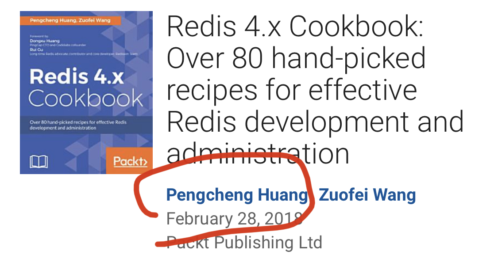
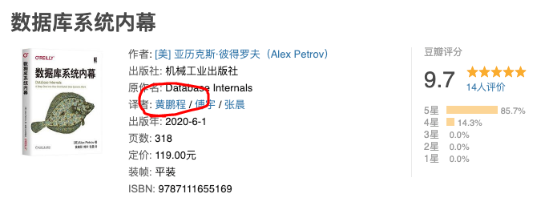

## 重磅福利 | 大佬送硬核技术书，还有签名

可能很多同学都知道，我有一个免费的知识星球。相较于公众号，知识星球更适合短内容的分享。平时我有什么新想法，或者看到什么新东西，觉得有价值的，我会第一时间放在这个知识星球上。

星球的名字和这个公众号一样，也叫【是不是很酷】。

星球有一个功能，是提问。在过去的一年，我已经断断续续的在星球上回答了 100 多个问题了。有的问题我觉得挺好的，就把文字整理一下，放到这个公众号上，相信很多老读者都了解这种形式。

但是，我个人的水平毕竟有限，关注的方向也有局限性。所幸，星球还有另外一个功能，邀请嘉宾。邀请了嘉宾以后，大家也可以在星球上向嘉宾提问。

就在上个月，我为【是不是很酷】邀请到了第一位嘉宾！**黄鹏程！@鹏程 大佬！**

 

@鹏程 大佬毕业于北京邮电大学，过去八年一直专注于数据库和大数据技术。毕业后就职于中国民生银行，历任大数据基础架构软件工程师及团队负责人。

所以，如果大家有数据库，大数据，银行工作等相关问题，都可以与他交流。

 

更酷的是，@鹏程 大佬大佬近期开启了他的职业转型，加入阿里云任高级产品专家，负责阿里云数据库相关产品的设计与规划工作。他很乐意与大家分享在阿里云做技术产品经理工作的心得体会。

业余时间里，@鹏程 大佬对技术书籍的撰写和翻译有着一些独特经历。他是《Redis 4.x cookbook》英文版的作者之一，值得一提的是该书是直接使用英文写的，在海外市场发行的。

大家有技术写作、图书出版，甚至是英语学习与应用的问题，都欢迎与他交流！

 

在中文技术社区上，就在最近，@鹏程 大佬主要参与翻译的著名数据库领域的硬核技术书籍《Database Internals》的中文版《数据库系统内幕》，在国内上市了！这本书刚上市，在豆瓣就收获了 9.7 分的好评！

 

阿里云数据库团队负责人鸣嵩（曹伟）专门为这本书做了推荐序。这篇推荐序非常值得一读，高屋建瓴地回顾了数据库领域的发展历史，并展望了数据库技术未来的发展方向。

以下内容就是曹伟博士为这本《数据库系统内幕》做的推荐序。

为了大家阅读方便，我针对公众号文章的阅读习惯，进行了一定的删减和重新排版。

 

---

**《数据库系统内幕》推荐序**

 

数据库是一个历史悠久的计算机学科。

1970 年，E.F.Codd 在 IBM 工作期间提出了现代关系型数据库的标准——关系模型。而事务型数据库最常用的持久化数据结构 B+ 树则来源于 Bayer 在 1972 年发表的论文。当时 Bayer 在波音工作，因此 B+ 树的 B 有说法是取自平衡（Balance）的意思，也有说法是作者的首字母（Bayer），还有说法是波音的首字母（Boeing）。

1974 年，IBM 开发了最早的关系数据库原型 System R，现代数据库的故障恢复机制 ARIES、以及基于代价的优化器都源自于 System R。1979 年 Oracle 发布了最早的商业关系型数据库。Oracle 最早的订单来自 CIA 的情报数据分析需求。在 NSA 的资助下，最早的开源数据库 Ingres 在 70 年代同时期诞生，一度对 Oracle 构成了严重威胁，Oracle 通过兼容 SQL 标准，以及早期引入 C 语言能更快的移植到各种小型机硬件打败了 Ingres。

在 Ingres 基础上，又衍生出了 Sybase 和 SQL Server，以及流行的开源数据库 PostgreSQL。当代另一个流行的关系型数据库 MySQL 则在 1995 年发布第一版。MySQL 的作者 Monty 和 Linux 的作者 Linus 都毕业于赫尔辛基大学。

近二十年，随着互联网经济的兴起，企业对数据库的需求转向了如何以更低的成本处理、存储与分析海量数据。LAMP（Linux、Apache、MySQL、PHP）架构是在 1998 年提出的，通过一套开源的解决方案，满足一个中小互联网公司的建站需求。

LAMP 架构影响了谷歌、Facebook、阿里巴巴、百度、腾讯等一众互联网巨头，他们都是基于 MySQL 起步，逐步发展出可扩展的在线事务数据库服务。2006 年到 2012 年，固态硬盘的普及，大大缩小了开源数据库与商业数据库的性能差距。

也是在这个时期，阿里巴巴在国内喊出“去 IOE”的口号，2013年完成核心业务数据库全部切换到 AliSQL（阿里巴巴定制和优化的 MySQL 分支），也培养出一批数据库内核方面的优秀人才。

近些年，云成为数据库发展的新动力，数据库厂商的版图正在发生巨大的变化。根据 Gartner 2019 年的报告，全球前三的云厂商（AWS，微软，谷歌）都跻身数据库领导者象限，与 Oracle，SAP 等老牌厂商并列。而传统企业数据库强者如 IBM DB2 则跌出了领导者象限。

值得自豪的是，阿里云作为中国第一的云厂商，通过推出 PolarDB、OceanBase 等技术领先的自研数据库，在数据库系统（DBMS）领域进入了挑战者象限。Gartner 预测到 2022 年，3/4 的数据库都将使用云数据库。可见对数据库市场份额而言，云是一个很大的变量，云市场的兴起带给了国内数据库厂商换道超车达到国际顶尖水平的机会。

技术的发展总是螺旋式上升的。近年来，RDMA 网络设备开始商业化和普及，RDMA 支持数据中心内部极低延迟和高吞吐的通讯，对分布式数据库的设计范式有很大的冲击。

近年来另一个新兴的存储技术是 NVM，它像 SSD 一样能持久化数据，但读写延迟接近于内存 DRAM。目前的 SSD 都是建议按 4K 来寻址，NVM 却可以按字节寻址。NVM 的出现对传统的数据库并发控制和故障恢复机制都提出了新的挑战。

在这个背景下，云原生数据库成为数据库系统进一步演进的热点。云原生的本质是资源池化。多台服务器上的 CPU、内存和磁盘资源通过分布式技术组成一个多租户的、容量更大、容错能力更强、可弹性伸缩的计算池、内存池和存储池。云原生数据库本质就是基于池化的资源构建出的数据库服务，这和采用软件分发模式的传统数据库形成质的区别。

近几年云原生数据库蓬勃发展，从全球来看，AWS 的 Aurora、微软 Azure 的 HyperScale、阿里云的 PolarDB 等产品都是基于云资源池基础设施构建，并且对传统 Oracle 等巨头产生了巨大的冲击。Oracle 在全球技术大会上已经把云数据库当为最大的竞争对手。

越来越多的企业上云开始直接选择云原生数据库，所有的云厂商都在开始基于云原生理念构建下一代云数据库体系。可以说对于 IT 基础设施行业，得数据库者得云，得云者得天下。深入了解数据库的核心技术，把握在新时代技术演进方向的重要性不言而喻。

这本**《数据库系统内幕》**就是对当今各种数据库系统的一个概述。前半部分站在单机的角度，介绍了磁盘存储格式、索引数据结构、事务处理等；后半部分则以分布式系统切入，讲解了分布式数据库的多副本、分布式事务、一致性等问题。

书中内容的选材紧跟业内前沿进展，不仅有提及各种新兴的数据库产品，还有涉及许多来自学术界前沿的研究成果。不论读者是一名有志于从事云计算领域的开发者，深入的研究数据库系统的设计与实现，还是作为一名开发者，即将使用云数据库以及云原生数据库，都应当阅读这本书。

数据库是在线系统中最关键的支撑组件，开发者应该对数据库系统的原理有所了解，深入理解数据库以及分布式系统内部的工作原理能帮助读者在工作中更好的提升在线系统的性能。

  

中国计算机协会数据库专委委员

阿里巴巴数据库研究员

阿里云智能数据库事业部总经理

曹伟

 

---

怎么样？是不是觉得很酷？很激动？想赶紧拜读一下这本《数据库系统内幕》！

作为我的星球嘉宾，同时也是这本书的主力译者的 @鹏程 大佬，向出版社申请了 5 本赠书，专门用于回馈【是不是很酷】这个公众号的读者！为了让赠书更有纪念价值，@鹏程 大佬将亲自签名！

 

我和大佬商量了一下，决定使用以下规则，选择五名读者，赠送这本书。

请大家在这篇文章下留言，我将选择 100 名读者的留言（如果有的话）上墙。**@鹏程 大佬则会选择 5 名留言最精彩，最能打动大佬，最需要这本书的五名读者赠书。**

注意：为了防止有刷赞的现象，**留言的赞数没有意义**，留言的质量最重要。同时，这也避免了越早的留言，越容易获得高赞的情况。只要在活动期间，大家都可以留言，来获得这次赠书机会。

赠书的最终获选名单，将会在一周后的周一，即 7 月 6 日的推文中公布。留言活动的截止日期，则是 7 月 5 日零点。

活动后，我会让获奖的同学联系我提供邮寄地址，以完成邮寄过程。（暂时不支持海外邮寄，请谅解。）

什么样的留言能获得大佬的青睐呢？说实话，我也很期待呢：）

想免费获得这本书签名版的同学，快来参与吧！祝大家好运！：）

 

**大家加油！**