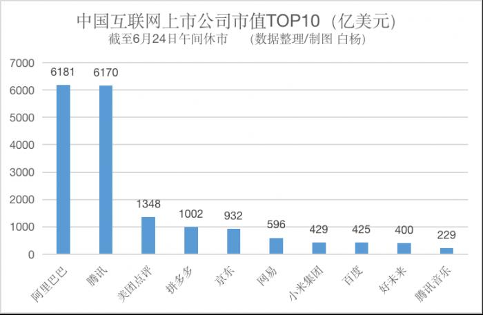
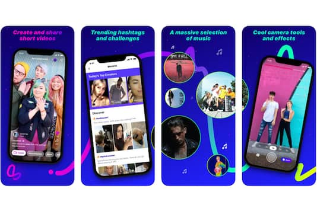
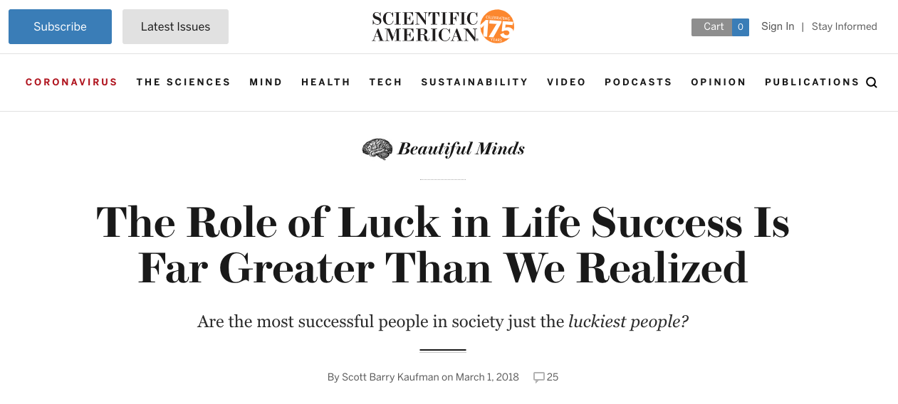

## 运气到底有多重要

很多时候不得不感慨，运气真的挺重要的。

我有一个很好的朋友，毕业后一直在百度做。后来，他跳到了阿里，做的业务是移动端的搜索。

从桌面端到移动端，他都在做搜索业务，这算是他的老本行了。

但稍微了解互联网发展的同学就应该知道：单纯的搜索在最近几年已经毫无红利可言了。看看百度的市值就明白了。昔日的互联网三巨头之一，据 2020 年 4 月份的统计，市值排名已经在国内互联网企业第八名了。前面的七名分别是：阿里，腾讯，美团，拼多多，京东，网易和小米。

那么在这个时代，红利属于谁？一个不容小觑的产品形态，就是短视频。

两三年前，抖音快手就已经发展起来了。甚至抖音在美国都已经占据了大把市场（Tik Tok）。短视频这块大蛋糕大家都看得见。正值红利期，大有可为。

短视频市场可以怎么做？除了在国内和抖音快手正面交锋以外（比如腾讯的视频号），还有一个非常好的策略，是做海外市场。

实际上，国内国外的互联网大厂，都非常注重布局海外，尤其是发展程度较低的市场。因为这样的市场发展潜力大，增长预期高，一旦拿下来，就能获得极高的回报。

以短视频服务为例，facebook 就推出了属于自己的短视频服务 LASSO，并且主要在南美洲市场做推广。

同时，被 facebook 收购了的 Instagram，也在自己的产品中添加了 Reels 这样一个功能。这个功能说白了，就是短视频。但是，这个功能暂时只对巴西地区开放，也意在占领南美市场。

国内大厂也在布局海外。比如阿里系，就在印度布局了一个短视频服务，开创一个新的短视频品牌。

三年前，我的这个朋友毅然加入了这个阿里的新团队，主攻印度短视频服务。理由很简单，这个业务将来有希望大爆发，成长几百倍。而他之前做的搜索业务，都属于很成熟的业务，增长太慢。

大爆发是什么概念？大家可以看看郭宇，就是最近沸沸扬扬的，28 岁退休，身价上亿的那个小伙儿，就明白了。

他凭什么有这么高的身价？当然，他本人一定是极其努力的大佬，但我们也不得不承认，他同时搭乘了一辆在过去几年少有的“航空母舰”。

郭宇 13 年加入糗事百科，糗事百科 14 年被字节跳动收购，于是郭宇身在字节跳动，直到 20 年。

那么从 13 年到今年，字节跳动的估值变化是怎样的呢？答案是从  6 千万美金到  1000 亿美金，增长 1600 多倍。1600 倍是什么概念？大概当时的 6 万元，如今就变成了 1 个 亿。

谁都想坐上这样的“航空母舰”，可惜，这样的“航空母舰”在之前只是“小船”。一艘小船日后能不能成为“航空母舰”？这是很难被提前鉴别出来的。能不能搭上，运气真的占很大一部分。

 

说回我的这位朋友。虽然能不能搭上“航空母舰”要看运气，但是，大家都知道，在搜索领域，可能短期很难再有大爆发了。不如尝试着挑战一下，跳到一个新兴业务中，碰碰运气。

这个印度短视频的业务其实一直发展也很不错。上次我回国和他吃饭，还看了在他们平台上，各种印度美女花样做才艺展示。从互联网的角度，各个指标，从用户的总量，增量，留存，到 PV，UV，DAU，都很不错。毕竟是阿里系的产品，和小作坊不一样。

他对这个产品的未来充满期望，财富自由就靠它了。毕竟，他也 35 岁了，希望就此一搏，即使不能财富自由，以后也不用那么拼了。

我还记得我们一起吃的是火锅，他一气儿吃了三盘儿毛肚儿，很兴奋。

但是，我的这个朋友没有郭宇的命。最近中印关系相信大家都有耳闻。印度封杀了中国的一系列服务和 app，涉及的企业包括字节跳动，快手，腾讯，百度，网易，当然，还有阿里。

他所在的这个在国内并不知名，专注于印度市场的短视频服务，也难逃厄运。实际上，最新消息，阿里已经有意完全放弃掉这个服务了。

就在昨天，我看到他在朋友圈发了一个信息：再见。

我问怎么了？他说，不给丫们印度阿三做了。

我也不知道他是什么心情。但是可以肯定的是，他搭乘的这艘小船，最终没有成为航空母舰，反而因为 2020 的时局动荡，最终沉入大海。

唉，都是命。

 

---

2018 年，美国最权威的科学期刊之一《科学美国人》，发表了一篇文章，叫 The Role of Luck in Life Success Is Far Greater Than We Realized. 翻译过来就是：**对于成功来说，幸运的作用要比我们想象得重要得多。**

实际上，这样的一个结论，已经被很多社会学的严谨研究所证实。这个结论也并不新鲜，换成现在流行的一个说法，就是**选择大于努力**。

你要是问我认不认同选择大于努力，我实话告诉你，我认同。

可关键在于，当我们在这一点上达成共识以后，下一步就要好好探讨一下该怎么选择了。比如，我问你，从现在开始算，往后十年，肯定还会有企业从小船变成航空母舰，那么这些企业都是谁？

近乎所有人都没了主意。

这就是我不很喜欢“选择大于努力”这个说辞的原因。它隐约透露着：这个世界存在一种选择的方法，只要掌握这种选择的方法，就可以不努力了。寻找这种选择的方法， 才是最重要的事情。

这是我不认同的。所以，我更喜欢运气这个说法。

运气无法掌握，但是努力可以掌握。因为即使努力了，就算运气一般，没能财富自由，不能提前退休，但是大概率的，我们也能过上安心富足的生活。

更何况，**很多时候，即便运气来了，我们也需要有努力的积累，才有能力接住这好运。**

 

对了，我的这名朋友，虽然没能财富自由，但毕竟是阿里员工，每年几十万是稳稳的。他早就在北京买了房，买了车，还有两个可爱的小孩儿。

我祝福他下一次的选择，能运气更好。

也祝所有阅读这篇文章的人，都能好运。

 

**大家加油！**