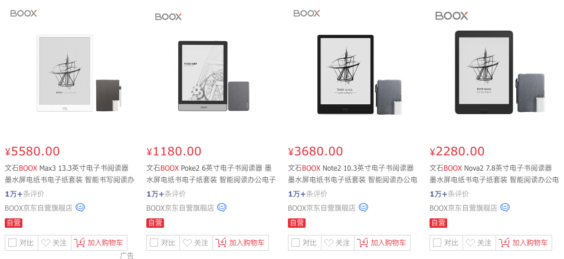

## 一家中国企业不遵守开源协议，引发的国外讨论

最近，一家中国企业因为拒绝遵守 GPL 开源许可协议，在国外引起了不小的争论。

事情是这样的。

这家企业叫 ONYX 文石科技，是一家专门致力于智能电子书阅读器的企业。

我对电子书阅读器相关产品不熟，只停留在使用过 kindle 的阶段，现在看电子书以使用 iPad 为主。

所以，我在网上简单查了一下，发现这家企业在电子书这个领域挺有名的。我估计我的读者中应该有他家的用户。

 

我在京东查了一下，他家的电子阅读器，最贵能达到 5580 元，也有上万的评价，可见销量扛扛的。

 

他家的产品不仅在国内销售，在海外也销量巨大。根据百度百科的介绍：

> ONYX 的龙头产品 BOOX 已经成为全球主流 E-reader 之一。BOOX 阅读器自 2009 年上市以来，产品销往美国、荷兰、比利时、卢森堡、西班牙、俄罗斯、芬兰、波兰、德国、西班牙、法国、乌克兰、澳大利亚、中国香港，以及众多其他国家和地区。BOOX 还得到了多方媒体的好评，如中国红星设计奖，波兰最佳电子阅读器；还被 HiTech magazine 评为最佳阅读器中的第二名，并成为首家通过 Adobe 9.1 认证的阅读器。

于是，我又在海外亚马逊搜索了一下。他家的一款阅读器，还成为了亚马逊官方推荐的产品之一。

 

但是最近，一个用户和 BOOX 的官方客服在互联网上的邮件往来，在国外 IT 圈引起了不小的讨论。

在这个截图中，一个名为 Andrew Rabert 的用户表示：某一个功能不能使用，然后话锋一转，表示：

请将这条信息转发给你们的技术部门和法务部门。如果你们不提供源代码，就是违反了 Linux 内核所遵守的 GPL v2 协议。  

简单来说，GPL 协议就是在说：**一份代码，你去改，没问题；你去用，也没问题。但你必须保持开源。**因为 BOOX 使用了 Linux 的内核，所以需要开源。

对此，BOOX 客服的回应非常“官方”，简单翻译就是：

你好，Andrew。感谢你的回复。我们已经将你的请求转给了我们的技术部门，得到的答复是：我们不能提供源码。对此产生的不便，我们感到抱歉。希望您能理解。

 

说实话，我对截图中的对话还是有很多疑问的。关键在于，怎么就从一个功能，扯到了开放源码？截图中并不包含之前谈论内容的信息。似乎有意隐藏了什么。

当然，国外也有人指出了这一点，认为应该公开全部的交流内容，才能够看明白事情的来龙去脉。

不过也有人认为，不管讨论的内容是怎样的，BOOX 使用了 Linux 内核，却拒绝开放源码，就是在违反协议。

 

有人开始探讨：BOOX 为什么拒绝公开源码？

鉴于现在国外对科技企业产品窥探人们日常隐私的担忧，有人指出：

通常，开放源码不是什么问题。如果他们拒绝，暗示着他们想要隐藏什么。很有可能是软件的后门。

 

不过，马上就有人唱反调：

嗨，如果美国企业可以在硬件上安装后门，为什么中国企业不可以？

这名读者说的，应该就是在指棱镜计划了。斯诺登事件对美国社会的影响是深远的，我觉得有时间，我应该好好写一写棱镜计划。

 

不过，还有人认为，作为一家在电子书阅读器领域颇有影响力的企业，他们可能确实在隐藏什么。他们真正想要隐藏的是...

他们超烂的代码质量...

 

还有人认为：他们可能并没有隐藏什么。不公开源代码，只是因为他们根本不理解 GPL 开源协议。

理由很简单，如果他们的代码中真的有要隐藏的后门，更好的隐藏方法是遵守协议，但是开放的源码并不包含后门。

实际上，很多企业就是这么做的。

讲真，我觉得这个推理无懈可击。我们必须承认，在近几十年，中国发展起来了，尤其是在科技领域突飞猛进。但是，在很多方面，比如法律意识层面，知识产权保护层面，我们还没有完全和世界接轨。

 

有人说了，他们只是不在乎而已。

 

非要说隐藏了什么，都需要太复杂的假设和推理。真相往往是简单的。

这就是**奥卡姆的剃刀**在说的道理啊！

 

有的人似乎很了解中国，道出了这件事情背后可能的本质。

他们不愿意公开源码，是因为在中国，硬件制造远远比软件开发便宜。如果他们公开了源码，那么马上就有人可以使用他们的代码，发布一个除了名字，完全一样的产品！

实际上，据我所知，这也是中国当下发展很多软件技术产品，尤其是底层技术的障碍之一。

这些技术研发时间长，投入高，但是一旦研发出来，太容易“盗版”，竞争对手可以轻易直接拿去使用。现有的法律对知识产权的保护也不够友好，维权困难。种种原因，导致很多企业没有动力做这方面的创新。

 

有人说，不管原因是什么，BOOX 拒绝开放源码，肯定是违反了 GPL 协议。应该在法律层面解决。

有人说，至少可以把他们告上美国的法院。一旦被认定指控成立，他家的产品就会被美国认定为非法产品，无法在美国销售。这应该对这家企业是不小的打击。

依此效仿，这样的官司可以在所有认可 GPL 开源协议的国家出现。这样一来，BOOX 近乎将丢掉整个海外市场。

 

但是，马上又有人说，这样的官司不值当。

首先，这样的官司将消耗大量的人力物力财力。

更关键的是，Linux 内核的发明人 Linus Torvalds 曾经公开表示：并不建议因为开源协议的遵守问题而挑起战争。原因是，这将削弱 Linux 的力量。**如果 Linux 想要无处不在，必须容忍这种现象。将所有违反开源协议的行为都付诸法律，最终的结果只能是让越来越多的人不再使用 Linux。**

说实话，看到这里，我对 Linus Torvalds 是大写的服。Linus 不仅仅是一名天才程序员，对这个世界的洞见也异常深刻。

反观：Windows 自 Windows XP 以后就因为封闭的生态节节败退，最近几年微软拥抱开源，一下子就打开了局面；

苹果的操作系统自 10.9 Mavericks 开始免费升级下载；

Android 系统也依靠开源和强势的 iOS 平分江山；

软件世界的发展历史简直就一直在 Linus 大神的掌握之中。

 

实际上，Linux 操作系统也确实做到了无处不在。其实，Android 的内核也是基于 Linux 内核的。

说到 Android，华为面临的困境，也是大家有目共睹的。

这也正是现如今，我国必须大力发展技术基础的原因。纵使近十年，我国在技术领域有着突飞猛进的发展。但是整体，在计算机底层领域，不管是软件还是硬件，我们都是大量依靠国外技术的。

从操作系统，到编程语言；从开发环境，到浏览器内核；从数据库，到游戏引擎；包括各种底层框架；从图形图像，到人工智能，从大数据，到前后端。更不用说芯片行业了。

现如今，由于基础的落后，产生的各种问题越来越凸显。我总认为，在未来的几年甚至十几年，踏踏实实做基础的技术研究，将有很好的发展。

**因为国家真的需要这样的人才。**

**大家加油！**

 

**P.S. 1**

最后，因为这篇文章聊的是开源协议，再给大家分享一个阮一峰大佬做的开源协议分析图，可以很简单地看到几种常见许可之间的区别。

其实，这张图的原作者是乌克兰的程序员 Paul Bagwell，阮一峰将其翻译成了中文。

 

在 [choosealicense.online](choosealicense.online) 上，还有一个很清晰的图示，说明了大家对自己的开源项目的定位不同，应该如何选择开源协议。

这张图上还基于著名的开源项目进行了举例，一目了然。

 

**P.S. 2**

之前，我还写过一篇文章，介绍了另外一个和 GPL 开源许可相关的案例，也挺有意思。不过和中国无关，叫[《被沙特政府机构“盗用”的 iOS App》](../2020-04-15/)。