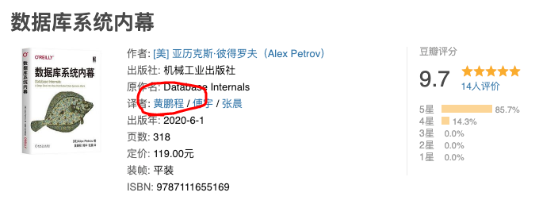
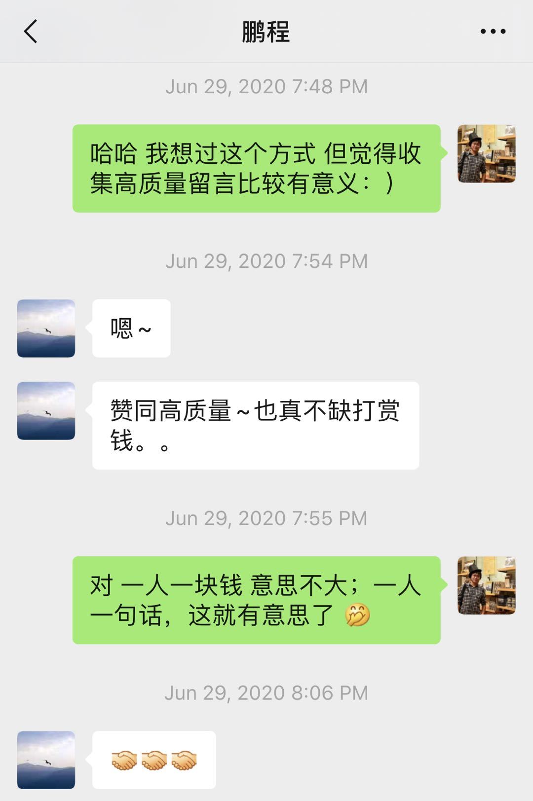

## 获奖名单公布 | 流量对我的读者不重要

在上周一的文章 [重磅福利 | 大佬送硬核技术书，还有签名](../2020-06-25/) 中，我推荐了 @鹏程 大佬最新翻译的数据库领域的重磅力作：**《数据库系统内幕》**。

同时，我还做了一个活动。大家留言，关于数据库，说什么都可以。@鹏程 大佬会选出 5 个幸运读者，免费邮寄一份**这本书的签名版**。

现在将 @鹏程 大佬选出的 5 名幸运读者的留言进行公布。

@鹏程 大佬说，他选择的依据是：通过留言可以看出来，正在从事数据库的学习或者工作，能感觉到确确实实需要这本书，进一步深入数据库的学习。

 

**@cde**

我是一名研一的学生，正好这学期选修了高级数据库系统这门课，课程内容是仿照 Stanford 的高级数据库课程，实现一个简单的关系型数据库，包括5个模块：文件系统、记录管理、索引、系统管理和查询模块。

刚开始我觉得这是个挺好的练手项目，在逐步完成各个模块的时候才意识到其涉及的内容之多。比如文件系统如何分页，怎么实现缓冲区从而支持大文件读写；数据库记录在一段空间应如何存储，以实现效率和空间的平衡；查询模块如何进行查询树的优化才能提升性能，以及多表连接、事务如何实现… 我意识到数据库是一个技术含量非常之高的系统，其中不仅需要各种巧妙的数据结构的配合，更需要合理的结构设计，让不同模块完美协作，并追求更高的效率和性能。

最终结课的时候，虽然我通过了验收，但我对自己做的仍然不满意，很多底层实现都是非常简易粗略的。这完成的并不是一个好的工作，我也准备在接下来抽空将其逐步完善。记得上课时老师给我们提供了一些慕课和书籍参考，但我在学习它们的时候感觉还是比较艰深晦涩，无法让我形成一个通透的认识，或许《数据库系统内幕》会是一个很好的补充。

在上第一节课的时候，老师就问我们，能否将记录一行一行存在文本文件里。这样也能实现增删改查，但当文件过大、系统出故障或需要更高效率的时候，这种方式就完全罢工了，但数据库系统却依然能很好地工作。从这个角度看，感觉数据库很像一种神奇的魔法而这种魔法，值得我们持续、认真、深入地学习和研究。最后，大家加油！

 

**@风影**

数据库为 CURD 而生，作为一个数据库要解决的问题就是怎样更快/更可靠的去 CURD。怎样去提升单节点的性能，怎样去保证多节点的一致性，怎么去对 API 进行取舍。都值得我们拿到一本 Database Internals 去学习[狗头]。

 

**@那头被驯服的象**

记得入职第一年的时候，Leader 说过一句很经典的话：面向对象的本质就是面向数据库开发，以至于后来几年我都把重心潜移默化的往数据库这方面靠拢，可以毫不夸张的说每次开发新项目，数据库的设计几乎要占整个开发周期的 50%，因为团队里面的每一位成员都很清楚，只要数据库设计合理设计好了，程序代码只是分分钟的事情！

 

**@曹义**

工作中用到关系数据库，现在往 kv 数据库转，也算半个数据库查询存储的开发者。借助于本书，再来加深一下理论的学习，用理论来指导实践，站在大牛的肩膀上前行！

 

**@蜀威**

最近在解决系统慢查询的问题，最常用的解决方式就是把该加的索引加上去。但是有一些 sql，感觉该加的索引都加上去了，查询速度也没有提升。这时候就需要更深入了解数据库的「底层」知识，哪些是数据库底层导致注定优化不了，而需要换成实现方式；哪些可以从 sql 角度优化。所以最近把压箱底的《高性能MySQL（第三版）》拿出来读了。

 

---

@鹏程 大佬送书的依据是从他认为能够最大化这本书的效用角度出发的。但是，作为这个公众号的号主，在自己的地盘做活动，我还是有一些私心的。

因为这个公众号很少做活动，所以**我希望借这个机会，能够回馈一下经常支持这个公众号的读者。**

我决定从留言中再选出五名这个公众号的老读者，我自掏腰包买书，劳请 @鹏程 大佬签名后寄出。

我选出的这五名读者包括：

 

**@蓝莓 @候鹏飞 @吃饭饭**

这三名读者 2017 年就关注这个公众号了，一直没有取关，谢谢你们的支持！：）

 

**@如梦初醒**

这名读者是在留言的读者中打赏最多的读者。谢谢你的支持！免费的文章，能被这样真金白银地打赏，是对我最大的认可：）

 

**@慧有未来จุ๊บ**

这名读者是在留言的读者中，评论次数最多的读者。谢谢你一直的参与和关注：）

 

以上共十名同学，我会单独联系，索要邮寄方式。

我知道还有很多同学一直是这个小小公众号的支持者，但是这次活动没能照顾到。在这里先说一声抱歉了。谢谢你们一直以来的支持。

**来日方长。**如果觉得我在这个公众号的分享有帮助，有启发，请继续支持我。以后有机会，我会继续回馈大家的：）

 

---

文章的最后，随便聊一聊这次送书活动的方式。

相信大家都见过，甚至参加过不少公众号的抽奖送书活动。一个最常规的操作是鼓励大家留言，选取留言点赞数最多的前几名赠书。

本来我觉得这种模式没有什么问题，既能让大家活跃一下，又能找到大家最认可的留言，来进行赠书。

最关键的是，这样的形式，还鼓励了大家去分享文章，给自己的留言点赞，无形中增加了文章的阅读量。

但今年早些时候，我和我的一名公众号读者交流，才意识到这种形式是有问题的。

我的这名读者在一个公众号活动中，参与了这样的留言集赞赢奖品的活动。于是他发了很多红包请朋友们点赞。结果后来才知道，原来还有专门刷赞的公司。

有人用刷赞公司的服务，后来者居上。他很不爽，于是也买了刷赞公司的服务刷赞。最后，花的钱都已经比奖品贵了。

我也不知道，如果奖品特别好的话，刷赞公司的人会不会直接来参与活动？

听了这个故事，我陷入了沉思。我回想了一下，我的公众号只搞过一次留言集赞赢奖品的活动，就是在[《天生不聪明》](../../2018/2018-07-18/)这篇文章下。

这个活动是我和慕课网合作的一次活动。但是，听了这个故事，我保证，以后再也不做这种形式的活动了。

 

另外一种常见的形式是打赏抽奖。

因为打赏的最低金额是一元钱，这种形式基本上就相当于是鼓励大家花一元钱买一张彩票。

这种形式虽然也没什么毛病，但在我看来，一元钱实在没有什么意思。你少了一元钱，我多了一元钱，虽然这也是在为 GDP 做贡献吧，但相较而言，如果能够激发出**大家精彩的留言，其中的价值，不管是对你，还是对我，我相信都远高于一元钱。**

我的这个想法，也和 @鹏程 大佬的想法不谋而合。

 

熟悉我的公众号的同学都了解，我基本上没有在公众号的宣传上花什么力气，算是佛系运营公众号了，主要把精力放在内容本身上。**如果接广告，次推文章会有一个无套路抽奖**，大家全凭运气，就当是我发给大家一个红包，仅此而已。

当然，首要原因是我不怎么懂运营，也不会那么多套路。

有的时候，看很多其他公众号的运营“套路”，自己也不是那么喜欢。**我相信如果我不喜欢这种形式，那么我的读者也不会喜欢这种形式。**

更重要的是，各种套路的目标，无非是给公众号增粉，增加自己文章的阅读数量。

毋庸置疑，公众号文章的阅读数量，对号主来说是重要的。但是，我同时作为一名读者，当打开一篇公众号文章的时候，从来不会首先去看一看这篇文章的阅读量是多少。

相信每个人都一样。大家主要是看文章的。文章写得不好，就直接退出了。阅读量是多少，读者不会关心。

换句话说，**文章的阅读量对读者完全不重要。**

既然运营是为了增加读者，那么公众号的运营就应该围绕读者进行。**既然流量对读者不重要，那么，无论如何，我也不能把流量放到读者之上。**

 

一不小心，说了一堆废话。反正看到这个文章标题，点进来的估计也都是真粉丝了。谢谢大家的海涵啦。

**大家加油！：）**