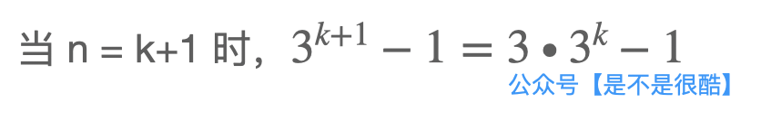
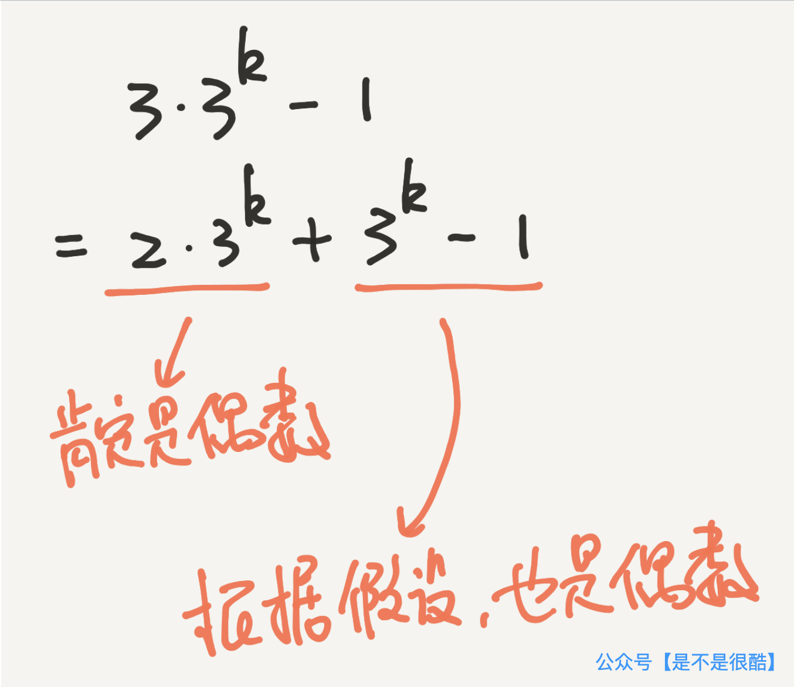
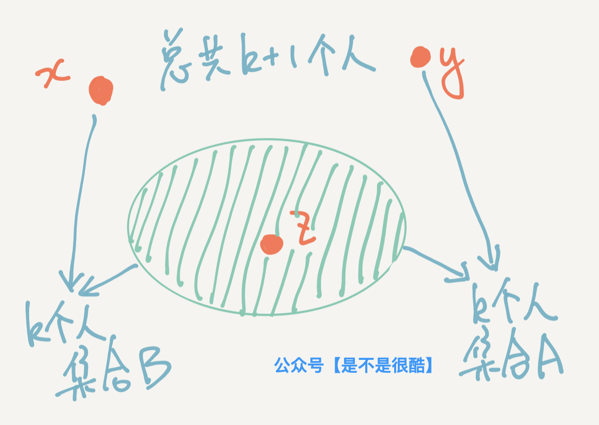
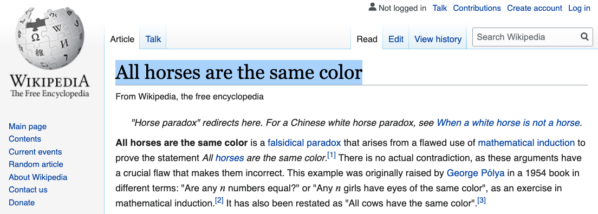

## 证明一个谬论：全世界所有人年龄都一样

在这篇文章中，我将带领大家使用数学归纳法，证明一个谬论：**这个世界上，所有人的年龄都一样！**

 

相信数学归纳法是所有同学都熟悉的一种证明方法。但是，为了文章的完整性，我简单举一个例子。

使用数学归纳法进行证明，只需要两步。

(1) 我们要证明，当 n = 1 的时候，命题是正确的；

(2) 我们假设当 n = k 的时候，命题是正确的；然后证明出，当 n = k + 1 的时候，命题也是正确的。

完成了这两步，整个逻辑链条就可以像多米诺骨牌一样摊开。

因为根据 (1)，n = 1 是正确的；

那么根据(2)，n = 2 就是正确的；

如果 n = 2 是正确的，根据(2)，n = 3 也是正确的；

如果 n = 3 是正确的，根据(2)，n = 4 也是正确的；

依此类推，我们可以得到，在 n >= 1 的所有情况下，命题都是正确的。

 

举个例子：

如何证明 3^n - 1 在 n >= 1 的情况下，肯定是偶数？

使用数学归纳法，这个问题非常简单。

首先，我们看 n = 1 的情况，命题显然成立。

下面，我们假设，当 n = k 的时候，这个命题成立。

注意，**这是一个假设**！

下面，我们看能不能证明出，在 n = k + 1 的时候，命题也成立？即 3^(k + 1) - 1 也是偶数？

此时，我们可以将这个式子拆成两部分。

可以看出，这两部分都是偶数。所以，3^(k + 1) - 1 整体也是偶数。

于是，我们证明出了：如果 n = k 时命题成立，则 n = k + 1 时命题成立。

至此，整个命题得证：3^n - 1 (n >= 1) 是偶数。

 

好了，前菜到此结束，下面，我们来尝试使用数学归纳法证明如下命题：

**全世界所有人年龄都一样。**

 

---

如何使用数学归纳法证明，全世界所有人的年龄都一样？

我们把这个命题再整理得形式化一些。

我们来证明：这个世界上的任意 n 个人（n >= 1），年龄相等。

 

首先，当 n = 1 的情况下，也就是只有一个人，那么不证自明，这个人的年龄只能有一个取值，年龄相等。

下面，我们假设，当 n = k 的时候，命题成立。即这个世界上，任意 k 个人，年龄相等。

依然是，这是一个假设。下面我们来看一下，根据这个假设，我们能不能推导出，当 n = k + 1 的时候，命题也是成立的？

 

我的证明如下：

现在，我们先在这 k + 1 个人中，随便选出一个人 x，那么剩下的 k 个人，根据假设，年龄是相等的。我们把这 k 个人组成的集合叫做 A。

然后，我们在这 k + 1 个人中，再随便选一个和 x 不同的人，叫 y。那么，现在又剩下了 k 个人。根据假设，这 k 个人年龄是相等。我们把这 k 个人组成的集合叫 B。

现在，我们随便在这 k + 1 个人找到一个即不是 x，又不是 y 的人，假设叫 z。

大概关系是这样的：

此时，集合 B 是除了 y 剩下的 k 个人，因为 x 和 z 都不是 y，所以 x 和 z 都在集合 B 中。因此，x 和 z 年龄相等。

现在，我们又可以从集合 A 的视角看了。整个 k + 1 个人，被我们拆成了 x 和集合 A，那么 z 也一定在集合 A 中。

因为集合 A 中包含 k 个人，所以年龄都相等。假设是 p。即 z 的年龄也是 p。

刚刚我们刚看到，x 和 z 的年龄相等，所以 x 的年龄也是 p，和集合 A 中所有人年龄都相等！

得证，此时，所有这 k + 1 个人的年龄都是 p。即这 k + 1 个人年龄也相等。

至此，我们的证明结束。我们使用数学归纳法证明出了：这个世界上的任意 n 个人（n >= 1），年龄相等。

让 n 等于世界人口总数，这个世界上所有人的年龄就都相等了。

是不是很酷？

 

等一下。这个结论显然是错误的。如果结论是错误的，说明我们的证明是错误的。

你能看出来，问题出在哪里吗？

 

---

现在，就让我来揭晓，以上证明，问题出在哪里。

答案是**“随便在这 k + 1 个人找到一个即不是 x，又不是 y 的人，假设叫 z。”**这句话。

因为，我们可能找不到这个 z。

实际上，在 n = 2 的时候，这个 z 就不存在。

当 n = 2 的时候，相当于已知了 k = 1 的时候，命题是正确的（这其实是我们的基础命题）。

现在，我们确实能随便找到一个 x，那么剩下的人，只有一个人，就组成了集合 A。

我们也确实能找到一个和 x 不同的 y。那么剩下的人，只有一个人，其实就是 x，组成了集合 B。

现在，我们要想再找一个既不是 x，又不是 y 的人，已经不可能了。因为整体只有两个不同的个体。

所以，我们在此时，就已经无法通过这个 z，推导出 x 和 y 的年龄相等了。

换句话说，在 n = 2 的时候，这个证明就失效了。

如果 n = 2 的证明是失败的，那么，后续的证明就无法像多米诺骨牌一般推导出来。实际上，我们一开始就失败了。

因此，我们得出的结论，也是错误的。

你看出来这个逻辑漏洞了吗？

 

---

这个错误的证明告诉了我们什么？

首先，数学证明是一个复杂的事情。很多看似合理的数学证明，背后可能会存在逻辑漏洞。一个逻辑漏洞，将使得整个证明过程完全崩塌。

更重要的是，一个简单的逻辑漏洞，就可以“看似严谨”地推导出荒谬至极的结果。所谓差之毫厘，谬以千里。

在这个例子中，因为这个结论太过荒谬，我们意识到了问题。但如果我们得到的结论，并没有那么荒谬，甚至听起来有几分道理呢？

那么这样的谬论，就可能假“严谨的数学”之名，存于世间，让我们难以察觉。 

 

实际上，这是一个经典的逻辑谬误。

在西方，这个逻辑谬误又被称为是 **Horse Paradox**（直译就是马悖论）。因为这个问题的原本陈述是：**All horses are the same color**.（所有的马颜色都一样）。

在维基百科上，有专门一个词条，描述这个问题。有兴趣的同学可以参考。

是不是很酷？

 

**大家加油！：）**