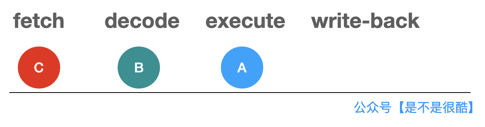

## 用简单的代码，看懂 CPU 背后的重要机制

今天，stackoverflow 突然给我推送来一个问题。

我一看这个问题，竟然是 2012 年，也就是 8 年前的老问题。而其中的高票答案，都已经有 30000 多个赞了。

仔细一看，这个问题还真挺有意思。

 

这个问题针对如下这样一个简单的代码：

相信大家都能看懂。这段代码对 ``data`` 数组中所有大于等于 ``128`` 的值进行求和。这样的求和操作运行了 10 万轮。

下面，我们来看一下这段代码的性能。我们这样随机生成一个数组：

 

使用这个随机生成的数组，测试上面的代码。在我的计算机上，整体耗时是 **8.5 秒**左右。

 

下面问题来了。如果，我对这个随机的数组进行一遍排序。对排序后的数组执行上面的代码，性能会有怎样的影响？

可能很多同学都会认为，性能是差不多的。

这是因为，上面的代码过程，只是从头到尾扫描数组，对于数组中的每一个元素，判断其是否大于等于 ``128``，如果是，就加入到 ``sum`` 中。

**整个算法逻辑，和数组是否有序无关。**有序的数组不会提前终止任何操作。不管是有序的数组，还是无序的数组，执行的操作数量是一样多的。

甚至，为了保持公平，我为随机数生成器添加了种子。所以，两次测试的数组中，大于等于 ``128`` 的元素个数都是一样的。这就意味着 ``sum += data[c];`` 这个指令的执行次数是一致的。

**区别只有：第二次执行，我先对数组进行了排序！**

可是，实际结果却是这样的：

大家可以看到，由于测试数据是一样的，所以最终的 ``sum`` 结果是一样的。但是第二次，针对有序的数组做实验，消耗的时间仅仅是 **2.8 秒**左右，比无序的情况快了有 3 倍之多！

 

大家可能会觉得，这是不是 JVM 在搞什么鬼？那么，同样的代码逻辑，我们尝试用 C++ 实验一遍！

 

这段代码，我使用无序的数组测试，在我的计算机上，运行时间大概是 **18.8 秒**左右。（Debug 模式）

 

但是，当我将数组进行排序以后，运行时间则变成了 **5.7 秒**！（Debug 模式）

 

看来，这不是 JVM 的问题，而是有更加底层的优化机制在起作用。

这个机制，就是 **CPU 的分支预测（Branch prediction）**。

 

---

在具体讲解什么是 CPU 的分支预测之前，我们先来看一下什么是 CPU 指令执行的**流水线（Pipeline）**。

简单来说，一条指令的执行，在 CPU 内部，需要经过若干步骤。

比如，一个常见的模型，是 4 阶段流水线。即一条指令在 CPU 内部的执行，需要有 4 步：

1. fetch（获取指令）
2. decode（解码指令）
3. execute（执行指令）
4. write-back（写回数据）

经过这四个阶段，才叫完整执行完了一条指令。

 

我们可以类比这样的一个例子。

我们去很多旅游景区吃饭，餐厅会使用半自助的形式由游客来选餐。游客进入选餐队伍之后，需要完成以下的事情，才能真正的执行完“买饭”这件事情，开始享用香喷喷的午餐：

1.  选择一个主菜
2. 选择一个配菜
3. 选择一个饮料
4. 去结账！

 

对于这个流程的执行，我们当然可以等 A 同学选好他的午饭：主菜，配菜和饮料，并且结完账，然后 B 同学再去选择他的午饭。▼

 

相信同学们都明白，这样做是低效的。

在 A 同学选择完主菜，去选择配菜的时候，B 同学就已经可以上去选择他的主菜了。▼

 

当 A 同学开始选择饮料的时候，B 同学已经可以选择配菜了，而 C 同学，此时就可以开始选择主菜了。▼

 

这样做，当 A 同学结完账的时候，E 同学都已经开始选主菜了。▼

很显然，这样做效率更高。

这就叫**流水线**。一个同学不需要等前一个同学完成所有选餐的步骤再去选餐，而只要完成一步，下一个同学就可以跟进。

 

CPU 的流水线完全同理。因为执行每一条指令需要 4 步。所以，在执行 A 指令的时候，一旦完成了 A 指令的 fetch 操作，进入 A 指令的 decode 阶段，就可以对下一条 B 指令执行 fetch 操作了。▼

 

当 A 指令 decode 完成，进入 execute 阶段，就可以开始对 B 指令进行 decode 了，同时，B 指令的下一条 C 指令，就可以开始 fetch 了。▼

 

那么问题来了，现在，如果一条指令是 ``if``，怎么办？

为什么 ``if`` 指令会出问题？因为对于 ``if`` 指令，我们必须等它运行完，才能知道下一条指令是什么！下一条指令是根据 ``if`` 表达式中的结果是真还是假来决定的！

 

而实际情况，可能不是简单的一条指令的问题。因为 ``if`` 表达式的计算，可能涉及多个操作。

比如上面代码中，就算是 ``if(data[c] >= 128)`` 这个简单的逻辑，我们也需要先解析出 ``c`` 的值，再拿出 ``data``，再从 ``data`` 中拿出 ``c`` 这个索引对应的元素，再去比较这个元素是不是大于等于 ``128``。

可以想象，后面的指令就停在这里了。需要等这一系列 ``if`` 判断相关的指令都执行完，计算出最终结果，才能决定下面把哪条指令放入流水线。

这显然会对性能产生影响。于是，现代 CPU 对于这种情况，都设计了一个机制，叫做分支预测（Branch Prediction）。

 

简单来说，分支预测就是针对这种 ``if`` 指令，不等它执行完毕，先预测一下执行的结果可能是 ``true`` 还是 ``false``，然后将对应条件的指令放进流水线。

如果等 ``if`` 语句执行完毕，发现最初预测错了，那么我们把这些错误的指令计算结果扔掉就好了，转而重新把正确的指令放到流水线中执行。

这种情况，虽然也会损失一些性能，但可以接受。因为反正如果不做预测，时间也会空耗，对应就是 CPU 的时钟周期空转。

但一旦预测对了，那就是一个巨大的性能提升。因为后续指令已经进入流水线，执行起来了。我们直接继续这个过程就好。

这就是 CPU 的分支预测，是不是很简单？

 

具体 CPU 的分支预测是如何实现的？不同的体系架构，包括同一体系架构 CPU 的不同版本，会有不同的策略。

但是，整体上，一个重要的策略，是参考某条 ``if`` 指令执行过程中判断为 ``true`` 或者 ``false`` 的历史记录。

这应用了在计算机领域经常使用的一个原理：**局部性原理**。

通常在操作系统课程中，都会介绍这个重要的原理。很多算法或者数据结构的设计，也是基于这个原理的。

比如，计算机体系结构设计，都是分层的。从外存；到内存；到一级缓存，二级缓存；到寄存器。存储容量逐渐减小；但是，运算速度越来越快。

操作系统在运行的过程中，就需要做一个重要的调度：决定把什么数据放到更高层次的缓存中，以提升程序运行的效率。

局部性原理说的就是：

如果一个信息正在访问，那么近期很有可能会再次访问，这叫**时间局部性**；

如果一个信息正在访问，那么近期访问的其他信息，大概率在空间地址上，和这个信息的空间地址邻近，这叫**空间局部性**。

 

这样的局部性原理同样被应用在了 CPU 对 ``if`` 的条件分支预测上。一个 ``if`` 现在被判为 ``true``，下次，会更高概率的判为 ``true``。当然，实际的预测逻辑会更复杂，但是，局部性原理是一个重要的参考。

我称之为：**``if`` 局部性原理**。

（我瞎编的，听说多使用这种让人摸不到头脑的术语，会显得文章更加高大上。）

 

现在，大家应该明白了。对于文章开始讨论的代码，如果数据经过了排序，那么，所有小于 ``128`` 的数据就都在数组的前面；所有大于等于 ``128`` 的数据，就都在数组的后面。

那么，在下面的执行过程中，CPU 根据历史记录对 ``if`` 进行分支预测，就会高概率命中，提升性能。

而对于完全随机的数组，数据是否大于等于 ``128`` 是完全随机的，这就导致 CPU 的分支预测总是失效，从而，降低了性能。

 

好了，原理解释清楚了。下面，我们看一下，在这个程序中，我们可不可以避免这种分支预测经常失败导致的性能问题？

答案是，可以！我们需要想办法去掉 ``if`` 判断。

怎么去除？在这个程序中，我们可以使用这样的方式：

注意上面的代码中，红框的部分，代替了原来的 if 逻辑。

为什么这是等价的？我们可以简单分析一下。

首先看变量 ``t`` 的值。他是 ``data[c] - 128`` 的结果右移 ``31`` 位。

大家可以想象：

如果 ``data[c] - 128`` 是非负数，右移补零，符号位也是 ``0``。右移 ``31`` 位的结果是 ``0x00000000``；

如果 ``data[c] - 128`` 是负数，右移补一，符号位也是 ``1``。右移 ``31`` 位的结果，是 ``0xffffffff``。

在下面的 ``sum`` 计算中，先对 ``t`` 取反。

那么如果 ``data[c] - 128`` 是非负数，即 ``data[c] >= 128``，``t`` 就是 ``0x00000000``，取反的结果是 ``0xffffffff``。``0xffffffff`` 每一位都是 ``1``，和 ``data[c]`` 做与运算，结果还是 ``data[c]`` 自身。此时，相当于把 ``data[c]`` 加入了 ``sum`` 中。

如果 ``data[c] - 128`` 是负数，即 ``data[c] < 128``，``t`` 就是 ``0xffffffff``。此时对 ``t`` 取反，结果为 ``0``。``0`` 和 ``data[c]`` 做与运算，结果还是 ``0``。此时，相当于 ``sum`` 什么都没有加。

所以，这和判断一下 ``data[c]`` 是否大于等于 ``128``，如果大于等于，再做加法运算，是等价的。

**但是，我们去掉了 ``if`` 判断!**

这个代码的性能是怎样的？在我的计算机上，不做排序的话，只需要 **1.7 秒**（对比之前的 8.4 秒）。

更重要的是，这个代码的性能，不再受原始数组是否排序而影响。当排序以后，执行时间，也是同一个数量级的。

使用 C++ 测试，结果是类似的。

怎么样，是不是很酷？

 

关于分支预测，有兴趣的同学，可以参考维基百科的 **Branch predictor** 词条，了解更多。

 

**大家加油！：）**

---

参考文献：

[https://stackoverflow.com/questions/11227809/why-is-processing-a-sorted-array-faster-than-processing-an-unsorted-array](https://stackoverflow.com/questions/11227809/why-is-processing-a-sorted-array-faster-than-processing-an-unsorted-array)

[https://en.wikipedia.org/wiki/Branch_predictor](https://en.wikipedia.org/wiki/Branch_predictor)