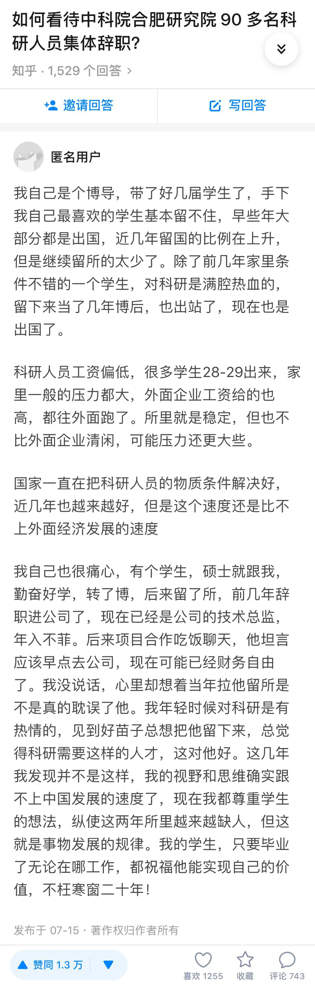

## 大多数人不适合做科研？

无意中看到知乎上的一个问题。问题源于一个新闻：**中科院合肥物质科学研究院 90 多名科研人员集体辞职。**

根据新闻报道：这个中科院的核所，最高峰的时候有 500 人。这几年人才快速流失，去年开始只有 200 个人了。这下 90 多个人辞职，现在就剩 100 人左右。

至于人才流失的原因，一名研究所的中层干部告诉记者：核所原先是一个搞核材料的研究室，之后扩张成一个研究所，揽下国家的几个大项目。但这两年申请不到大的科研项目，没有钱，人才就走了。

 

我简单翻了一下这个问题下的讨论，可能事情会更复杂，不完全是钱的原因。比如很多人提到了也有领导的原因，也有管理制度的原因，也有子女教育的原因，等等。

但是，一个高赞回答让我心有戚戚。

一名博导，费尽心思，想留下自己的得意门生，在科研领域做一番事业，大展拳脚。原本以为这既是为学生好，也是为研究好。可多少年后，却开始反思，自己这样做，是不是耽误了学生的人生。

我竟也觉得有一丝悲伤。

 

曾经有很多同学跟我表达过：觉得自己不适合科研。不仅自己不适合，觉得其实大多数人都不适合科研。

对此，我虽嘴上说：嗯嗯，选择自己的路就好。但其实，内心是 100 个不同意的。

这里关键在于，到底什么叫适合科研？

很多人的潜台词其实是：大多数人都不甘愿只拿着一份低薄的薪水，搞研究。

这里的**核心，根本不是搞研究，而是拿一份低薄的薪水。**

如果这样定义的话，我不仅同意大多数人不适合做科研，我甚至认为所有人都不适合做科研。

因为，所有人，只要努力，在不断进步，在自己的领域做出成绩，都不应该一直拿一份低薄的薪水。

**这和科研无关。**

 

大多数人就适合职场吗？我不这样看。只不过企业天然的商业属性，使得大多数企业可以解决员工的经济问题，发展问题，让员工可以拿到符合自己能力的薪酬。

因此，大多数人愿意主动去适应职场的规则，打磨自己的职场生存能力，让自己成为职场需要的样子。

在我看来，不是大多数同学更适合职场，而是**大多数同学选择去适应职场。**

同理，也不是大多数同学不适合科研，而是**大多数同学选择不去适应科研。**

就我的观察，我接触的很多同学，我敢 100% 肯定，如果科研机构能够像企业一样解决“钱”的问题，他们都非常非常适合做科研，甚至能比在职场做出更大的成绩。

 

有感而发而已。

如上面的回答所说，国家也一直在努力解决科研人员的物质问题。

愿所有科研人员生活能够越来越好，实现自己人生价值的同时，也能收获和自己的贡献相匹配的经济回报。

**大家加油！：）**